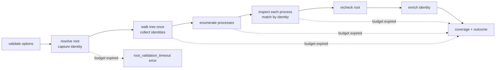
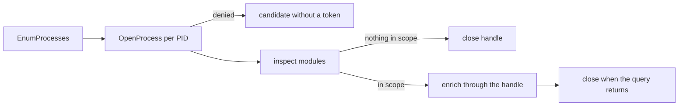

# Filesystem process usage queries

Query a file or directory tree to find observable processes using it:

```rust
use sniff::filesystem::query::{Outcome, PathUsageOptions, query_path_usage};
use std::path::Path;

let report = query_path_usage(Path::new("./checkout"), &PathUsageOptions::default())?;
if report.outcome != Outcome::Usable {
    // Discovery could not run here; read `report.coverage` for why.
}
```

**Status.** The library entry point, report contract, platform-neutral
matching, the [Linux/WSL2 backend](#linux-and-wsl2), the
[macOS backend](#macos), and the [Windows loaded-module backend](#windows)
are built. Windows does not inspect other processes' file handles: its
`open_handles` mechanism reports `unsupported`. **Planned:** the
[CLI query](../cli/filesystem_query.md).

A directory query includes descendants by default;
`PathUsageOptions::default().target_only()` inspects the target alone. Normal
host and repository reports never perform this scan, and the query does no
repository inventory, network request, privilege elevation, process
termination, or caching.

A handle identifies usage; it does not necessarily prevent deletion. An empty
result does not establish that the target is unused.

## How a query runs



One monotonic budget (default two seconds, `with_deadline` to change it)
covers every phase. When it expires the query **stops scheduling work** and
returns what it collected, with `budget_exhausted: true` and incomplete
coverage. A native call already running can overrun the budget, so the
deadline is not a guarantee of when the function returns.

## Errors versus reports

`query_path_usage` returns `Err(PathUsageError)` only when it cannot build a
report about a verified target. Each error has a stable `kind()`:

| Kind | When |
| --- | --- |
| `invalid_option` | Zero deadline, or one too large to form a deadline |
| `missing_target` | The path, or a root symlink's target, does not exist |
| `unsupported_target_kind` | A socket, FIFO, or device, rejected before it is opened |
| `root_identity` | The root's identity cannot be read |
| `root_validation_timeout` | The budget expired before the root identity was captured |

Every later problem (a denied process, an unreadable descendant, the budget
running out mid-scan) becomes a coverage status and a limitation in the report.

## Matching rules

Evidence is matched by file identity: `(st_dev, st_ino)` on Unix, the volume
serial plus 128-bit file ID on Windows.

- The tree is walked once per query, however many processes are inspected.
  Hidden and Git-ignored entries are in scope.
- A root symlink is resolved once; the report keeps the `requested` and
  `resolved` spellings. Descendant symlinks, junctions, and reparse points are
  indexed as themselves and never followed.
- A hard link outside the tree that names an in-scope file is a match:
  `matched_paths` lists every in-scope path (none is preferred) and
  `observed_path` keeps the spelling the OS reported.
- When a backend supplies only a path (no identity), the path must sit under
  the root component by component (`/work/app-copy` is outside `/work/app`)
  and is then looked up; the match is labeled `match_basis: path_lookup`. On
  Windows the lookup, not text comparison, settles drive/UNC/`\\?\`
  spellings, 8.3 short names, and case-sensitive directories. An object known
  to be deleted is never matched by its former path.

## Process identity

A PID can be reused after a process exits. Observations merge only when both
the PID and the native creation token match; different tokens stay separate
records. A record without a token (and no retained process handle) is marked
`identity_uncertain` and is never merged or enriched. Name, executable, and
user are read only after the creation token is re-read and found unchanged;
otherwise the evidence is kept without a name and a limitation explains why.

## Coverage and outcome

Each mechanism, plus the two prerequisites (`process_enumeration`,
`tree_identity`), gets a coverage record:

| Status | Meaning |
| --- | --- |
| `complete` | Finished over the visible processes and target scope with no known gap |
| `partial` | Started, but permissions, races, malformed records, an incomplete tree, an unverified root, truncation, or the budget left gaps. A watch on an ancestor of the target is noted as a limitation but is not a gap |
| `unsupported` | This OS or build cannot inventory the mechanism; `reason` says why |
| `failed` | Attempted, but no inspection succeeded |
| `not_attempted` | Supported but never started, for example because the budget ran out first; `reason` says why |

A gap in a prerequisite makes every dependent mechanism `partial`. The report's
`outcome` is decided by the library:

- `usable`: at least one usage mechanism is `complete`, or `partial` with a
  successful inspection or retained evidence. Matches may be empty.
- `unavailable`: usage mechanisms are supported, but none of them is usable.
- `unsupported`: no usage mechanism is supported here.

Prerequisites never make an outcome `usable` on their own.

| Environment | Discovery | Coverage limit |
| --- | --- | --- |
| Linux/WSL2 | Open descriptors, cwd, inotify registrations | Permissions; fanotify and polling are `unsupported` |
| macOS | Vnode descriptors and cwd, including observable event-only opens | Permissions (another user's processes are denied without root); FSEvents and polling are `unsupported` |
| Windows | Loaded modules (executables and DLLs) | Permissions and protected processes; open handles, cwd, `ReadDirectoryChangesW` subscriptions, and polling are `unsupported` |

For example, a Node process with its cwd in a checkout will appear as working
directory evidence. A Node process watching that checkout through FSEvents may
have no observable path association and be absent from matches.

Retained evidence is capped at 1,000 records per process and 10,000 per query;
a hit cap makes the mechanism `partial` with a `truncation` record and the
omitted count.

## Linux and WSL2

The backend reads `/proc` directly. WSL2 runs the same code and sees only
Linux processes, never native Windows ones.

- **Processes** are the numeric entries of `/proc`, which are thread-group
  leaders, so a thread is never reported as a process. The creation token is
  `starttime` (field 22 of `/proc/<pid>/stat`); the process name comes from
  the same file. If the start time changes between enumeration and the end of
  a process's inspection, the PID was reused and nothing read for it is kept.
- **Open descriptors** (`open_handles`) and the **working directory**
  (`working_directories`) are identified by `stat` through
  `/proc/<pid>/fd/<n>` and `/proc/<pid>/cwd`. The link text becomes
  `observed_path` only; for an unlinked file it reads `<path> (deleted)` and
  is never opened. Open access (`read`/`write`) comes from the `flags` line of
  `/proc/<pid>/fdinfo/<n>`; an `O_PATH` descriptor has neither.
- **inotify registrations** are read from the `fdinfo` of anonymous-inode
  descriptors. A descriptor is an inotify instance when its `fdinfo` has
  `inotify` lines; its event queue is never read. Each line is one
  registration, kept separately even when several share a descriptor:

  ```text
  inotify wd:3 ino:b84b5 sdev:800011 mask:fff ignored_mask:0
  ```

  becomes watch evidence with `descriptor`, `watch.watch_id: 3`,
  `watch.mask`, and `watch.recursive: false` (inotify has no recursive
  watches). `sdev` is the kernel's device number (`major << 20 | minor`, here
  8:17) and is converted to the `st_dev` encoding before it is compared, so
  `sdev:800011` matches `st_dev` `0x811`. A watch has no path of its own:
  `observed_path` is always `null`.

A watch counts only when it names the target or an included descendant:

| Watched object | Result |
| --- | --- |
| The target, or a descendant in a recursive query | `watch_registration` evidence |
| The target directory under `target_only()` | Evidence; descendants are out of scope |
| An ancestor of the target (`/work` when querying `/work/app`) | No evidence; an `ancestor_watch` limitation on `inotify`, which stays `complete` |
| An in-scope inode number on a different device | No evidence; a `device_identity_unreliable` limitation, `partial` |
| Anything else (`/work/app-copy`) | Ignored |

The device check exists because btrfs subvolumes and overlayfs report a
`st_dev` that differs from the kernel device inotify records, so such a watch
may be in scope but cannot be proven to be.

Problems stay visible instead of reading as "no matches":

- A denied descriptor table (`/proc/<pid>/fd`, typical for another user's
  processes) makes that process `permission_denied` for `open_handles` and
  `inotify`. So does a table that lists but whose every entry is denied.
- A malformed `inotify` line is a `malformed_record` limitation naming the
  descriptor and line; valid lines beside it are kept. A field missing, empty,
  repeated, out of range, or not a number makes its line malformed; unknown
  `key:value` fields are ignored. A record that is empty, or whose every line
  is malformed, means that process's inotify inspection did not succeed.
- A descriptor whose `fdinfo` inode no longer matches what `stat` saw was
  replaced mid-inspection; it is dropped with a `descriptor_replaced`
  limitation.
- fanotify marks and polling watchers are `unsupported`. A complete
  descriptor scan is still not complete watcher discovery.

## macOS

The backend calls `libproc` (`proc_listallpids`, `proc_pidinfo`,
`proc_pidfdinfo`) directly; it reads no other process's memory and runs no
subprocess.

- **Processes** come from `proc_listallpids`. The creation token is the start
  time in microseconds since the epoch from `PROC_PIDTBSDINFO`, which also
  supplies the name. If it changes between enumeration and the end of a
  process's inspection, the PID was reused and nothing read for it is kept.
- **Open descriptors** (`open_handles`) are listed with `PROC_PIDLISTFDS`.
  A listing that fills its buffer may have been cut short, so it is read
  again with a larger buffer until it is not full. Each vnode descriptor is
  read with `PROC_PIDFDVNODEPATHINFO`; sockets, pipes, and kqueues carry no
  path and are counted but not matched. Identity is the vnode's
  `(dev, ino)`, in the same encoding `std::fs::Metadata::dev` reports; the
  kernel's path becomes `observed_path` only, and it uses the canonical
  spelling (`/private/var/...` for a target queried as `/var/...`).
- **Access and event-only opens.** `access` comes from the descriptor's open
  flags. A descriptor opened with `O_EVTONLY` (how kqueue-based watchers
  hold a file) is still `open_handle` evidence, with `event_only: true`;
  every other macOS descriptor has `event_only: false`. It shows that a
  process can be notified about the object, not that it is subscribed.
- **The working directory** (`working_directories`) comes from
  `PROC_PIDVNODEPATHINFO` and is matched the same way.
- **FSEvents** subscriptions are `unsupported`: macOS has no supported
  systemwide inventory of them, so a process watching through FSEvents alone
  can be absent from matches. Polling watchers are `unsupported` everywhere.

For example, a target `/var/tmp/app` held open read-write by PID 812, with
PID 812's cwd in `/var/tmp/app/sub`, yields one process record with two
pieces of evidence:

```text
open_handle        /private/var/tmp/app/file.txt   fd 3  read+write  event_only: false
working_directory  /private/var/tmp/app/sub
```

Problems stay visible instead of reading as "no matches":

- Without root, every per-process call for another user's process (for
  example `launchd`, PID 1) fails with `EPERM`. That process is
  `permission_denied` for `open_handles` and `working_directories`, which
  are then `partial`. Process enumeration itself stays `complete`: the PID
  list is whole, only the detail is denied.
- A descriptor that closes between the listing and its read is no longer
  usage and is not a gap. A descriptor that cannot be read for any other
  reason is a `permission_denied` or `inspection_failed` limitation naming
  it, and the rest of the table is still read.
- A process whose start time cannot be read for a reason other than
  permission has no creation token: enumeration records an
  `identity_uncertain` limitation and the record is kept apart.

## Windows

The backend lists processes with `EnumProcesses` and reads each one through
a process handle; it runs no subprocess and starts no thread. It reports one
usage mechanism, `loaded_modules`: every executable and DLL a process has
mapped. A module is observed by path only, so its path is looked up and
matched by identity (`match_basis: path_lookup`). That settles `\\?\`,
8.3 short-name, and case spellings, and a case-sensitive directory keeps
`Module.dll` and `module.dll` apart.

For example, a build tool started from `C:\work\app\bin\tool.exe` that has
also loaded `C:\work\app\bin\helper.dll` yields, for a query of
`C:\work\app`:

```text
loaded_module  \\?\C:\work\app\bin\helper.dll
loaded_module  \\?\C:\work\app\bin\tool.exe
```

Matched paths sit under the canonical root, which on Windows is the verbatim
`\\?\` spelling; `observed_path` keeps the spelling Windows reported.

- **Processes and identity.** Each listed PID is opened once with
  `PROCESS_QUERY_LIMITED_INFORMATION | PROCESS_VM_READ`, or with the limited
  right alone when memory access is denied. The creation token is the
  process's creation `FILETIME`, which also gives `start_time`; the image path
  gives `name` and `executable`. While that handle is open the PID cannot be
  reused.
- **Handle lifetime.** A process with no in-scope module has its handle
  closed as soon as it has been inspected. A process holding something in
  scope keeps its handle until the query returns, so `user` (the account SID
  from its token) and the creation-time recheck are read through the same
  handle, never by opening the PID again.



- **Module lists** come from `EnumProcessModulesEx(LIST_MODULES_ALL)`. A list
  larger than the buffer is read again at the reported size, so no module is
  dropped; a list that keeps outgrowing its buffer, or reports more than
  65,536 modules, fails that process instead.
- **Unsupported mechanisms.** Reading the identity of another process's
  handle can block until that process's pending I/O on the file completes,
  and nothing can cancel the wait, so `open_handles` is `unsupported`. A
  working directory and a `ReadDirectoryChangesW` subscription are directory
  handles that cannot be told apart from any other, so both are
  `unsupported` too.

A loaded module or an open handle shows that a process uses a file. It does
not establish that deleting or renaming the file will fail. A handle opened
with `FILE_SHARE_DELETE` permits deletion, and a module's file can often be
renamed while it is mapped.

Problems stay visible instead of reading as "no matches":

- A process that cannot be opened at all (a protected process, or another
  user's when not elevated) is `permission_denied` for `loaded_modules`. So
  is a process opened without memory access; that one still has its creation
  token, so it is not `identity_uncertain`. The System process's modules are
  never readable, so `loaded_modules` is `partial` on every host.
- A module list that cannot be read while the process is running is
  `inspection_failed`, with the Windows message (for example, a process still
  starting, or of an architecture this build cannot read). The same failure
  after the process has exited is `process_disappeared`.
- A module unloaded between the listing and its path read is no longer usage
  and is not a gap.
- An open that fails for a reason other than permission leaves the process
  without a token: enumeration records an `identity_uncertain` limitation.

## Serialized form

The report serializes with snake_case keys and `schema_version: 1`.

- Paths, executables, and process names are objects:
  `{"display": "caf�"}` plus, only when `display` cannot reproduce the
  value, `"native": {"encoding": "unix_bytes", "units": [99, 97, 102, 233]}`
  (`windows_utf16` units on Windows, which preserve unpaired surrogates).
  Never match or open files using `display`.
- Inodes, devices, file IDs, creation tokens, descriptors, and watch masks are
  decimal strings, because they can exceed what a JSON number holds exactly.
- An unavailable field is an explicit `null`, never an omitted key. Reading a
  report back requires every key, rejects unknown keys, and rejects duplicates.
- `elapsed_us` is monotonic microseconds; `started_at`/`finished_at` are
  wall-clock times for presentation.

## Work counters

Under a performance collector the query records these
`performance::counters`: `filesystem.query.tree_walks` (one per recursive
directory query), `tree_identity_reads`, `process_enumerations`,
`process_inspections`, `descriptor_inspections`, `watch_registration_reads`,
`module_inspections`, `identity_enrichments`, and `path_lookups`, all under
`filesystem.query.`.
On Linux, `descriptor_inspections` counts each `/proc/<pid>/fd/<n>` entry and
`watch_registration_reads` each `fdinfo` read of an anonymous-inode
descriptor, failures included. On macOS, `descriptor_inspections` counts
each listed descriptor, vnode or not; `watch_registration_reads` stays zero.
On Windows, `module_inspections` counts each module path read, failures
included, and `path_lookups` counts only modules whose path could lie inside
the target; the descriptor and watch counters stay zero.
Root resolution also records `filesystem.io.metadata_probes` and
`filesystem.io.canonicalizations`.
