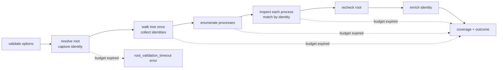

# Filesystem process usage queries

Query a file or directory tree to find observable processes using it:

```rust
use sniff::filesystem::query::{Outcome, PathUsageOptions, query_path_usage};
use std::path::Path;

let report = query_path_usage(Path::new("./checkout"), &PathUsageOptions::default())?;
if report.outcome != Outcome::Usable {
    // Discovery could not run here; read `report.coverage` for why.
}
```

**Status.** The library entry point, report contract, platform-neutral
matching, and the [Linux/WSL2 backend](#linux-and-wsl2) are built.
**Planned:** the macOS and Windows backends and the
[CLI query](../cli/filesystem_query.md). Until its backend lands, every usage
mechanism on macOS and Windows reports `unsupported` and the outcome there is
`unsupported`.

A directory query includes descendants by default;
`PathUsageOptions::default().target_only()` inspects the target alone. Normal
host and repository reports never perform this scan, and the query does no
repository inventory, network request, privilege elevation, process
termination, or caching.

A handle identifies usage; it does not necessarily prevent deletion. An empty
result does not establish that the target is unused.

## How a query runs



One monotonic budget (default two seconds, `with_deadline` to change it)
covers every phase. When it expires the query **stops scheduling work** and
returns what it collected, with `budget_exhausted: true` and incomplete
coverage. A native call already running can overrun the budget, so the
deadline is not a guarantee of when the function returns.

## Errors versus reports

`query_path_usage` returns `Err(PathUsageError)` only when it cannot build a
report about a verified target. Each error has a stable `kind()`:

| Kind | When |
| --- | --- |
| `invalid_option` | Zero deadline, or one too large to form a deadline |
| `missing_target` | The path, or a root symlink's target, does not exist |
| `unsupported_target_kind` | A socket, FIFO, or device, rejected before it is opened |
| `root_identity` | The root's identity cannot be read |
| `root_validation_timeout` | The budget expired before the root identity was captured |

Every later problem (a denied process, an unreadable descendant, the budget
running out mid-scan) becomes a coverage status and a limitation in the report.

## Matching rules

Evidence is matched by file identity: `(st_dev, st_ino)` on Unix, the volume
serial plus 128-bit file ID on Windows.

- The tree is walked once per query, however many processes are inspected.
  Hidden and Git-ignored entries are in scope.
- A root symlink is resolved once; the report keeps the `requested` and
  `resolved` spellings. Descendant symlinks, junctions, and reparse points are
  indexed as themselves and never followed.
- A hard link outside the tree that names an in-scope file is a match:
  `matched_paths` lists every in-scope path (none is preferred) and
  `observed_path` keeps the spelling the OS reported.
- When a backend supplies only a path (no identity), the path must sit under
  the root component by component (`/work/app-copy` is outside `/work/app`)
  and is then looked up; the match is labeled `match_basis: path_lookup`. On
  Windows the lookup, not text comparison, settles drive/UNC/`\\?\`
  spellings, 8.3 short names, and case-sensitive directories. An object known
  to be deleted is never matched by its former path.

## Process identity

A PID can be reused after a process exits. Observations merge only when both
the PID and the native creation token match; different tokens stay separate
records. A record without a token (and no retained process handle) is marked
`identity_uncertain` and is never merged or enriched. Name, executable, and
user are read only after the creation token is re-read and found unchanged;
otherwise the evidence is kept without a name and a limitation explains why.

## Coverage and outcome

Each mechanism, plus the two prerequisites (`process_enumeration`,
`tree_identity`), gets a coverage record:

| Status | Meaning |
| --- | --- |
| `complete` | Finished over the visible processes and target scope with no known gap |
| `partial` | Started, but permissions, races, malformed records, an incomplete tree, an unverified root, truncation, or the budget left gaps. A watch on an ancestor of the target is noted as a limitation but is not a gap |
| `unsupported` | This OS or build cannot inventory the mechanism; `reason` says why |
| `failed` | Attempted, but no inspection succeeded |
| `not_attempted` | Supported but never started, for example because the budget ran out first; `reason` says why |

A gap in a prerequisite makes every dependent mechanism `partial`. The report's
`outcome` is decided by the library:

- `usable`: at least one usage mechanism is `complete`, or `partial` with a
  successful inspection or retained evidence. Matches may be empty.
- `unavailable`: usage mechanisms are supported, but none of them is usable.
- `unsupported`: no usage mechanism is supported here.

Prerequisites never make an outcome `usable` on their own.

| Environment | Discovery | Coverage limit |
| --- | --- | --- |
| Linux/WSL2 | Open descriptors, cwd, inotify registrations | Permissions; fanotify and polling are `unsupported` |
| macOS (**planned**) | Vnode descriptors and cwd, including observable event-only opens | FSEvents subscriptions cannot be enumerated systemwide |
| Windows (**planned**) | File/directory handle and loaded-module owners | Handle ownership does not establish watcher status or deletion blocking; cwd and `ReadDirectoryChangesW` subscriptions are `unsupported` |

For example, a Node process with its cwd in a checkout will appear as working
directory evidence. A Node process watching that checkout through FSEvents may
have no observable path association and be absent from matches.

Retained evidence is capped at 1,000 records per process and 10,000 per query;
a hit cap makes the mechanism `partial` with a `truncation` record and the
omitted count.

## Linux and WSL2

The backend reads `/proc` directly. WSL2 runs the same code and sees only
Linux processes, never native Windows ones.

- **Processes** are the numeric entries of `/proc`, which are thread-group
  leaders, so a thread is never reported as a process. The creation token is
  `starttime` (field 22 of `/proc/<pid>/stat`); the process name comes from
  the same file. If the start time changes between enumeration and the end of
  a process's inspection, the PID was reused and nothing read for it is kept.
- **Open descriptors** (`open_handles`) and the **working directory**
  (`working_directories`) are identified by `stat` through
  `/proc/<pid>/fd/<n>` and `/proc/<pid>/cwd`. The link text becomes
  `observed_path` only; for an unlinked file it reads `<path> (deleted)` and
  is never opened. Open access (`read`/`write`) comes from the `flags` line of
  `/proc/<pid>/fdinfo/<n>`; an `O_PATH` descriptor has neither.
- **inotify registrations** are read from the `fdinfo` of anonymous-inode
  descriptors. A descriptor is an inotify instance when its `fdinfo` has
  `inotify` lines; its event queue is never read. Each line is one
  registration, kept separately even when several share a descriptor:

  ```text
  inotify wd:3 ino:b84b5 sdev:800011 mask:fff ignored_mask:0
  ```

  becomes watch evidence with `descriptor`, `watch.watch_id: 3`,
  `watch.mask`, and `watch.recursive: false` (inotify has no recursive
  watches). `sdev` is the kernel's device number (`major << 20 | minor`, here
  8:17) and is converted to the `st_dev` encoding before it is compared, so
  `sdev:800011` matches `st_dev` `0x811`. A watch has no path of its own:
  `observed_path` is always `null`.

A watch counts only when it names the target or an included descendant:

| Watched object | Result |
| --- | --- |
| The target, or a descendant in a recursive query | `watch_registration` evidence |
| The target directory under `target_only()` | Evidence; descendants are out of scope |
| An ancestor of the target (`/work` when querying `/work/app`) | No evidence; an `ancestor_watch` limitation on `inotify`, which stays `complete` |
| An in-scope inode number on a different device | No evidence; a `device_identity_unreliable` limitation, `partial` |
| Anything else (`/work/app-copy`) | Ignored |

The device check exists because btrfs subvolumes and overlayfs report a
`st_dev` that differs from the kernel device inotify records, so such a watch
may be in scope but cannot be proven to be.

Problems stay visible instead of reading as "no matches":

- A denied descriptor table (`/proc/<pid>/fd`, typical for another user's
  processes) makes that process `permission_denied` for `open_handles` and
  `inotify`. So does a table that lists but whose every entry is denied.
- A malformed `inotify` line is a `malformed_record` limitation naming the
  descriptor and line; valid lines beside it are kept. A field missing, empty,
  repeated, out of range, or not a number makes its line malformed; unknown
  `key:value` fields are ignored. A record that is empty, or whose every line
  is malformed, means that process's inotify inspection did not succeed.
- A descriptor whose `fdinfo` inode no longer matches what `stat` saw was
  replaced mid-inspection; it is dropped with a `descriptor_replaced`
  limitation.
- fanotify marks and polling watchers are `unsupported`. A complete
  descriptor scan is still not complete watcher discovery.

## Serialized form

The report serializes with snake_case keys and `schema_version: 1`.

- Paths, executables, and process names are objects:
  `{"display": "caf�"}` plus, only when `display` cannot reproduce the
  value, `"native": {"encoding": "unix_bytes", "units": [99, 97, 102, 233]}`
  (`windows_utf16` units on Windows, which preserve unpaired surrogates).
  Never match or open files using `display`.
- Inodes, devices, file IDs, creation tokens, descriptors, and watch masks are
  decimal strings, because they can exceed what a JSON number holds exactly.
- An unavailable field is an explicit `null`, never an omitted key. Reading a
  report back requires every key, rejects unknown keys, and rejects duplicates.
- `elapsed_us` is monotonic microseconds; `started_at`/`finished_at` are
  wall-clock times for presentation.

## Work counters

Under a performance collector the query records these
`performance::counters`: `filesystem.query.tree_walks` (one per recursive
directory query), `tree_identity_reads`, `process_enumerations`,
`process_inspections`, `descriptor_inspections`, `watch_registration_reads`,
`identity_enrichments`, and `path_lookups`, all under `filesystem.query.`.
On Linux, `descriptor_inspections` counts each `/proc/<pid>/fd/<n>` entry and
`watch_registration_reads` each `fdinfo` read of an anonymous-inode
descriptor, failures included.
Root resolution also records `filesystem.io.metadata_probes` and
`filesystem.io.canonicalizations`.
