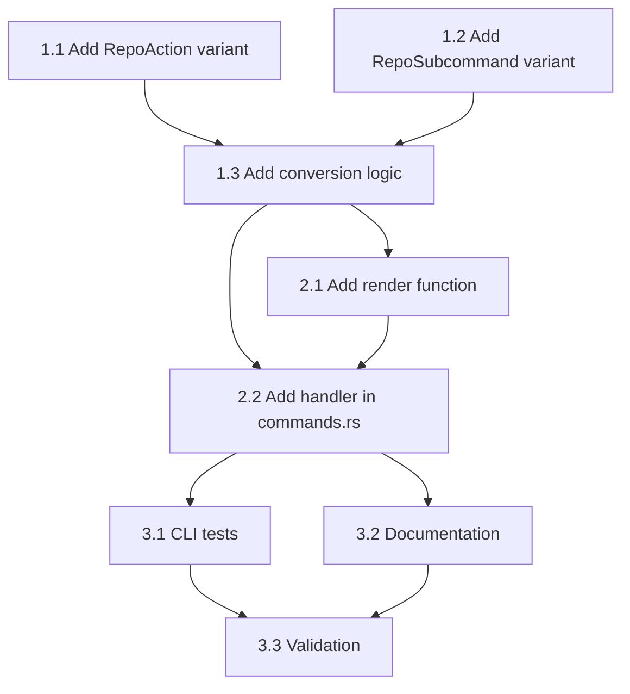

# Execution Plan: `sniff repo package-areas` Command

## Overview

Add a new `sniff repo package-areas` subcommand that lists all unique package areas in a monorepo. This command mirrors the existing `sniff repo packages` command with identical CLI switches and output format options.

## Dependency Graph



---

## Phase 1: CLI Argument Structure
**Agent:** `rust-developer` | **Skills:** sniff, cli, clap | **Complexity:** Low
**Deps:** None | **Parallel:** Steps 1.1 and 1.2 can run in parallel

**Goal:** Define the CLI argument types and parsing for the new subcommand.

### Step 1.1: Add `PackageAreas` variant to `RepoAction` enum

**File:** `sniff/cli/src/args.rs`

Add after the existing `Packages` variant (~line 44):

```rust
PackageAreas {
    filter: Vec<String>,
    package_area: Option<String>,
    format: PackagesFormat,
},
```

**Pass when:**
- [ ] `RepoAction::PackageAreas` variant exists with correct fields
- [ ] Builds without errors

### Step 1.2: Add `PackageAreas` subcommand to `RepoSubcommand` enum

**File:** `sniff/cli/src/args.rs`

Add after the existing `Packages` subcommand (~line 666):

```rust
/// Output only package area names as a comma-separated list
#[command(name = "package-areas")]
PackageAreas {
    /// Filter by area name; prefix with ! to exclude
    filter: Vec<String>,
    /// Restrict output to a specific package area
    #[arg(long)]
    package_area: Option<String>,
    /// Render as a Markdown unordered list (one `- name` per line)
    #[arg(long, conflicts_with = "list")]
    md: bool,
    /// Render as a raw list (one entry per line, no bullet)
    #[arg(long, conflicts_with = "md")]
    list: bool,
},
```

**Pass when:**
- [ ] `RepoSubcommand::PackageAreas` variant exists
- [ ] `--md` and `--list` are mutually exclusive
- [ ] Builds without errors

### Step 1.3: Add conversion from `RepoSubcommand::PackageAreas` to `RepoAction::PackageAreas`

**File:** `sniff/cli/src/args.rs`

In the `to_action()` method (or similar conversion logic, ~line 1081), add handling for the new variant:

```rust
Some(RepoSubcommand::PackageAreas {
    filter: sub_filter,
    package_area,
    md,
    list,
}) => RepoAction::PackageAreas {
    filter: if sub_filter.is_empty() {
        filter.clone()
    } else {
        sub_filter.clone()
    },
    package_area: package_area.clone(),
    format: if *md {
        PackagesFormat::Markdown
    } else if *list {
        PackagesFormat::List
    } else {
        PackagesFormat::Csv
    },
},
```

**Pass when:**
- [ ] `sniff repo package-areas --help` shows correct options
- [ ] `sniff repo package-areas --md --list` fails with conflict error
- [ ] Unit test `test_repo_package_areas_parsing` passes

---

## Phase 2: Output Rendering and Command Handler
**Agent:** `rust-developer` | **Skills:** sniff, cli, biscuit-terminal | **Complexity:** Medium
**Deps:** Phase 1 | **Parallel:** Steps 2.1 and 2.2 must be sequential

**Goal:** Implement the output formatting function and wire up the command handler.

### Step 2.1: Add `render_repo_package_areas_formatted` function

**File:** `sniff/cli/src/output/filesystem.rs`

Add near `render_repo_packages_formatted` (~line 1361):

```rust
/// Render the package area list for `sniff repo package-areas` in the requested format.
///
/// Honors `--md` (Markdown unordered list), `--list` (one entry per line), and
/// the default csv form. With `verbose > 0`, each entry is annotated with the
/// dimmed package area root directory.
pub fn render_repo_package_areas_formatted(
    repo: &RepoInfo,
    repo_filter: &[String],
    package_area_filter: Option<&str>,
    format: PackagesFormat,
    verbose: u8,
) -> String {
    if !repo.is_monorepo {
        return String::from(
            "- the \"package-areas\" subcommand is only intended to be used in a monorepo",
        );
    }

    let packages = match repo.packages.as_ref() {
        Some(p) => p,
        None => return String::new(),
    };

    // Collect unique package areas with their root directories
    let mut area_map: std::collections::BTreeMap<&str, &str> = std::collections::BTreeMap::new();
    for pkg in packages {
        // Use the package's relative path minus the package name suffix as the area root
        let area_root = if pkg.relative == pkg.package_area {
            &pkg.relative
        } else {
            pkg.relative.strip_suffix(&format!("/{}", pkg.relative.rsplit('/').next().unwrap_or("")))
                .unwrap_or(&pkg.relative)
        };
        area_map.entry(pkg.package_area.as_str()).or_insert(area_root);
    }

    // Apply package_area filter if specified
    let areas: Vec<(&str, &str)> = if let Some(filter) = package_area_filter {
        let filter_lower = filter.to_lowercase();
        area_map
            .into_iter()
            .filter(|(area, _)| area.to_lowercase() == filter_lower)
            .collect()
    } else {
        area_map.into_iter().collect()
    };

    // Apply repo filter patterns
    let filtered: Vec<(&str, &str)> = if repo_filter.is_empty() {
        areas
    } else {
        let filters = parse_repo_filters(repo_filter);
        areas
            .into_iter()
            .filter(|(area, _)| matches_filters(area, &filters))
            .collect()
    };

    // Format entries
    let entries: Vec<String> = filtered
        .iter()
        .map(|(area, root)| {
            if verbose > 0 {
                format!("{area} (<dim><i>./{root}</i></dim>)")
            } else {
                (*area).to_string()
            }
        })
        .collect();

    match format {
        PackagesFormat::Csv => entries.join(", "),
        PackagesFormat::Markdown => entries
            .iter()
            .map(|e| format!("- {e}"))
            .collect::<Vec<_>>()
            .join("\n"),
        PackagesFormat::List => entries.join("\n"),
    }
}
```

**Also update `sniff/cli/src/output/mod.rs`** to re-export the new function:

```rust
pub(crate) use filesystem::{
    // ... existing exports ...
    render_repo_package_areas_formatted,
};
```

**Pass when:**
- [ ] Function compiles without errors
- [ ] Unit test for CSV output passes
- [ ] Unit test for Markdown output passes
- [ ] Unit test for List output passes
- [ ] Unit test for verbose output passes

### Step 2.2: Add handler for `RepoAction::PackageAreas` in commands.rs

**File:** `sniff/cli/src/commands.rs`

Add a new struct and handler function similar to `RepoPackagesArgs` and `handle_repo_packages`:

```rust
/// Subcommand-specific args for `sniff repo package-areas`.
struct RepoPackageAreasArgs<'a> {
    filter: &'a [String],
    package_area: Option<&'a str>,
    format: PackagesFormat,
}

/// Fast-path handler for `sniff repo package-areas`.
fn handle_repo_package_areas(
    base_dir: Option<&std::path::Path>,
    args: RepoPackageAreasArgs<'_>,
    json: bool,
    plain: bool,
    verbose: u8,
    perf: &CliPerf,
) -> Result<(), Box<dyn std::error::Error>> {
    let RepoPackageAreasArgs {
        filter,
        package_area,
        format,
    } = args;

    perf.start("detection");
    let plan = sniff::DetectionPlan::new()
        .without_os()
        .without_hardware()
        .without_network()
        .filesystem(
            sniff::request::FilesystemRequest::new()
                .repo(sniff::request::RepoRequest::structure())
                .without_git()
                .without_docs()
                .without_file_inventory()
                .without_formatting(),
        );
    let result = sniff::detect_with_plan(plan, base_dir)?;
    perf.stop("detection");

    let repo = result
        .filesystem
        .as_ref()
        .and_then(|fs| fs.repo.as_ref())
        .ok_or("Not in a repository")?;

    if json {
        perf.start("json_render");
        let packages = repo.packages.as_ref();
        let mut areas: Vec<&str> = packages
            .map(|pkgs| {
                pkgs.iter()
                    .map(|p| p.package_area.as_str())
                    .collect::<std::collections::HashSet<_>>()
                    .into_iter()
                    .collect()
            })
            .unwrap_or_default();
        areas.sort();

        // Apply package_area filter
        if let Some(filter_area) = package_area {
            let filter_lower = filter_area.to_lowercase();
            areas.retain(|a| a.to_lowercase() == filter_lower);
        }

        // Apply repo filter
        if !filter.is_empty() {
            let filters = crate::output::filesystem::parse_repo_filters(filter);
            areas.retain(|a| crate::output::filesystem::matches_filters(a, &filters));
        }

        let json = serde_json::to_string_pretty(&areas)?;
        perf.stop("json_render");
        perf.report();
        println!("{json}");
    } else {
        perf.start("text_render");
        let text = crate::output::render_repo_package_areas_formatted(
            repo,
            filter,
            package_area,
            format,
            verbose,
        );
        perf.stop("text_render");
        perf.report();

        if text.is_empty() {
            std::process::exit(1);
        }

        let output = if plain {
            biscuit_terminal::strip_ansi(&text)
        } else {
            text
        };
        println!("{output}");
    }

    Ok(())
}
```

Add the match arm in the command dispatch (~line 505):

```rust
crate::args::RepoAction::PackageAreas {
    filter,
    package_area,
    format,
} => {
    return handle_repo_package_areas(
        base_dir.as_deref(),
        RepoPackageAreasArgs {
            filter,
            package_area: package_area.as_deref(),
            format: *format,
        },
        json,
        plain,
        verbose,
        &perf,
    );
}
```

**Pass when:**
- [ ] `sniff repo package-areas` outputs CSV by default
- [ ] `sniff repo package-areas --md` outputs Markdown
- [ ] `sniff repo package-areas --list` outputs one per line
- [ ] `sniff repo package-areas --json` outputs JSON array
- [ ] `sniff repo package-areas -v` shows root directories
- [ ] `sniff repo package-areas --plain` strips ANSI codes

---

## Phase 3: Testing and Documentation
**Agent:** `rust-developer` | **Skills:** sniff, cli, rust-testing | **Complexity:** Low
**Deps:** Phase 2 | **Parallel:** Steps 3.1 and 3.2 can run in parallel

**Goal:** Add comprehensive CLI tests and documentation.

### Step 3.1: Add CLI integration tests

**File:** `sniff/cli/tests/cli.rs`

Add test section after `repo packages` tests (~line 2754):

```rust
// ============================================================================
// repo package-areas Subcommand Tests
// ============================================================================

#[test]
fn test_repo_package_areas_csv_default() {
    let (_dir, path) = create_cli_monorepo();
    let assert = cargo_bin_cmd!("sniff")
        .args([
            "--base",
            path.to_str().unwrap(),
            "repo",
            "package-areas",
        ])
        .assert()
        .success();
    let stdout = String::from_utf8_lossy(&assert.get_output().stdout);
    // create_cli_monorepo creates packages in "area-a" and "area-b" areas
    assert!(stdout.contains("area-a") && stdout.contains("area-b"));
}

#[test]
fn test_repo_package_areas_md_format() {
    let (_dir, path) = create_cli_monorepo();
    let assert = cargo_bin_cmd!("sniff")
        .args([
            "--base",
            path.to_str().unwrap(),
            "repo",
            "package-areas",
            "--md",
        ])
        .assert()
        .success();
    let stdout = String::from_utf8_lossy(&assert.get_output().stdout);
    assert!(stdout.contains("- area-a") || stdout.contains("- area-b"));
}

#[test]
fn test_repo_package_areas_list_format() {
    let (_dir, path) = create_cli_monorepo();
    let assert = cargo_bin_cmd!("sniff")
        .args([
            "--base",
            path.to_str().unwrap(),
            "repo",
            "package-areas",
            "--list",
        ])
        .assert()
        .success();
    let stdout = String::from_utf8_lossy(&assert.get_output().stdout);
    let lines: Vec<&str> = stdout.trim().lines().collect();
    assert!(lines.len() >= 2); // At least two areas
}

#[test]
fn test_repo_package_areas_md_and_list_conflict() {
    let (_dir, path) = create_cli_monorepo();
    cargo_bin_cmd!("sniff")
        .args([
            "--base",
            path.to_str().unwrap(),
            "repo",
            "package-areas",
            "--md",
            "--list",
        ])
        .assert()
        .failure();
}

#[test]
fn test_repo_package_areas_verbose_shows_root_dir() {
    let (_dir, path) = create_cli_monorepo();
    let assert = cargo_bin_cmd!("sniff")
        .args([
            "--base",
            path.to_str().unwrap(),
            "repo",
            "package-areas",
            "--list",
            "-v",
            "--plain",
        ])
        .assert()
        .success();
    let stdout = String::from_utf8_lossy(&assert.get_output().stdout);
    // Verbose output should include directory path in parentheses
    assert!(
        stdout.contains("(./") || stdout.contains("(."),
        "Verbose list output should include the area root, got:\n{stdout}"
    );
}

#[test]
fn test_repo_package_areas_json_output() {
    let (_dir, path) = create_cli_monorepo();
    let assert = cargo_bin_cmd!("sniff")
        .args([
            "--base",
            path.to_str().unwrap(),
            "repo",
            "package-areas",
            "--json",
        ])
        .assert()
        .success();
    let stdout = String::from_utf8_lossy(&assert.get_output().stdout);
    let parsed: serde_json::Value = serde_json::from_str(&stdout).expect("Valid JSON");
    assert!(parsed.is_array());
}
```

**Pass when:**
- [ ] All new tests pass
- [ ] No regressions in existing tests
- [ ] `cargo test -p sniff-cli` succeeds

### Step 3.2: Add documentation

**File:** `sniff/docs/cli/repo_package-areas.md`

```markdown
---
blast_radius:
  - sniff/cli/src/args.rs
  - sniff/cli/src/commands.rs
  - sniff/cli/src/output/filesystem.rs
---

# The `sniff repo package-areas` Subcommand

Outputs all unique package area names in the monorepo in a configurable format. Designed for script consumption and shell automation. Runs a structure-only detection (no git scanning, no file inventory, no language detection), so it returns well under 100 ms even on large monorepos.

## Default Behavior

Outputs a single line of comma-separated package area names:

```
sniff, homelab, biscuit-terminal, claudine
```

## Arguments and Flags

| Argument/Flag | Description |
|---------------|-------------|
| `[filter...]` | Optional substring filters to narrow the area list |
| `--package-area <AREA>` | Restrict output to a specific package area |
| `--md` | Render as a Markdown unordered list (one `- name` per line) |
| `--list` | Render as a raw list (one name per line, no bullet) |
| `-v`, `--verbose` | Append each area's repo-relative root directory in dim italic |
| `--json` | Emit a JSON array of area names |
| `--plain` | Strip terminal escape codes |

`--md` and `--list` are mutually exclusive. `--verbose` is layered on top of any output format and shows the root dir as styled metadata, never as raw tracing.

## Output Formats

### Default (CSV)

```
sniff, homelab, biscuit-terminal, claudine
```

### Markdown (`--md`)

```
- sniff
- homelab
- biscuit-terminal
```

### Raw list (`--list`)

```
sniff
homelab
biscuit-terminal
```

### Verbose (`-v` / `--verbose`)

With `--verbose`, each entry is annotated with its repo-relative root directory, rendered in dim italic (stripped by `--plain`):

```
sniff (./sniff), homelab (./homelab), biscuit-terminal (./biscuit-terminal)
```

## JSON Output (`--json`)

```bash
sniff repo package-areas --json
```

Returns a JSON array of package area name strings:

```json
["sniff", "homelab", "biscuit-terminal", "claudine"]
```

## Usage in Scripts

```bash
# Iterate with --list (one name per line)
while read -r area; do
    echo "Processing area: $area"
done < <(sniff repo package-areas --list)

# Build all packages in each area
for area in $(sniff repo package-areas --list); do
    just "$area" build
done
```
```

**Pass when:**
- [ ] Documentation file exists
- [ ] Examples are accurate
- [ ] Blast radius frontmatter is correct

### Step 3.3: Final Validation

**Agent:** `rust-developer` | **Skills:** sniff, cli | **Complexity:** Low
**Deps:** Steps 3.1, 3.2

**Goal:** Verify the complete implementation.

**Validation checklist:**
- [ ] `just sniff lint` passes
- [ ] `just sniff test` passes
- [ ] `just sniff build` passes
- [ ] `sniff repo package-areas` works in the rusty-biscuit monorepo
- [ ] `sniff repo package-areas --json` outputs valid JSON
- [ ] `sniff repo package-areas -v --plain` shows area roots without ANSI codes
- [ ] Help text displays correctly: `sniff repo package-areas --help`
- [ ] Error on non-monorepo is user-friendly

**If failed:**
- Rollback: Revert changes to args.rs, commands.rs, filesystem.rs, mod.rs
- Retry: Address specific test/lint failures before re-running validation

---

## Implementation Notes

1. **Reuse `PackagesFormat` enum** - The output format options (CSV, Markdown, List) are identical to `sniff repo packages`, so reuse the existing enum.

2. **Package area extraction** - Each `Package` has a `package_area: String` field. Collect unique values using a `BTreeMap` for sorted, deduplicated output.

3. **Verbose root calculation** - For verbose mode, derive the area root from `pkg.relative`. The pattern is typically `{area}/{subdir}` (e.g., `sniff/cli` → area root is `sniff`).

4. **Fast path** - Like `sniff repo packages`, use `RepoRequest::structure()` to skip expensive git/language detection.

5. **Filter compatibility** - Support the same filter patterns as packages (`@area`, `!exclude`), though `@area` filtering on areas is somewhat redundant.
