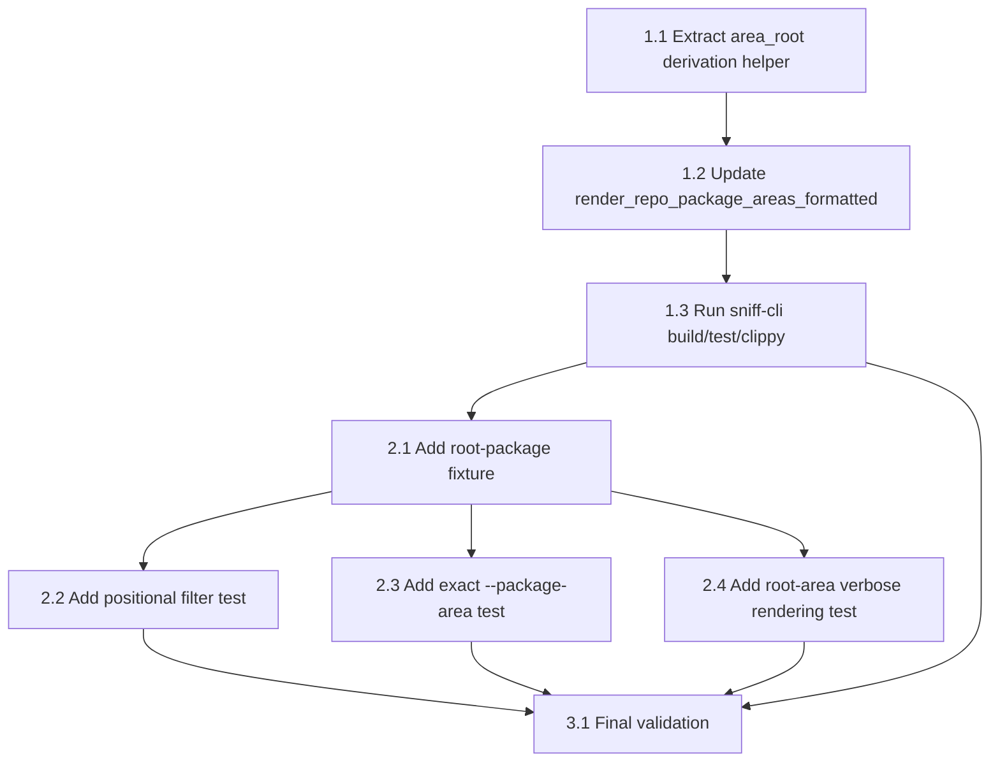

# Review Plan 1: `sniff repo package-areas` Follow-Up

## Overview

Address findings 1 - 4 from `review-1.md` for the newly-landed `sniff repo package-areas` command. All findings target `sniff/cli/src/output/filesystem.rs::render_repo_package_areas_formatted` and the integration test suite in `sniff/cli/tests/cli.rs`. No changes to argument parsing (`args.rs`) or command dispatch (`commands.rs`) are required — the handler already passes `verbose`, `repo_filter`, `package_area`, and `format` through correctly.

### Scope at a Glance

| Finding | Area | Fix Location |
|---------|------|--------------|
| 1 | Verbose format missing space | `render_repo_package_areas_formatted` markup template |
| 2 | `root` area renders `./root` | New helper for area-root derivation |
| 3 | Hardcoded `./ + area` instead of `pkg.relative` | Replace derivation path in the render loop |
| 4 | Missing tests: positional filter, `--package-area`, `root` area verbose rendering | `sniff/cli/tests/cli.rs` |
| Lint | Clean `sniff` package-area warnings | `cargo clippy` for both `sniff` and `sniff-cli` |

### Confirmed Facts (discovery)

1. **`Package` struct** (`sniff/lib/src/filesystem/repo/types.rs:171-178`):
   - `pub relative: String` — repo-relative path, e.g. `"sniff/cli"`, `"pkg-a/lib"`, `"model_id"` for a root package.
   - `pub package_area: String` — the top-level area name, or `"root"` for packages that live directly at the repo root.
2. **Current bug** (`sniff/cli/src/output/filesystem.rs:1489-1494`):
   ```rust
   let markup = if verbose > 0 {
       format!("{area}(<dim><i>./{area}</i></dim>)")
   } else {
       (*area).to_string()
   };
   ```
   - No space between `{area}` and `(` (Finding 1).
   - Hardcoded `./{area}` rather than using `pkg.relative` to derive the area root (Finding 3).
   - For `area == "root"` this produces `root (./root)` which is a non-existent directory (Finding 2).
3. **`select_repo_package_areas`** (`filesystem.rs:1404-1438`) currently returns `Vec<&str>` of area names only — to derive area roots from `pkg.relative` we need access to at least one `Package` per area. The fix will replace this helper with (or add alongside it) a version that returns `(area_name, area_root)` tuples.
4. **Consumer of `select_repo_package_areas`**: only `render_repo_package_areas_formatted` and `collect_repo_package_area_names`. The latter's public signature (`Vec<&str>`) must not change because it's part of the crate's API surface and returns area names for JSON output.
5. **Existing test fixture** `create_cli_monorepo` (`cli.rs:2069-2128`) defines workspace members `pkg-a/lib` and `pkg-b/lib`. It has **no root-level package**, so the "root" area rendering test needs a new fixture (or an extension of an existing one) that places a package directly at the repo root.
6. **`just sniff lint`** expands to `cargo clippy -p sniff -p sniff-cli` (without `-- -D warnings` by default). The spec of this review requires `-D warnings` across both crates.

## Dependency Graph



Phases 2.2 / 2.3 / 2.4 can run in parallel once 2.1 (fixture) lands.

---

## Phase 1: Fix `render_repo_package_areas_formatted`

**Agent:** `rust-developer` | **Skills:** sniff, cli, biscuit-terminal | **Complexity:** Low
**Deps:** None | **Parallel:** Steps 1.1 and 1.2 are tightly coupled; implement sequentially.

**Goal:** Produce correct verbose output: insert the missing space, replace `./{area}` with a value derived from `pkg.relative`, and special-case the `"root"` area so it renders as `./`.

### Step 1.1: Introduce an area-root derivation helper

**File:** `sniff/cli/src/output/filesystem.rs`

**What to add** (place near the other `select_repo_*` helpers, around line 1403):

```rust
/// Compute the repo-relative area root directory for a given package.
///
/// For a package whose `package_area` is `"root"` (top-level package such as
/// `model_id` at the repo root), returns `"."` — the repo root itself.
///
/// Otherwise returns the top-level directory of `pkg.relative`
/// (e.g. `"sniff/cli"` → `"sniff"`, `"apps/browser/my_package"` → `"apps"`).
///
/// This mirrors the `{area}` naming used by `Package::package_area` while
/// preserving the invariant that the returned string always names a real
/// directory relative to the repo root.
fn package_area_root<'a>(pkg: &'a Package) -> &'a str {
    if pkg.package_area == "root" {
        return ".";
    }
    let trimmed = pkg.relative.trim_start_matches("./");
    trimmed.split('/').next().unwrap_or(trimmed)
}
```

**Why this shape:**
- Returns `&str` to avoid allocation in the hot render loop.
- Handles defensive `./` prefix stripping, matching the existing pattern in `package_entry_markup` (line 1349).
- Uses `pkg.package_area == "root"` directly because `Package::package_area` is already normalized by `sniff-lib` — this is the sole source of truth for the sentinel.
- Does **not** depend on `pkg.relative` matching `pkg.package_area`; it derives directly from the relative path's first component.

**Pass when:**
- [ ] Function compiles.
- [ ] `cargo clippy -p sniff-cli -- -D warnings` produces no new warnings.

### Step 1.2: Update `select_repo_package_areas` (and callers) to carry area roots

**File:** `sniff/cli/src/output/filesystem.rs` (lines 1403 - 1507)

**Constraints:**
- `collect_repo_package_area_names` (line 1443) **must keep returning `Vec<&str>` of area names**; it's the path used for `--json` output in `commands.rs` and is exercised by `test_repo_package_areas_json_output`. Do not break its public signature.

**Recommended change** — keep the name-only helper and add a sibling that returns `(name, root)` pairs:

1. Rename the current `select_repo_package_areas` body into an internal "names only" implementation (keep its signature). **Do not delete it.**
2. Add a second helper `select_repo_package_areas_with_roots` that returns `Vec<(&str, &str)>` of `(area_name, area_root)` pairs:

```rust
/// Same selection logic as [`select_repo_package_areas`] but also returns the
/// repo-relative area root directory derived from each area's first package.
fn select_repo_package_areas_with_roots<'a>(
    packages: &'a [Package],
    repo_filter: &[String],
    package_area: Option<&str>,
) -> Vec<(&'a str, &'a str)> {
    // Capture the first package encountered for each area (deterministic via
    // sorted insertion below) so we can derive the area root once.
    let mut seen: std::collections::BTreeMap<&str, &Package> =
        std::collections::BTreeMap::new();
    for pkg in packages {
        seen.entry(pkg.package_area.as_str()).or_insert(pkg);
    }

    let scope = package_area.map(str::to_lowercase);
    let filters: Vec<RepoFilter> = if repo_filter.is_empty() {
        Vec::new()
    } else {
        repo_filter.iter().map(|f| RepoFilter::parse(f)).collect()
    };

    seen.into_iter()
        .filter(|(area, _)| {
            if let Some(needle) = scope.as_deref()
                && area.to_lowercase() != needle
            {
                return false;
            }
            if filters.is_empty() {
                return true;
            }
            let lower = area.to_lowercase();
            filters.iter().any(|f| {
                let hit = lower.contains(&f.query.to_lowercase());
                if f.negate { !hit } else { hit }
            })
        })
        .map(|(area, pkg)| (area, package_area_root(pkg)))
        .collect()
}
```

**Note:** The filter predicate is identical to `select_repo_package_areas`. If you want to DRY it up later that's fine, but for this fix prefer clarity over consolidation — this phase is a minimal correctness patch.

3. **Update `render_repo_package_areas_formatted`** (lines 1463 - 1507) to use the new helper and apply the three formatting fixes:

```rust
pub fn render_repo_package_areas_formatted(
    repo: &RepoInfo,
    repo_filter: &[String],
    package_area: Option<&str>,
    format: PackagesFormat,
    verbose: u8,
) -> String {
    if !repo.is_monorepo {
        return String::from(
            "- the \"package-areas\" subcommand is only intended to be used in a monorepo",
        );
    }

    let Some(packages) = repo.packages.as_ref() else {
        return String::new();
    };

    let areas = select_repo_package_areas_with_roots(packages, repo_filter, package_area);
    if areas.is_empty() {
        return String::new();
    }

    let term = Terminal::default();
    let entries: Vec<String> = areas
        .iter()
        .map(|(area, root)| {
            let markup = if verbose > 0 {
                // Finding 2 (root area): render "." → "./" so the annotation
                // reads "root (./)"; all other areas get "./{root}".
                let dir_label = if *root == "." {
                    String::from("./")
                } else {
                    format!("./{root}")
                };
                // Finding 1: note the space before the open paren.
                format!("{area} (<dim><i>{dir_label}</i></dim>)")
            } else {
                (*area).to_string()
            };
            Prose::new(markup).render(&term)
        })
        .collect();

    match format {
        PackagesFormat::Csv => entries.join(", "),
        PackagesFormat::Markdown => entries
            .iter()
            .map(|e| format!("- {e}"))
            .collect::<Vec<_>>()
            .join("\n"),
        PackagesFormat::List => entries.join("\n"),
    }
}
```

**Output contract after this change** (verified with `--plain --list --verbose`):
- `pkg-a (./pkg-a)` — top-level areas get their `pkg.relative` first component.
- `root (./)` — the `"root"` sentinel renders as `./`.
- `apps (./apps)` — nested monorepos (e.g. `apps/browser/my_package`) get the top-level directory only, matching the area name.

**Pass when:**
- [ ] Function compiles.
- [ ] `cargo build -p sniff-cli` succeeds.
- [ ] No new clippy warnings in `sniff-cli`.
- [ ] `sniff repo package-areas --list --verbose --plain` in the rusty-biscuit monorepo shows a space before each `(` and does **not** emit `root(./root)`.

### Step 1.3: Package-level validation

Run from repo root:

```bash
cargo build -p sniff-cli
cargo test -p sniff-cli --test cli -- repo_package_areas
cargo clippy -p sniff -p sniff-cli -- -D warnings
cargo clippy -p sniff --tests -- -D warnings
cargo clippy -p sniff-cli --tests -- -D warnings
```

**Intentional lint scope:** the review prompt requires *all* warnings in the `sniff` package area (both `sniff-lib` and `sniff-cli`, including their test targets) to be clean after this work — regardless of whether they were introduced by Phase 1. Fix any pre-existing warnings encountered. If a warning is structurally intentional (e.g. a public API that cannot yet be cleaned up), allowlist it with a narrowly-scoped `#[allow(...)]` and a comment citing the reason; do **not** blanket-allow at the crate level.

**Pass when:**
- [ ] `cargo build -p sniff-cli` succeeds.
- [ ] All existing `repo_package_areas*` tests still pass. **Note:** `test_repo_package_areas_verbose_shows_root_dir` currently asserts `pkg-a(./pkg-a)` and `pkg-b(./pkg-b)` — both substrings still appear inside the new output `pkg-a (./pkg-a)` and `pkg-b (./pkg-b)` because `contains("pkg-a(./pkg-a)")` does **not** match `"pkg-a (./pkg-a)"`. This means the existing test **will regress** and must be updated to assert the spaced form: `contains("pkg-a (./pkg-a)")`. Do this update as part of Phase 1 to keep the test suite green before Phase 2 adds new tests.
- [ ] `cargo clippy -p sniff -p sniff-cli -- -D warnings` is clean across lib + cli + their test targets.

---

## Phase 2: Test Coverage

**Agent:** `rust-developer` | **Skills:** sniff, cli, rust-testing | **Complexity:** Low
**Deps:** Phase 1 | **Parallel:** Steps 2.2 - 2.4 may be authored in parallel after 2.1 lands.

**Goal:** Close the gaps identified in review finding 4 — positional filter, `--package-area` exact match, and root-area verbose rendering — plus update the existing verbose-substring assertion that regresses in Phase 1.

### Step 2.1: Extend the monorepo fixture with a root-level package

**File:** `sniff/cli/tests/cli.rs`

The existing `create_cli_monorepo` (line 2069) does not produce a `"root"` area. Rather than mutate it (and potentially destabilize 20+ existing tests), add a **sibling fixture** that is a superset:

```rust
/// Like `create_cli_monorepo` but adds a third package at the repo root so
/// tests can exercise the special `"root"` package-area sentinel.
///
/// Produces packages:
/// - `pkg-a` in `pkg-a/lib` (area: `pkg-a`)
/// - `pkg-b` in `pkg-b/lib` (area: `pkg-b`)
/// - `root-pkg` at `./`   (area: `root`)
fn create_cli_monorepo_with_root_pkg() -> (tempfile::TempDir, PathBuf) {
    let dir = tempfile::tempdir().unwrap();
    let repo = git2::Repository::init(dir.path()).unwrap();

    let mut config = repo.config().unwrap();
    config.set_str("user.email", "test@test.com").unwrap();
    config.set_str("user.name", "Test").unwrap();

    // Workspace Cargo.toml includes the root package as a member.
    std::fs::write(
        dir.path().join("Cargo.toml"),
        r#"[workspace]
members = [".", "pkg-a/lib", "pkg-b/lib"]

[package]
name = "root-pkg"
version = "0.1.0"
edition = "2024"
"#,
    )
    .unwrap();

    std::fs::create_dir_all(dir.path().join("src")).unwrap();
    std::fs::write(dir.path().join("src/lib.rs"), "pub fn root() {}").unwrap();

    // pkg-a + pkg-b — identical to create_cli_monorepo
    let pkg_a = dir.path().join("pkg-a/lib");
    std::fs::create_dir_all(pkg_a.join("src")).unwrap();
    std::fs::write(
        pkg_a.join("Cargo.toml"),
        r#"[package]
name = "pkg-a"
version = "0.1.0"
edition = "2024"
"#,
    )
    .unwrap();
    std::fs::write(pkg_a.join("src/lib.rs"), "pub fn a() {}").unwrap();

    let pkg_b = dir.path().join("pkg-b/lib");
    std::fs::create_dir_all(pkg_b.join("src")).unwrap();
    std::fs::write(
        pkg_b.join("Cargo.toml"),
        r#"[package]
name = "pkg-b"
version = "0.1.0"
edition = "2024"
"#,
    )
    .unwrap();
    std::fs::write(pkg_b.join("src/lib.rs"), "pub fn b() {}").unwrap();

    // Commit everything
    let mut index = repo.index().unwrap();
    index
        .add_all(["*"].iter(), git2::IndexAddOption::DEFAULT, None)
        .unwrap();
    index.write().unwrap();
    let sig = repo.signature().unwrap();
    let tree_id = index.write_tree().unwrap();
    let tree = repo.find_tree(tree_id).unwrap();
    repo.commit(Some("HEAD"), &sig, &sig, "initial monorepo with root", &tree, &[])
        .unwrap();

    let path = dir.path().to_path_buf();
    (dir, path)
}
```

**Validation note:** before committing, manually confirm that `sniff repo package-areas --list` against this fixture yields exactly three entries `pkg-a`, `pkg-b`, `root` (order: sorted by area name, which is the `BTreeMap` order). If `sniff-lib` assigns a different area label, adjust the assertions in 2.4 accordingly — but keep the expectation that `"root"` is the sentinel, because that's the contract the review pinned.

**Pass when:**
- [ ] Fixture compiles and `cargo test -p sniff-cli --test cli -- create_cli_monorepo_with_root_pkg` shows no usages error (silent compile).

### Step 2.2: Test positional filter

**File:** `sniff/cli/tests/cli.rs` (add after the existing `test_repo_package_areas_*` block, ~line 2932)

```rust
#[test]
fn test_repo_package_areas_positional_filter() {
    let (_dir, path) = create_cli_monorepo();
    let assert = cargo_bin_cmd!("sniff")
        .args([
            "--base",
            path.to_str().unwrap(),
            "repo",
            "package-areas",
            "pkg-a",
            "--list",
            "--plain",
        ])
        .assert()
        .success();
    let stdout = String::from_utf8_lossy(&assert.get_output().stdout);
    assert_eq!(stdout.trim(), "pkg-a");
}

#[test]
fn test_repo_package_areas_positional_filter_negation() {
    let (_dir, path) = create_cli_monorepo();
    let assert = cargo_bin_cmd!("sniff")
        .args([
            "--base",
            path.to_str().unwrap(),
            "repo",
            "package-areas",
            "!pkg-a",
            "--list",
            "--plain",
        ])
        .assert()
        .success();
    let stdout = String::from_utf8_lossy(&assert.get_output().stdout);
    assert_eq!(stdout.trim(), "pkg-b");
}
```

**Rationale:** the positional case covers substring inclusion; the negation variant ensures `!` propagates through the same code path that packages already validates. Both use the existing fixture (no `root` area needed).

**Pass when:**
- [ ] Both tests pass.

### Step 2.3: Test exact `--package-area` matching

**File:** `sniff/cli/tests/cli.rs`

```rust
#[test]
fn test_repo_package_areas_package_area_exact_match() {
    let (_dir, path) = create_cli_monorepo();
    // A prefix should not match — --package-area is exact (case-insensitive) equality.
    let assert = cargo_bin_cmd!("sniff")
        .args([
            "--base",
            path.to_str().unwrap(),
            "repo",
            "package-areas",
            "--package-area",
            "pkg",
            "--list",
            "--plain",
        ])
        .assert()
        .success();
    let stdout = String::from_utf8_lossy(&assert.get_output().stdout);
    assert!(
        stdout.trim().is_empty(),
        "--package-area should exact-match, not substring-match; got: {stdout:?}"
    );
}

#[test]
fn test_repo_package_areas_package_area_case_insensitive() {
    let (_dir, path) = create_cli_monorepo();
    let assert = cargo_bin_cmd!("sniff")
        .args([
            "--base",
            path.to_str().unwrap(),
            "repo",
            "package-areas",
            "--package-area",
            "PKG-A",
            "--list",
            "--plain",
        ])
        .assert()
        .success();
    let stdout = String::from_utf8_lossy(&assert.get_output().stdout);
    assert_eq!(stdout.trim(), "pkg-a");
}
```

**Rationale:** the original test `test_repo_package_areas_package_area_filter` confirmed that an exact match returns the expected area. These two round out the contract: a non-matching prefix must return nothing, and the match is case-insensitive (which is what `select_repo_package_areas` already does via `to_lowercase()`).

**Pass when:**
- [ ] Both tests pass.

### Step 2.4: Test root area rendering (verbose)

**File:** `sniff/cli/tests/cli.rs`

```rust
#[test]
fn test_repo_package_areas_root_area_verbose_renders_dot_slash() {
    let (_dir, path) = create_cli_monorepo_with_root_pkg();
    let assert = cargo_bin_cmd!("sniff")
        .args([
            "--base",
            path.to_str().unwrap(),
            "repo",
            "package-areas",
            "--list",
            "--verbose",
            "--plain",
        ])
        .assert()
        .success();
    let stdout = String::from_utf8_lossy(&assert.get_output().stdout);
    assert!(
        stdout.contains("root (./)"),
        "root area verbose output must render './' not './root'; got:\n{stdout}"
    );
    assert!(
        !stdout.contains("root (./root)"),
        "root area must not render './root' (finding #2); got:\n{stdout}"
    );
    // Sanity: non-root areas still render with their directory.
    assert!(
        stdout.contains("pkg-a (./pkg-a)"),
        "non-root areas must retain directory annotation; got:\n{stdout}"
    );
}

#[test]
fn test_repo_package_areas_verbose_has_space_before_paren() {
    let (_dir, path) = create_cli_monorepo();
    let assert = cargo_bin_cmd!("sniff")
        .args([
            "--base",
            path.to_str().unwrap(),
            "repo",
            "package-areas",
            "--list",
            "--verbose",
            "--plain",
        ])
        .assert()
        .success();
    let stdout = String::from_utf8_lossy(&assert.get_output().stdout);
    assert!(
        stdout.contains("pkg-a (./pkg-a)"),
        "verbose output must have a space before the paren (finding #1); got:\n{stdout}"
    );
    assert!(
        !stdout.contains("pkg-a(./pkg-a)"),
        "verbose output must not be flush-left (finding #1 regression); got:\n{stdout}"
    );
}
```

**Plus update** `test_repo_package_areas_verbose_shows_root_dir` (lines 2867 - 2890): replace the two `contains("pkg-X(./pkg-X)")` assertions with their spaced forms, or delete the test entirely in favor of the more precise `test_repo_package_areas_verbose_has_space_before_paren` above. **Recommendation:** delete the old test. The new pair is strictly stronger.

**Pass when:**
- [ ] All four new tests pass.
- [ ] `test_repo_package_areas_verbose_shows_root_dir` is removed OR updated to use the spaced form (no stale assertions).
- [ ] `cargo test -p sniff-cli --test cli -- repo_package_areas` is entirely green.

---

## Phase 3: Final Validation

**Agent:** `rust-developer` | **Skills:** sniff, cli | **Complexity:** Low
**Deps:** Phases 1 and 2.

**Goal:** Confirm the full feature is correct and the `sniff` package area is lint-clean.

### Step 3.1: End-to-end validation

Run all of the following from the repo root and ensure each succeeds:

```bash
# Build
cargo build -p sniff-cli

# Test suite (all sniff-cli tests — not just the new ones)
cargo test -p sniff -p sniff-cli

# Lint (non-test targets, warnings as errors)
cargo clippy -p sniff -p sniff-cli -- -D warnings

# Lint test targets too
cargo clippy -p sniff --tests -- -D warnings
cargo clippy -p sniff-cli --tests -- -D warnings

# Doctests
cargo test -p sniff -p sniff-cli --doc

# Convenience: the area-level justfile wrapper
just sniff lint
just sniff test
just sniff build
```

Then run the live CLI against the current worktree as a smoke test:

```bash
cargo run -p sniff-cli --quiet -- repo package-areas --list --plain
cargo run -p sniff-cli --quiet -- repo package-areas --list --verbose --plain
cargo run -p sniff-cli --quiet -- repo package-areas --md --verbose --plain
cargo run -p sniff-cli --quiet -- repo package-areas --json
cargo run -p sniff-cli --quiet -- repo package-areas sniff --list --plain
cargo run -p sniff-cli --quiet -- repo package-areas --package-area sniff --list --plain
```

**Expected behavior for each:**
- `--list --verbose --plain` output shows each area with a space before `(` and never `./root` — confirm by piping to `grep -E '\(\./(root|\w)' | sort -u`.
- `sniff` positional-filter produces only areas whose names contain `sniff` (typically: `sniff`).
- `--package-area sniff` returns exactly `sniff` (exact-match).
- `--json` returns a sorted JSON array.

### Step 3.2: Update the review metadata

**File:** `sniff/features/2026-04-22-package-areas/review-1.md`

Flip the frontmatter `ready: false` to `ready: true` once all three findings are verified by automated tests. Do **not** remove or alter the original review text — this is an audit record.

**Pass when:**
- [ ] All commands in 3.1 succeed.
- [ ] `review-1.md` frontmatter updated to `ready: true`.

---

## Implementation Notes

1. **Why not touch `collect_repo_package_area_names`?** It feeds the `--json` output (confirmed at `commands.rs:1291-ish`, where `handle_repo_package_areas` builds the area list for `serde_json::to_string_pretty`). That output is names-only by contract and is tested by `test_repo_package_areas_json_output`. Changing its shape to `(name, root)` would break the JSON envelope and is out of scope for this review.

2. **Why a separate `package_area_root` helper?** Localizing the `"root"` sentinel handling in one place means any future caller (e.g. a hypothetical `sniff repo package-area-roots` command, or the `-v` form of `sniff repo packages` if we want it to borrow this behavior) can reuse the same derivation without re-introducing the bug. It also makes unit-testable logic out of a currently inline expression.

3. **Finding #5 (OR filter logic) is out of scope.** The reviewer explicitly framed it as an observation inherited from `sniff repo packages`, not a defect in `package-areas`. Mixing inclusion + exclusion filters is a pre-existing ergonomic concern for both commands; fixing it in just one would create inconsistency. Flag as a future follow-up in `sniff/features/` if desired.

4. **No `args.rs` / `commands.rs` changes.** Double-checked: `handle_repo_package_areas` already forwards `verbose: u8` to `render_repo_package_areas_formatted` (observed in the current tree at the top of Phase 1 discovery). The regression path is entirely contained within the render function.

5. **Prose markup convention.** The fix continues to wrap verbose annotations in `<dim><i>...</i></dim>` markup and pass them through `Prose::new(...).render(&term)`, matching the existing pattern in `package_entry_markup` and honoring the spec's `{package-area} (<dim><i>{dir}</i></dim>)` form.

## Risks and Concerns

| Risk | Likelihood | Mitigation |
|------|------------|------------|
| Existing `test_repo_package_areas_verbose_shows_root_dir` regresses because its assertion is `contains("pkg-a(./pkg-a)")` (no space). | **High — guaranteed.** | Phase 1.3 updates/removes it in the same commit. |
| `create_cli_monorepo_with_root_pkg` does not produce a `"root"` area if `sniff-lib` categorizes root workspace members differently than expected. | Low. | Phase 2.1 includes an explicit manual validation step. If categorization differs, the test will need to assert whatever sentinel `sniff-lib` actually emits — still meeting the spirit of finding #2. |
| Pre-existing clippy warnings in `sniff` or `sniff-cli` that aren't related to this change block `-D warnings`. | Medium. | Phase 1.3 explicitly scopes this: fix them, or narrowly `#[allow(...)]` with a citation. |
| `package_area_root` returning a borrowed `&str` instead of `String` forces lifetime parameters on the new helper. | Low. | The `'a` lifetime is already present on `select_repo_package_areas_with_roots`; no new complication. |
| Finding #3 recommends using `pkg.relative` for derivation, but `pkg.relative` for a nested package like `apps/browser/my_package` yields `"apps"` as the area root — does this match `pkg.package_area`? | Low. | `sniff-lib`'s docstring on `Package::package_area` explicitly says "for nested monorepos the value is `apps/browser`" — meaning area names can contain `/`. The fix's `split('/').next()` is too aggressive for that shape. **Safer alternative:** if `pkg.relative` starts with `pkg.package_area` then the area root is exactly `pkg.package_area`. Implementation should prefer: `pkg.relative.strip_prefix(&format!("{}/", pkg.package_area)).map(\|_\| pkg.package_area.as_str()).unwrap_or_else(\|\| pkg.relative.split('/').next().unwrap_or(&pkg.relative))`. Update `package_area_root` accordingly before committing Phase 1.1. |

**Action item flagged by the last row:** when implementing 1.1, prefer the strip-prefix form so that multi-segment area names (`apps/browser`) render correctly as `./apps/browser`. The `"root"` sentinel still short-circuits first.

Updated `package_area_root`:

```rust
fn package_area_root<'a>(pkg: &'a Package) -> &'a str {
    if pkg.package_area == "root" {
        return ".";
    }
    // If relative starts with the area name (the common case, including
    // multi-segment areas like "apps/browser"), the area root *is* the area.
    if pkg
        .relative
        .trim_start_matches("./")
        .strip_prefix(&pkg.package_area)
        .and_then(|rest| rest.chars().next())
        .is_some_and(|c| c == '/' || c == '\0')
        || pkg.relative.trim_start_matches("./") == pkg.package_area
    {
        return &pkg.package_area;
    }
    // Fallback: first path component. Preserves the original behavior for any
    // exotic shape where package_area is not a prefix of relative.
    let trimmed = pkg.relative.trim_start_matches("./");
    trimmed.split('/').next().unwrap_or(trimmed)
}
```

This is a correctness-preserving improvement beyond what the review strictly requires, but it aligns with the review's own stated intent ("use `pkg.relative`") and prevents a latent bug for nested-monorepo users.
