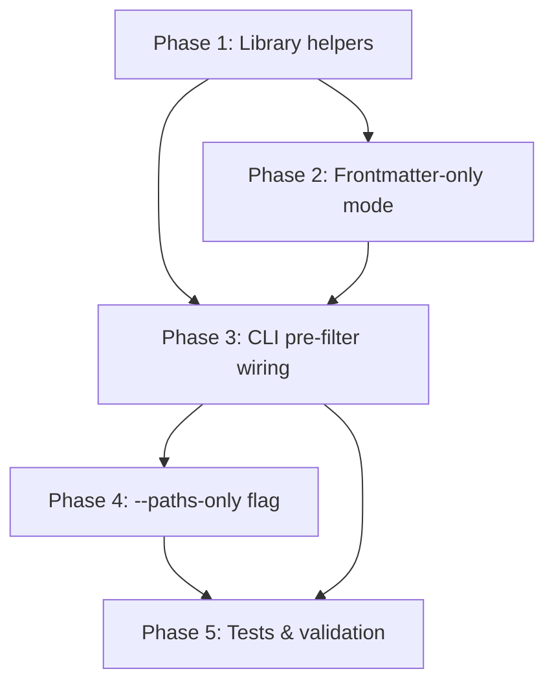

# Execution Plan: Faster `sniff docs`

## Overview

Optimize the `sniff docs` execution path by eliminating redundant repo discovery, using structure-only detection, adding path-based pre-filtering before expensive parsing, adding a frontmatter-only parse mode, and exposing a bare-paths mode for shell completions. Target: sub-25ms for filtered queries (down from ~115ms).

## Dependency Graph



---

## Phase 1: Library — Eliminate Redundant Discovery & Use Structure-Only Detection

**Agent:** `rust-developer` | **Skills:** sniff, rust | **Complexity:** Low
**Deps:** None | **Parallel:** Steps 1.1 and 1.2 can run in parallel

**Goal:** Fix B1 (redundant `Repository::discover`) and B2 (full `detect_repo` for names only) in the library.

### Step 1.1: Add `RepoDocuments::from_root()` constructor

**File:** `sniff/lib/src/filesystem/docs.rs`

Add a new constructor that accepts an already-resolved repo root and optional package info, skipping `Repository::discover` and `detect_repo`:

```rust
impl RepoDocuments {
    pub fn from_root(
        repo_root: PathBuf,
        packages: Vec<(String, PathBuf)>,
    ) -> Self {
        Self { repo_root, packages }
    }
}
```

**Pass when:**
- [ ] `RepoDocuments::from_root()` compiles and is `pub`
- [ ] Existing `RepoDocuments::new()` is unchanged

### Step 1.2: Change `RepoDocuments::new()` to use `detect_repo_structure`

**File:** `sniff/lib/src/filesystem/docs.rs`

Change line 116 from `detect_repo(&repo_root)` to `detect_repo_structure(&repo_root)`:

```rust
let packages = detect_repo_structure(&repo_root)
    .ok()
    .flatten()
    .and_then(|info| info.packages)
    .map(/* ... same mapping ... */)
    .unwrap_or_default();
```

**Pass when:**
- [ ] `detect_docs()` still returns the same docs (only `package` assignments may differ if `detect_repo_structure` returns fewer packages — verify parity)
- [ ] Existing tests in `docs.rs` pass unchanged

### Step 1.3: Add `detect_docs_from_root()` standalone function

**File:** `sniff/lib/src/filesystem/docs.rs`

Add a new public function that accepts the repo root directly:

```rust
pub fn detect_docs_from_root(
    repo_root: &Path,
    packages: &[(String, PathBuf)],
) -> Option<Vec<MarkdownMeta>> {
    let repo_docs = RepoDocuments::from_root(
        repo_root.to_path_buf(),
        packages.to_vec(),
    );
    let docs = repo_docs.documents();
    if docs.is_empty() { None } else { Some(docs) }
}
```

**Pass when:**
- [ ] Function compiles and is `pub`
- [ ] Unit test confirms it returns the same docs as `detect_docs()`

**Validation Checkpoint 1:** `cargo test -p sniff docs` passes. Both `detect_docs()` and `detect_docs_from_root()` return identical results.

---

## Phase 2: Library — Frontmatter-Only Parse Mode

**Agent:** `rust-developer` | **Skills:** sniff, rust | **Complexity:** Medium
**Deps:** Phase 1 | **Parallel:** None

**Goal:** Fix B4 by adding `DocParseMode::FrontmatterOnly` that skips body hashing, title extraction, and mtime resolution.

### Step 2.1: Add `DocParseMode::FrontmatterOnly` variant

**File:** `sniff/lib/src/filesystem/docs.rs`

Add to the `DocParseMode` enum:

```rust
pub enum DocParseMode {
    Full,
    BlastRadiusOnly,
    FrontmatterOnly,
}
```

### Step 2.2: Implement `parse_markdown_meta_frontmatter_only`

**File:** `sniff/lib/src/filesystem/docs.rs`

Add after `parse_markdown_meta_blast_radius_only`:

```rust
fn parse_markdown_meta_frontmatter_only(
    path: &Path,
    package: Option<String>,
    relative: String,
) -> Option<MarkdownMeta> {
    let frontmatter = read_frontmatter_only(path)?;

    let title = get_string_field(&frontmatter, "title").unwrap_or_default();
    let title_source = if title.is_empty() {
        TitleSource::None
    } else {
        TitleSource::FrontmatterTitle
    };
    let model = get_string_field(&frontmatter, "model");
    let prompt = get_string_field(&frontmatter, "prompt");
    let has_blast_radius = frontmatter.contains_key("blast_radius");

    let mut frontmatter_keys: Vec<String> = frontmatter.keys().cloned().collect();
    frontmatter_keys.sort();

    Some(MarkdownMeta {
        filepath: path.to_path_buf(),
        relative,
        package,
        title,
        title_source,
        model,
        prompt,
        last_updated: DateTime::<Utc>::from_timestamp(0, 0).unwrap_or_default(),
        updated_source: UpdatedSource::FileMetadata,
        content_hash: String::new(),
        has_blast_radius,
        blast_radius: None,
        frontmatter_keys,
    })
}
```

Wire into `parse_markdown_meta_with_mode`:

```rust
DocParseMode::FrontmatterOnly => {
    parse_markdown_meta_frontmatter_only(path, package, relative)
}
```

### Step 2.3: Add `collect_markdown_files_with_mode` function

**File:** `sniff/lib/src/filesystem/docs.rs`

Add a variant of `collect_markdown_files` that accepts a `DocParseMode` and an optional path filter closure:

```rust
pub(crate) fn collect_markdown_files_filtered<F>(
    repo_root: &Path,
    packages: &[(String, PathBuf)],
    mode: DocParseMode,
    path_filter: F,
) -> Vec<MarkdownMeta>
where
    F: Fn(&str) -> bool + Sync,
{
    let walker = WalkBuilder::new(repo_root)
        .hidden(false)
        .git_ignore(true)
        .git_global(true)
        .git_exclude(true)
        .build();

    let paths: Vec<_> = walker
        .filter_map(|entry| entry.ok())
        .filter(|entry| {
            entry.file_type().is_some_and(|ft| ft.is_file())
                && entry.path().extension()
                    .is_some_and(|ext| ext.eq_ignore_ascii_case("md"))
        })
        .filter(|entry| {
            entry.path()
                .strip_prefix(repo_root)
                .map(|rel| path_filter(&rel.to_string_lossy()))
                .unwrap_or(false)
        })
        .map(|entry| entry.path().to_path_buf())
        .collect();

    let mut docs: Vec<MarkdownMeta> = paths
        .into_par_iter()
        .filter_map(|path| {
            parse_markdown_meta_with_mode(&path, repo_root, packages, mode)
        })
        .collect();

    docs.sort_by(|a, b| a.relative.cmp(&b.relative));
    docs
}
```

**Pass when:**
- [ ] `DocParseMode::FrontmatterOnly` compiles
- [ ] `collect_markdown_files_filtered` compiles
- [ ] New unit test: `FrontmatterOnly` mode populates `prompt`, `relative`, `package`, `frontmatter_keys` but leaves `content_hash` empty and `last_updated` at epoch

**Validation Checkpoint 2:** `cargo test -p sniff docs` passes.

---

## Phase 3: CLI — Wire Pre-Filtering and Fast Library Paths

**Agent:** `rust-developer` | **Skills:** sniff, cli | **Complexity:** Medium
**Deps:** Phases 1, 2 | **Parallel:** None

**Goal:** Fix B3 by using the library fast paths from the CLI. The CLI already has `repo_root` resolved; use `detect_docs_from_root()` or the new filtered collection function.

### Step 3.1: Resolve packages with structure-only detection in CLI

**File:** `sniff/cli/src/commands/mod.rs`

In the `Commands::Docs` early-return block (around line 180), replace the current `detect_docs` call with:

```rust
let repo_root = repo.workdir().ok_or("Bare repository not supported")?.to_path_buf();

let packages: Vec<(String, PathBuf)> = sniff::filesystem::repo::detect_repo_structure(&repo_root)
    .ok()
    .flatten()
    .and_then(|info| info.packages)
    .map(|pkgs| {
        pkgs.into_iter()
            .map(|p| {
                let rel_path = p.path.strip_prefix(&repo_root).unwrap_or(&p.path).to_path_buf();
                (p.name, rel_path)
            })
            .collect()
    })
    .unwrap_or_default();
```

### Step 3.2: Choose parse strategy based on filter

**File:** `sniff/cli/src/commands/mod.rs`

Determine the optimal parse mode based on what the caller actually needs:

```rust
let needs_full_parse = cli.verbose > 0
    || cli.json;
let has_path_filter = !docs_filter.package_area.is_empty()
    || !docs_filter.package.is_empty();

let all_docs = if has_path_filter {
    let lowered_areas: Vec<String> = docs_filter.package_area.iter()
        .map(|a| a.to_lowercase())
        .collect();
    let lowered_pkgs: Vec<String> = docs_filter.package.iter()
        .map(|p| p.to_lowercase())
        .collect();

    let area_prefixes: Vec<String> = lowered_areas.iter()
        .map(|a| format!("{}/", a))
        .collect();
    let pkg_prefixes: Vec<String> = packages.iter()
        .filter(|(name, _)| lowered_pkgs.iter().any(|p| name.eq_ignore_ascii_case(p)))
        .map(|(_, rel)| format!("{}/", rel))
        .collect();

    let mode = if needs_full_parse {
        sniff::filesystem::docs::DocParseMode::Full
    } else {
        sniff::filesystem::docs::DocParseMode::FrontmatterOnly
    };

    sniff::filesystem::docs::collect_markdown_files_filtered(
        &repo_root, &packages, mode, |rel| {
            if !area_prefixes.is_empty() {
                let rel_lower = rel.to_lowercase();
                return area_prefixes.iter().any(|prefix| rel_lower.starts_with(prefix.as_str()));
            }
            if !pkg_prefixes.is_empty() {
                let rel_lower = rel.to_lowercase();
                return pkg_prefixes.iter().any(|prefix| rel_lower.starts_with(prefix.as_str()));
            }
            true
        },
    )
} else if !needs_full_parse {
    sniff::filesystem::docs::collect_markdown_files_filtered(
        &repo_root, &packages,
        sniff::filesystem::docs::DocParseMode::FrontmatterOnly,
        |_| true,
    )
} else {
    sniff::filesystem::detect_docs_from_root(&repo_root, &packages).unwrap_or_default()
};

let filtered = output::filter_docs(&all_docs, &docs_filter);
```

**Pass when:**
- [ ] `sniff docs --json` produces identical output to before
- [ ] `sniff docs --package-area sniff --json` produces identical output to before
- [ ] `sniff docs --has-prompt --json` produces identical output to before
- [ ] `sniff docs --has-prompt --package-area sniff --json` works

**Validation Checkpoint 3:** `cargo test -p sniff-cli` passes. Manual timing shows improvement.

---

## Phase 4: CLI — `--paths-only` Flag for Completions

**Agent:** `rust-developer` | **Skills:** sniff, cli, clap | **Complexity:** Low
**Deps:** Phase 1 | **Parallel:** Can start after Phase 1

**Goal:** Fix B5 by exposing the already-existing `collect_markdown_paths()` through a CLI flag.

### Step 4.1: Add `--paths-only` flag to Docs variant

**File:** `sniff/cli/src/args/mod.rs`

Add to the `Docs` variant:

```rust
/// Output only relative file paths (no metadata, fastest mode)
#[arg(long)]
paths_only: bool,
```

### Step 4.2: Handle `--paths-only` in the Docs early-return block

**File:** `sniff/cli/src/commands/mod.rs`

Before the existing full-parse path, add an early exit:

```rust
if paths_only {
    let paths = sniff::filesystem::docs::collect_markdown_paths(&repo_root);
    let filtered: Vec<_> = paths.iter()
        .map(|p| p.strip_prefix(&repo_root).unwrap_or(p).to_string_lossy().into_owned())
        .filter(|rel| {
            let path_lower = rel.to_lowercase();
            if !docs_filter.package_area.is_empty() {
                return docs_filter.package_area.iter().any(|area| {
                    let prefix = format!("{}/", area.to_lowercase());
                    path_lower.starts_with(&prefix)
                });
            }
            true
        })
        .collect();

    if cli.json {
        output::print_json_value(serde_json::json!(filtered), perf.build_report().as_ref());
    } else {
        for path in &filtered {
            println!("{}", path);
        }
    }
    perf.emit_stdout(None);
    return Ok(());
}
```

**Pass when:**
- [ ] `sniff docs --paths-only` outputs one path per line
- [ ] `sniff docs --paths-only --json` outputs a JSON array of strings
- [ ] `sniff docs --paths-only --package-area sniff` filters paths
- [ ] Timing is under 15ms

**Validation Checkpoint 4:** `cargo test -p sniff-cli` passes.

---

## Phase 5: Testing & Validation

**Agent:** `rust-developer` | **Skills:** sniff, cli, rust-testing | **Complexity:** Low
**Deps:** Phases 3, 4 | **Parallel:** Steps 5.1 and 5.2 can run in parallel

**Goal:** Prove correctness and measure performance.

### Step 5.1: Add library unit tests

**File:** `sniff/lib/src/filesystem/docs.rs`

Add tests for:
- `DocParseMode::FrontmatterOnly` extracts `prompt` and `frontmatter_keys` correctly
- `DocParseMode::FrontmatterOnly` leaves `content_hash` empty and `last_updated` at epoch
- `collect_markdown_files_filtered` with a path filter returns only matching docs
- `RepoDocuments::from_root` returns same docs as `RepoDocuments::new`

### Step 5.2: Add CLI integration tests

**File:** `sniff/cli/tests/cli.rs`

Add tests for:
- `sniff docs --paths-only` outputs paths, one per line
- `sniff docs --paths-only --json` is valid JSON array
- `sniff docs --paths-only --package-area sniff` filters correctly
- `sniff docs --paths-only --plain` has no escape codes

### Step 5.3: Performance validation

Run timing benchmarks against the rusty-biscuit monorepo and verify:

| Command | Target |
|---|---|
| `sniff docs --json` | < 85ms |
| `sniff docs --package-area sniff --json` | < 30ms |
| `sniff docs --has-prompt --json` | < 60ms |
| `sniff docs --has-prompt --package-area sniff --json` | < 15ms |
| `sniff docs --paths-only` | < 15ms |
| `sniff docs --paths-only --package-area sniff` | < 10ms |

### Step 5.4: Final validation

- [ ] `cargo test -p sniff -p sniff-cli` passes
- [ ] `cargo clippy -p sniff -p sniff-cli` is clean
- [ ] All output shapes are identical to pre-optimization baseline
- [ ] `sniff docs --paths-only --json | python3 -c "import sys,json; json.load(sys.stdin)"` succeeds

**Validation Checkpoint 5:** All tests pass, clippy is clean, performance targets met.

---

## Parallelizable Work Summary

- **Phase 1** (library helpers) and **Phase 4** (`--paths-only`) are independent after Phase 1.1
- **Phase 2** (frontmatter mode) can start as soon as Phase 1 is complete
- **Phase 3** (CLI wiring) requires both Phase 1 and Phase 2
- **Phase 5** (testing) requires Phases 3 and 4

## Rollback Plan

Each phase modifies distinct files. A failed phase can be reverted without affecting completed phases:
- Phase 1: Revert `docs.rs` changes to `RepoDocuments`
- Phase 2: Remove `DocParseMode::FrontmatterOnly` and `collect_markdown_files_filtered`
- Phase 3: Revert `commands/mod.rs` to use `detect_docs()`
- Phase 4: Remove `--paths-only` from `args/mod.rs` and `commands/mod.rs`
