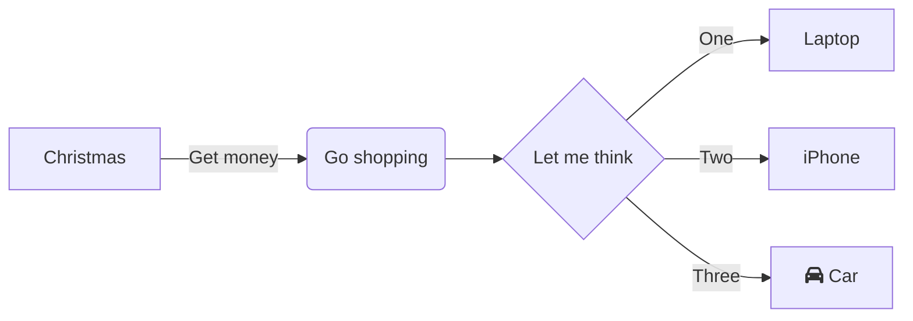

# Testing Features

## Image Support

### Raster Image


- [Zigbee2MQTT](https://www.zigbee2mqtt.io/)

### SVG


## Table

| Title | Price |
| ----- | ----: |
| Happy Potter | 9.99 |
| Tea for the Tillerman | 18.99 |


## Fenced Blocks

### Code

```ts title="Greet Function"
function greet() {
    console.log("hi")
}
```


### Text

Text blocks get some _title love_ too.

```text title="Text Block"
- foo
- bar
- baz
```

Please take note:

> **NOTE:** use of *italics* in Markdown can use either the '_' character OR the '*' character


## Special Links

- Markdown links support the _standard_ syntax links: [your text here](https://somewhere.com).
- Although often not supported, it also supports a second parameter which intended to be the title: [your text here](https://somewhere.com My Title)
- And even fewer seem to recognize the title when special characters are added: [your text here](https://somewhere.com {title="My glorious title",style="color: red"})

All three bullet points above are ~~invalid~~ valid Markdown.

## TODO Lists

One of the most popular additions which the GFM standard adds to CommonMark is the ability to annotate TODO lists.

- [x] do something (should yield 󰄵  if `--nerd` option is on)
- [ ] do something else (should yield 󰄱  if `--nerd` option is on)
- [ ] do it until `it` hurts
- Progress
    - [ ] yeah yeah, i'm working on it (should yield )
    - [0%] started, but no real progress (should yield \uf0c8 )
    - [25%] making progress (should yield ◔ )
    - [50%] halfway there (should yield ○ )
    - [75%] getting close (should yield ○ )
- [!] this shit's blocked (should yield   if `--nerd` option is on)

## Strikethrough

The **strikethrough** feature -- introduced in GFM -- uses `~~` around a block of text to represent the text which should be ~~kept~~ crossed out.


## Markdown Highlighting

Unlike the strikethrough functionality, the **highlight** feature for Markdown lives as a less formal spec but it is supported in popular apps like Obsidian and Typora. It is also being considered for [**CommonMark**](https://commonmark.org "style:'text: red'").

- this emerging standard uses the character sequence `==` to wrap text and the wrapped text is then given a different background color to clearly ==separate it from== the rest of the text.

## Block Quotes

Block quotes are trigger by the use of the `>` character at the beginning of a line. Visually the are indented from the left side but with a vertical line running along the left-hand side to clearly demarcate the quote's line scope:

> Ut faucibus mauris mauris, sed tincidunt augue hendrerit eu. In ultrices ultrices commodo. Sed ipsum metus, luctus vel faucibus sed, bibendum at erat. Suspendisse vulputate leo velit, ut interdum ante volutpat in. Cras cursus dui in est congue, non semper diam bibendum. Suspendisse sagittis vel ex vel suscipit. Phasellus eu dignissim metus, eu eleifend quam. Integer ac venenatis nibh. Proin vel ipsum eget tellus varius aliquet. Suspendisse a rutrum lacus.


This same text is rendered in the VSCode previewer as:


## No Language Code Blocks

When we render code blocks with NO language specified we will render them and display the language as "text":

```
/
- foo
- bar
- baz
```

The same logic is applied when we use the `md` CLI's `--clean` flag but in this case it is adding the language to the markdown content, not the _rendered_ markdown content.


## Mermaid Rendering

The [Mermaid](https://mermaid.js.org) project just keeps giving with their text-to-diagram magic.


