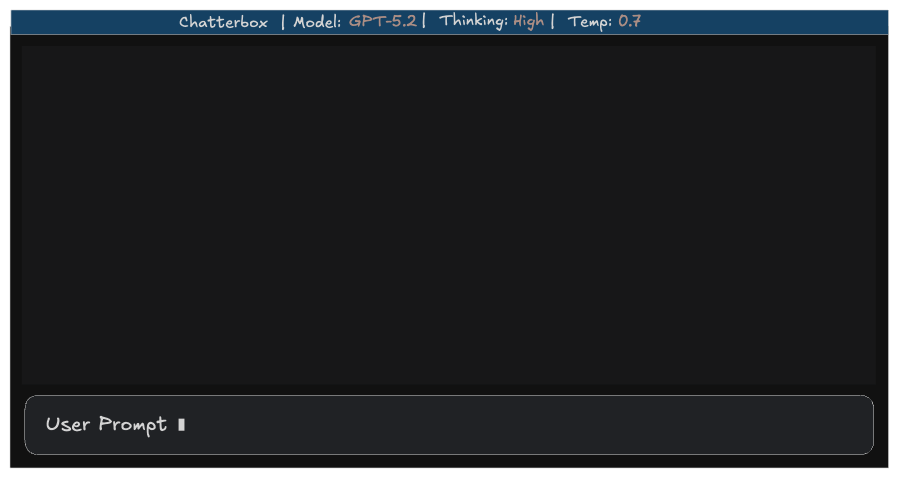
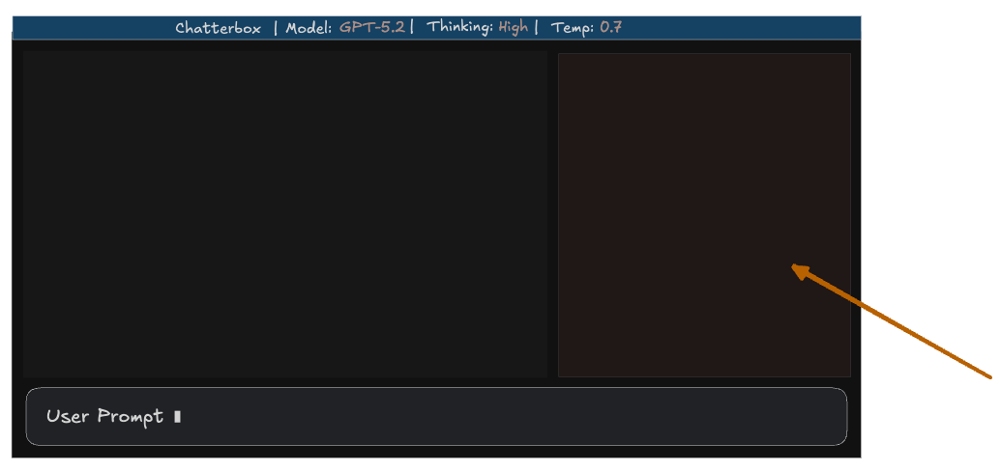

# Chatterbox TUI

The TUI application will be called "chatterbox" and have a fairly conventional layout of (from top to bottom):

- Status Bar (provides info like "model", "temperature", "thinking", etc.)
- Chat Window
- User Input Window

When a user presses the `CMD+I` keyboard sequence it will toggle the visibility of the "Info Pane" which shares vertical space with the chat window.

More design details can be found here:

- [Status Bar](./status-bar.md)
- [Scrollable Chat Window](./scrollable-chat-window.md)
- [User Input](./user-input.md)
  - [Slash Command Popups](./slash-command-popups.md)
- [Info Pane](./info-pane.md)
