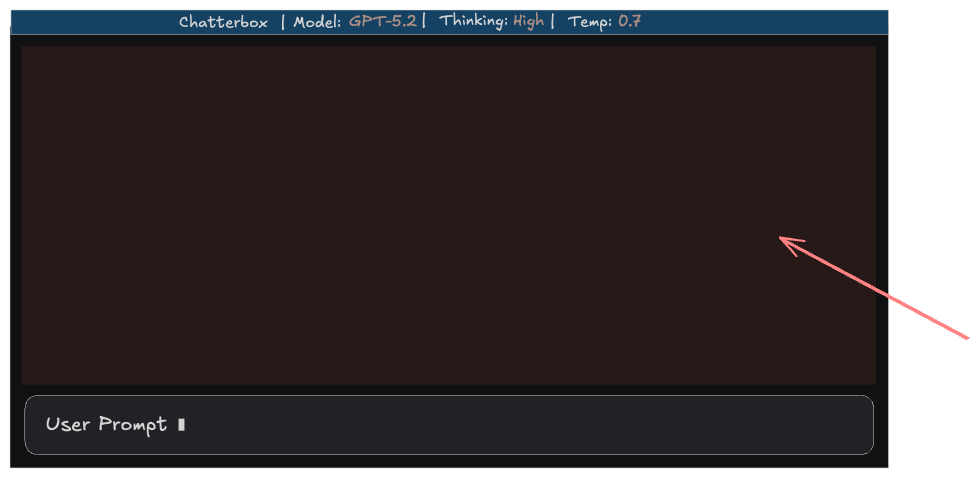

# Scrollable Chat Windows



## Requirements

The Chatterbox TUI presents a large text window above the user's chat input control. This window should take the available vertical space: above the chat input and below the status bar.

This text window will contain a rich-text view of the conversation history between the user and the model(s). This window will need to be scrollable to accommodate when the conversation's length no longer fits in the window.

The Markdown content received from the user and/or the LLM will be able to support:

- **THEMES:** the prose markdown will be color theme'd with adjustable color themes
  - All color themes offered will have a "dark" and "light" variant.
- **IMAGES:** (SVG and raster)
  - SVG images will be converted to raster images with `resvg` crate
  - images will only be displayed on terminals which support the Kitty image standard
    - terminals which do not support it will display: `IMAGE: {{Alt Text}}` instead
- **FENCED CODE BLOCKS:**
  - fenced code blocks will have syntax-aware color highlighting
  - code blocks will use the inverted theme from the rest of the page (e.g., if we were using the `dark-one` theme for prose then the `light-one` theme would be used for code blocks, etc.)
  - in technical design we must consider which library should be used for the code highlighting but the crate which should be considered first is `syntect`.

    > Note: if we do end up using `syntect` please be aware that it's built-in themes are very old and not worth using. All themes should be sourced and brought in to be used both for prose and code-block highlighting.

  - When **fenced code blocks** are encountered in the content. There will be a `📋` icon next to the code block's "language" display. When a user clicks this the content of the code block will be copied to the clipboard.
- **LINKS:**
  - all Markdown links on the page should be made into real links which will open an external browser when clicked.
  - if Ratatui support for links relies on OSC8 then we will gracefully degrade the output to the link's text and the URL listed as text in square brackets for terminals which don't support OSC8.

A scrollbar should appear when there is enough content where vertical scrolling is needed. When this scrollbar appears, however, it should not shift the layout as the "space" for the scrollbar's layout should have been accounted for from the beginning.

## Technical Design

### 1. Scrollable Rich Text Window

The chat history window uses a stateful list widget to display parsed markdown content with automatic scrolling behavior.

#### Architecture

```txt
┌─────────────────────────────────────────────────────────────┐
│  ChatWindow                                                 │
│  ├─ messages: Vec<ChatMessage>     (raw + cached content)   │
│  ├─ scroll_state: ListState        (scroll position)        │
│  ├─ scroll_offset: usize           (virtual scroll offset)  │
│  └─ auto_scroll: bool              (smart scroll toggle)    │
│                                                             │
│  ChatMessage                                                │
│  ├─ raw_content: String            (original markdown)      │
│  ├─ styled_content: Text<'static>  (cached parsed output)   │
│  ├─ code_blocks: Vec<CodeBlock>    (extracted for copying)  │
│  └─ is_user: bool                  (alignment/styling)      │
└─────────────────────────────────────────────────────────────┘
```

#### State Management

The window maintains two types of scroll state:

- **ListState**: Tracks which message is "selected" for keyboard navigation
- **Virtual scroll offset**: Pixel-level scrolling within long messages

```rust
use ratatui::widgets::{List, ListItem, ListState, Paragraph, Wrap};
use ratatui::layout::{Constraint, Layout, Margin, Rect};

struct ChatWindow {
    messages: Vec<ChatMessage>,
    scroll_state: ListState,
    auto_scroll: bool,
}

struct ChatMessage {
    raw_content: String,
    styled_content: Text<'static>,
    code_blocks: Vec<CodeBlock>,
    is_user: bool,
}

impl ChatWindow {
    /// Smart auto-scroll: only scroll to bottom if user is near the end
    fn should_auto_scroll(&self) -> bool {
        if let Some(selected) = self.scroll_state.selected() {
            selected >= self.messages.len().saturating_sub(3)
        } else {
            true // No selection = always at bottom
        }
    }

    fn add_message(&mut self, msg: ChatMessage) {
        let should_scroll = self.should_auto_scroll();
        self.messages.push(msg);

        if should_scroll {
            self.scroll_to_bottom();
        }
    }

    fn scroll_to_bottom(&mut self) {
        if !self.messages.is_empty() {
            self.scroll_state.select(Some(self.messages.len() - 1));
        }
    }

    fn scroll_up(&mut self) {
        let i = self.scroll_state.selected().unwrap_or(0);
        self.scroll_state.select(Some(i.saturating_sub(1)));
    }

    fn scroll_down(&mut self) {
        let i = self.scroll_state.selected().unwrap_or(0);
        let max = self.messages.len().saturating_sub(1);
        self.scroll_state.select(Some((i + 1).min(max)));
    }
}
```

#### Rendering Pipeline

```rust
impl ChatWindow {
    fn render(&mut self, frame: &mut Frame, area: Rect) {
        // Reserve 1 column for scrollbar (always present to prevent layout shift)
        let content_area = Rect {
            width: area.width.saturating_sub(1),
            ..area
        };

        // Convert messages to ListItems with dynamic height
        let items: Vec<ListItem> = self.messages
            .iter()
            .map(|msg| {
                let block = Block::default()
                    .borders(Borders::ALL)
                    .border_type(if msg.is_user {
                        BorderType::Thick
                    } else {
                        BorderType::Rounded
                    })
                    .border_style(Style::default().fg(
                        if msg.is_user { Color::Blue } else { Color::Green }
                    ));

                ListItem::new(msg.styled_content.clone())
            })
            .collect();

        let list = List::new(items)
            .block(Block::default().borders(Borders::NONE))
            .highlight_style(Style::default()); // No visible selection highlight

        frame.render_stateful_widget(list, content_area, &mut self.scroll_state);
    }
}
```

#### Markdown Parsing with Caching

Parse markdown once when messages arrive, cache the styled output:

```rust
use pulldown_cmark::{Event, Options, Parser, Tag, TagEnd, CodeBlockKind};
use tui_markdown::from_str;

impl ChatMessage {
    fn new(content: &str, is_user: bool) -> Self {
        let (styled_content, code_blocks) = parse_markdown_with_blocks(content);

        Self {
            raw_content: content.to_string(),
            styled_content,
            code_blocks,
            is_user,
        }
    }
}

fn parse_markdown_with_blocks(markdown: &str) -> (Text<'static>, Vec<CodeBlock>) {
    let mut code_blocks = Vec::new();
    let mut options = Options::empty();
    options.insert(Options::ENABLE_STRIKETHROUGH);
    options.insert(Options::ENABLE_TABLES);

    let parser = Parser::new_ext(markdown, options);
    let mut current_code_block: Option<(String, String)> = None; // (language, content)

    for event in parser.clone() {
        match event {
            Event::Start(Tag::CodeBlock(CodeBlockKind::Fenced(lang))) => {
                current_code_block = Some((lang.to_string(), String::new()));
            }
            Event::Text(text) if current_code_block.is_some() => {
                if let Some((_, ref mut content)) = current_code_block {
                    content.push_str(&text);
                }
            }
            Event::End(TagEnd::CodeBlock) => {
                if let Some((lang, content)) = current_code_block.take() {
                    code_blocks.push(CodeBlock {
                        language: lang,
                        content,
                        line_offset: code_blocks.len(), // Track for click detection
                    });
                }
            }
            _ => {}
        }
    }

    // Use tui-markdown for styled rendering
    let styled = from_str(markdown);

    (styled, code_blocks)
}
```

---

### 2. Scrollbar Widget

The scrollbar provides visual feedback for scroll position without causing layout shifts.

#### Layout Strategy

Reserve scrollbar space from initial layout to prevent content reflow:

```rust
use ratatui::widgets::{Scrollbar, ScrollbarOrientation, ScrollbarState};
use ratatui::layout::Margin;

impl ChatWindow {
    fn render_with_scrollbar(&mut self, frame: &mut Frame, area: Rect) {
        // Main layout: content | scrollbar gutter
        let chunks = Layout::default()
            .direction(Direction::Horizontal)
            .constraints([
                Constraint::Min(0),      // Content takes remaining space
                Constraint::Length(1),   // Fixed 1-column scrollbar gutter
            ])
            .split(area);

        let content_area = chunks[0];
        let scrollbar_area = chunks[1];

        // Render messages in content area
        self.render_messages(frame, content_area);

        // Only show scrollbar when content overflows
        let needs_scrollbar = self.total_content_height() > content_area.height;

        if needs_scrollbar {
            self.render_scrollbar(frame, scrollbar_area);
        }
    }

    fn render_scrollbar(&self, frame: &mut Frame, area: Rect) {
        let scrollbar = Scrollbar::new(ScrollbarOrientation::VerticalRight)
            .begin_symbol(Some("▲"))
            .end_symbol(Some("▼"))
            .track_symbol(Some("│"))
            .thumb_symbol("█");

        let position = self.scroll_state.selected().unwrap_or(0);
        let content_length = self.messages.len();

        let mut scrollbar_state = ScrollbarState::new(content_length)
            .position(position);

        // Render within the scrollbar gutter, respecting any parent borders
        let scrollbar_inner = area.inner(&Margin { vertical: 1, horizontal: 0 });
        frame.render_stateful_widget(scrollbar, scrollbar_inner, &mut scrollbar_state);
    }

    fn total_content_height(&self) -> u16 {
        // Approximate: each message takes at least 3 lines (borders + content)
        self.messages.iter()
            .map(|m| self.calculate_message_height(m))
            .sum()
    }

    fn calculate_message_height(&self, msg: &ChatMessage, width: u16) -> u16 {
        let content_width = width.saturating_sub(4); // Account for borders + padding
        if content_width == 0 { return 3; }

        let line_count = msg.raw_content.lines().count() as u16;
        let wrapped_lines = msg.raw_content.len() as f32 / content_width as f32;

        (line_count.max(wrapped_lines.ceil() as u16)) + 2 // +2 for borders
    }
}
```

#### Mouse Wheel Support

```rust
use crossterm::event::{Event, MouseEvent, MouseEventKind, EnableMouseCapture};

fn handle_mouse_event(event: MouseEvent, chat: &mut ChatWindow, chat_area: Rect) {
    // Only handle events within the chat window bounds
    if !chat_area.contains(Position::new(event.column, event.row)) {
        return;
    }

    match event.kind {
        MouseEventKind::ScrollDown => chat.scroll_down(),
        MouseEventKind::ScrollUp => chat.scroll_up(),
        MouseEventKind::Down(MouseButton::Left) => {
            // Handle click-to-copy for code blocks (see Section 3)
            chat.handle_click(event.column, event.row, chat_area);
        }
        _ => {}
    }
}
```

---

### 3. Copy-to-Clipboard Code Blocks

Fenced code blocks display a clickable `📋` icon that copies content to the system clipboard.

#### Architecture

```txt
┌─────────────────────────────────────────────────────────────┐
│  CodeBlock                                                  │
│  ├─ language: String               ("rust", "python", etc)  │
│  ├─ content: String                (raw code text)          │
│  ├─ line_offset: usize             (position in message)    │
│  └─ copy_button_rect: Option<Rect> (clickable area)         │
│                                                             │
│  ClipboardHandler                                           │
│  ├─ use_osc52: bool                (terminal-based copy)    │
│  └─ fallback: Option<arboard>      (native clipboard)       │
└─────────────────────────────────────────────────────────────┘
```

#### Code Block Rendering

Render the language tag and copy icon as a header:

```rust
use ratatui::text::{Line, Span};

struct CodeBlock {
    language: String,
    content: String,
    line_offset: usize,
    copy_button_rect: Option<Rect>, // Set during render
}

fn render_code_block(
    code_block: &mut CodeBlock,
    frame: &mut Frame,
    area: Rect,
) {
    // Header line: "rust 📋"
    let header = Line::from(vec![
        Span::styled(
            format!(" {} ", code_block.language),
            Style::default()
                .fg(Color::White)
                .bg(Color::Rgb(60, 60, 60))
        ),
        Span::raw(" "),
        Span::styled(
            "📋",
            Style::default()
                .fg(Color::Cyan)
                .add_modifier(Modifier::BOLD)
        ),
    ]);

    // Calculate copy button clickable area
    let button_x = area.x + code_block.language.len() as u16 + 3;
    code_block.copy_button_rect = Some(Rect {
        x: button_x,
        y: area.y,
        width: 2, // "📋" width
        height: 1,
    });

    // Code content with syntax highlighting
    let code_style = Style::default()
        .fg(Color::White)
        .bg(Color::Rgb(40, 44, 52));

    let code_lines: Vec<Line> = std::iter::once(header)
        .chain(code_block.content.lines().map(|line| {
            Line::from(Span::styled(format!(" {} ", line), code_style))
        }))
        .collect();

    let paragraph = Paragraph::new(code_lines)
        .block(Block::default()
            .borders(Borders::ALL)
            .border_style(Style::default().fg(Color::DarkGray)));

    frame.render_widget(paragraph, area);
}
```

#### Click Detection

```rust
impl ChatWindow {
    fn handle_click(&mut self, x: u16, y: u16, chat_area: Rect) {
        // Find which message was clicked
        for msg in &self.messages {
            for code_block in &msg.code_blocks {
                if let Some(btn_rect) = code_block.copy_button_rect {
                    if btn_rect.contains(Position::new(x, y)) {
                        self.copy_to_clipboard(&code_block.content);
                        self.show_copy_feedback(btn_rect);
                        return;
                    }
                }
            }
        }
    }
}
```

#### Clipboard Implementation

Support both OSC52 (works over SSH) and native clipboard:

```rust
use std::io::Write;

struct ClipboardHandler {
    use_osc52: bool,
}

impl ClipboardHandler {
    fn new() -> Self {
        // Detect if terminal supports OSC52 (modern terminals)
        let use_osc52 = std::env::var("TERM")
            .map(|t| {
                t.contains("xterm") ||
                t.contains("kitty") ||
                t.contains("alacritty") ||
                t.contains("wezterm")
            })
            .unwrap_or(false);

        Self { use_osc52 }
    }

    fn copy(&self, text: &str) -> Result<(), Box<dyn std::error::Error>> {
        if self.use_osc52 {
            self.copy_osc52(text)
        } else {
            self.copy_native(text)
        }
    }

    /// OSC 52 clipboard copy - works over SSH
    fn copy_osc52(&self, text: &str) -> Result<(), Box<dyn std::error::Error>> {
        use base64::{Engine, engine::general_purpose::STANDARD};

        let encoded = STANDARD.encode(text);
        let osc52_sequence = format!("\x1b]52;c;{}\x07", encoded);

        let mut stdout = std::io::stdout();
        stdout.write_all(osc52_sequence.as_bytes())?;
        stdout.flush()?;

        Ok(())
    }

    /// Native clipboard via arboard crate (fallback)
    #[cfg(feature = "native-clipboard")]
    fn copy_native(&self, text: &str) -> Result<(), Box<dyn std::error::Error>> {
        use arboard::Clipboard;

        let mut clipboard = Clipboard::new()?;
        clipboard.set_text(text)?;

        Ok(())
    }

    #[cfg(not(feature = "native-clipboard"))]
    fn copy_native(&self, _text: &str) -> Result<(), Box<dyn std::error::Error>> {
        Err("Native clipboard not available. Enable 'native-clipboard' feature.".into())
    }
}
```

#### Visual Feedback

Show brief feedback when copy succeeds:

```rust
struct CopyFeedback {
    rect: Rect,
    expires_at: std::time::Instant,
}

impl ChatWindow {
    fn show_copy_feedback(&mut self, rect: Rect) {
        self.copy_feedback = Some(CopyFeedback {
            rect,
            expires_at: std::time::Instant::now() + std::time::Duration::from_millis(800),
        });
    }

    fn render_copy_feedback(&self, frame: &mut Frame) {
        if let Some(ref feedback) = self.copy_feedback {
            if std::time::Instant::now() < feedback.expires_at {
                // Overlay "✓" on the copy button location
                let checkmark = Paragraph::new("✓")
                    .style(Style::default()
                        .fg(Color::Green)
                        .add_modifier(Modifier::BOLD));

                frame.render_widget(checkmark, feedback.rect);
            }
        }
    }
}
```

---

### 4. Theming System

The theming system provides cohesive color schemes across prose content and code blocks, with paired dark/light variants.

#### Architecture

```txt
┌─────────────────────────────────────────────────────────────┐
│  ThemeManager                                               │
│  ├─ current_theme: ThemePair      (active theme pair)       │
│  ├─ available_themes: Vec<ThemePair>                        │
│  └─ mode: ThemeMode               (Dark | Light)            │
│                                                             │
│  ThemePair                                                  │
│  ├─ name: String                  ("one", "dracula", etc.)  │
│  ├─ dark: Theme                   (prose + code themes)     │
│  └─ light: Theme                  (prose + code themes)     │
│                                                             │
│  Theme                                                      │
│  ├─ prose: ProseColors            (headings, text, links)   │
│  └─ code: syntect::Theme          (syntax highlighting)     │
└─────────────────────────────────────────────────────────────┘
```

#### Theme Definition

```rust
use syntect::highlighting::Theme as SyntectTheme;
use ratatui::style::{Color, Style, Modifier};

#[derive(Clone)]
struct ProseColors {
    text: Color,
    heading: Color,
    link: Color,
    emphasis: Color,
    strong: Color,
    code_inline: Color,
    code_inline_bg: Color,
    blockquote: Color,
    list_marker: Color,
}

#[derive(Clone)]
struct Theme {
    prose: ProseColors,
    code: SyntectTheme,  // For fenced code blocks
}

struct ThemePair {
    name: String,
    dark: Theme,
    light: Theme,
}

#[derive(Clone, Copy, PartialEq)]
enum ThemeMode {
    Dark,
    Light,
}

struct ThemeManager {
    themes: Vec<ThemePair>,
    current_index: usize,
    mode: ThemeMode,
}

impl ThemeManager {
    /// Get the active theme based on current mode
    fn current_theme(&self) -> &Theme {
        let pair = &self.themes[self.current_index];
        match self.mode {
            ThemeMode::Dark => &pair.dark,
            ThemeMode::Light => &pair.light,
        }
    }

    /// Get the inverted theme for code blocks
    /// Dark mode prose uses light theme for code blocks and vice versa
    fn code_block_theme(&self) -> &Theme {
        let pair = &self.themes[self.current_index];
        match self.mode {
            ThemeMode::Dark => &pair.light,  // Inverted
            ThemeMode::Light => &pair.dark,  // Inverted
        }
    }

    fn toggle_mode(&mut self) {
        self.mode = match self.mode {
            ThemeMode::Dark => ThemeMode::Light,
            ThemeMode::Light => ThemeMode::Dark,
        };
    }
}
```

#### Loading Themes from Binary Dumps

Use `build.rs` to pre-compile themes for fast startup:

```rust
// build.rs
use syntect::highlighting::ThemeSet;
use syntect::dumps::dump_to_file;
use std::env;
use std::path::Path;

fn main() {
    let out_dir = env::var("OUT_DIR").unwrap();
    let theme_dir = "assets/themes";
    let dump_path = Path::new(&out_dir).join("themes.bin");

    // Load all .tmTheme files (Dracula, Nord, One Dark, etc.)
    let theme_set = ThemeSet::load_from_folder(theme_dir)
        .expect("Failed to load themes from folder");

    // Serialize to binary for fast loading
    dump_to_file(&theme_set, &dump_path)
        .expect("Failed to dump themes to binary");

    println!("cargo:rerun-if-changed={}", theme_dir);
}
```

```rust
// At runtime - loads in <5ms
use syntect::highlighting::ThemeSet;
use syntect::dumps::from_binary;
use once_cell::sync::Lazy;

static THEME_SET: Lazy<ThemeSet> = Lazy::new(|| {
    let theme_data = include_bytes!(concat!(env!("OUT_DIR"), "/themes.bin"));
    from_binary(theme_data)
});
```

#### Theme Sources

Modern themes should be sourced from their official repositories:

| Theme | Source | Format |
|-------|--------|--------|
| Dracula | [dracula/textmate](https://github.com/dracula/textmate) | .tmTheme |
| Nord | [nordtheme/sublime-text](https://github.com/nordtheme/sublime-text) | .tmTheme |
| One Dark | [sublime-text-one-dark-theme](https://github.com/Ice-Man-007/sublime-text-one-dark-theme) | .tmTheme |
| Rainglow | [rainglow/sublime](https://github.com/rainglow/sublime) | .tmTheme (320+ themes) |

> **Note:** syntect's built-in themes (base16-ocean, Solarized) are outdated. Always source modern themes in `.tmTheme` format.

---

### 5. Image Rendering

Images in markdown are rendered using the Kitty graphics protocol with fallback to alt-text for unsupported terminals.

#### Architecture

```txt
┌─────────────────────────────────────────────────────────────┐
│  ImageRenderer                                              │
│  ├─ protocol: Option<ImageProtocol>  (detected capability)  │
│  ├─ picker: ratatui_image::Picker    (protocol selector)    │
│  └─ cache: HashMap<String, CachedImage>                     │
│                                                             │
│  CachedImage                                                │
│  ├─ protocol_data: Box<dyn Protocol> (rendered image)       │
│  └─ alt_text: String                 (fallback)             │
│                                                             │
│  ImageProtocol                                              │
│  └─ Kitty | Sixel | Halfblocks | None                       │
└─────────────────────────────────────────────────────────────┘
```

#### Protocol Detection

```rust
use ratatui_image::picker::Picker;

struct ImageRenderer {
    picker: Option<Picker>,
    supports_kitty: bool,
}

impl ImageRenderer {
    fn new() -> Self {
        // Query terminal for graphics support
        let picker = Picker::from_query_stdio().ok();
        let supports_kitty = picker.as_ref()
            .map(|p| p.protocol_type().is_some())
            .unwrap_or(false);

        Self { picker, supports_kitty }
    }

    fn can_render_images(&self) -> bool {
        self.supports_kitty
    }
}
```

#### SVG Conversion with resvg

SVG images must be rasterized before display:

```rust
use resvg::usvg::{self, Options, Tree};
use resvg::tiny_skia::{self, Pixmap};
use image::DynamicImage;

fn render_svg_to_image(svg_data: &[u8], max_width: u32) -> Result<DynamicImage, Box<dyn std::error::Error>> {
    // Parse SVG
    let options = Options::default();
    let tree = Tree::from_data(svg_data, &options)?;

    // Calculate dimensions maintaining aspect ratio
    let size = tree.size();
    let scale = max_width as f32 / size.width();
    let width = (size.width() * scale) as u32;
    let height = (size.height() * scale) as u32;

    // Render to pixmap
    let mut pixmap = Pixmap::new(width, height)
        .ok_or("Failed to create pixmap")?;

    let transform = tiny_skia::Transform::from_scale(scale, scale);
    resvg::render(&tree, transform, &mut pixmap.as_mut());

    // Convert to image::DynamicImage
    let rgba = pixmap.take();
    let img = image::RgbaImage::from_raw(width, height, rgba)
        .ok_or("Failed to create image")?;

    Ok(DynamicImage::ImageRgba8(img))
}
```

#### Image Rendering with Fallback

```rust
use ratatui::text::{Line, Span};
use ratatui::style::{Color, Style};

impl ImageRenderer {
    fn render_image(
        &mut self,
        image_data: &[u8],
        alt_text: &str,
        is_svg: bool,
        frame: &mut Frame,
        area: Rect,
    ) {
        if !self.can_render_images() {
            // Fallback: Display alt text
            self.render_alt_text_fallback(alt_text, frame, area);
            return;
        }

        // Convert SVG to raster if needed
        let dyn_image = if is_svg {
            match render_svg_to_image(image_data, area.width as u32 * 8) {
                Ok(img) => img,
                Err(_) => {
                    self.render_alt_text_fallback(alt_text, frame, area);
                    return;
                }
            }
        } else {
            match image::load_from_memory(image_data) {
                Ok(img) => img,
                Err(_) => {
                    self.render_alt_text_fallback(alt_text, frame, area);
                    return;
                }
            }
        };

        // Render with ratatui-image
        if let Some(ref mut picker) = self.picker {
            if let Ok(protocol) = picker.new_protocol(
                dyn_image,
                area,
                ratatui_image::Resize::Fit(None),
            ) {
                let image_widget = ratatui_image::Image::new(protocol.as_ref());
                frame.render_widget(image_widget, area);
                return;
            }
        }

        // Protocol creation failed - fallback
        self.render_alt_text_fallback(alt_text, frame, area);
    }

    fn render_alt_text_fallback(&self, alt_text: &str, frame: &mut Frame, area: Rect) {
        let fallback = Line::from(vec![
            Span::styled("IMAGE: ", Style::default().fg(Color::DarkGray)),
            Span::styled(alt_text, Style::default().fg(Color::Gray)),
        ]);
        let paragraph = Paragraph::new(fallback);
        frame.render_widget(paragraph, area);
    }
}
```

---

### 6. Syntax Highlighting

Fenced code blocks use `syntect` for syntax-aware highlighting with custom modern themes.

#### Architecture

```txt
┌─────────────────────────────────────────────────────────────┐
│  SyntaxHighlighter                                          │
│  ├─ syntax_set: SyntaxSet          (language definitions)   │
│  ├─ theme_manager: &ThemeManager   (active themes)          │
│  └─ cache: HashMap<(String, ThemeId), Vec<Line>>            │
│                                                             │
│  HighlightedCodeBlock                                       │
│  ├─ language: String               ("rust", "python", etc)  │
│  ├─ lines: Vec<Line<'static>>      (styled output)          │
│  └─ raw_content: String            (for clipboard copy)     │
└─────────────────────────────────────────────────────────────┘
```

#### Setup with Binary Dumps

```rust
use syntect::parsing::SyntaxSet;
use syntect::highlighting::{ThemeSet, Style as SyntectStyle};
use syntect::easy::HighlightLines;
use syntect::dumps::from_binary;
use once_cell::sync::Lazy;
use ratatui::text::{Line, Span};
use ratatui::style::{Color, Style};

// Pre-compiled syntax definitions for fast startup
static SYNTAX_SET: Lazy<SyntaxSet> = Lazy::new(|| {
    SyntaxSet::load_defaults_newlines()
});

// Pre-compiled theme set from build.rs
static THEME_SET: Lazy<ThemeSet> = Lazy::new(|| {
    from_binary(include_bytes!(concat!(env!("OUT_DIR"), "/themes.bin")))
});
```

#### Highlighting Implementation

```rust
struct SyntaxHighlighter;

impl SyntaxHighlighter {
    fn highlight_code(
        code: &str,
        language: &str,
        theme_name: &str,
    ) -> Vec<Line<'static>> {
        let syntax = SYNTAX_SET
            .find_syntax_by_token(language)
            .or_else(|| SYNTAX_SET.find_syntax_by_extension(language))
            .unwrap_or_else(|| SYNTAX_SET.find_syntax_plain_text());

        let theme = THEME_SET.themes.get(theme_name)
            .unwrap_or_else(|| &THEME_SET.themes["base16-ocean.dark"]);

        let mut highlighter = HighlightLines::new(syntax, theme);
        let mut lines = Vec::new();

        for line in code.lines() {
            let ranges = highlighter
                .highlight_line(line, &SYNTAX_SET)
                .unwrap_or_default();

            let spans: Vec<Span> = ranges
                .iter()
                .map(|(style, text)| {
                    Span::styled(
                        text.to_string(),
                        syntect_to_ratatui_style(style),
                    )
                })
                .collect();

            lines.push(Line::from(spans));
        }

        lines
    }
}

fn syntect_to_ratatui_style(style: &SyntectStyle) -> Style {
    let fg = Color::Rgb(
        style.foreground.r,
        style.foreground.g,
        style.foreground.b,
    );
    let bg = Color::Rgb(
        style.background.r,
        style.background.g,
        style.background.b,
    );

    Style::default().fg(fg).bg(bg)
}
```

#### Code Block Rendering with Header

```rust
fn render_code_block_with_highlighting(
    code_block: &mut CodeBlock,
    theme_manager: &ThemeManager,
    frame: &mut Frame,
    area: Rect,
) {
    // Use inverted theme for code blocks
    let code_theme = theme_manager.code_block_theme();
    let theme_name = /* get syntect theme name from code_theme */;

    // Highlight code content
    let highlighted_lines = SyntaxHighlighter::highlight_code(
        &code_block.content,
        &code_block.language,
        theme_name,
    );

    // Build header: "rust 📋"
    let header = Line::from(vec![
        Span::styled(
            format!(" {} ", code_block.language),
            Style::default()
                .fg(Color::White)
                .bg(Color::Rgb(60, 60, 60)),
        ),
        Span::raw(" "),
        Span::styled(
            "📋",
            Style::default()
                .fg(Color::Cyan)
                .add_modifier(Modifier::BOLD),
        ),
    ]);

    // Track copy button location
    let button_x = area.x + code_block.language.len() as u16 + 3;
    code_block.copy_button_rect = Some(Rect {
        x: button_x,
        y: area.y,
        width: 2,
        height: 1,
    });

    // Combine header + highlighted code
    let mut all_lines = vec![header];
    all_lines.extend(highlighted_lines);

    let paragraph = Paragraph::new(all_lines)
        .block(Block::default()
            .borders(Borders::ALL)
            .border_style(Style::default().fg(Color::DarkGray)));

    frame.render_widget(paragraph, area);
}
```

---

### 7. Hyperlinks (OSC 8)

Markdown links are rendered as clickable terminal hyperlinks using OSC 8 escape sequences.

#### Architecture

```txt
┌─────────────────────────────────────────────────────────────┐
│  HyperlinkRenderer                                          │
│  ├─ supports_osc8: bool            (terminal capability)    │
│  └─ link_regions: Vec<LinkRegion>  (click detection)        │
│                                                             │
│  LinkRegion                                                 │
│  ├─ rect: Rect                     (clickable area)         │
│  ├─ url: String                    (target URL)             │
│  └─ text: String                   (display text)           │
└─────────────────────────────────────────────────────────────┘
```

#### OSC 8 Detection

```rust
use std::env;

struct HyperlinkRenderer {
    supports_osc8: bool,
}

impl HyperlinkRenderer {
    fn new() -> Self {
        // Detect OSC 8 support based on terminal
        let supports_osc8 = Self::detect_osc8_support();
        Self { supports_osc8 }
    }

    fn detect_osc8_support() -> bool {
        // Check TERM_PROGRAM first (more reliable)
        if let Ok(term_program) = env::var("TERM_PROGRAM") {
            let supported = matches!(
                term_program.to_lowercase().as_str(),
                "iterm.app" | "wezterm" | "kitty" | "alacritty" |
                "vscode" | "hyper" | "tabby" | "ghostty"
            );
            if supported {
                return true;
            }
        }

        // Check TERM variable
        if let Ok(term) = env::var("TERM") {
            return term.contains("xterm") ||
                   term.contains("kitty") ||
                   term.contains("alacritty") ||
                   term.contains("wezterm");
        }

        // Check for Windows Terminal
        if env::var("WT_SESSION").is_ok() {
            return true;
        }

        false
    }
}
```

#### Rendering Links with Graceful Degradation

```rust
use ratatui::text::{Line, Span};
use ratatui::style::{Color, Modifier, Style};

impl HyperlinkRenderer {
    /// Render a hyperlink with OSC 8 or fallback to text
    fn render_link(&self, text: &str, url: &str) -> Span<'static> {
        let link_style = Style::default()
            .fg(Color::Cyan)
            .add_modifier(Modifier::UNDERLINED);

        if self.supports_osc8 {
            // OSC 8 hyperlink: ESC ] 8 ; ; URL BEL text ESC ] 8 ; ; BEL
            let hyperlink = format!(
                "\x1b]8;;{}\x07{}\x1b]8;;\x07",
                url,
                text
            );
            Span::styled(hyperlink, link_style)
        } else {
            // Fallback: "text [url]"
            Span::styled(
                format!("{} [{}]", text, url),
                link_style,
            )
        }
    }

    /// Render link and track its region for click handling
    fn render_link_with_tracking(
        &mut self,
        text: &str,
        url: &str,
        position: (u16, u16),
        link_regions: &mut Vec<LinkRegion>,
    ) -> Span<'static> {
        let display_len = if self.supports_osc8 {
            text.len()
        } else {
            text.len() + url.len() + 3 // " [url]"
        };

        link_regions.push(LinkRegion {
            rect: Rect {
                x: position.0,
                y: position.1,
                width: display_len as u16,
                height: 1,
            },
            url: url.to_string(),
            text: text.to_string(),
        });

        self.render_link(text, url)
    }
}

struct LinkRegion {
    rect: Rect,
    url: String,
    text: String,
}
```

#### Click Handler for Opening Links

```rust
use std::process::Command;

impl HyperlinkRenderer {
    fn handle_click(&self, x: u16, y: u16, link_regions: &[LinkRegion]) {
        for region in link_regions {
            if region.rect.contains(Position::new(x, y)) {
                self.open_url(&region.url);
                return;
            }
        }
    }

    fn open_url(&self, url: &str) {
        #[cfg(target_os = "macos")]
        let _ = Command::new("open").arg(url).spawn();

        #[cfg(target_os = "linux")]
        let _ = Command::new("xdg-open").arg(url).spawn();

        #[cfg(target_os = "windows")]
        let _ = Command::new("cmd").args(["/C", "start", "", url]).spawn();
    }
}
```

#### Integration with Markdown Parser

```rust
use pulldown_cmark::{Event, Tag, TagEnd};

fn parse_markdown_with_links(
    markdown: &str,
    hyperlink_renderer: &mut HyperlinkRenderer,
) -> (Text<'static>, Vec<LinkRegion>) {
    let mut link_regions = Vec::new();
    let mut current_link: Option<String> = None;
    let mut lines = Vec::new();
    let mut current_spans = Vec::new();

    let parser = Parser::new_ext(markdown, Options::all());

    for event in parser {
        match event {
            Event::Start(Tag::Link { dest_url, .. }) => {
                current_link = Some(dest_url.to_string());
            }
            Event::Text(text) if current_link.is_some() => {
                let url = current_link.as_ref().unwrap();
                let span = hyperlink_renderer.render_link(&text, url);
                current_spans.push(span);
            }
            Event::End(TagEnd::Link) => {
                current_link = None;
            }
            // ... handle other events
            _ => {}
        }
    }

    (Text::from(lines), link_regions)
}
```

---

### Dependencies

```toml
[dependencies]
# TUI Framework
ratatui = "0.29"
crossterm = { version = "0.28", features = ["event-stream"] }

# Markdown Parsing
tui-markdown = "0.3"
pulldown-cmark = "0.13"

# Syntax Highlighting
syntect = "5.2"

# Image Rendering
ratatui-image = "1.0"
image = "0.25"
resvg = "0.44"                  # SVG to raster conversion

# Utilities
base64 = "0.22"
once_cell = "1.19"              # Lazy statics for theme/syntax sets

[dependencies.arboard]
version = "3.4"
optional = true

[build-dependencies]
syntect = { version = "5.2", features = ["plist-load"] }  # Theme compilation

[features]
default = []
native-clipboard = ["arboard"]  # Enable for non-terminal clipboard
```

### Theme Assets

Place `.tmTheme` files in `assets/themes/` directory:

```
assets/
└── themes/
    ├── Dracula.tmTheme
    ├── Dracula-light.tmTheme
    ├── Nord.tmTheme
    ├── Nord-light.tmTheme
    ├── OneDark.tmTheme
    └── OneLight.tmTheme
```

Each theme pair should have matching dark/light variants for the inverted code block rendering.
