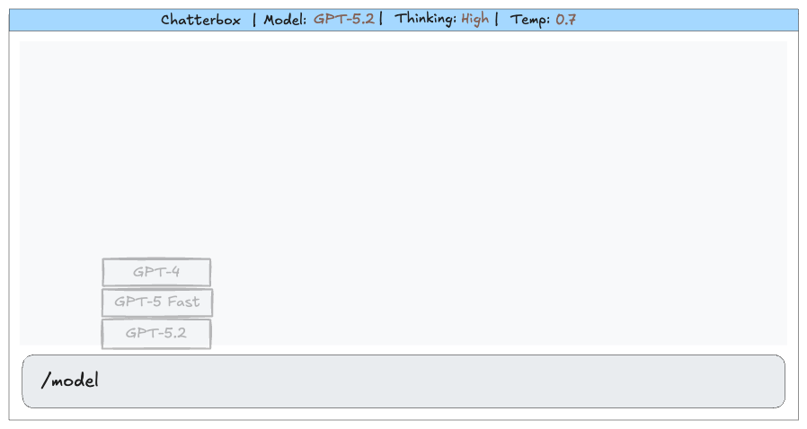

# Slash Command Popups



Implementing a "slash command" popup in a Ratatui TUI involves a few specific architectural decisions. Since Ratatui is an **immediate mode** library, you don't "attach" a listener to a widget; instead, you evaluate your state every frame and decide what to draw.

### 1. Choice of Input Component

For a text field that needs to handle slash commands, you have two primary options:

* **`tui-input` (Crate):** The "standard" for single-line inputs. It is lightweight and handles cursor management well.
* **`tui-textarea` (Crate):** Better if you need a more robust editor feel (multi-line support, undo/redo).
* **Custom `Paragraph`:** Not recommended. You would have to manually handle every keypress (backspace, arrow keys, etc.) which is error-prone.

**Recommendation:** Use **`tui-input`**. It provides the `value()` and `cursor()` methods you need to detect the slash command and position the popup accurately.

---

### 2. Watching for the Command

To trigger the popup, you should monitor the state of your input buffer during the event loop.

1. **Detection:** In your `handle_events` or `update` function, check if the input string starts with or contains `/`.
2. **Filtering:** If the user has typed `/model `, you can use `.split_whitespace()` to extract the "command" (`model`) and the current "query" (any text after it).
3. **State Toggle:** Store a boolean in your App state like `show_suggestions`. Set this to `true` only when the input matches your criteria (e.g., starts with `/model`).

---

### 3. Positioning the Popup

The trickiest part is showing the list **above** the cursor. Since Ratatui uses a coordinate system where  is the top-left, you need to calculate the popup's `Rect` based on the input field's area.

**The Logic:**
If your input field is at row , and your popup is  rows high, your popup should be rendered in a `Rect` starting at .

```rust
// Logic for vertical positioning
let input_area = Rect::new(x, y, width, 1);
let popup_height = 5;
let popup_area = Rect::new(
    input_area.x + cursor_offset, // Align with cursor
    input_area.y.saturating_sub(popup_height), // Move UP
    20, // Width
    popup_height
);

```

---

### 4. Custom vs. 3rd Party Components

While there are a few helper crates, this is often done with **custom code** because positioning is highly dependent on your specific layout.

| Component | Source | Pros/Cons |
| --- | --- | --- |
| **`tui-popup`** | 3rd Party | Great for centered popups, but harder to "anchor" to a specific cursor position. |
| **Custom `List**` | **Core Ratatui** | **Recommended.** Use the built-in `List` widget combined with a `Clear` widget. |

#### Implementation Steps:

1. **Use `Clear`:** Before rendering your list, render `frame.render_widget(Clear, popup_area)`. This ensures the popup isn't transparent against the background.
2. **Stateful List:** Use `ListState` to track which model is currently "selected" in the popup while the user is still typing.
3. **Constraint-based Layout:** Use `Layout::vertical` or `Rect` math to ensure the popup doesn't bleed off the top of the screen (use `.saturating_sub()`).

### Summary of Workflow

1. **Input:** Use `tui-input` for the text field.
2. **Trigger:** Check `input.value().starts_with("/model")` in your update loop.
3. **Position:** Calculate a `Rect` exactly above your input box using the input's current `y` coordinate.
4. **Render:** Render a `Block` + `List` inside that `Rect`, preceded by a `Clear` widget to "cut out" the background.

## Positioning the List

To implement this, we will use a **Stateful approach**. Since Ratatui is immediate mode, we don't "open" a menu; we simply decide to draw one if our state says it should be there.

Below is a deep dive into the implementation logic using `tui-input` and core Ratatui widgets.

---

### 1. The Data Structure

You need to track three things: the text being typed, whether the "suggestion mode" is active, and which item in the suggestion list is highlighted.

```rust
struct App {
    input: Input,              // from tui-input crate
    show_suggestions: bool,
    suggestions: Vec<String>,
    suggestion_state: ListState, // Tracks selection (Up/Down arrows)
}

```

### 2. Logic: The "Watchdog"

In your event loop, you monitor the input. If the user types `/model `, you flip the state.

```rust
match input.value() {
    v if v.starts_with("/model ") => {
        app.show_suggestions = true;
        // Filter logic: if they type "/model gpt", show only gpt models
        let query = &v[7..]; 
        app.suggestions = all_models.filter(|m| m.contains(query)).collect();
    }
    _ => app.show_suggestions = false,
}

```

### 3. Rendering: The "Float" Logic

The trick to a "popup" in Ratatui is using the `Clear` widget. It acts as an eraser, clearing the area so the popup doesn't overlap with background text.

To position it, we use a helper function to create a `Rect` that sits exactly above the input area.

```rust
fn render_popup(f: &mut Frame, input_area: Rect, app: &mut App) {
    if !app.show_suggestions || app.suggestions.is_empty() {
        return;
    }

    // 1. Calculate the area: 5 rows high, same width as input
    let height = (app.suggestions.len() as u16).min(5);
    let popup_area = Rect {
        x: input_area.x,
        y: input_area.y.saturating_sub(height + 1), // +1 for the border
        width: input_area.width,
        height: height + 2, // +2 for top/bottom borders
    };

    // 2. Wipe the background
    f.render_widget(Clear, popup_area);

    // 3. Render the List
    let items: Vec<ListItem> = app.suggestions
        .iter()
        .map(|s| ListItem::new(s.as_str()))
        .collect();

    let list = List::new(items)
        .block(Block::default().borders(Borders::ALL).title("Select Model"))
        .highlight_symbol(">> ")
        .highlight_style(Style::default().fg(Color::Yellow));

    f.render_stateful_widget(list, popup_area, &mut app.suggestion_state);
}

```

---

### 4. Handling Input Focus

When `show_suggestions` is true, your keyboard event handler needs to intercept **Up/Down** and **Enter** keys before they reach the text input.

* **Up/Down:** Change `suggestion_state`.
* **Enter:** Replace the current input text with the selected model (e.g., `/model gpt-4o`) and set `show_suggestions = false`.
* **Esc:** Just set `show_suggestions = false`.

### Why this works

1. **`tui-input`** handles the cursor position, so you can even align the popup's `x` coordinate with the actual cursor index if you want it to "follow" the typing.
2. **`Clear`** is the secret sauce. Without it, your popup will look like a mess of overlapping characters.
3. **No 3rd Party Needed:** While crates like `tui-popup` exist, they are often too rigid for "autocomplete" style UI. Doing it manually with `Rect` math gives you full control over the "Anchor."

**Would you like a full, runnable `main.rs` example that demonstrates this "intercept" logic and the popup positioning?**
