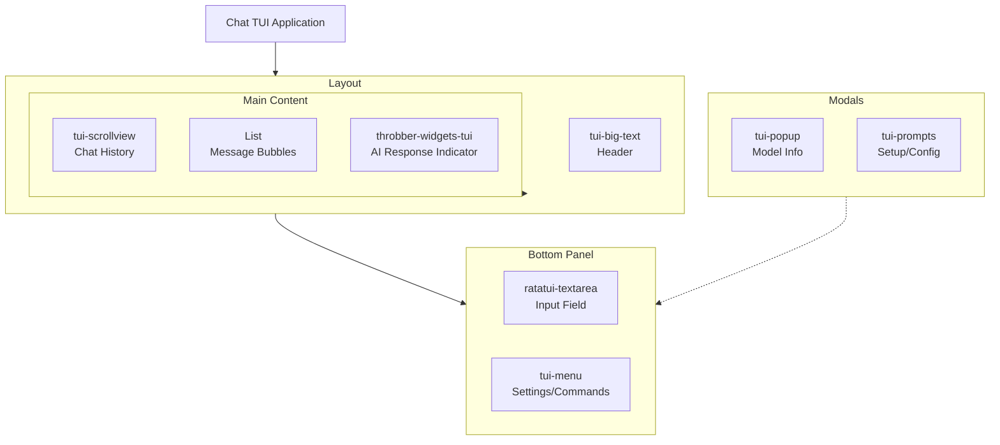

Building a chat-based Terminal User Interface (TUI) to interact with AI models using Ratatui requires a thoughtful combination of widgets for input, message display, navigation, and configuration. Below is a curated list of UI widgets from the Ratatui ecosystem and related libraries that are well-suited for this purpose, along with their key features and use cases.

---

## 🧩 Core Widgets for a Chat TUI Application

### 1. **Input Area**

| Widget | Key Features | Use Case |
| :--- | :--- | :--- |
| **`ratatui-textarea`** 【turn0search10】【turn0search11】 | Multi-line text editing, Emacs-like shortcuts, undo/redo, line numbers, cursor highlight, search with regex, mouse scrolling, yank support. | Primary input field for typing user messages to the AI. Supports complex editing and navigation. |
| **`tui-input`** 【turn0search20】 | Backend-agnostic (supports `tui-rs` and `ratatui`), single-line input, customizable key bindings. | Simpler alternative for single-line prompts or command input (e.g., slash commands). |

### 2. **Message Display & History**

| Widget | Key Features | Use Case |
| :--- | :--- | :--- |
| **`List` (Ratatui built-in)** 【turn0search16】【turn0search17】 | Selectable items, custom styling, scrolling support. | Display chat history as a list of messages (e.g., user/AI messages). Each `ListItem` can represent a message bubble. |
| **`tui-scrollview`** 【turn0search1】【turn0search2】 | Scrollable content area, flexible layout, supports nested widgets. | Wrapper for the chat message area to handle scrolling when conversations grow long. |
| **`ratatui-image`** 【turn0search2】 | Renders images in terminal using sixels or unicode-halfblocks. | Display AI-generated images or rich media content in the chat. |

### 3. **Navigation & Selection**

| Widget | Key Features | Use Case |
| :--- | :--- | :--- |
| **`tui-widget-list`** 【turn0search3】 | Stateful list widget, keyboard navigation, customizable rendering. | Enhanced list for managing chat history, sessions, or model selection with better state management. |
| **`tui-menu`** 【turn0search2】 | Dropdown-style menu, keyboard-driven, hierarchical items. | Settings menu to select AI models, adjust parameters (e.g., temperature, max tokens), or toggle features. |

### 4. **Interactive Elements**

| Widget | Key Features | Use Case |
| :--- | :--- | :--- |
| **`tui-prompts`** 【turn0search1】【turn0search2】 | Interactive prompts, text input, confirmation dialogs. | Guided setup for API keys, model configuration, or confirming actions (e.g., clearing chat history). |
| **`tui-popup`** 【turn0search1】【turn0search2】 | Modal popups, context menus, overlaid content. | Show additional info (e.g., AI model details, error messages, help text) without leaving the chat interface. |

### 5. **Visual Enhancements**

| Widget | Key Features | Use Case |
| :--- | :--- | :--- |
| **`tui-big-text`** 【turn0search1】【turn0search2】 | Large text rendering using `font8x8`, custom styling. | Display app title, AI name, or status indicators (e.g., "Model Ready"). |
| **`throbber-widgets-tui`** 【turn0search2】 | Animated loading spinners (throbbers). | Visual feedback while waiting for AI responses (e.g., "Generating..."). |

---

## 🏗️ Frameworks & Utilities for Architecture

While not widgets themselves, these libraries help structure your TUI app:

| Library | Purpose |
| :--- | :--- |
| **`ratatui`** 【turn0search4】 | Core TUI library for rendering widgets, handling layouts, and terminal events. |
| **`crossterm`**/`termion` | Backend-agnostic terminal handling (keyboard, mouse, screen). Required for input/output. |
| **`tui-react`** 【turn0search2】 | React-like paradigm for stateful widgets. Useful for managing complex UI state (e.g., chat history, app mode). |
| **`tui-realm`** 【turn0search2】 | Elm/React-inspired framework for declarative UI. Helps structure component-based TUI apps. |
| **`rat-salsa`** 【turn0search2】 | Event queue and focus management for handling complex user interactions. |

---

## 📋 Widget Configuration Example

Below is a conceptual layout for a chat TUI using the suggested widgets:



---

## 🎯 Example Implementation Snippet

Here’s how you might integrate `ratatui-textarea` for input and `List` for chat history:

```rust
use ratatui::{backend::CrosstermBackend, Terminal, layout::Rect, Frame};
use ratatui_textarea::TextArea;
use ratatui::widgets::{List, ListItem, ListState};

struct ChatApp {
    input: TextArea,
    messages: Vec<String>,
    list_state: ListState,
}

impl ChatApp {
    fn new() -> Self {
        let mut input = TextArea::default();
        // Set up input key bindings and styles
        let list_state = ListState::default();
        Self { input, messages: Vec::new(), list_state }
    }

    fn draw(&mut self, f: &mut Frame) {
        let chunks = Layout::default()
            .direction(Direction::Vertical)
            .margin(1)
            .constraints(
                [
                    Constraint::Min(10), // Chat history
                    Constraint::Length(3), // Input area
                ]
                .as_ref(),
            )
            .split(f.size());

        // Render chat history
        let items: Vec<ListItem> = self.messages.iter()
            .map(|msg| ListItem::new(msg.as_str()))
            .collect();
        let list = List::new(items).block(Block::default().borders(Borders::ALL).title("Chat"));
        f.render_stateful_widget(list, chunks[0], &mut self.list_state);

        // Render input field
        let input_widget = self.input.widget();
        f.render_widget(input_widget, chunks[1]);
    }
}
```

> 💡 **Full Example**: See the [`ratatui` examples directory](https://github.com/ratatui-org/ratatui/blob/main/examples/README.md)【turn0search19】 for more complete app templates.

---

## 🔍 Additional Resources

1. **App Showcases**: Explore real-world TUI chat apps like [maclincomms](https://github.com/hy-atharv/maclincomms)【turn0search6】 and [agentic](https://github.com/gitcoder89431/agentic)【turn0search7】 for inspiration.
2. **Widget Libraries**: Browse the [tui-widgets](https://github.com/joshka/tui-widgets)【turn0search1】 and [awesome-ratatui](https://github.com/ratatui/awesome-ratatui)【turn0search2】 lists for more widgets.
3. **Templates**: Use the [ratatui/templates](https://github.com/ratatui/templates)【turn0search21】 repository to bootstrap your project.
4. **Documentation**: Refer to [`ratatui-textarea` docs](https://docs.rs/ratatui-textarea)【turn0search10】 for input handling and [`ratatui` docs](https://docs.rs/ratatui) for widget rendering.

---

## ⚙️ Choosing the Right Widgets

| Priority | Recommended Widget | Why? |
| :--- | :--- | :--- |
| **Input** | `ratatui-textarea` | Best-in-class editing features for multi-line messages. |
| **Message Display** | `List` + `tui-scrollview` | Simple, flexible, and handles long conversations gracefully. |
| **Model/Config** | `tui-menu` + `tui-popup` | Intuitive navigation and context-aware overlays. |
| **Feedback** | `throbber-widgets-tui` | Clear visual indication for async AI responses. |
| **Advanced Layout** | `tui-react`/`tui-realm` | Manages complex state and UI updates for rich interactions. |

---

## 💎 Conclusion

To build a robust chat TUI for AI interactions in Ratatui, start with `ratatui-textarea` for input and `List`/`tui-scrollview` for message history. Add `tui-menu` and `tui-popup` for configuration, and enhance visual feedback with `throbber-widgets-tui` and `tui-big-text`. For larger applications, consider frameworks like `tui-react` to manage complexity.

The Ratatui ecosystem provides all the building blocks needed for a powerful, responsive chat interface. Combine these widgets thoughtfully to create a seamless and productive AI interaction experience in the terminal.
