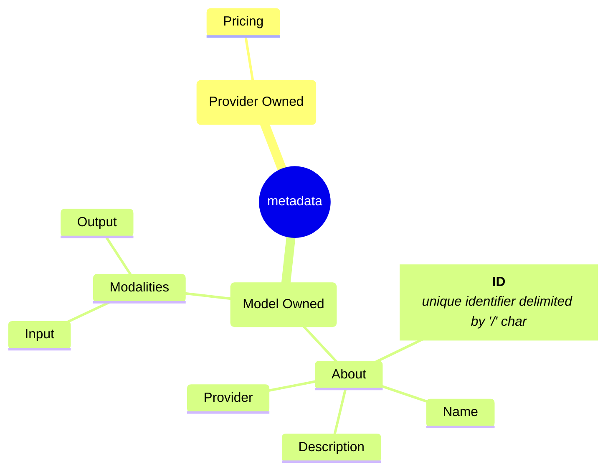

# Metadata Enhancements



## Metadata Enums

```rust
/// Capability labels advertised by Parsera's LLM specs metadata under
/// `capabilities`.
///
/// Parsera's public endpoint does not appear to publish this field as a formal
/// closed enum. The observed/documented capability labels include:
///
/// - `"batch"`
/// - `"citations"`
/// - `"function_calling"`
/// - `"reasoning"`
/// - `"streaming"`
/// - `"structured_output"`
///
/// Keep `Other(String)` for forward compatibility with newly added capability
/// labels.
#[derive(Debug, Clone, PartialEq, Eq, Hash)]
pub enum ModelCapability {
    /// Supports batch processing.
    ///
    /// This generally means the model/provider can process requests through a
    /// batch API or discounted asynchronous batch workflow rather than only
    /// immediate, interactive requests.
    Batch,

    /// Supports citations.
    ///
    /// This generally means the model/provider can return source references,
    /// citation metadata, or grounded references alongside generated text.
    Citations,

    /// Supports function calling or tool calling.
    ///
    /// This means the model can return structured tool/function-call requests
    /// rather than only plain text. Provider APIs may expose this as
    /// `functions`, `tools`, `tool_calls`, or a similar mechanism.
    FunctionCalling,

    /// Supports reasoning-oriented behavior.
    ///
    /// This generally means the model is advertised as having explicit
    /// reasoning capability, reasoning tokens, reasoning controls, or a
    /// reasoning-optimized architecture/interface.
    Reasoning,

    /// Supports streaming responses.
    ///
    /// This means generated output can be delivered incrementally as tokens or
    /// chunks rather than only as a completed response.
    Streaming,

    /// Supports structured output.
    ///
    /// This generally means the model can be constrained or instructed to
    /// produce schema-shaped output, such as JSON mode, JSON Schema output, or a
    /// provider-specific structured-output mechanism.
    StructuredOutput,

    /// Any capability label not recognized by this enum.
    ///
    /// Keep this variant because Parsera may add new `capabilities` values
    /// without treating the field as a published closed enum.
    Other(String),
}

pub enum ModelPricing {
    Text(PricingMetrics),
    Embeddings(PricingMetrics),
    Image(PricingMetrics),
    Video(PricingMetrics)
}

/// Parameters advertised by OpenRouter model metadata in
/// `supported_parameters`.
///
/// This enum intentionally includes `Other(String)` because OpenRouter's
/// `/models` endpoint is a better source of truth than any static list, and
/// provider-specific parameters may appear before they are documented.
#[derive(Debug, Clone, PartialEq, Eq, Hash)]
pub enum ModelParameters {
    /// Penalizes tokens based on how frequently they have already appeared.
    ///
    /// Positive values discourage repeated tokens. Negative values encourage
    /// reuse. This is useful for reducing repetitive phrasing.
    FrequencyPenalty,

    /// Requests reasoning text/tokens in the response when supported.
    ///
    /// This is an older or simpler flag-style control used by some thinking
    /// models. Newer integrations may prefer the structured `Reasoning`
    /// parameter.
    IncludeReasoning,

    /// Biases specific tokens before sampling.
    ///
    /// Usually represented as a map from token IDs to bias values. Strong
    /// negative values can suppress tokens; strong positive values can encourage
    /// them. Token IDs are tokenizer-specific.
    LogitBias,

    /// Requests log probabilities for emitted output tokens.
    ///
    /// When supported, the response includes token-level log probability
    /// information for generated tokens.
    LogProbs,

    /// Upper bound on generated completion tokens.
    ///
    /// This is the newer OpenAI-style naming for the completion token budget.
    /// In practice it serves the same broad purpose as `max_tokens`, but some
    /// providers or models may prefer one spelling over the other.
    MaxCompletionTokens,

    /// Upper bound on generated output tokens.
    ///
    /// This limits how many tokens the model may emit in the response. The
    /// effective maximum is constrained by the model context length minus the
    /// prompt/input tokens.
    MaxTokens,

    /// Filters candidate tokens by minimum probability.
    ///
    /// Tokens below a threshold relative to the most likely token are removed
    /// from the sampling pool. This is commonly used with open-weight model
    /// backends.
    MinP,

    /// Allows the model to emit multiple tool calls in parallel.
    ///
    /// Applies when tool calling is enabled. Actual behavior depends on the
    /// target model and provider.
    ParallelToolCalls,

    /// Penalizes tokens based on whether they have appeared at all.
    ///
    /// Unlike `FrequencyPenalty`, this does not scale with the number of
    /// occurrences. Positive values encourage the model to introduce new
    /// concepts or terms.
    PresencePenalty,

    /// Controls provider/model reasoning behavior.
    ///
    /// OpenRouter normalizes several provider-specific reasoning controls under
    /// this parameter. Depending on model support, it may include fields such as
    /// whether reasoning is enabled, reasoning effort, reasoning token budget,
    /// or whether reasoning should be excluded from the final response.
    Reasoning,

    /// OpenAI-style reasoning effort selector.
    ///
    /// Used by some reasoning models to control how much reasoning effort the
    /// model should spend. Exact accepted values are model/provider-specific,
    /// but commonly include levels such as low, medium, high, or similar.
    ReasoningEffort,

    /// Penalizes repeated tokens in the generated text.
    ///
    /// Common in open-weight inference servers. Values above the neutral point
    /// discourage repetition; exact ranges and defaults are provider-specific.
    RepetitionPenalty,

    /// Forces or hints at a desired response format.
    ///
    /// Commonly used for JSON mode or JSON Schema structured output. For schema
    /// enforcement, provider/model support varies substantially.
    ResponseFormat,

    /// Requests deterministic sampling where supported.
    ///
    /// Given the same model, prompt, and parameters, a seed may make output more
    /// reproducible. Determinism is not guaranteed across all providers,
    /// backends, or model versions.
    Seed,

    /// Stop sequence or sequences.
    ///
    /// Generation halts when the model emits one of the configured stop
    /// strings. The stop text is usually not included in the final response.
    Stop,

    /// Indicates support for structured outputs.
    ///
    /// Usually associated with JSON Schema output via `ResponseFormat`. This is
    /// best treated as a capability/parameter advertised by model metadata
    /// rather than a universally portable request field.
    StructuredOutputs,

    /// Controls sampling randomness.
    ///
    /// Lower values make output more deterministic and focused. Higher values
    /// increase diversity and variance. Common ranges are `0.0..=2.0`, with
    /// `1.0` often used as the default.
    Temperature,

    /// Controls whether and how the model may call tools.
    ///
    /// Typical values include automatic tool choice, no tool use, required tool
    /// use, or a specific tool/function selector.
    ToolChoice,

    /// Tool/function definitions available to the model.
    ///
    /// This is the OpenAI-style tool-calling interface. OpenRouter may translate
    /// this into provider-specific formats for models that support tool use.
    Tools,

    /// Dynamic probability filtering similar in spirit to top-p.
    ///
    /// Typically filters candidate tokens based on a probability threshold
    /// derived from the most likely token. Support is provider/model-specific.
    TopA,

    /// Restricts sampling to the top `k` candidate tokens.
    ///
    /// A value of `1` approximates greedy decoding. Some providers use `0` or
    /// omission to disable top-k filtering.
    TopK,

    /// Requests top alternative token log probabilities.
    ///
    /// Typically requires `LogProbs` to be enabled. The value controls how many
    /// candidate tokens and log probabilities are returned at each output
    /// position.
    TopLogProbs,

    /// Nucleus sampling threshold.
    ///
    /// Restricts candidate tokens to the smallest probability mass whose
    /// cumulative probability reaches this value. Lower values narrow the
    /// distribution and make output more focused.
    TopP,

    /// Controls response detail level where supported.
    ///
    /// Used by models/providers that expose a verbosity control. Higher values
    /// generally ask for more detailed responses; lower values ask for terser
    /// output.
    Verbosity,

    /// Provider-specific web search configuration.
    ///
    /// Used by search-capable models to configure or enable web-search behavior.
    /// Shape and semantics are provider/model-specific.
    WebSearchOptions,

    /// Any parameter not recognized by this enum.
    ///
    /// Keep this variant to preserve forward compatibility with newly added
    /// OpenRouter or provider-specific parameters.
    Other(String),
}

/// Tokenizer family advertised by OpenRouter model metadata under
/// `architecture.tokenizer`.
///
/// OpenRouter does not appear to publish this as a formal closed enum, so keep
/// `Other(String)` for forward compatibility with newly added tokenizer labels.
#[derive(Debug, Clone, PartialEq, Eq, Hash)]
pub enum ModelTokenizer {
    /// Anthropic Claude tokenizer family.
    ///
    /// Observed on Claude-family models.
    Claude,

    /// DeepSeek tokenizer family.
    ///
    /// Observed on DeepSeek-family models.
    DeepSeek,

    /// Google Gemini tokenizer family.
    ///
    /// Observed on Gemini-family models and some Gemma/Reka-family entries.
    Gemini,

    /// OpenAI GPT tokenizer family.
    ///
    /// Observed on OpenAI GPT-family models and some OpenAI-compatible model
    /// entries.
    GPT,

    /// xAI Grok tokenizer family.
    ///
    /// Observed on Grok-family models.
    Grok,

    /// Llama 2 tokenizer family.
    ///
    /// Observed on older Llama-2-derived models.
    Llama2,

    /// Llama 3 tokenizer family.
    ///
    /// Observed on Llama-3-derived models.
    Llama3,

    /// Mistral tokenizer family.
    ///
    /// Observed on Mistral, Mixtral, Codestral, and related models.
    Mistral,

    /// Amazon Nova tokenizer family.
    ///
    /// Observed on Amazon Nova-family models.
    Nova,

    /// OpenRouter's fallback or unspecified tokenizer label.
    ///
    /// This appears frequently for models where OpenRouter does not expose a
    /// more specific tokenizer family.
    OtherKnown,

    /// Qwen tokenizer family.
    ///
    /// Observed on Qwen-family models where the metadata uses `Qwen` rather
    /// than `Qwen3`.
    Qwen,

    /// Qwen3 tokenizer family.
    ///
    /// Observed on newer Qwen3-family models.
    Qwen3,

    /// OpenRouter router tokenizer label.
    ///
    /// Observed on router/alias models such as `~openai/gpt-latest`,
    /// `~anthropic/claude-sonnet-latest`, and `openrouter/free`.
    Router,

    /// Any tokenizer label not recognized by this enum.
    ///
    /// Keep this variant because OpenRouter may add new tokenizer labels without
    /// treating the field as a published closed enum.
    Other(String),
}

/// Instruction/chat template family advertised by OpenRouter model metadata
/// under `architecture.instruct_type`.
///
/// OpenRouter does not appear to publish this field as a formal closed enum.
/// The live `/api/v1/models` payload currently contains `null` plus string
/// values such as `"alpaca"`, `"chatml"`, `"gemma"`, `"llama3"`,
/// `"mistral"`, and `"vicuna"`.
///
/// Keep `Other(String)` for forward compatibility with newly added template
/// labels.
#[derive(Debug, Clone, PartialEq, Eq, Hash)]
pub enum ModelInstructType {
    /// No instruction template family is advertised.
    ///
    /// This corresponds to `architecture.instruct_type: null` in OpenRouter
    /// model metadata. It is the most common value for hosted/proprietary
    /// chat models and for models where OpenRouter does not expose a specific
    /// instruction-template label.
    None,

    /// Alpaca-style instruction template.
    ///
    /// Observed on older Llama-2-derived roleplay/storytelling fine-tunes.
    /// This generally implies an instruction/input/response style prompt
    /// format rather than a native multi-role chat format.
    Alpaca,

    /// ChatML-style instruction template.
    ///
    /// Observed on Qwen-family and Hermes-family models, among others.
    /// ChatML-style formats typically encode conversations using explicit
    /// message-role delimiters such as system/user/assistant boundaries.
    ChatMl,

    /// Gemma instruction template.
    ///
    /// Observed on Google Gemma instruction-tuned models. This indicates the
    /// model expects Gemma-family chat/instruction formatting rather than a
    /// generic OpenAI, ChatML, Llama, or Mistral template.
    Gemma,

    /// Llama 3 instruction template.
    ///
    /// Observed on Meta Llama 3.x Instruct models and some Llama-3-derived
    /// fine-tunes. This generally implies Llama-3-family role/header token
    /// formatting.
    Llama3,

    /// Mistral instruction template.
    ///
    /// Observed on Mistral, Mixtral, Mistral-Nemo, and related instruction
    /// models. This generally implies Mistral-family instruction formatting,
    /// commonly associated with `[INST] ... [/INST]`-style templates for older
    /// variants.
    Mistral,

    /// Vicuna-style instruction template.
    ///
    /// Observed on some older instruction-tuned or roleplay-oriented models.
    /// This generally implies a Vicuna/FastChat-style conversational prompt
    /// format.
    Vicuna,

    /// Any instruction template label not recognized by this enum.
    ///
    /// Keep this variant because OpenRouter may add new `instruct_type` values
    /// without treating the field as a published closed enum.
    Other(String),
}


/// Canonical model card built from provider docs, aggregator metadata,
/// and benchmark/market sources.
///
/// Treat this as your internal normalized representation, not as a direct
/// mirror of any one provider's schema.
#[derive(Debug, Clone, PartialEq)]
pub struct ModelCard {
    /// Stable internal identifier.
    pub id: String,

    /// Human-readable model name.
    pub name: String,

    /// Vendor or model creator.
    pub creator: Organization,

    /// Provider-specific API offerings for this model.
    pub providers: Vec<ModelProviderOffering>,

    /// Model family / lineage.
    pub family: Option<String>,

    /// Vendor version or dated alias, if known.
    pub version: Option<String>,

    /// Deployment or alias identifiers that may resolve to this model.
    pub aliases: Vec<String>,

    /// Whether the model weights are open, closed, or unknown.
    pub availability: ModelAvailability,

    /// Input/output modality support.
    pub modalities: ModelModalities,

    /// Context limits.
    pub limits: ModelLimits,

    /// High-level capability flags.
    pub capabilities: ModelCapabilities,

    /// Architecture-level metadata when available.
    pub architecture: Option<ModelArchitecture>,

    /// Pricing observed from providers or aggregators.
    pub pricing: Vec<ModelPricing>,

    /// Benchmarks and empirical measurements.
    pub evaluations: Vec<ModelEvaluation>,

    /// Free quota / subscription / billing notes.
    pub access: Vec<ModelAccessPolicy>,

    /// Source-level provenance for the card.
    pub sources: Vec<ModelMetadataSource>,
}


#[derive(Debug, Clone, PartialEq, Eq)]
pub enum ModelAvailability {
    OpenWeights,
    ClosedWeights,
    HostedOnly,
    Unknown,
}

#[derive(Debug, Clone, PartialEq, Eq)]
pub struct ModelProviderOffering {
    /// Example: "alibaba-cloud", "openrouter", "artificial-analysis".
    pub provider_id: String,

    /// Provider-facing model id.
    ///
    /// Examples:
    /// - "qwen3.5-plus"
    /// - "qwen3.5-plus-2026-02-15"
    /// - "qwen/qwen3.5-plus-20260420"
    pub model_id: String,

    /// Region or deployment scope, if relevant.
    pub deployment: Option<ModelDeployment>,

    /// Provider-specific endpoint type.
    pub api_style: ApiStyle,
}

#[derive(Debug, Clone, PartialEq, Eq)]
pub enum ApiStyle {
    OpenAiCompatible,
    AnthropicCompatible,
    NativeProviderApi,
    WebUiOnly,
    Unknown,
}

#[derive(Debug, Clone, PartialEq, Eq)]
pub struct ModelDeployment {
    pub region: Option<String>,
    pub mode: Option<String>,
}

#[derive(Debug, Clone, PartialEq, Eq)]
pub struct ModelModalities {
    pub input: Vec<Modality>,
    pub output: Vec<Modality>,
}

#[derive(Debug, Clone, PartialEq, Eq, Hash)]
pub enum Modality {
    Text,
    Image,
    Audio,
    Video,
    Embedding,
    Other(String),
}

#[derive(Debug, Clone, PartialEq, Eq)]
pub struct ModelLimits {
    pub context_window_tokens: Option<u64>,
    pub max_output_tokens: Option<u64>,
    pub max_input_tokens: Option<u64>,
}

pub enum PricingInterval {
    Monthly,
    Annual
}

#[derive(Debug, Clone, PartialEq, Eq)]
pub struct SubscriptionPlan {
    pub provider: ModelProvider,
    /// Pricing in USD
    pub price: F32,
    pub interval: PricingInterval,
    pub five_hour_limit: Option<i32>,
    pub five_hour_unit: Option<UsageUnit>,
    pub weekly_limit: Option<i32>,
    pub weekly_limit_unit: Option<UsageUnit>,
    pub monthly_limit: Option<i32>,
    pub monthly_limit_unit: Option<UsageUnit>,
}

#[derive(Debug, Clone, PartialEq, Eq, Default)]
pub struct ModelCapabilities {
    pub reasoning: CapabilitySupport,
    pub tool_calling: CapabilitySupport,
    pub structured_output: CapabilitySupport,
    pub streaming: CapabilitySupport,
    pub citations: CapabilitySupport,
    pub batch: CapabilitySupport,
    pub vision: CapabilitySupport,
    pub video_input: CapabilitySupport,
    pub audio_input: CapabilitySupport,
}
```

## Metadata Structs

```rust
pub struct PricingMetrics {
    /** Input price per million tokens */
    InputPrice: F32;
    CachedInputPrice: Option<F32>;
    OutputPrice: F32;
    BatchInputPrice: Option<F32>;
    BatchOutputPrice: Option<F32>;
}

```
