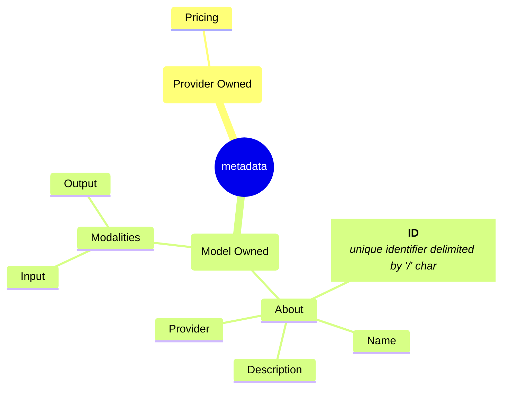

# Metadata Enhancements



## Metadata Enums

```rust

pub enum ModelModality {
    Audio,
    Image,
    Text,
    Video,
    Embeddings
}

pub enum ModelCapability {
    FunctionCalling,
    Batch,
    StructuredOutput,

}

pub enum Pricing {
    Text(PricingMetrics),
    Embeddings(PricingMetrics)
}

pub enum ModelParameters {
    MaxTokens,
    Temperature,
    TopP,
    Reasoning,
    IncludeReasoning,
    Stop,
    FrequencyPenalty,
    Seed,
    TopK,
    MinP,
    LogProbs,
    LogitBias,
    ParallelToolCalls,
    PresencePenalty,
    ResponseFormat,

    TopLogProbs,


    Other(String)
}

pub enum ModelTokenizer {

}

```

## Metadata Structs

```rust
pub struct PricingMetrics {
    /** Input price per million tokens */
    InputPrice: F32;
    CachedInputPrice: Option<F32>;
    OutputPrice: F32;
    BatchInputPrice: Option<F32>;
    BatchOutputPrice: Option<F32>;
}

```
