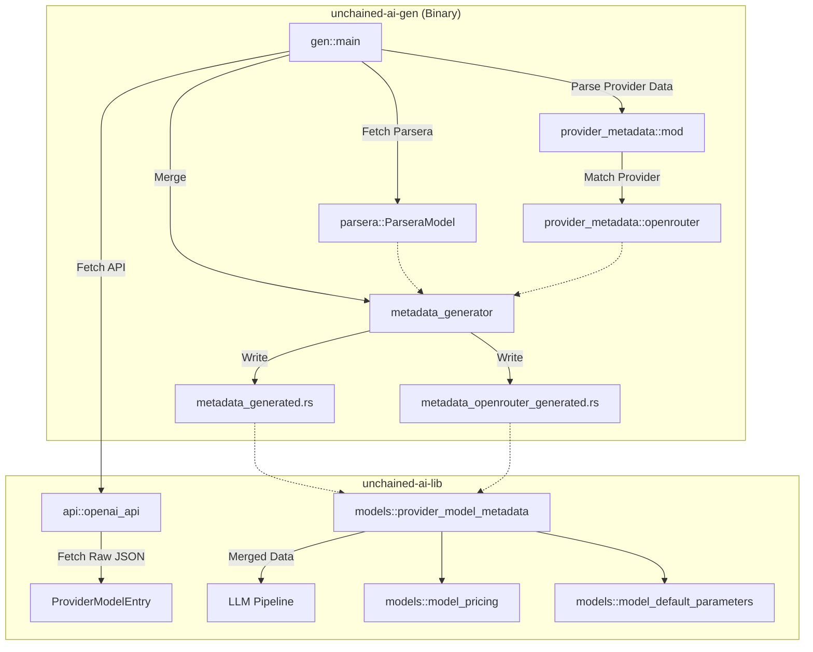

# Technical Design: Better Model Metadata

This technical design complements the [Better Model Metadata Specification](./spec.md). It details the implementation strategy for expanding model metadata in the `unchained-ai` package, focusing on capturing rich provider-native data (primarily from OpenRouter) and merging it with Parsera-sourced specifications.

## Module Dependency Graph

The following graph illustrates the interaction between the library, the generator, and the new provider-native metadata layer.



## Type Definitions & Relationships

### `ProviderModelMetadata` (Renamed from `ModelMetadata`)
Located in `lib/src/models/model_metadata.rs`. This is the primary runtime container for model info.

```rust
pub struct ProviderModelMetadata {
    // Legacy fields (backward compatible)
    pub display_name: Option<String>,
    pub family: Option<String>,
    pub context_window: Option<u32>,
    pub max_output_tokens: Option<u32>,
    pub modalities: Option<ModelModalities>,
    pub capabilities: Vec<String>,

    // New rich fields
    pub description: Option<String>,
    pub pricing: Option<ModelPricing>,
    pub supported_parameters: Vec<String>,
    pub default_parameters: Option<ModelDefaultParameters>,
    pub knowledge_cutoff: Option<String>,
    pub created: Option<i64>,
}
```

### `OpenRouterModelMetadata` (Internal to Generator & Specialized Lookup)
This struct mirrors the OpenRouter API exactly and is used to generate the rich specialized lookup table in `metadata_openrouter_generated.rs`.

## Error Type Hierarchy

We introduce `ModelMetadataError` to handle issues during fetching, parsing, and merging within the `gen-models` binary.

```rust
#[derive(Debug, thiserror::Error)]
pub enum ModelMetadataError {
    #[error("Failed to fetch provider models: {0}")]
    FetchError(#[from] reqwest::Error),

    #[error("Failed to parse provider-native JSON for {provider}: {details}")]
    ParseError {
        provider: String,
        details: String,
    },

    #[error("Validation error for model {model_id}: {message}")]
    ValidationError {
        model_id: String,
        message: String,
    },

    #[error("Metadata merge conflict for {model_id} on field {field}")]
    MergeConflict {
        model_id: String,
        field: String,
    },
}
```

## Testing Patterns

### 1. Fixture-based Unit Tests
The complexity of OpenRouter's metadata means we cannot rely solely on integration tests.
- **Location**: `unchained-ai/gen/tests/fixtures/`
- **Pattern**: Load `openrouter_v1_models.json`, run it through `parse_openrouter_model`, and assert specific fields (e.g., pricing for `x-ai/grok-4.3`).

### 2. Mocking Providers with `wiremock`
For the end-to-end generator flow, we mock the `/v1/models` endpoint.
- **Goal**: Verify that raw JSON is correctly passed from the API layer to the generator logic without being prematurely stripped.

### 3. Golden File Testing
- **Goal**: Ensure the generated code follows the expected format.
- **Implementation**: The generator output is compared against files in `unchained-ai/gen/tests/golden/`.

## Performance Considerations

### Memory Layout
- **'static Lifetime**: All generated metadata is baked into the binary as `&'static` data. This avoids runtime allocation for metadata access.
- **Lazy Initialization**: `metadata_openrouter_generated.rs` uses `std::sync::LazyLock<HashMap<...>>`. The hash map is only built on first access, saving memory for applications that don't query rich OpenRouter metadata.
- **f64 Pricing**: We use `f64` for pricing. While not suitable for billing systems, it is perfect for informational displays (e.g., "Cost per 1k tokens") and avoids the heavy dependency of a decimal library in the generated code.

### Code Bloat
Generating 371 rich entries adds ~4000 lines of code. By splitting this into `metadata_openrouter_generated.rs`, we ensure that:
1. Compilation time for the core library remains fast.
2. Only consumers who explicitly `use` the OpenRouter table pay the binary size penalty.

## Deprecation Mechanics

To maintain backward compatibility during the transition from `ModelMetadata` to `ProviderModelMetadata`:

1.  **Type Alias**: `pub type ModelMetadata = ProviderModelMetadata;` with `#[deprecated]`.
2.  **Internal Update**: All 48 workspace crates will be updated to the new name in a single follow-up PR.
3.  **Removal**: The alias will be removed once all internal dependencies are migrated.

## Data Merging Logic

Merge priority is strictly enforced in `gen/src/metadata_generator.rs`:

| Field | Source 1 (Priority) | Source 2 (Fallback) |
|-------|-------------------|-------------------|
| `display_name` | Provider `name` | Parsera `name` |
| `context_window` | Provider `context_length` | Parsera `context_window` |
| `modalities` | Provider `architecture` | Parsera `modalities` |
| `description` | Provider `description` | N/A |
| `pricing` | Provider `pricing` | N/A |
| `capabilities` | Parsera `capabilities` | N/A |
| `family` | Parsera `family` | N/A |
