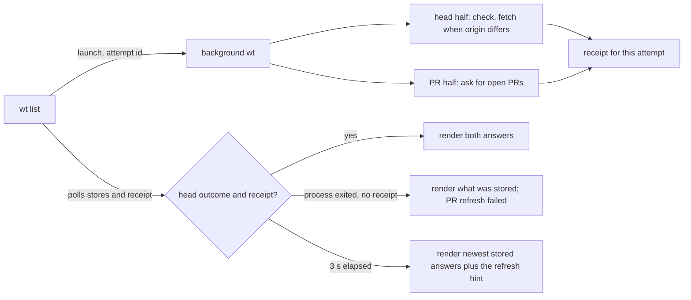

# `wt list`

Lists all git worktrees along with their status. This is the default command -- running `wt` with no subcommand is equivalent to `wt list`.

Before it lists anything, `wt list` checks whether `origin/<default>` is current (fetching it when it is not) and asks for the open pull requests, both in one short wait; see [Checking origin](#checking-origin). The output is then, in order: a caption, an optional credentials warning, the worktree table, a two-line legend, the git graph (image-capable terminals only), a status list holding this run's PR item and the refresh hint, the verbose section (`-v` only), and, after a blank line, any closing notes. Everything is written to stderr.

## Output

```text
  main  is 7 commits behind  origin/main  (updated from origin just now)

┌───────────────────┬──────────────────────────────────┬──────────────────────┬───────────────────────────┐
│ Worktree          │ Branch                           │ ->  origin/main      │ -> parent                 │
├───────────────────┼──────────────────────────────────┼──────────────────────┼───────────────────────────┤
│ ○ base repo       │  main                            │ —                    │ —                         │
│ ● fix-wt-ux       │ ├─ fix/wt-ux                     │ clean +2 -1  PR #99  │ —                         │
│ ● feat-theme      │ ├─ feat/theme                    │ clean +3             │ —                         │
│ ○ feat-dark-fixes │ │  └─ feat/dark-fixes            │ clean +2 -1          │ conflicts +1 -3  PR #104  │
│ ○ old-cleanup     │ └─ chore/old-cleanup             │ clean -4             │ —                         │
│ ○ release-prep    │ release/prep  PR #7 → release/2  │ clean                │ —                         │
│                   │ experiments (deleted)            │                      │                           │
│ ● spike-parser    │ └┄ spike/parser                  │ conflicts +1 -3      │ parent deleted            │
│ ● bisect          │ detached @ a1b2c3d               │ —                    │ —                         │
└───────────────────┴──────────────────────────────────┴──────────────────────┴───────────────────────────┘

 Worktree   ○ clean    ● uncommitted files    ● uncommitted source files
 Branch     └─ merges cleanly into parent     └─ conflicts with parent    └┄ parent deleted

 - main is 7 commits behind origin/main; run wt --ff to fast-forward it.
```

### Checking origin

Merge metrics are only as good as `origin/<default>`, and PR badges only as good as the last answer about open pull requests, so every listing with an `origin` asks `origin` both questions before it lists anything. A detached background `wt` process does the asking, in two halves that run side by side: the **head half** (steps 1 and 2) and the **PR half** (see [PR badges](#pr-badges)). The listing waits for both (step 3).

1. **Check.** The head half asks `origin` for the default branch's current commit. For a provider `sniff` supports (GitHub, GitLab, Gitea, Bitbucket) it asks the provider's API, using the same API key variables as the PR badges (`GITHUB_TOKEN` or `GH_TOKEN`, and so on). For any other remote (a local bare repository, an SSH alias, an unsupported host), or when the API request fails (a missing or rejected key, a 404, a rate limit, or any other error with time left), it runs `git ls-remote origin refs/heads/<default>` instead. The whole check, fallback included, is capped at 10 s. Only a complete `ls-remote` answer without the branch counts as the branch being absent; an API 404 alone proves nothing, because providers answer a private repository that way.
2. **Fetch, only when origin differs.** When the answer differs from `origin/<default>`, the head half fetches that one ref, capped at 60 s:

    ```bash
    git -c maintenance.auto=false -c gc.auto=0 fetch --no-write-fetch-head --no-tags \
      --no-recurse-submodules --refmap= origin +refs/heads/<default>:refs/remotes/origin/<default>
    ```

    Only `refs/remotes/origin/<default>` changes: no tags, no other branches, no `FETCH_HEAD`, and no submodules, whatever your Git configuration says. The leading `+` lets a remote rewind through. Your local default branch is never moved; see `--ff` below. Git runs without credential prompts, with SSH in batch mode, and is killed with its whole process tree at the deadline.
3. **Wait.** `wt list` waits up to **3 s** for both halves, so an ordinary listing costs the slower of the two, never their sum. While it waits, a spinner on stderr says `updating`, `no API key, using fallback method`, `rate limited, using fallback method`, or `pulling remote updates`, and goes back to `updating` once only the PR half is left. It appears only after 150 ms, only when stderr is a terminal, and its line is cleared before anything else is printed, so captured output and the shell wrapper never see it. Work still running at 3 s carries on in the background, the listing adds the refresh hint, and the next listing shows the result.
4. **Gather.** Only then are the local refs, comparison counts, and graph read, so a fetch that finished during the wait is reflected everywhere at once.

The check's result is stored for later listings (the last successful answer is never erased by a failed check), and at most one check or fetch runs per repository at a time: a listing that finds one already running follows it rather than asking `origin` again. `-r` and `--ff` wait for both halves the same way, only longer: up to 75 s.

Without an `origin` nothing is asked, nothing is waited for, and no PR item or refresh hint is shown.

#### How the wait knows both halves are done

The background process writes a small **receipt** file when both halves have finished, on every run. It records how each half ended: the head half's outcome, and whether the PR half published an answer, failed (and why), found another process already asking, was skipped for an ignored repository, or had no provider to ask. The listing reads the receipt for the attempt it launched, and deletes it when its wait ends.



The two halves are reported separately, so one never hides the other:

- **The head finished, PRs did not.** The caption shows the finished check (for example `(updated from origin just now)`), never "still checking"; the status list shows the PR item for an unfinished refresh and the refresh hint.
- **PRs published, the head did not.** The new badges show with no PR item; the caption says "still checking" (or "still pulling") and the hint follows.
- **The process exited without a receipt.** What it stored is still shown; the PR refresh counts as failed, with no guessed reason.

The PR half publishes its answer before the receipt exists, so a new answer is recognized the moment it is stored: every stored answer carries a fresh random publication id, and a listing that sees an id other than the one stored when it started knows the answer is new, even when it arrived in the same second or lists no PRs.

Two listings that overlap (say `wt list` in two checkouts of one repository) never ask for PRs twice at once. The second one's PR half finds the first one asking and makes no request; its listing then waits, within its own 3 s, for the first one to finish, and shows the first one's answer if a new one was published. When nothing new appears the PR refresh counts as failed; `-r` and `--ff` instead try once more, still within their 75 s. Waiting on someone else never extends a listing's budget.

### The default-branch target

Ahead/behind and merge comparisons use one **target**: whichever of the local default branch and `origin/<default>` contains the other, or `origin/<default>` when the two have diverged. Without a remote-tracking ref the local branch is the target. `origin/<default>` is as current as the last fetch, whether `wt list`'s own or yours.

### Caption

The caption is one sentence: how the local default branch compares with `origin/<default>`, then, dim and italic in parentheses, what this run learned from `origin`. When this run's check found the tracking ref already current there is nothing to add, so the sentence ends at the comparison. It needs an `origin` remote: without one, leftover `origin/*` refs produce no caption.

The comparison is `is N commits behind`, `is N commits ahead of`, `is in sync with`, or `has diverged from … (N commits ahead, M commits behind)`. Only the counts are colored. It says `local origin/main` in the two rows where this run could not bring the tracking ref up to date, so the counts may be old.

| This run | Caption |
|---|---|
| Checked; no difference | `main is 3 commits behind origin/main` |
| Origin differed; the fetch succeeded | `main is 3 commits behind origin/main (updated from origin just now)`, counted from the fetched tip |
| Origin differed; the fetch failed | `main is 3 commits behind local origin/main (origin differed when checked just now; fetch didn't finish within 60 s)` |
| Still checking at 3 s | `main is 3 commits behind origin/main (origin hasn't answered yet; still checking in the background; last checked with origin 2 h ago)` |
| Still fetching at 3 s | `main is 3 commits behind local origin/main (origin differed when checked just now; pulling remote updates in the background)` |
| Check failed | `main is 3 commits behind origin/main (couldn't check origin; last checked with origin 2 h ago)` |
| Branch absent on `origin`, tracking ref still present | `main is in sync with origin/main (main was absent on origin when checked just now; origin/main is a local tracking ref)` |

- **Reasons.** A failed check reads `origin didn't answer within 10 s`, `origin didn't accept Git's credentials`, or `couldn't check origin`; a failed fetch reads `fetch didn't finish within 60 s` or `fetch failed`. Other failures never claim that the host was unreachable or the machine offline, and Git's own error text, remote URLs, and credentials are never shown.
- **What was last known.** The still-checking and check-failed rows end with `last checked with origin <age> ago` when an earlier answer is stored. Without one they fall back to `tracking ref last changed <age> ago`, from the ref's reflog; that dates the last change to the ref, not the last fetch or check. With neither, or with a timestamp in the future, they say `never checked with origin`.
- **Missing refs.** Without a local default branch the sentence is `origin/main`, and without a tracking ref `No local tracking ref origin/main`, each followed by the row's parenthesized text when it has one; and when the branch is absent on `origin` and the tracking ref has been pruned, only `main was absent on origin when checked just now` remains. An absent branch never reads as in sync with `origin`.

Ages use the PR age units: `less than 1 min`, then minutes, hours below two days, then days.

### Credentials warning

When `origin` is a supported provider and this run's API request failed for a confirmed credentials or rate-limit reason, one dim line follows the caption. `{key}` is the variable that was used, or, when none was set, every variable the provider accepts (for example `GITHUB_TOKEN or GH_TOKEN`). Only variable names are printed, never their values.

| Condition | Line |
|---|---|
| No key set, the repository isn't visible without one, and `ls-remote` failed too | `GitHub did not show this repository, and Git could not check it. If it is private, set GITHUB_TOKEN or GH_TOKEN and try again.` |
| A key is set, but the provider didn't accept it | `GitHub didn't accept GITHUB_TOKEN; it may be invalid, expired, or revoked. Replace it and try again.` |
| A key is set, and the provider denied access | `The API key GITHUB_TOKEN doesn't have rights to view this repository on GitHub.` |
| No key set, and the provider rate limited the request | `GitHub rate limited the request for updated information. Add the GITHUB_TOKEN or GH_TOKEN API key to get larger rate limits.` |
| A key is set, and the provider still rate limited the request | `GitHub rate limited the request for updated information. Try again in a few minutes.` |

The PR request counts too, in every listing, not only under `-r`: a rejected key or a rate limit on it prints the same line. When both requests failed for a confirmed reason, the `origin` check's line wins, and the PR item's `(couldn't refresh)` does not repeat the reason.

Nothing is printed when the request succeeded, with or without a key, or when no key was set and `ls-remote` answered (the closing notice below covers that). A 404 on its own is ambiguous and produces no line. Only failures this listing observed count; a background refresh that fails after the listing rendered never adds a line to it.

The table is never narrower than the legend beneath it; a table with short content widens its last column to match. In the legend the `conflicts` sample sits in the same column as the source-files dot above it.

### Columns

- **Worktree** -- a status dot and the directory name; the main checkout is `base repo`. The current worktree's name is bold and its whole row is highlighted.
    - `○` (dim): no uncommitted files
    - `●` (yellow): uncommitted files, none of them source code
    - `●` (red, the same red as `conflicts`): at least one uncommitted source file
- **Branch** -- a tree built from the fork records `wt create` keeps (see `--from` in the [README](../../README.md)):
    - the default branch comes first, as a badge; branches forked from another branch nest under it
    - the connector (`├─`, `└─`) is gray when the branch merges cleanly into its parent and red when it conflicts
    - a parent that has no worktree of its own still gets a row, with empty status cells
    - a deleted parent is shown dim, struck through, and marked `(deleted)`; its children hang from it with dotted connectors (`├┄`, `└┄`)
    - branches without a fork record sit at the root, in worktree order; siblings are ordered by creation time, then name
    - a detached worktree shows `detached @ <sha>` and comes last
- **`-> {target}`** -- the header names the target as a remote (`origin/main`) or local (`main`) badge. The cell compares the branch with it:
    - `clean` (dim italic): it would merge without conflicts, including when it has nothing to merge
    - `conflicts` (red): it would not
    - from 100 terminal columns, `clean` and `conflicts` are followed by `+N` (dim green, commits the branch has that the target lacks) and `-N` (dim red, commits the target has that the branch lacks); a zero side is left out, so equal tips read `clean` alone. Below 100 columns only the state word shows. The width is the terminal's; `-w` / `--width` sizes only the graph
    - `—`: the default branch's own row, and detached worktrees
    - `?`: git could not answer; `wt` never shows a guessed result
- **`-> parent`** -- the same comparison, counts included, against the recorded fork parent's local branch (never its `origin/*` copy). `—` when there is no non-default parent; `parent deleted` when the recorded parent is gone.

Comparison results are cached by the pair of commit SHAs, so a warm `wt list` runs no `rev-list` or `merge-base`; see [performance-testing.md](../performance-testing.md). Uncommitted-file status is always checked live.

### PR badges

Every listing asks `origin` for its open pull requests, whatever the age of the last answer, and shows the answer that arrives within its wait. Open pull requests whose source is this repository show as a green `PR #n` badge:

- in the `-> {target}` cell when the PR targets the default branch, after any counts
- in the `-> parent` cell when it targets the branch's fork parent
- beside the branch name, as `PR #n → <target>`, otherwise

A PR from a fork with a same-named branch is never shown. In terminals that support OSC 8 hyperlinks the badge links to the PR; elsewhere it shows the number only, with no visible URL, so the table always fits.

The request is made only by the background process's PR half (see [Checking origin](#checking-origin)), never by `wt list` itself, with a 10 s deadline. It asks for the complete list, which can take more than one HTTP request on some providers, and stores the answer only when it is complete and `origin` has not changed meanwhile. A failure is never stored, so the last good answer survives it. Each answer is stored with the `origin` it came from; an answer for a different `origin` is never shown. An empty answer is an answer: it clears the badges.

What the listing shows depends on how this run's PR half ended:

| This run's PR half | Badges | Status item |
|---|---|---|
| published an answer within the wait (its own, or one another listing published) | the new answer | none |
| finished but published nothing, or its result could not be observed | the last stored answer | `- PRs as of <age> ago (couldn't refresh)`, at any age |
| the same, with nothing stored | none | `- couldn't get open PRs` |
| still running at 3 s | the last stored answer | `- PRs as of <age> ago` when that answer is 60 s old or more; the refresh hint follows either way |
| repository listed in `~/.wt.json` (see `--ignore-api`) | none | none |
| `origin` is a local path or a host with no supported provider | none | none |

For example, a refresh that fails right after a good answer from 10 s ago keeps that answer's badges and reads `- PRs as of less than 1 min ago (couldn't refresh)`. A local-path or unsupported `origin` is not a failure: it simply has no provider to ask, and its head check still runs through Git.

If `origin` changes or disappears during the wait, the old `origin`'s badges and its PR failure reasons are dropped from this listing, and no second refresh starts.

### Git Graph

When stderr is a terminal and `TERM_PROGRAM` (or `KITTY_WINDOW_ID`) names an image-capable terminal (Kitty, iTerm2, Ghostty, WezTerm, Warp, Konsole), a branch graph is drawn below the table. It is not drawn for a detached current worktree.

- **A feature branch is checked out**: the current branch forked from the default branch (or from its recorded parent branch, which then gets a line of its own), and the default branch down to just below the oldest fork or merge.
- **The default branch is checked out**: the default branch's 10 newest commits, and a line for every worktree branch.

Every line is its branch's first-parent history, so a merged branch's commits never appear on the default branch's line:

- a branch merged with a merge commit keeps its own line, drawn merging into the branch it was merged into, at the merge commit;
- a branch that got new commits after being merged stays one connected line: it merges at the merge commit and continues after it, and a branch still at the merged commit is a tag on that line;
- a branch with no commits of its own (fast-forwarded, or created and not yet committed to) is a tag on its commit;
- forks and merges older than the drawn commits stay visible, with the commits between them folded into `+N` squares.

Each line shows its 5 newest commits; older ones fold into a `+N` square. Open PRs appear as `PR #n → target` tags. When `origin/<default>` has diverged from the local default branch it gets a line of its own.

When local history cannot establish a connection (in a shallow clone, for instance), or something the graph should show cannot be drawn at its own commit, the graph shows what it could verify followed by a dim "Some history is not shown". It never fetches more history for this.

There is no minimum terminal width: the graph is sized from its natural width and the terminal's cell size, trims commits into `+N` squares to fit, and shrinks only when even the trimmed graph is too wide. In the base view a graph taller than half the terminal keeps the most recently active lines and notes how many were left out. See [git-graph.md](../git-graph.md) for the design.

`-w` / `--width` sets the graph's width directly (`70`, `70ch`, or `50%` of the terminal); the graph is then never trimmed to fit.

### Status list

A Markdown-style list of dim items follows the graph (or the legend when no graph is drawn), before the verbose section. It is left out when it has no items:

- this run's PR item, when its PR refresh failed or was still running with an answer at least 60 seconds old (see the table under [PR badges](#pr-badges))
- the refresh hint, when the wait ran out before both halves finished

A failed refresh adds the hint only when the wait also ran out (the head half was still running). A refresh still running at 3 s:

```text
- PRs as of 12 min ago
- running this command again will provide updated metrics; alternatively use the --refresh / -r flags to force refresh immediately
```

### Verbose Mode

With `-v` / `--verbose`, and whenever the current branch is not the default branch (including when it is checked out in the base repo), two sections follow the graph:

- **Default branch section** -- the commit the branch forked from, formatted with SHA, conventional commit type/scope, timestamp, and any refs
- **Feature branch section** -- every commit on the branch that neither the local default branch nor `origin/<default>` has, oldest first, using the same format

Commits are formatted as conventional commits when possible (e.g. `feat(scope): description`), with fallback to a truncated first line for non-conventional messages.

### Closing notes

After a blank line, the output can end with up to three kinds of note, in this order. A command a note tells you to run (`wt --ff`, `--ignore-api`) is shown in reverse video, so it stands out as something to type. The examples below are plain text.

- **Fast-forward suggestion.** When the local default branch is strictly behind `origin/<default>` (not diverged):

    ```text
    - main is 3 commits behind origin/main; run wt --ff to fast-forward it.
    ```

    It is not shown when the listing rendered while origin was still being checked or pulled, or under `--ff`, which reports its own result instead: nothing when it moved the branch or there was nothing to do, otherwise the reason it did not, for example (`main has diverged from origin/main, so it can't be fast-forwarded.`, `main wasn't fast-forwarded: the checkout has uncommitted changes to files the update touches.`, or `main wasn't fast-forwarded: origin/main doesn't exist.`). A failed check or fetch still shows it, since `--ff` moves to the local tracking ref; the caption keeps the failure reason, so the target may itself be out of date.
- **Fallback notice.** When no API key was set, the provider would not show the repository without one, and `ls-remote` answered instead:

    ```text
    - Git checked origin using `ls-remote`; this can take longer than the provider API.
    - Set GITHUB_TOKEN or GH_TOKEN to let wt try the provider API, or use --ignore-api to use Git directly for this repository.
    ```

    A rate-limit fallback never produces it.

## Flags

| Flag | Short | Description |
|------|-------|-------------|
| `--width <WIDTH>` | `-w` | Set the graph width (e.g. `70`, `70ch`, `50%`) and turn off trimming |
| `--verbose` | `-v` | Show the commit history of the current branch |
| `--refresh` | `-r` | Wait for the full check, fetch, and PR refresh, up to 75 s instead of 3 s |
| `--ignore-api` | | Check `origin` with Git only, never the provider API, for this repository from now on |
| `--fast-forward` | `--ff` | Wait like `--refresh`, then fast-forward the local default branch to `origin/<default>` |
| `--perf` | | Print a per-stage timing report to stderr |

`-r`, `--ignore-api`, and `--ff` are global, so `wt -r` and `wt list -r` are the same. They apply only to listing: `wt create`, `wt go`, and `wt remove` reject them with exit code 2. They can be combined; `wt --ff -r` makes one check, at most one fetch, and one fast-forward.

### `--refresh` / `-r`

Waits for both the `origin` check (with any fetch) and the PR refresh to finish, up to 75 s (the 10 s check and 60 s fetch caps plus a short allowance) instead of 3 s. Every listing asks both questions anyway; `-r` only waits longer for the answers. When a check is already running for the same `origin` and branch, `-r` follows it; one for another branch is waited out and then a fresh one starts. When another listing was already asking for PRs and published nothing, `-r` asks once more. A failure is reported in the caption or credentials line as usual and does not fail the listing.

### `--ignore-api`

Records the current repository in `~/.wt.json` before the check starts, so this run and every later one checks `origin` with `git ls-remote` only. Neither the check nor the PR refresh makes a provider request for that repository, so it shows no PR badges, no credentials warning, and no fallback notice. It fails (exit code 1, nothing listed) when there is no `origin`, when `origin` is a local path, or when the home directory is unknown.

The file lives in the home directory (`%USERPROFILE%` on native Windows), separate from `~/.worktree.json`:

```json
{
  "format_version": 1,
  "ignore_api": [
    { "host": "github.com", "port": 443, "path": "owner/repo" }
  ]
}
```

A repository is identified by its lowercase host, effective port, and path, never by the raw URL, and user names and credentials are dropped. HTTPS and SSH remotes of the same provider repository share one entry (SSH to a known provider host counts as port 443); different ports or paths never do. The file is written atomically under a lock, so concurrent `wt` processes keep each other's entries. A missing file ignores nothing; an unreadable or corrupt one is treated as empty for listing, but `--ignore-api` reports an error rather than overwrite it. To undo the choice, remove the entry or the file.

### `--fast-forward` / `--ff`

Waits for the check like `--refresh`, then moves the local default branch to `origin/<default>` when that is a fast-forward, and lists the result:

- when no worktree has the default branch checked out, it updates the branch with a compare-and-swap (`git update-ref`), so a concurrent change makes it refuse
- when a worktree has it checked out, it runs `git merge --ff-only` there, which refuses rather than overwrite local changes to files the update touches
- a diverged branch, or a missing local branch or tracking ref, is refused with a note and nothing is created or changed; in sync or ahead does nothing and prints nothing

Both refs and their ancestry are read again immediately before the move. When the check or fetch failed, `--ff` still fast-forwards to the local `origin/<default>` if that is ahead, and the caption keeps the failure reason, so you know the target may itself be out of date. A refusal does not fail the listing.

## Examples

```bash
wt              # List worktrees (default command)
wt list         # Explicit list
wt -v           # List with verbose commit details
wt -w 100       # List with graph forced to 100 characters wide
wt -w 50%       # List with graph at 50% of terminal width
wt -v -w 120    # Verbose output with wider graph
wt -r           # List after a full update from origin
wt --ff         # Fast-forward the default branch to origin, then list
wt --ignore-api # Check this repository with git ls-remote only, from now on
```
