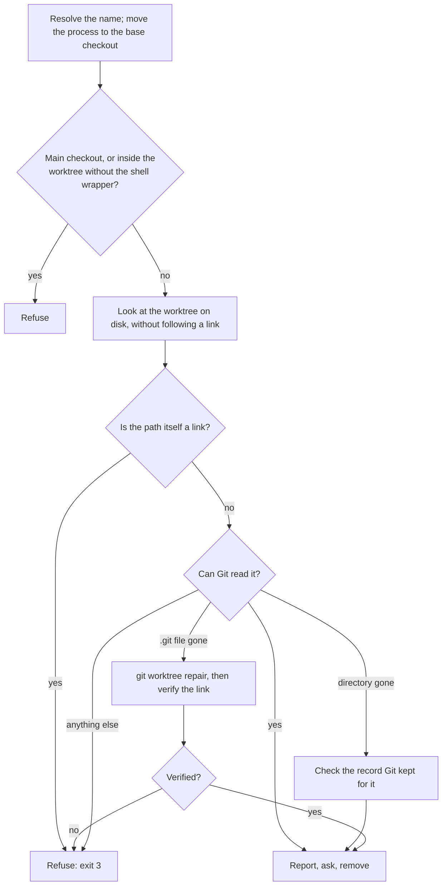

# `wt remove`

Removes a worktree, by branch or directory name, and its local branch when that branch's commits are safe elsewhere. Every decision comes from one question: **would removing this lose work?** If it would, `wt remove` asks first, or refuses when it can't ask.

```bash
wt remove feat/theme                  # by branch name
wt remove feat-theme                  # by directory name
wt remove feat/theme --force-worktree # discard uncommitted files without asking
wt remove feat/theme --force-branch   # delete the branch even if its commits exist nowhere else
wt remove feat/theme --force-remote   # also delete the branch on origin (and close its open PR)
```

Names resolve as in `wt go`: `base` is the main checkout, any other name matches a branch or a worktree directory, and a name matching more than one worktree is an error listing each one. The main checkout itself is never removed; use plain `git` for that.

## How a removal runs



Nothing is ever deleted before the report has been printed and every needed consent has been given.

### The report

Before asking or removing anything, `wt remove` prints what removal would affect:

```text
Removing worktree theme at /code/wts/repo/theme

Uncommitted files (1):
└── notes.txt

Branch feat/theme
- Safe: its commits are on main
- 0 ahead, 0 behind main
```

- **The worktree's files**: uncommitted files, and included ignored files (selected by `.worktreeinclude`; see the [README](../../README.md#included-ignored-files)) that are new, changed since `wt create` copied them, or impossible to compare. These need consent. Unchanged included copies and other ignored files (`target/`, `node_modules/`) do not.
- **The branch**, by where its last commit is found:

    | Tier | Where the commits are | What happens |
    |---|---|---|
    | Safe | on the default branch (local or `origin/<default>`), or the exact head of an open or merged PR from this repository | deleted |
    | Pretty safe | on another local branch, a tag, or an `origin/*` branch whose live head `wt` checked with `git ls-remote` | deleted; the report says where the commits still live |
    | Not safe | nowhere else, or it could not be checked | an interactive run lists the commits and offers "keep" (default) or "delete"; a non-interactive run keeps it with a warning and still exits 0 |

    The tier, and any consent to delete, applies to the commit the report showed. Immediately before `git branch -D`, the branch must still point there. If a commit landed on it in the meantime, that commit was never assessed: the branch is kept and `wt remove` exits 1 after removing the worktree (`branch feat/theme moved from <old> to <new> after it was checked, so it was kept`).

- **The branch on origin**, its PR, and ahead/behind counts against the default branch.

### Consent and the force flags

An interactive run (stdin and stderr are terminals, `CI` unset or empty) asks each question, default No. A non-interactive run can't ask, so it needs a flag or it refuses with exit 3:

| Flag | Allows |
|---|---|
| `--force-worktree` | discarding the uncommitted and protected included files listed in the report |
| `--force-branch` | deleting a Not-safe branch (`git branch -D`) |
| `--force-remote` | deleting the branch on origin, under a lease on the head the report showed, and closing its open PR |

The flags only stand in for answers to questions the report asked, so they approve discarding exactly what the report listed. If the files or staged changes differ when removal is about to run (something was edited or staged while the question was open), `wt remove` refuses with exit 3 and asks you to run it again. **No flag lets `wt remove` delete a directory whose files it could not check.** A worktree Git can't read, a failed `git status`, or an unreadable file refuses whatever flags are given.

`--force-branch` without `--force-worktree` on a worktree that has files is a conflict (exit 3 when non-interactive), because the branch can't go before the worktree.

With `--force-remote`, the branch on origin is deleted through origin's push URL. An origin with several push URLs, or one Git would rewrite (`url.<base>.insteadOf` / `pushInsteadOf`) or read as the name of another remote, is refused before anything is removed. If origin can't be reached, the local removal still happens and `wt` exits 1 with the `git push origin --delete <branch>` that finishes the job.

### Standing in the worktree you remove

A program can't move its parent shell, so removing the worktree your shell is in needs the shell wrapper (`wt --completions <shell>`; see the [README](../../README.md#shell-integration)). Without it `wt remove` refuses with exit 4 and nothing changes.

With the wrapper, removal happens in two runs:

1. The first run reports and asks everything, records what you approved, then moves your shell to the fork parent's worktree (or the base checkout), keeping your subdirectory when it exists there.
2. The wrapper runs `wt remove --handoff <token>` from there, which checks again and removes.

The second run deletes nothing when anything approved has changed in between: protected files, the include rules, the copy record, the branch tip, the worktree's `.git` link (where it leads, or whether Git can still read it), the worktree's path (a link now standing [in its place](#a-link-in-place-of-the-worktree)), or the branch on origin. It also refuses when the handoff is more than a minute old. A changed state is exit 3; a file it can't read, a shell still inside the worktree, or an expired or unknown handoff is exit 4. The second run never repairs anything. It asks the network only for what the approvals still need: a branch approved because a PR or an `origin/*` copy held its commits is checked live again.

On Windows a worktree folder another program holds (a terminal tab opened in it, an open file) is detected before anything is deleted and refused with exit 4.

## Worktrees Git can't read

A linked worktree can lose its connection to the repository while Git still records it. `git worktree list --porcelain` then marks the entry `prunable`, and `wt list` shows it as `✕` (see [`wt list`](list.md#worktrees-git-cant-read)). `wt remove` looks at the recorded path on disk and handles three cases differently. "Gone" always means the operating system answered "not found"; a permission or I/O error is never read as absence.

### The directory is gone

Only Git's record of the worktree is left. That record still holds the worktree's own **index**, which can contain staged changes that were never committed, so `wt remove` compares it with the worktree's last commit before removing anything:

```text
Removing worktree staged at /code/wts/repo/staged

Its directory is already gone, but the index Git kept for it holds staged changes that removing its record discards (1):
└── a.txt
```

- An index that matches the last commit needs no consent: `Its directory is already gone. The index Git kept for it matches its last commit, so removing its record loses no staged changes.`
- Staged changes need the ordinary consent: a question in an interactive run, `--force-worktree` otherwise.
- An index that is missing or can't be read refuses (exit 3) with any flags, because staged work can't be ruled out.

The branch is then judged exactly as for any other worktree. Removal runs `git -C <base> worktree remove <path>` for this one record only, never `git worktree prune` and never `--force`. Git does not protect that index once the directory is gone, so immediately before, `wt remove` checks that everything the report and your consent rested on still holds:

- Git still lists the same worktree at the path, under the same record;
- the branch tip (or the recorded HEAD when detached) is still the commit the index was compared with;
- nothing has appeared at the path;
- the index still holds exactly the bytes that were checked, and Git still reads the same entries from it.

The second half matters for a **split index** (`git update-index --split-index`, or `core.splitIndex`). There, `index` holds only recent changes and points at a `sharedindex.<id>` file beside it that holds the rest of the entries, so the `index` bytes alone can stay the same while what it stages changes. `wt remove` asks Git to list every entry, with their flags, at the check and again just before removal. A shared file that has been changed, removed, emptied, extended, or replaced by a directory since the check refuses (exit 3) with any flags, because Git can no longer read the index that was reported:

```text
Nothing was removed. The record of worktree gone was not removed: its index at /code/repo/.git/worktrees/gone/index can't be inspected: failed to execute git command: fatal: /code/repo/.git/worktrees/gone/sharedindex.39d8…: index file smaller than expected.
  Run wt remove again to start over.
```

If any of these changed, or can't be read, it refuses with exit 3 and asks you to run it again, so the new state is reported and asked about. `--force-worktree` approves discarding the staged changes that were reported, never ones staged after the check:

```text
Nothing was removed. The record of worktree gone was not removed: its index at /code/repo/.git/worktrees/gone/index changed after it was checked.
  Run wt remove again to start over.
```

Branch steps run only after the record is gone:

```text
Removed the record of worktree gone (its directory at /code/wts/repo/gone was already gone)
Deleted branch feat/gone
```

There is no directory to stand in, so this never needs the two-run handoff.

### The directory is there but its `.git` file is gone

Git can't check the files without the link, so `wt remove` first runs `git -C <base> worktree repair <path>` and then **verifies** the result. It never trusts the repair's exit status: Git can exit 1 after a complete repair, so the status proves nothing either way. The link counts as restored only when all of these hold:

- the worktree's `.git` leads to the exact worktree record Git keeps for this path, in this repository;
- that record points back to the worktree's `.git`;
- Git sees the worktree itself as the top of the checkout, not an enclosing repository;
- a fresh `git worktree list` shows the same worktree, with the same branch or detached commit, no longer marked `prunable`;
- the path is still a real directory, not a link (every other check reads through a link, so only this one notices a checkout moved away and replaced by a link to it).

Then the ordinary report, consent, and handoff follow, exactly as for a healthy worktree:

```text
Restored the link for unlinked so its files could be checked.
  git worktree repair may also have restored other worktrees' links.

Removing worktree unlinked at /code/wts/repo/unlinked

Uncommitted files (1):
└── notes.txt
...
Nothing was removed. Worktree unlinked has uncommitted or protected included files (listed above), and there is no terminal to confirm discarding them.
  Add --force-worktree to discard them.
  The .git link restored for unlinked was left in place.
```

The repair happens **before** you are asked anything, because nothing can be asked about files that can't be checked. It is not undone if you then decline, or if a later check refuses; those messages say the restored link was left in place. Run from the base checkout, `git worktree repair` also restores the links of **other** worktrees whose `.git` is missing or broken, which is why the success line says so. It never deletes anything.

When the link can't be verified, nothing is removed, whatever the flags (exit 3):

```text
Can't remove ro: its .git file was missing and Git couldn't restore a verified link.
No working files, branches, or worktree records were removed. The repair attempt may have changed Git metadata for this or other worktrees.
From the base checkout, inspect the repair result with git worktree list --porcelain and try git worktree repair /code/wts/repo/ro, then retry wt remove feat/ro.
  Not verified: Git's worktree list still marks it prunable
  Repair output: fatal: could not open '/code/wts/repo/ro/.git' for writing: Permission denied
```

Each `Not verified:` line names a condition above that failed, and each `Repair output:` line is what Git printed (or why it could not run). Before running the repair at all, `wt remove` requires exactly one of Git's worktree records to point at this path; when none does, more than one does, or one can't be read, it refuses without attempting a repair.

### Anything else

Everything else Git can't read refuses with exit 3 and says what was found, with Git's own reason when it gave one:

- a file, or a link, where the worktree directory was (a link is never followed: it may have replaced the original checkout);
- a path or `.git` that can't be inspected;
- a `.git` that exists but Git can't use.

```text
Can't remove file: Git can't read this worktree: /code/wts/repo/file is not a directory; Git reports: gitdir file points to non-existent location.
No working files, branches, or worktree records were removed. wt remove deletes a directory only after checking its files, and no --force flag changes that.
  Restore or move what is at /code/wts/repo/file, then retry wt remove feat/file.
```

Two cases are not marked `prunable` by Git and so look healthy until `wt remove` tries to check the files. Both stop with exit 1, the worktree's name and path, and Git's message, and remove nothing:

- a **locked** worktree whose directory is gone (`git worktree lock`). Unlock it with `git worktree unlock <path>` and run `wt remove` again;
- a `.git` file that holds something Git can't use:

    ```text
    Error: failed to execute git command: could not check the files of worktree b2 at /code/wts/repo/b2: fatal: gitfile does not point to a valid repository: /code/wts/repo/b2/.git
    ```

**Run `wt remove` from outside a worktree whose `.git` is gone.** From a shell standing inside it, `wt` can't find the repository (the directory is no longer connected to it) and stops with Git's `fatal: not a git repository` before it can repair anything. The one exception is a worktree nested inside another checkout of the same repository. From any other directory the removal works as described above.

## A link in place of the worktree

A worktree directory can be moved away and replaced by a link to its new location. Git reads the checkout through the link and does **not** mark it `prunable`, yet `git worktree remove` would delete the files the link leads to and then fail on the link itself. So `wt remove` looks at the recorded path without following it, whatever Git reports, and refuses with exit 3 when the path itself is a symbolic link or, on Windows, any reparse point (a junction included). No flag changes that:

```text
Can't remove feat-x: /code/wts/repo/feat-x is a link, which may have replaced the original checkout.
No working files, branches, or worktree records were removed. wt remove deletes a directory only after checking its files, and no --force flag changes that.
  Restore or move what is at /code/wts/repo/feat-x, then retry wt remove feat-x.
```

The path is checked before anything else, again after a [repair](#the-directory-is-there-but-its-git-file-is-gone), in both runs of a [handoff](#how-a-removal-runs), and once more immediately before the directory is deleted, so a link that appears while a question is open is still caught. Only the worktree's own path counts: a link among its parent directories, such as macOS's `/tmp` → `/private/tmp`, is just another spelling of the same place and is removed as usual. To remove such a worktree, put the real directory back at the recorded path, or remove the link and let `wt remove` treat the directory as gone.

`wt list` shows the row as `✕` with the note `<name>: <path> is a link, which may have replaced the original checkout.` (see [`wt list`](list.md#worktrees-git-cant-read)).

## Exit codes

| Code | Meaning |
|---|---|
| 0 | Done, including a question you declined or cancelled |
| 1 | Something failed. Git failures name the worktree, its path, and what was being done (`could not check the files of worktree …`). When a later step fails, the message says what was already removed (`removed worktree X, but could not delete branch B`) |
| 2 | Invalid arguments |
| 3 | Refused, to avoid losing work. **No working files, branches, or worktree records were removed**, but a repair attempt may have changed Git's link metadata, and the message says so when it might have |
| 4 | Blocked by the environment (no shell wrapper, a folder in use on Windows, an expired handoff); nothing was removed, and no flag helps |

Exit 3 means "nothing removed", not "nothing changed": `wt remove` never prints "nothing was changed" after a repair attempt.
