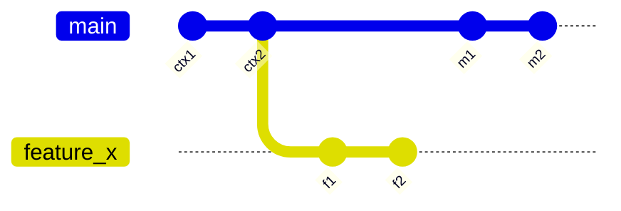
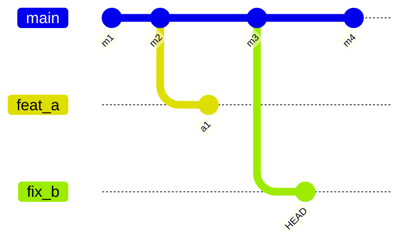

---
blast_radius:
  - sniff/cli/src/args.rs
  - sniff/cli/src/commands.rs
  - sniff/cli/src/output/filesystem.rs
  - sniff/cli/src/output/commit_blocks.rs
  - sniff/lib/src/filesystem/git/mod.rs
  - sniff/lib/src/filesystem/git/types.rs
  - sniff/lib/src/filesystem/git/detection.rs
  - sniff/docs/cli/repo_git-status.md
  - sniff/cli/README.md
reference:
  - worktree/cli/src/commands/list.rs
  - worktree/cli/src/commands/git_graph.rs
  - worktree/docs/cli/list.md
---

# Git Graph Specification For `sniff`

## Summary

Bring the inline git graph view from `worktree` into `sniff`, centered on `sniff repo git-status`, while keeping `sniff`'s current library/CLI split intact:

- `sniff` library owns graph discovery and graph-model construction
- `sniff` CLI owns terminal rendering, width policy, and verbose text formatting
- JSON output remains unchanged in v1
- the feature is worktree-aware, but it should also render a focused branch graph when the current checkout is a non-default branch

The end result should feel like `worktree`'s graph view, but implemented with `sniff`'s existing `git2`-based repository primitives rather than shelling out to `git`.

## Goals

- Show branch topology visually inside `sniff repo git-status`.
- Preserve the two current `worktree` viewing modes:
  - focused branch view when the current checkout is a non-default branch
  - base overview when the current checkout is the default branch
- Reuse existing `sniff` git data where possible:
  - current branch
  - worktrees
  - ahead/behind
  - refs
  - recent commit metadata
- Keep graph generation opt-in at the library layer and cheap at runtime.
- Avoid changing `GitInfo` JSON shape or `GitRequest` defaults in v1.

## Non-Goals

- Do not attempt to render the full real git DAG.
- Do not add graph output to `recent-commits`, `source-code-changes`, or JSON mode in v1.
- Do not make graph depth user-configurable beyond width in v1.
- Do not add network calls.
- Do not shell out to the `git` binary from `sniff`.

## Reference Behavior From `worktree`

The feature being ported has these current user-facing semantics:

- Graph appears under the worktree list in `wt list`.
- Graph is rendered as a Mermaid `gitGraph` image through `biscuit-terminal`.
- When on a feature branch:
  - include up to 2 context commits ending at the merge-base
  - include up to 5 commits on the feature branch since divergence
  - include up to 5 commits on the default branch since divergence
- When on the default branch:
  - include up to 10 recent commits on the default branch
  - show each active worktree branch forking from its divergence point
  - include up to 10 commits per worktree branch
- If a branch has no commits after divergence, emit a placeholder `HEAD` commit so the fork is still visible.
- Suppress auto-rendering when the terminal is narrower than 80 columns.
- Default width is chosen from commit-count thresholds.
- Verbose mode on a feature branch prints:
  - the merge-base commit on the default branch
  - all commits on the current branch since the branch point

## Product Behavior In `sniff`

### Primary Entry Point

The feature lives in:

```bash
sniff repo git-status
```

### Section Placement

The text output order becomes:

1. `Status`
2. `Worktrees` when applicable
3. `Git Graph` when applicable
4. `Meta`

This keeps the graph adjacent to worktree status without interrupting the existing commit/file summary at the top.

### When The Graph Is Available

Graph generation is eligible only when all of the following are true:

- the command is `sniff repo git-status`
- output is text, not `--json`
- the output is not scoped with `--package`
- HEAD is attached to a local branch
- a default branch can be resolved
- a merge-base or default-branch history exists for the chosen scenario

Additional auto-render checks are applied by the CLI renderer:

- stdout is a TTY
- inline image support is available
- terminal width is at least 80 columns

### Scenario Selection

Use exactly one scenario:

| Scenario | Condition | Output |
|----------|-----------|--------|
| Focused branch | current branch exists and is not the default branch | 2-branch graph: current branch vs default branch |
| Base overview | current branch is the default branch and there is at least one linked worktree branch | default-branch graph with all active worktree branches |
| No graph | detached HEAD, no default branch, no worktree branches in base overview, or scoped output | omit graph |

### Interaction With Existing Flags

| Flag | Behavior |
|------|----------|
| `--json` | Graph is never rendered. No JSON shape changes in v1. |
| `--plain` | Styled text is stripped as today. Graph behavior is unchanged. |
| `-v` | Adds verbose graph detail for the focused-branch scenario. |
| `-vv` | No extra graph behavior beyond `-v` in v1. |
| `--history <N>` | Continues to affect the Status section only. It does not change graph depth. |
| `--refresh-remotes` | No graph-specific behavior. Graph is entirely local. |
| `--package <PKG>` | Suppress the graph. The graph is repository-topology output and should not appear in path-scoped mode. |

### New CLI Flags

Add these flags to `repo git-status`:

```bash
sniff repo git-status [--graph] [--no-graph] [--graph-width <WIDTH>]
```

Definitions:

- `--graph`
  - force graph emission
  - if inline image rendering is unavailable, fall back to a fenced Mermaid code block
- `--no-graph`
  - suppress graph generation and rendering entirely
- `--graph-width <WIDTH>`
  - width override using the same syntax as `worktree`
  - accepted forms: `70`, `70ch`, `50%`

Clap rules:

- `--graph` conflicts with `--no-graph`
- `--graph-width` requires that graph rendering is not disabled
- `--graph-width` is ignored in `--json`

Default behavior:

- if neither `--graph` nor `--no-graph` is passed, run in auto mode
- auto mode renders inline only when terminal/image checks pass
- auto mode skips silently otherwise

## Rendering Rules

### Graph Section Heading

When a graph is emitted in text mode, print a heading:

```txt
Git Graph
```

Use the same heading style as `Status`, `Worktrees`, and `Meta`.

### Width Policy

Reuse the current `worktree` width heuristic:

| Commits In Diagram | Width |
|--------------------|-------|
| 1-4 | `60ch` |
| 5-8 | `80ch` |
| 9-15 | `120ch` if terminal width is greater than 120, otherwise `100%` |
| 16+ | `160ch` if terminal width is at least 160, otherwise `100%` |

Implementation notes:

- width parsing should use `biscuit_terminal::components::terminal_image::parse_width_spec`
- default rendering target in `sniff` is stdout, so the normal `Terminal::default()` path is fine
- unlike `worktree`, no stderr-based image-detection workaround is needed

### Inline Image vs Fallback

Rendering behavior by mode:

| Mode | Image support available | Result |
|------|--------------------------|--------|
| auto | yes | inline Mermaid image |
| auto | no | omit graph silently |
| forced (`--graph`) | yes | inline Mermaid image |
| forced (`--graph`) | no | fenced Mermaid code block |

The fallback code block format is:

````markdown

````

### Verbose Detail

At `-v`, and only for the focused-branch scenario, print a text detail block under the graph:

- first section for the default branch containing the merge-base commit
- second section for the current branch containing all commits since the branch point, oldest first

Formatting should match `sniff`'s existing commit language:

- parse conventional commits with `ConventionalCommit::parse`
- use local time
- use `Today`, `Yesterday`, or `YYYY-MM-DD`
- show refs when available

This detail is supplementary. The graph remains the primary artifact.

## Library Design

### New Module

Add a new library module:

```txt
sniff/lib/src/filesystem/git/graph.rs
```

Export it from:

```txt
sniff/lib/src/filesystem/git/mod.rs
```

### Public API

Expose an opt-in API instead of mutating `GitInfo`:

```rust
pub struct GitGraphRequest {
    pub focused_context_commits: usize,
    pub focused_branch_commits: usize,
    pub focused_default_commits: usize,
    pub overview_default_commits: usize,
    pub overview_branch_commits: usize,
}

impl Default for GitGraphRequest { ... }

pub enum GitGraphKind {
    FocusedBranch,
    BaseOverview,
}

pub struct GitGraph {
    pub kind: GitGraphKind,
    pub default_branch: String,
    pub current_branch: Option<String>,
    pub commit_count: usize,
    pub mermaid: String,
    pub merge_base: Option<GitGraphCommit>,
    pub default_branch_commits: Vec<GitGraphCommit>,
    pub branches: Vec<GitGraphBranch>,
}

pub struct GitGraphBranch {
    pub name: String,
    pub mermaid_id: String,
    pub anchor_index: usize,
    pub commits: Vec<GitGraphCommit>,
    pub placeholder_head: bool,
}

pub struct GitGraphCommit {
    pub sha: String,
    pub short_sha: String,
    pub message: String,
    pub timestamp: chrono::DateTime<chrono::Utc>,
    pub refs: Vec<RefDecoration>,
}

impl GitRepo {
    pub fn git_graph(&self, request: &GitGraphRequest) -> Result<Option<GitGraph>>;
}
```

### Why A Separate API

- avoids changing `GitInfo` JSON
- avoids extra work during normal `detect_git_with_request`
- keeps graph generation explicit for library callers
- allows the CLI to request graph data only when it will actually be rendered

### Data Reuse And Refactoring

The graph builder should reuse existing `sniff` git machinery where possible.

Recommended refactors:

- factor default-branch resolution into a shared helper used by both:
  - worktree detection
  - graph construction
- factor commit-decoration collection into a reusable helper so graph commits can include refs without duplicating logic
- keep `GitGraphCommit` aligned with `CommitInfo`, but do not force all graph callers through `GitInfo.recent`

### Technical Rules

#### Repository Handle Selection

When inside a linked worktree:

- open the base repository from `repo.commondir().parent()`
- perform worktree enumeration and base-overview graph construction against the base repository
- resolve the current worktree branch from the current repository handle

This avoids ambiguity about which repository can enumerate sibling worktrees.

#### Default Branch Resolution

Use the same policy as existing worktree detection:

1. current HEAD branch of the base repository
2. `main`
3. `master`

If none resolve to a valid local branch tip, graph generation returns `Ok(None)`.

#### Commit Traversal Semantics

The graph must be intentionally simplified for Mermaid:

- use first-parent traversal for all branch segments
- do not attempt to render merged side branches
- cap all traversals strictly according to the request

This is a deliberate simplification and should be documented as such.

#### Commit Identity

Use libgit2 short IDs, not string slicing, to generate abbreviated SHAs:

- preferred: `Object::short_id()`
- fallback: first 7 hex characters of the full SHA if short-ID generation fails

#### Mermaid-Safe Branch Names

Do not emit raw git branch names directly as Mermaid branch identifiers.

Instead:

- generate a Mermaid-safe identifier for each branch
- allow only `[A-Za-z0-9_]`
- replace every other character with `_`
- collapse repeated `_`
- prefix with `b_` when the first character is numeric
- add numeric suffixes on collision

The displayed worktree lines continue to show the real branch names. The Mermaid branch label may be sanitized.

### Graph Construction Algorithms

#### Focused Branch Graph

This scenario applies when the current branch is not the default branch.

Inputs:

- current branch tip
- default branch tip
- merge-base of the two

Algorithm:

1. Resolve `current_branch`.
2. Resolve `default_branch`.
3. Resolve both tips to OIDs.
4. Compute `merge_base`.
5. Collect up to `focused_context_commits` commits ending at the merge-base, oldest first, on the default branch first-parent chain.
6. Collect up to `focused_branch_commits` commits reachable from the current branch tip back to but excluding the merge-base, oldest first.
7. Collect up to `focused_default_commits` commits reachable from the default branch tip back to but excluding the merge-base, oldest first.
8. Emit Mermaid in this shape:



9. If the current branch has zero commits after divergence, emit:

```mermaid
commit id: "HEAD"
```

after the feature-branch checkout so the fork is visible.

#### Base Overview Graph

This scenario applies when the current branch is the default branch and linked worktrees exist.

Inputs:

- default branch tip
- linked worktree branch tips from `repo.worktrees()`

Algorithm:

1. Collect up to `overview_default_commits` commits on the default branch first-parent chain, oldest first.
2. For each linked worktree branch:
   - resolve its tip
   - compute merge-base with the default branch tip
   - collect up to `overview_branch_commits` commits after the merge-base, oldest first
   - if no commits exist after divergence, mark `placeholder_head = true`
3. Find the merge-base position inside the displayed default-branch window.
4. If the merge-base is outside the displayed window, anchor the branch at index `0`.
5. Sort branches by:
   - `anchor_index`
   - branch name, ascending
6. Emit Mermaid by iterating the mainline commits and inserting any branches whose `anchor_index` matches the current commit index.

Target shape:



## Edge Cases

Handle these explicitly:

- detached HEAD: return `None`
- branch ref exists but tip cannot be resolved: skip that branch
- merge-base cannot be found: return `None` for focused mode, skip branch in base overview
- no linked worktrees on default branch: return `None`
- merge-base older than the displayed mainline window: anchor at the first displayed mainline commit
- branch with zero post-divergence commits: emit `HEAD` placeholder
- deleted or pruned worktree directory: skip that worktree silently
- invalid Mermaid width spec: ignore and fall back to automatic width

## CLI Integration

### New Output Module

Add:

```txt
sniff/cli/src/output/git_graph.rs
```

Responsibilities:

- decide render mode: auto, forced, suppressed
- choose width
- render inline Mermaid image or fenced code block
- render verbose commit detail

Keep Mermaid and terminal-image code out of the library.

### Changes To `render_git_section`

After the existing Worktrees section, call a new helper:

```rust
maybe_render_git_graph(...)
```

Inputs should include:

- `GitInfo`
- `GitRepo`
- graph flags
- verbosity level
- `Terminal`

Do not build the graph inside `render_git_section` when graph rendering is known to be suppressed.

### Commit Detail Formatting

Do not duplicate formatting policy again inside `filesystem.rs`.

Either:

- move shared commit-time formatting into a common CLI helper, or
- create a graph-specific formatter that reuses:
  - `ConventionalCommit::parse`
  - existing relative-day policy from `commit_blocks.rs`

The important requirement is that graph detail and commit-centric output should not drift stylistically.

## Performance Requirements

- No subprocess calls.
- No network calls.
- No full-history traversal.
- All revwalks must stop as soon as the requested cap is reached.
- Graph generation should happen only when the CLI intends to use it.

Expected costs:

- focused view: one merge-base query and at most 12 commit loads
- base overview: one default-branch walk plus one merge-base query and one short walk per worktree branch

This is acceptable relative to current `repo git-status` work.

## Test Plan

### Library Unit Tests

Add tests for:

- default-branch resolution fallback order
- Mermaid branch-name sanitization
- collision handling for sanitized branch IDs
- focused-branch graph generation
- base-overview graph generation
- empty post-divergence branch emits `HEAD`
- out-of-window merge-base anchors at index `0`
- detached HEAD returns `None`

### Library Integration Tests

Build temporary repositories that cover:

- base repo with two linked worktrees
- current checkout inside a linked worktree
- merge-base older than current display window
- branch with merge commit in history

Assertions should verify the emitted Mermaid instruction string, not rendered terminal bytes.

### CLI Tests

Add coverage for:

- `sniff repo git-status --graph`
- `sniff repo git-status --no-graph`
- `sniff repo git-status --graph-width 120`
- `sniff repo git-status --graph --plain`
- `sniff --json repo git-status --graph` does not emit graph text
- `sniff repo git-status --package sniff --graph` suppresses graph
- `sniff repo git-status -v --graph` includes verbose graph detail in focused mode

## Documentation Updates Required At Implementation Time

Update these docs when the feature lands:

- `sniff/docs/cli/repo_git-status.md`
- `sniff/docs/cli/repo.md`
- `sniff/cli/README.md`
- `sniff/lib/README.md` if the new public graph API is exported

## Implementation Checklist

1. Add `sniff::filesystem::git::graph` with `GitRepo::git_graph`.
2. Factor or reuse default-branch and ref-decoration helpers.
3. Add CLI flags to `repo git-status`.
4. Add CLI graph renderer and width policy.
5. Insert graph rendering between Worktrees and Meta.
6. Add verbose focused-branch detail.
7. Add unit, integration, and CLI tests.
8. Update docs.

## Decisions Locked By This Spec

- graph lives in `repo git-status`, not in JSON
- library builds graph data, CLI renders it
- graph is suppressed for `--package`-scoped output
- graph uses first-parent simplification
- Mermaid branch IDs are sanitized
- `--graph` forces output and falls back to fenced Mermaid when inline images are unavailable
