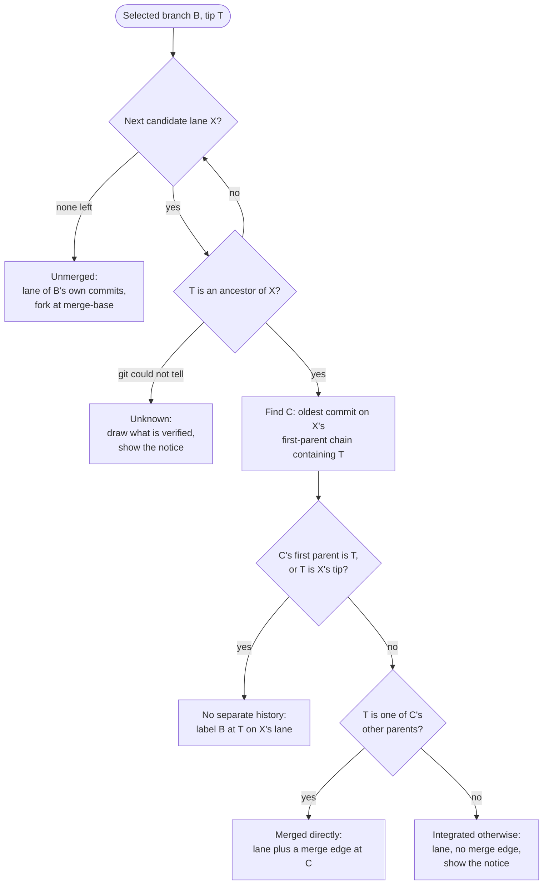

# The `wt list` Graph

On a terminal that shows inline images, `wt list` draws the branch topology below its table. The worktree CLI gathers the git facts. biscuit-terminal's [`GitGraph`](../../biscuit-terminal/docs/components/git_graph.md) component turns them into a Mermaid `gitGraph`, fits it to the terminal, and renders it. The CLI builds no Mermaid text and picks no width of its own.

In short, the graph:

- draws every lane as its tip's **first-parent** history, so a merged branch's commits never appear as the default branch's;
- gives a merged branch its own lane with a **merge edge** at the actual merge commit;
- draws forks and merges only at **verified** commits, however old, and folds the history between them into `+N` squares;
- never moves a label or a fork to a different commit. When it cannot show something, it says **"Some history is not shown"** instead.

## Who does what

| Piece | Owner | Code |
|---|---|---|
| Which branches to draw; how each was integrated; each lane's first-parent commits with its fork, merge, and label commits; ref tips; creation and activity times | worktree CLI | [`git_graph.rs`](../cli/src/commands/git_graph.rs) (`gather`, `GraphFacts`), [`git_graph/topology.rs`](../cli/src/commands/git_graph/topology.rs) |
| Open PRs (the same list the table's badges use) | worktree library | [`pull_requests.rs`](../lib/src/pull_requests.rs) |
| Lanes versus tags, lane order, merge statements, `+N` squares, unique commit IDs, the incomplete-history notice | `GitGraph` | `biscuit-terminal/lib/src/components/git_graph.rs` |
| Scale, width cap, trimming, height cap, the "N more worktrees not shown" note | `GitGraph` | `GitGraph::plan` |
| A merge's second parent, spacing commits so tags never overlap | `biscuit-visualized` | [Mermaid gitGraph corrections](../../biscuit-visualized/docs/mermaid-gitgraph.md) |

`GitGraph` runs no git commands, and `git_graph.rs` makes no layout decisions.

## When the graph is drawn

- Only when stderr is a terminal and `TERM_PROGRAM` (or `KITTY_WINDOW_ID`) names an image-capable terminal.
- Not for a detached current worktree.
- There is no minimum terminal width. `GitGraph` trims commits to fit and, only when even the fully trimmed graph is too wide, shrinks it.

Gathering starts on its own thread right after `parse_worktree_state`, in parallel with the table's status pass and the PR request. The `--perf` stages are `graph gather` and `graph image render (biscuit-terminal)`; their cost per scenario is in [performance-testing.md](./performance-testing.md#graph-stages).

## Which branches are drawn

Selection does not depend on whether a branch is merged.

### Focused view (a feature branch is checked out)

- The default branch and the current branch.
- The current branch's recorded parent (from its fork-origin record, written by `wt create`), when that is another existing local branch. The parent does not need a worktree. It gets a lane, and its tip is passed as a ref. This is one level only: the parent's own parent is not added.
- A recorded parent that no longer exists is ignored, and the current branch is measured against the default branch.

`wt list -v` reuses the focused view's `merge-base` with the default lane for its "forked from" commit, and lists every commit on the branch that neither default tip has (all parents, not only first parents).

### Base view (the default branch is checked out)

- The default branch and every worktree branch.
- A branch's recorded parent is used only when that parent is also drawn.
- When the graph is taller than half the terminal, `GitGraph` keeps the most recently active lanes (each line carries its tip's commit time) and prints "N more worktrees not shown". A lane is kept together with its parent's lane and the lanes holding its fork and merge commits. The focused view is never cut this way.

## The default lane

The default lane ends at the descendant of the local default branch and `origin/<default>` (one `merge-base` when both exist and differ). Both tips are passed as refs, so they appear as tags where they sit.

- `origin/<default>` ahead of the local branch (the PR-driven case, and what `wt list`'s own fetch produces): the lane ends at `origin/<default>`. After merges made on origin, the local tip is on that lane's first-parent chain, so it keeps its tag even when the gap is folded into a `+N` square. A local tip reachable only through a merge's second parent is not drawn, and the notice says so.
- Local ahead (the Gitflow case): the same, the other way round.
- Diverged: the default lane is the local branch, and `origin/<default>` gets a lane of its own from their fork point. That is the only case where it gets a lane.

The lane is **first-parent** history: `git log --first-parent`. A plain `git log` walks into a merge's second parent and would show the merged branch's commits as the default branch's. In the base view that could fill the whole window with one merged branch.

## How each branch is classified

Each selected branch `B` with tip `T` is compared against the lanes that could contain it, in this order:

1. its recorded parent's lane, when that parent is drawn;
2. the default lane;
3. the diverged `origin/<default>` lane, when there is one.

The first lane whose tip contains `T` (`merge-base --is-ancestor`) decides. On that lane's first-parent chain, `C` is the oldest commit that descends from `T`. It is found as the leading run of `rev-list --first-parent --parents T..X` whose commits are also in `rev-list --ancestry-path T..X`.


```mermaid
flowchart TD
    start([Selected branch B, tip T]) --> next{Next candidate lane X?}
    next -- none left --> unmerged[Unmerged:<br/>lane of B's own commits,<br/>fork at merge-base]
    next -- yes --> contains{T is an ancestor of X?}
    contains -- no --> next
    contains -- git could not tell --> unknown[Unknown:<br/>draw what is verified,<br/>show the notice]
    contains -- yes --> findC[Find C: oldest commit on X's<br/>first-parent chain containing T]
    findC --> c1{C's first parent is T,<br/>or T is X's tip?}
    c1 -- yes --> label[No separate history:<br/>label B at T on X's lane]
    c1 -- no --> c2{T is one of C's<br/>other parents?}
    c2 -- yes --> merged[Merged directly:<br/>lane plus a merge edge at C]
    c2 -- no --> indirect[Integrated otherwise:<br/>lane, no merge edge,<br/>show the notice]
```

| Class | When | Drawn as |
|---|---|---|
| Unmerged | No candidate contains `T` | A lane of `T`'s first-parent commits that its fork lane lacks, forked at `merge-base(parent tip, else default lane tip, T)` |
| Merged directly | `T` is a non-first parent of `C` | A lane of `T`'s first-parent commits down to `C^1`, with a merge edge into `C` |
| No separate history | `T` is on `X`'s first-parent chain | A tag at `T` on `X`'s lane: no empty lane, no merge |
| Integrated otherwise | `T` reached `X` through another branch's merge | A lane like a merged one, with no merge edge, and the notice |
| Unknown | Git could not answer (see [Unavailable history](#unavailable-history)) | Whatever was verified, and the notice |

Tip equality is never used to classify. Two branches at the same commit can still differ: one may have been merged with a merge commit and the other created at that commit afterwards.

### Examples

**Merged directly.** `fix/wt-ux` was merged into `main` by pull request, and its worktree still exists:

```text
*   08cf96a (origin/main) Merge pull request #103 from fix/wt-ux
|\
| * 2a7298a (fix/wt-ux) close cycle 1
| * 7ba6ea8 record Phase 5 close
|/
* 3333333 (main)
```

`C` is `08cf96a` and `T` (`2a7298a`) is its second parent. `fix/wt-ux` gets a lane of `7ba6ea8` and `2a7298a` from `3333333`, with a merge edge into `08cf96a`. The default lane is `3333333 → 08cf96a`, with `main` and `origin/main` as tags.

**The merge's fork, when the parent is another branch.** `fix/sniff` was forked from `fix/wt-ux` (its recorded parent) and merged into `main`. It is not in `fix/wt-ux`, so the default lane decides: merged directly at `origin/main`'s merge commit. Its fork is measured against its parent's tip, so its lane hangs from `fix/wt-ux`'s lane and merges into the default lane. When a branch is merged **into** its parent instead, the fork is measured against `C^1`. The parent's tip contains `T`, so a `merge-base` with it would return `T` itself.

**No separate history.** A branch fast-forwarded into `main`, or created at a commit already on `main` and never committed to, has its tip on `main`'s first-parent chain. It is a tag on that commit.

**Integrated otherwise.** `feat/a` was merged into `feat/b`, and `feat/b` into `main`. On `main`'s chain, `C` is `feat/b`'s merge, and `feat/a`'s tip is not one of its parents. `feat/a` keeps its lane and fork, but no merge edge is drawn, because the merge that brought it in is on no drawn lane.

**Continued after a merge.** A branch that got new commits after its merge is not contained in any lane, so it is unmerged. Its fork is its old merged tip, which is the merge's second parent and on no first-parent lane. The lane is drawn unconnected, with the notice. The earlier merge is not reconstructed.

## Forks, merges, and labels at verified commits

A lane's **anchors** are the commits other lanes need on it:

- the fork commits of the lanes that hang from it;
- the merge commits that lanes merged into it;
- the tips of branches labeled on it (no separate history);
- on the default lane, the local and `origin/<default>` tips.

Anchors are placed whatever their age. Only the ordinary windows are drawn in full: the 5 newest commits of a branch lane, and the default lane's 10 newest in the base view. An anchor outside the window is placed at its real distance from the lane tip (`rev-list --first-parent --count A..tip`). Every such position is checked in one `git log --no-walk=unsorted --ignore-missing tip~d…`. An anchor that is not found at its distance is not on that lane, and is never placed there anyway. The runs between drawn commits become `+N` squares with exact counts.

For example, a branch forked 5,000 first-parent commits back and merged 3,000 back still draws in a handful of commits: the default lane's newest, a `+N` square, the merge, another `+N` square, the fork, and the fork's first parent.

Gathering runs in two stages on scoped threads:

1. Every selected branch is classified in parallel.
2. Every branch lane, and a diverged `origin/<default>` lane, is built in parallel with the anchors expected on it. The default lane is built last and takes every anchor no branch lane placed. A child's fork can sit on its parent's lane or on the default lane below it, and only the parent lane's build can tell which.

The default lane is drawn down to its oldest anchor plus that anchor's first parent (from `%P`, no extra git call), so a merge is never its first commit. In the focused view that also ends the window: the default lane shows the connections and the commit before the oldest one, not ten commits.

## Nothing undrawn is substituted

`GitGraph` never moves something it cannot draw onto another commit:

- A lane whose fork commit is not drawn, or whose fork is unknown, is drawn **unconnected**, not hung from the start of another lane.
- A tag whose commit is not drawn is left out, and counted.
- A merge whose destination is not drawn, or would come before the merged lane's commits, is not drawn, and counted.
- A branch with no commits of its own is labeled at its own tip (`GraphLine::with_tip`), never at its fork commit.

Anything counted this way shows the dim notice **"Some history is not shown"** below the graph, after "N more worktrees not shown". Lanes the base view's height cap leaves out are counted by that note, not by the notice.

## Unavailable history

When local history cannot establish a connection, the graph draws what it verified and shows the notice. It never fetches and makes no network request of its own. The table is unaffected.

- Git's "no" (exit 1 from `merge-base --is-ancestor` or `merge-base`) is read through `worktree::git::git_command_allow_no_match`. It is trusted only when `rev-parse --is-shallow-repository` says `false`. Across a shallow boundary, "no" looks exactly like a real "no". So in a shallow clone every negative or empty answer is unknown, and every `+N` count is a lower bound.
- Any other failed git command, or an output line that does not parse, is also unknown. Errors are told apart by exit code, never by git's (possibly localized) messages.
- An unknown answer drops only the connection it was needed for. The whole graph is dropped only when the default lane itself cannot be read.
- Unknown is never read as "no separate history". A branch whose classification failed keeps its lane.

## PR tags

Each open PR from origin's own repository whose head is a drawn branch becomes a tag `PR #n → target` on that branch's tip. `GitGraph` matches PRs by branch name alone, so `GraphFacts::to_git_graph` filters them by source repository first (`PrListing::for_branch`). A fork's same-named branch never gets the tag.

## Sizing and `--width`

`GitGraph` draws at 125% scale: at 100%, the diagram's 16-unit body text is one terminal line tall. The width follows from the image's natural width and the terminal's cell size (8×16 when unknown), capped at the available columns. Past the cap, commits move into `+N` squares before anything shrinks. Lane tips, forks, merge destinations, and tagged commits are never folded.

Neighboring tags never overlap: `biscuit-visualized` spaces every commit by the widest tag plus one em. A graph with long labels is therefore wide, and on a narrow terminal it is trimmed and then shrunk rather than shortened. Labels are never abbreviated, moved, or combined.

`-w`/`--width` (`70`, `70ch`, `50%`) replaces the scale-derived width, and the graph is then never trimmed to fit it.

## Limits

- **No squash-merge inference.** A squash-merged branch shares no commits with the default branch. It stays an unmerged lane.
- **No reconstruction of earlier merges.** Only a branch's current relationship is drawn. A branch continued after a merge, or merged several times, shows its latest state (see [Examples](#examples)).
- **No edge for indirect integration.** A branch that reached its lane through another branch's merge has no merge edge of its own. It is drawn with its fork and the notice.
- One lane merged per commit: when two drawn lanes were merged by the same commit, only the first is drawn merging, and the notice appears.

## Tests

- [`git_graph/tests.rs`](../cli/src/commands/git_graph/tests.rs) (L1, real Git): the facts each view hands over, as exact full SHAs, for both observed merge situations. Also merged into a parent, fast-forward, equal tips, continued after a merge, indirect integration, old connections with exact `+N` counts, a shallow clone, a deleted parent, a merged lane under the height cap, and the classifier and anchor placement on their own. The shared `merge-base`, call counts, PR filtering, and the `--width` override are covered too.
- `gathered_graphs_lay_out_with_exact_merges_and_no_overlapping_tags` in the same file gathers real repositories, plans them at 120×40 and 56×60 with real measurement, and checks the layout the image is drawn from: no overlapping tags, every tag on its SHA's commit, exact merge parents, and no label shortened. `--width 40` is never trimmed.
- `cli/tests/list_remote_head.rs::a_shallow_clone_lists_with_the_incomplete_history_notice_and_asks_origin_nothing` runs `wt list` in a shallow clone. It shows the notice, the table stays, and the graph adds no request to origin.
- `GitGraph`'s own tests cover lanes and tags, merges, the no-substitution rule, trimming, and sizing (`biscuit-terminal/lib/src/components/git_graph/tests.rs`).
- `level2_list_verbose.rs` runs the image path in tmux, which cannot display it.
- `level2_graph_in_kitty.rs` checks the graph as Kitty draws it (macOS): in a short and a narrow window, the image's columns fit, its rows respect the half-height cap and match the rows `wt` reserves, the elision notice follows it, the table is intact, and a screenshot shows the image where it belongs. `level2_graph_draws_a_merged_branch_in_kitty` does the same for a merged branch and keeps each screenshot and transmitted PNG for inspection.
