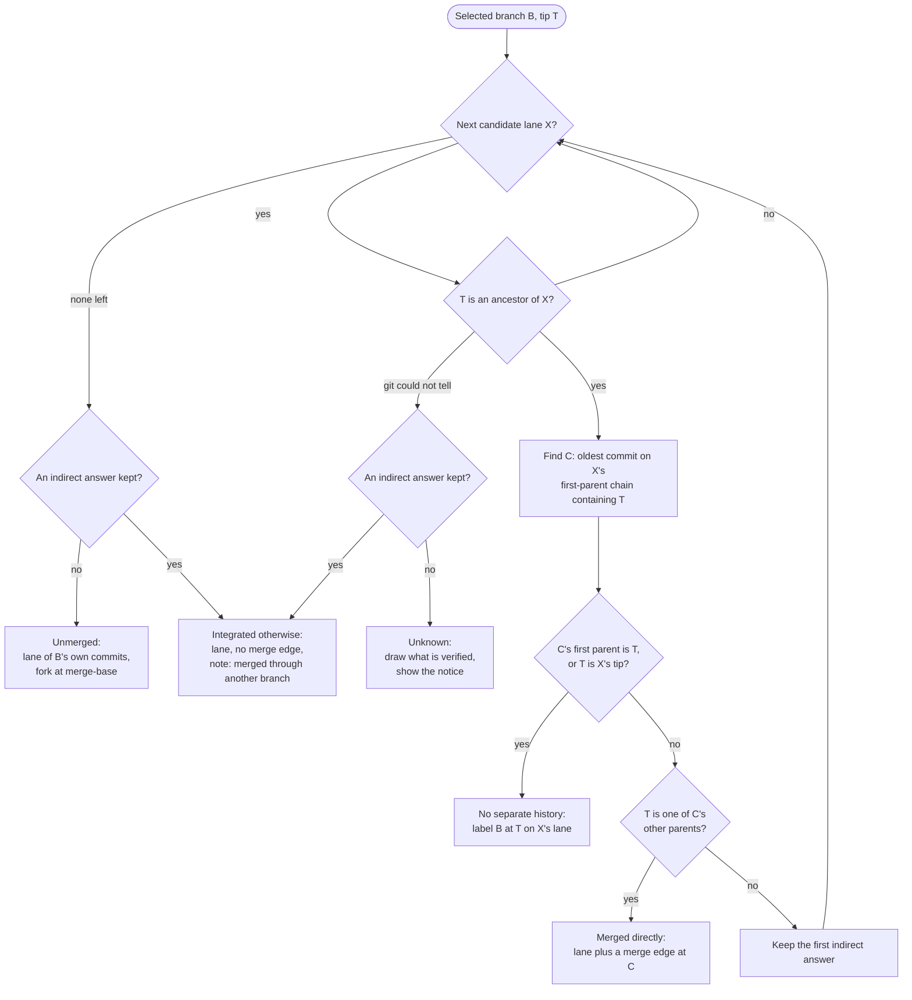
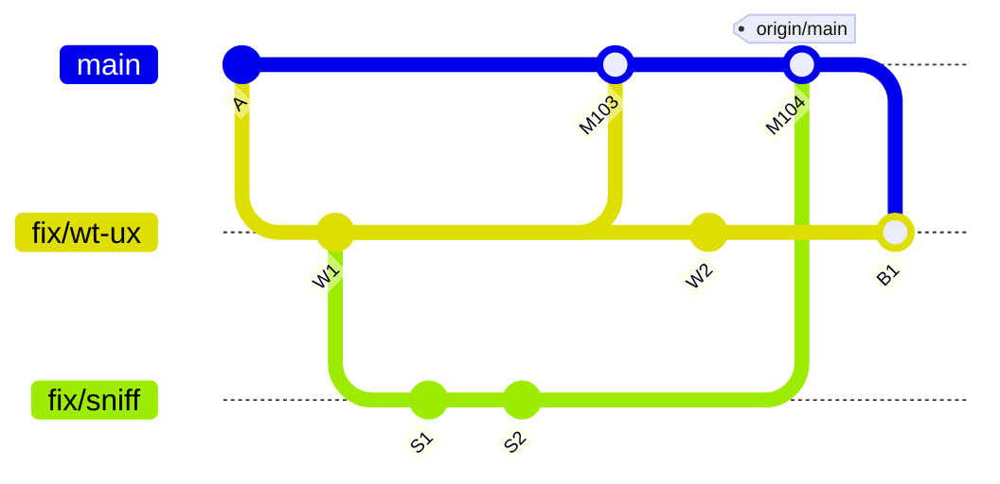
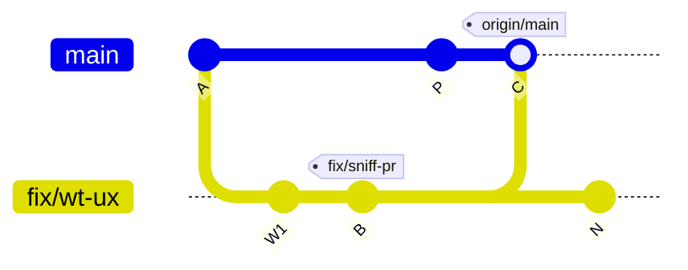

# The `wt list` Graph

On a terminal that shows inline images, `wt list` draws the branch topology below its table. The `worktree` library gathers the git facts. biscuit-terminal's [`GitGraph`](../../biscuit-terminal/docs/components/git_graph.md) component turns them into a Mermaid `gitGraph`, fits it to the terminal, and renders it. The CLI builds no Mermaid text and picks no width of its own.

In short, the graph:

- draws every lane as its tip's **first-parent** history, so a merged branch's commits never appear as the default branch's;
- gives a merged branch its own lane with a **merge edge** at the actual merge commit, including a branch that kept going after its merge, which stays one connected lane;
- draws forks and merges only at **verified** commits, however old, and folds the history between them into `+N` squares;
- never moves a label or a fork to a different commit. When it cannot show something, `wt list`'s closing notes say so instead: in a shallow clone, how to fetch the missing history; otherwise, that the graph left something out.
- names a branch whose work reached a lane only through another branch's merge (`feat/a's commits are all in main (merged through feat/b).`). That is complete history with no merge of its own to draw, so it is not reported as missing. When the branch's tip is drawn, it also gets an `in main` (or `in origin/main`) tag, so a tip that trails past the lane's merges doesn't read as unmerged.

## Who does what

| Piece | Owner | Code |
|---|---|---|
| Which branches to draw; how each was integrated; each lane's first-parent commits with its fork, merge, and label commits; ref tips; creation and activity times | worktree library | [`graph.rs`](../lib/src/graph.rs) (`gather`, `GraphFacts`), [`graph/topology.rs`](../lib/src/graph/topology.rs) |
| Converting the facts for `GitGraph`, PR tags, and `-v` commit lines | worktree CLI | [`git_graph.rs`](../cli/src/commands/git_graph.rs) (`to_git_graph`) |
| Open PRs (the same list the table's badges use) | worktree library | [`pull_requests.rs`](../lib/src/pull_requests.rs) |
| Lanes versus tags, lane order, merge statements, `+N` squares, unique commit IDs, the incomplete-history notice | `GitGraph` | `biscuit-terminal/lib/src/components/git_graph.rs` |
| Scale, width cap, trimming, height cap, the count of lanes left out | `GitGraph` | `GitGraph::plan` |
| Wording of what the graph left out, as closing notes | `wt list` | `render_notes` in [`list_table.rs`](../cli/src/commands/list_table.rs) |
| A merge's second parent, spacing commits so tags never overlap | `biscuit-visualized` | [Mermaid gitGraph corrections](../../biscuit-visualized/docs/mermaid-gitgraph.md) |

`GitGraph` runs no git commands, and neither `graph.rs` nor `git_graph.rs` makes layout decisions. The library has no terminal dependency: its facts are its own types (`GraphLine`, `LaneEntry`), which `to_git_graph` maps onto biscuit-terminal's.

## When the graph is drawn

- Only when stderr is a terminal and `TERM_PROGRAM` (or `KITTY_WINDOW_ID`) names an image-capable terminal.
- Not for a detached current worktree.
- There is no minimum terminal width. `GitGraph` trims commits to fit and, only when even the fully trimmed graph is too wide, shrinks it.

Gathering starts on its own thread right after `parse_worktree_state`, in parallel with the table's status pass and while `wt list` waits for `origin`. It works from the branch tips read before the wait, and every Git history query names the commit IDs captured in that read, never a branch name, so a ref that moves meanwhile cannot leak into the result. When the tips read after the wait (and after `--ff`) differ from the first read, or either read failed, the graph is gathered once more from the second read, so the graph, the table, and the caption always describe the same tips ([details](./cli/list.md#local-work-during-the-wait)). The `-v` history follows the same rule, and its commit labels come from that read too: `HEAD -> <current branch>`, local branches, and `origin/*` names (with `origin/HEAD` beside the tip it points at) are placed by the read's tips, in Git's own order, while tags and any other refs Git decorates are shown as Git reports them. In `--perf`, the graph's gathering is the `graph history` row (id `graph_history`), a child of the region that spans the wait, and again inside `regather` when it ran again. Its sequential sub-steps show their own durations and `git` counts: `shallow check`, `default-branch tips`, `focused merge base` (focused view), `verbose commit details` (with `-v`), and `assemble lanes and fork holders`, which is the whole lane-assembly loop, including a repeat after another fork holder is found; time between them is the row's `unattributed` remainder. `graph image render (biscuit-terminal)` (`graph_render`) is a top-level row. Their cost per scenario is in [performance-testing.md](./performance-testing.md#graph-stages), and the stage table in [Runtime `--perf` flag](./performance-testing.md#runtime---perf-flag).

## Which branches are drawn

Selection does not depend on whether a branch is merged.

### Focused view (a feature branch is checked out)

- The default branch and the current branch.
- The current branch's recorded parent (from its fork-origin record, written by `wt create`), when that is another existing local branch. The parent does not need a worktree. It gets a lane, and its tip is passed as a ref. The parent's own parent is not added for its own sake.
- A recorded parent that no longer exists is ignored, and the current branch is measured against the default branch.
- Any worktree branch whose own line (first-parent history) holds the fork commit of a drawn lane, when no drawn lane holds it. A lane's recorded parent is preferred, then branches in listing order; each added branch hangs from its own recorded parent when that is drawn, and the view is gathered again until every fork that some branch holds is drawn. Example: in `fix/path-spelling`'s view, its parent `fix/magic-globs` forked at `e23d0c2`, a commit on `feat/schema-enhancement`'s line that reached `main` only through that branch's merge. Without `feat/schema-enhancement`'s lane the fork has nowhere to be drawn (putting it on `main`'s lane would claim `main` had that commit on its own line), so the lane is added and `fix/magic-globs` hangs from `e23d0c2` on it.

`wt list -v` reuses the focused view's `merge-base` with the default lane for its "forked from" commit, and lists every commit on the branch that neither default tip has (all parents, not only first parents).

### Base view (the default branch is checked out)

- The default branch and every worktree branch.
- A branch's recorded parent is used only when that parent is also drawn.
- When the graph is taller than the rows `wt list` gives it (`GitGraph::with_max_rows`: whatever the rest of the listing leaves on screen, less four, at least 12; see `list_table::graph_row_budget`), `GitGraph` keeps the most recently active lanes (each line carries its tip's commit time, in whole seconds; lanes whose tips share a second count as equally recent, so one that doesn't fit gives way to the others before the graph stops adding lanes) and `wt list` notes "N worktrees aren't in the graph". A lane is kept together with its parent's lane and the lanes holding its fork and merge commits. The focused view is never cut this way.

## The default lane

The default lane ends at the descendant of the local default branch and `origin/<default>` (one `merge-base` when both exist and differ). Both tips are passed as refs, so they appear as tags where they sit.

- `origin/<default>` ahead of the local branch (the PR-driven case, and what `wt list`'s own fetch produces): the lane ends at `origin/<default>`. After merges made on origin, the local tip is on that lane's first-parent chain, so it keeps its tag even when the gap is folded into a `+N` square. A local tip reachable only through a merge's second parent is not drawn, and the notice says so.
- Local ahead (the Gitflow case): the same, the other way round.
- Diverged: the default lane is the local branch, and `origin/<default>` gets a lane of its own from their fork point. That is the only case where it gets a lane.

The lane is **first-parent** history: `git log --first-parent`. A plain `git log` walks into a merge's second parent and would show the merged branch's commits as the default branch's. In the base view that could fill the whole window with one merged branch.

## How each branch is classified

Each selected branch `B` with tip `T` is compared against the lanes that could contain it, in this order:

1. its recorded parent's lane, when that parent is drawn;
2. the default lane;
3. the diverged `origin/<default>` lane, when there is one.

When none of these merged `T` directly, the other drawn lanes are tried too (the branch's own parent excluded), and only a **direct** merge there counts: a commit on that lane whose second parent is `T`. So a branch merged into a child or a sibling, such as `feat/schema-enhancement` merged into `fix/path-spelling`, is drawn merging there. Its fork and its line stay what the three lanes above gave it; measuring the fork from the merging lane would hang the branch from it. A tip that is merely on another lane's line (a child forked there) is no merge. Merges of the default branch into a branch are not drawn: the default lane is not classified.

For each lane `X` whose tip contains `T` (`merge-base --is-ancestor`), `C` is the oldest commit on `X`'s first-parent chain that descends from `T`. It is found as the leading run of `rev-list --first-parent --parents T..X` whose commits are also in `rev-list --ancestry-path T..X`. What `C` says about `T` gives that lane's class.

The lanes are tried in order, but not every answer ends the search:

- **Merged directly** and **no separate history** are exact answers. The first lane that gives one decides.
- **Integrated otherwise** only says that `T` arrived by way of some other branch. The first such answer is kept, and the later lanes are still tried. A later lane that merged `T` directly, or has it on its first-parent chain, wins. The kept answer is used only when none does.
- A lane Git cannot answer for ends the search. Before any answer was kept, the branch is **unknown**. After one was kept, the kept answer stands: it already shows the notice, and no merge edge is guessed.


```mermaid
flowchart TD
    start([Selected branch B, tip T]) --> next{Next candidate lane X?}
    next -- none left --> kept1{An indirect answer kept?}
    kept1 -- no --> unmerged[Unmerged:<br/>lane of B's own commits,<br/>fork at merge-base]
    kept1 -- yes --> indirect[Integrated otherwise:<br/>lane, no merge edge,<br/>note: merged through another branch]
    next -- yes --> contains{T is an ancestor of X?}
    contains -- no --> next
    contains -- git could not tell --> kept2{An indirect answer kept?}
    kept2 -- no --> unknown[Unknown:<br/>draw what is verified,<br/>show the notice]
    kept2 -- yes --> indirect
    contains -- yes --> findC[Find C: oldest commit on X's<br/>first-parent chain containing T]
    findC --> c1{C's first parent is T,<br/>or T is X's tip?}
    c1 -- yes --> label[No separate history:<br/>label B at T on X's lane]
    c1 -- no --> c2{T is one of C's<br/>other parents?}
    c2 -- yes --> merged[Merged directly:<br/>lane plus a merge edge at C]
    c2 -- no --> keep[Keep the first indirect answer]
    keep --> next
```

| Class | When | Drawn as |
|---|---|---|
| Unmerged | No candidate contains `T` | A lane of `T`'s first-parent commits that its fork lane lacks, forked at `merge-base(parent tip, else default lane tip, T)` |
| Merged directly | `T` is a non-first parent of `C`, on the first lane that gives a merged-directly or no-separate-history answer | A lane of `T`'s first-parent commits down to `C^1`, with a merge edge into `C` |
| No separate history | `T` is on `X`'s first-parent chain | A tag at `T` on `X`'s lane: no empty lane, no merge |
| Integrated otherwise | `T` reached `X` through another branch's merge, and no later lane merged it directly or has it on its first-parent chain | A lane like a merged one, with no merge edge, and a closing note naming where its commits are |
| Unknown | Git could not answer (see [Unavailable history](#unavailable-history)) | Whatever was verified, and the notice |

Tip equality is never used to classify. Two branches at the same commit can still differ: one may have been merged with a merge commit and the other created at that commit afterwards.

### Examples

**Merged directly.** `fix/wt-ux` was merged into `main` by pull request, and its worktree still exists:

```text
*   08cf96a (origin/main) Merge pull request #103 from fix/wt-ux
|\
| * 2a7298a (fix/wt-ux) close cycle 1
| * 7ba6ea8 record Phase 5 close
|/
* 3333333 (main)
```

`C` is `08cf96a` and `T` (`2a7298a`) is its second parent. `fix/wt-ux` gets a lane of `7ba6ea8` and `2a7298a` from `3333333`, with a merge edge into `08cf96a`. The default lane is `3333333 → 08cf96a`, with `main` and `origin/main` as tags.

**The merge's fork, when the parent is another branch.** `fix/sniff` was forked from `fix/wt-ux` (its recorded parent) and merged into `main`. It is not in `fix/wt-ux`, so the default lane decides: merged directly at `origin/main`'s merge commit. Its fork is measured against its parent's tip, so its lane hangs from `fix/wt-ux`'s lane and merges into the default lane. When a branch is merged **into** its parent instead, the fork is measured against `C^1`. The parent's tip contains `T`, so a `merge-base` with it would return `T` itself.

**Merged directly after the parent took it indirectly.** `fix/sniff` was forked from `fix/wt-ux` (its recorded parent) at `W1`, then merged into `main` by `M104`. Earlier, `fix/wt-ux` itself was merged into `main` at `W1` (by `M103`) and kept going, and later it merged `main` back in (`B1`):


```mermaid
gitGraph
    commit id: "A"
    branch fix/wt-ux
    commit id: "W1"
    branch fix/sniff
    commit id: "S1"
    commit id: "S2"
    checkout main
    merge fix/wt-ux id: "M103"
    checkout fix/wt-ux
    commit id: "W2"
    checkout main
    merge fix/sniff id: "M104" tag: "origin/main"
    checkout fix/wt-ux
    merge main id: "B1"
```

`fix/wt-ux`'s tip contains `S2`, but only through `B1`, so the parent lane's answer is integrated otherwise. That answer is kept, and `main` is tried next: `S2` is `M104`'s second parent, so `fix/sniff` is merged directly into `main` at `M104`, with a merge edge. Because the parent's tip contains `S2`, the fork is measured against `M104`'s first parent, not against the parent's tip, and it comes out as `W1`. `W1` is `M103`'s second parent, and `fix/wt-ux` continued after that merge, so `fix/wt-ux`'s lane is extended back through `W1` with its merge into `M103` drawn (see "Continued after a merge" below). So `fix/sniff`'s lane holds `S1` and `S2`, hangs from `W1` on `fix/wt-ux`'s lane, and merges into `M104`: connected at both ends, with no notice. If `W1` could not be drawn, the lane would hang from nothing and the notice would account for it; nothing else stands in for a fork.

**No separate history.** A branch fast-forwarded into `main`, or created at a commit already on `main` and never committed to, has its tip on `main`'s first-parent chain. It is a tag on that commit.

**Integrated otherwise.** `feat/a` was merged into `feat/b`, and `feat/b` into `main`. On `main`'s chain, `C` is `feat/b`'s merge, and `feat/a`'s tip is not one of its parents. `feat/a` keeps its lane and fork, but no merge edge is drawn, because the merge that brought it in is `feat/b`'s, not its own. Nothing is missing, so the graph is not marked incomplete; `wt list` notes `feat/a's commits are all in main (merged through feat/b).` It names `feat/b` only when `feat/b` is drawn and one of its own merges is that commit, and says "another branch" otherwise.

**Continued after a merge.** This is the most common flow: a pull request merges, and work continues on the same branch. `fix/wt-ux` was merged into `main` at `C` with `B` as its tip, got one more commit `N`, and `fix/sniff-pr` still points at `B`:

```text
* N (fix/wt-ux)
| *   C: Merge pull request #105 from fix/wt-ux (main, origin/main)
| |\
| |/
|/|
* | B (fix/sniff-pr)
* | W1
| * P
|/
* A
```

It is drawn as one connected lane:


```mermaid
gitGraph
    commit id: "A"
    branch fix/wt-ux
    commit id: "W1"
    commit id: "B" tag: "fix/sniff-pr"
    checkout main
    commit id: "P"
    merge fix/wt-ux id: "C" tag: "origin/main"
    checkout fix/wt-ux
    commit id: "N"
```

How it is found: `N` is not contained in any lane, so the branch is unmerged at first, and its lane would end just above its old merged tip `B` (the **boundary**, the first commit below the lane). That boundary is classified against the same lanes. When a lane merged `B` directly at `C`, the branch's lane is extended through `B`, draws `B` merged into `C`, and continues after it. The walk repeats from the next older boundary, so a branch merged several times draws every such merge, oldest first. The fork is measured against the oldest merge: `merge-base(C^1, B)`. A branch labeled at `B` (here `fix/sniff-pr`) becomes a tag on `fix/wt-ux`'s lane, and a branch forked at `B` hangs from it.

The walk stops at:

- an ordinary fork (the boundary is on no other lane's history, or not merged directly);
- a boundary that reached the other lane only through another branch's merge, which is not reconstructed;
- the commit the branch was created at, from its fork-origin record (see below);
- anything Git cannot answer, which keeps the merges already found and shows the notice.

**The fork-origin cutoff.** Git history records commits, not when a branch name was created. `wt create` records the commit each branch was created at (`base_sha`). When that commit is the boundary, or newer than it on the branch tip's first-parent chain, the walk stops there. So a branch created at an already merged tip does not claim the older branch's merge: its lane stays unconnected, with the notice. A record that is malformed, names an unknown commit, or names a commit off the tip's first-parent chain is ignored (in a shallow clone an unknown commit is unknown, and shows the notice). Without a usable record, for example for a branch created with plain `git branch`, the graph can only describe the commits, and draws the old merge as the branch's own.

## Forks, merges, and labels at verified commits

A lane's **anchors** are the commits other lanes need on it:

- the fork commits of the lanes that hang from it;
- the merge commits that lanes merged into it;
- its own merge sources: each commit of this lane that another lane's merge took as a parent, including one in the middle of a lane that kept going after the merge;
- the tips of branches labeled on it (no separate history);
- on the default lane, the local and `origin/<default>` tips.

Anchors are placed whatever their age. Only the ordinary windows are drawn in full: the 5 newest commits of a branch lane, and the default lane's 10 newest in the base view. An anchor outside the window is placed at its real distance from the lane tip (`rev-list --first-parent --count A..tip`). Every such position is checked in one `git log --no-walk=unsorted --ignore-missing tip~d…`. An anchor that is not found at its distance is not on that lane, and is never placed there anyway. The runs between drawn commits become `+N` squares with exact counts.

For example, a branch forked 5,000 first-parent commits back and merged 3,000 back still draws in a handful of commits: the default lane's newest, a `+N` square, the merge, another `+N` square, the fork, and the fork's first parent.

Gathering runs in two stages on scoped threads:

1. Every selected branch is classified in parallel.
2. Every branch lane, and a diverged `origin/<default>` lane, is built in parallel with the anchors expected on it. The default lane is built last and takes every anchor no branch lane placed. A child's fork can sit on its parent's lane or on the default lane below it, and only the parent lane's build can tell which.

The default lane is drawn down to its oldest anchor plus that anchor's first parent (from `%P`, no extra git call), so a merge is never its first commit. In the focused view that also ends the window: the default lane shows the connections and the commit before the oldest one, not ten commits.

## Nothing undrawn is substituted

`GitGraph` never moves something it cannot draw onto another commit:

- A lane whose fork commit is not drawn, or whose fork is unknown, is drawn **unconnected**, not hung from the start of another lane.
- A tag whose commit is not drawn is left out, and counted.
- A merge whose source or destination is not drawn, or whose destination would still be emitted before its source, is not drawn, and counted. (A lane that reaches a merge destination before its source is drawn waits there, so this is rare.)
- A branch with no commits of its own is labeled at its own tip (`GraphLine::with_tip`), never at its fork commit.

Each thing counted this way is a `GraphOmission` in `GitGraphPlan::omissions` (and sets `GitGraphPlan::incomplete`). `wt list` draws the graph with `GitGraph::render_without_notes` and writes one closing note per omission, naming the branch and commits, after the note counting the lanes the height cap left out (those lanes are counted by that note, not here):

| Omission | Note |
|---|---|
| a lane whose fork its expected lane holds only through a merge (gathering records it as a `ForkedOffLine`) | `fix/magic-globs branched from e23d0c2, which reached origin/main through merge 21debbc, so the graph doesn't join its lane to origin/main.` |
| a lane whose fork no lane draws, for another reason | `feat/far branched from abcdef0, which isn't in the graph, so its lane isn't joined to the others.` |
| a lane whose fork is unknown | `The graph couldn't tell where feat/lost branched from, so its lane isn't joined to the others.` |
| a merge it can't draw | `8888888 is drawn as a plain commit, not as feat/m's merge: the graph couldn't place both ends of it.` |
| a label whose commit isn't drawn | `The v0.1.0 label isn't in the graph: its commit isn't drawn.` |
| gathering couldn't establish something (a Git command failed) | `Git couldn't answer every question about this history, so the graph may be missing connections; run wt list again to retry.` |

In a shallow clone (`rev-parse --is-shallow-repository` read `true`) all of these come from the cut, so the one note **"This clone is shallow, so the graph can't connect some older history; run git fetch --unshallow to fill it in."** replaces them.

## Unavailable history

When local history cannot establish a connection, the graph draws what it verified and shows the notice. It never fetches and makes no network request of its own. The table is unaffected.

- Git's "no" (exit 1 from `merge-base --is-ancestor` or `merge-base`) is read through `worktree::git::git_command_allow_no_match`. It is trusted only when `rev-parse --is-shallow-repository` says `false`. Across a shallow boundary, "no" looks exactly like a real "no". So in a shallow clone every negative or empty answer is unknown, and every `+N` count is a lower bound.
- Any other failed git command, or an output line that does not parse, is also unknown. Errors are told apart by exit code, never by git's (possibly localized) messages.
- An unknown answer drops only the connection it was needed for. A read that fails after something was verified never discards it, and never drops the graph:
    - When the wider window past an accepted earlier merge cannot be read, the lane keeps the window it already had. The merge's source is the commit just below that window, so the merge is still drawn.
    - When an anchor's position on a lane cannot be read, only that anchor is left off the lane.
    - When the default lane's newest commits cannot be read, the lane still draws its tip and every fork, merge, and label commit at its verified position, with exact `+N` squares between.

  For example, if the reread past `fix/wt-ux`'s merge `B → C` fails, the lane draws `B` and the newer commits it had already read, `B` still merges into `C`, and the notice appears. A lane whose own first read fails has no verified commits, so it is drawn empty, and a merge into it is not drawn.
- Unknown is never read as "no separate history". A branch whose classification failed keeps its lane.

## PR tags

Each open PR from origin's own repository whose head is a drawn branch becomes a tag `PR #n → target` on that branch's tip. `GitGraph` matches PRs by branch name alone, so `GraphFacts::to_git_graph` filters them by source repository first (`PrListing::for_branch`). A fork's same-named branch never gets the tag.

## Sizing and `--width`

`GitGraph` draws at 125% scale: at 100%, the diagram's 16-unit body text is one terminal line tall. The width follows from the image's natural width and the terminal's cell size (8×16 when unknown), capped at the available columns. Past the cap, commits move into `+N` squares before anything shrinks. Lane tips, forks, merge destinations, and tagged commits are never folded.

Neighboring tags never overlap. `biscuit-visualized` widens the commit spacing only when two tags on different commits would collide, and only as far as a one-em gap needs. A long label on its own, such as `main` and `origin/main` stacked on the default lane's tip, keeps the renderer's default spacing, so every lane keeps its recent commits. Where tags do collide, the whole graph widens, and on a narrow terminal it is trimmed and then shrunk rather than shortened. Labels are never abbreviated, moved, or combined.

`-w`/`--width` (`70`, `70ch`, `50%`) replaces the scale-derived width, and the graph is then never trimmed to fit it.

## Limits

- **No squash-merge inference.** A squash-merged branch shares no commits with the default branch. It stays an unmerged lane.
- **Earlier merges are drawn only when direct and provable.** A branch's earlier merge is drawn when another drawn lane merged the branch's old tip directly. A usable fork-origin record stops the walk at the branch's creation commit; without one, the walk stops at an ordinary fork or an indirect integration. An earlier merge reached only through another branch is not drawn (see [Examples](#examples)).
- **Shallow histories.** Past a shallow clone's cut, no merge is reconstructed and `+N` counts are lower bounds; the notice appears (see [Unavailable history](#unavailable-history)).
- **No edge for indirect integration.** A branch that reached its lane through another branch's merge has no merge edge of its own. It is drawn with its fork, and a closing note says where its commits are.
- **One merged lane per commit.** A commit is drawn merging one source. When one commit merged two drawn lanes (an octopus merge), only the first is drawn merging, and the notice appears.
- **Branch creation is known only from the fork-origin record.** Without a usable record, a branch created at an already merged commit is drawn as if it had been merged there itself (see [the fork-origin cutoff](#examples)).

## Tests

- [`graph/tests.rs`](../lib/src/graph/tests.rs) and [`git_graph/tests.rs`](../cli/src/commands/git_graph/tests.rs) (L1, real Git): the library's tests check the gathered facts, and the CLI's check facts together with the `GitGraph` they become. Between them they cover the facts each view hands over, as exact full SHAs, for both observed merge situations. Also merged into a parent, fast-forward, equal tips, indirect integration, old connections with exact `+N` counts, a shallow clone, a deleted parent, a merged lane under the height cap, a branch merged directly into `main` after its parent took it indirectly, and the classifier and anchor placement on their own. Branches that continued after a merge are covered in the observed pull-request shape (base view and both focused views, with `main` at the merge, behind it, and diverged from `origin/main`), merged twice, created at an already merged tip with and without a fork-origin record (`fork_origin_cutoff_matrix` covers each record shape), a boundary integrated through another merge, and a shallow boundary. An ordinary unmerged branch is pinned to the same facts and an exact Git call count. The shared `merge-base`, call counts, PR filtering, and the `--width` override are covered too.
- `gathered_graphs_lay_out_with_exact_merges_and_no_overlapping_tags` in the CLI's `git_graph/tests.rs` gathers real repositories, plans them at 120×40 and 56×60 with real measurement, and checks the layout the image is drawn from: no overlapping tags, every tag on its SHA's commit, exact merge parents, the commit after each merge source hanging from it, and no label shortened. The fixtures include the continued-after-merge shapes above. `--width 40` is never trimmed. `the_observed_graph_keeps_recent_commits_on_every_lane_at_200x60` plans the observed history above at 200×60: the step is the renderer's default, `fix/wt-ux` draws `W1` merged into `M103`, `fix/sniff` hangs from `W1` and merges into the default lane, there is no notice, and every branch lane except `fix/wt-ux` keeps at least two commits after its last `+N` square. At the 8×16 fallback cell size the trimmer folds `fix/wt-ux`'s recent commits first, because it prefers commits beside a square; at Kitty's real cell size the lane keeps three.
- `cli/tests/list_remote_head.rs::a_shallow_clone_lists_with_the_incomplete_history_notice_and_asks_origin_nothing` runs `wt list` in a shallow clone. It shows the shallow-clone note, the table stays, and the graph adds no request to origin.
- `GitGraph`'s own tests cover lanes and tags, merges (including a lane merged from its middle, merged twice, children forked before, at, and after a merge source, merges between sibling lanes, and a cycle), the no-substitution rule, the height cap keeping a merge's two lanes together, trimming, and sizing (`biscuit-terminal/lib/src/components/git_graph/tests.rs`).
- `level2_list_verbose.rs` runs the image path in tmux, which cannot display it.
- `level2_graph_in_kitty.rs` checks the graph as Kitty draws it (macOS): in a short and a narrow window, the image's columns fit, its rows respect the half-height cap and match the rows `wt` reserves, the elision notice follows it, the table is intact, and a screenshot shows the image where it belongs. `level2_graph_draws_a_merged_branch_in_kitty` does the same for a merged branch, `level2_graph_restores_lane_density_in_kitty` for the observed history at 200×60, and `level2_graph_draws_a_branch_continued_after_its_merge_in_kitty` for the pull-request shape above at 200×60; the last two expect no notice, and all three keep each screenshot and transmitted PNG for inspection, under fixed names in the temp directory (`$TMPDIR/wt-graph-<case>-<cols>x<rows>-{screenshot,transmitted}.png`; the pull-request shape is `wt-graph-continued-200x60-*`), and print both paths. Each window is launched and screenshotted before the next opens.
    - The screenshot comparison is mandatory: every test that claims what Kitty drew passes only when the drawn part of the transmitted image appears exactly where `wt` reserved its rows. A capture of the table with no graph in its band fails.
    - When the pixels cannot be observed the test is skipped, with the reason on stderr: before launching, when the terminal running the tests lacks macOS Screen Recording permission (the capture would hold no window contents), and after it, when the screenshot holds nothing at all, not even the table. Kitty does not render a window that another window covers, so uncover the area where it opens and rerun. With `BISCUIT_TEST_REQUIRED_BACKENDS=kitty` either condition fails the test instead. Kitty never runs in CI, and `.config/nextest.toml` shows this binary's output on success so the skip reason and evidence paths stay visible.
