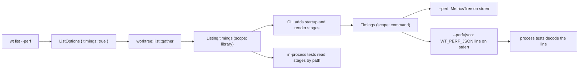

# Performance Testing — Worktree

This document defines the worktree-owned performance surfaces for `wt list` and related commands. It scopes what should be benchmarked, what assumptions the benchmarks rely on, and what is intentionally excluded.

## List Status Collection

The first owned cost center is [`list_worktrees`](../../worktree/lib/src/worktree.rs), which produces the status table.

- It runs `git worktree list --porcelain`, resolves the default branch once, and reads every branch tip with one `git for-each-ref refs/heads refs/remotes`.
- The caption compares the local default branch with its local tracking ref `origin/<default>` (cached like any other pair) and records the tracking tip it read. Its counts also choose the default-branch target, so a warm run makes no `merge-base` call. The library listing path never touches the network; the CLI reads it after its worker's check and fetch (see [Live Remote Head](#live-remote-head)).
- Per-worktree `git status --porcelain` and per-branch comparisons (`git rev-list --left-right --count` plus a speculative `git merge-tree --write-tree`, against the target and, for a branch whose fork parent is another branch, against the parent) are dispatched in parallel via `std::thread::scope`.
- `git status` is passed `-c core.untrackedCache=true`; benchmarks assume a warm untracked-cache so the measurement reflects steady-state behavior rather than the first cold walk.
- The Criterion bench measures this listing through the library pipeline (see [Bench Recipe](#bench-recipe)); subprocess counts are asserted separately with the `count-git` recorder.

## Graph Data Collection

The second owned cost center is graph data collection in the library, [`worktree::graph`](../lib/src/graph.rs). The CLI only converts the gathered facts for biscuit-terminal and renders them ([`git_graph.rs`](../cli/src/commands/git_graph.rs)).

- [`gather`](../lib/src/graph.rs) reads whether the repository is shallow once, then works in three stages, each stage's branches concurrently: it classifies every drawn branch (one `merge-base --is-ancestor` per candidate lane, plus `rev-list --first-parent --parents` and `rev-list --ancestry-path` for a merged branch) and finds its fork (`merge-base`); it builds every branch lane (`log --first-parent`), classifying the lane's boundary (the first commit below it) the same way, so a branch that kept going after its merge is extended through that merge; then it builds the default lane. Each fork, merge, or label commit outside a lane's window costs one `rev-list --first-parent --count`, and a lane's anchors are verified together in one `log --no-walk`. See [git-graph.md](./git-graph.md).
- Graph data is only gathered when the terminal reports inline-image support. On non-image terminals the entire graph-data path is skipped.
- `GitGraph` measures each trimming candidate with the renderer (`GitGraph::plan`). That cost is in the `graph_render` stage, never in `graph_history`, `local_gather`, or the table.

## PR Request

`wt list` makes no PR request of its own. The detached worker every listing launches (see [Live Remote Head](#live-remote-head)) asks for open PRs on every run, beside its live-head check, and the listing waits for both within one budget ([`pull_requests.rs`](../lib/src/pull_requests.rs), [`list/wait.rs`](../lib/src/list/wait.rs)).

- Every stored answer is bound to a digest of the exact `git remote get-url origin` value, so every run pays that one git call before it may show stored badges.
- The worker's PR half asks whenever it wins the nonblocking lock beside the store, whatever the stored answer's age, under a 10 s deadline (`REFRESH_DEADLINE`). A contender makes no request, so overlapping listings keep at most one PR request in flight. A failure is never stored, and a repository in `~/.wt.json` makes no request.
- The two halves run concurrently, so an ordinary listing waits for the slower of the PR request and the head update (check plus any fetch), never their sum, and never more than 3 s. A stalled PR request now costs the whole 3 s even when the head answers at once; that is the accepted price of showing this run's answer.
- In `--perf`, `origin_lookup` is the origin lookup before the wait. The origin recheck and the stored-answer read after the wait are `pr_cache_read`, a child of the region that spans the wait (see [Runtime `--perf` flag](#runtime---perf-flag)). Neither makes a request, and neither adds to `local_gather`. The PR request runs in the worker; the foreground sees its time only inside `refresh_worker`, and the worker's own report shows it as `pr_request`.

### Before and after: waiting for the PR request

An observation, not a threshold: one quick unauthenticated sample on the macOS development host on 2026-10-02, in the `rusty-biscuit` checkout (`origin` is a public GitHub repository over SSH), with release builds of `wt` from `main` (before) and from this change (after), run back to back with a few seconds between runs. Times are the `--perf` rows of that date ([old row names](#rows-in-older-samples)).

| Build | Run | PR request | `pr gather` | `remote wait` |
| --- | --- | --- | ---: | ---: |
| before | 1 (no usable stored answer) | in the foreground | 82.5 ms | 141.6 ms |
| before | 2–3 (answer seconds old) | none | 4.5–4.9 ms | 119.1–139.1 ms |
| after | 5 runs | every run, by the worker; a new publication each time | 10.1–10.4 ms | 108.0–138.3 ms |

- Asking on every run cost no measurable wait here: GitHub answered the PR request faster than the head check finished, and the two run side by side, so `remote wait` is the head check's time either way.
- **With authentication: not sampled.** No `GITHUB_TOKEN` or `GH_TOKEN` was available on the host when the sample was taken (`sniff` reads only those variables), so the authenticated case has no number. Authentication changes the rate limit, not the request path, so no difference in wait is expected; record one the next time a key is at hand.
- `pr gather` grew by about 5 ms: after the wait the listing runs `git remote get-url origin` a second time, so badges for an `origin` replaced during the wait are never shown.

## Live Remote Head

Every listing with an `origin` checks the remote and, when it differs, fetches the one tracking ref, through the same detached worker that makes the PR request, and waits for both halves up to 3 s ([`remote_update.rs`](../lib/src/remote_update.rs), [`list/wait.rs`](../lib/src/list/wait.rs)).

- `wt list` launches (or adopts) one `wt internal-refresh <main checkout> --attempt <id>` and polls `<repo hash>.remote-head.json`'s `attempt` record and the attempt's completion receipt every 25 ms until the head attempt has an outcome **and** the PR half is resolved (a new PR publication id, or the receipt), or 3 s pass. Work still running at 3 s continues in the background, and the caption says so ("still checking" or "still pulling").
- The local gathers (dirtiness, comparisons, graph, and `-v` history) run on scoped threads *during* the wait, from the branch tips read before it, so an ordinary listing costs the slower of the wait and the local work. After the wait (and after `--ff`, which runs once the local work is joined) the tips are read again; when they differ, or either read failed, the comparisons, graph, and history are gathered once more from the second read, so the output still describes the post-fetch state. A changed-tip run therefore pays for one extra ref-dependent gather (the `regather` stage); dirtiness is measured again only in a checkout `--ff` moved (the `checkout_refresh` stage). The wait's budget limits only the wait: a local gather that takes longer is still finished before rendering. See [the listing docs](./cli/list.md#local-work-during-the-wait).
- The worker's check asks the provider API, then `git ls-remote`, within one 10 s budget (`REMOTE_HEAD_REFRESH_DEADLINE`), and its fetch of `refs/remotes/origin/<default>` has its own 60 s deadline (`FETCH_DEADLINE`). Both kill the whole process tree at the deadline ([`live_remote.rs`](../lib/src/live_remote.rs)), so no worker holds `remote-head.lock` forever.
- `-r`/`--refresh` and `--ff` wait the same way, bounded by `ATTEMPT_MAX_AGE` (75 s) instead of 3 s; in practice by the worker's own deadlines. Every attempt, ordinary or forced, writes its own receipt file (`<repo hash>.refresh-receipt.<attempt id>.json`), so overlapping runs each read their own; the run tries once to delete it as its wait ends, and every worker deletes this repository's receipts older than 75 s before writing its own. A receipt written after its wait ended (the wait timed out, or finished early on a new publication and a finished head) is left for that sweep.
- In `--perf`, the wait and the local gathers are one concurrent region, `remote_and_local`, whose children are `refresh_worker` (launch through outcome or budget), `pr_cache_read`, `local_gather`, and `graph_history` or `verbose_history`. After it come `fast_forward` (`--ff` only), `ref_reread`, `regather` (only when the tips changed or a read failed), `commit`, and `checkout_refresh` (only when `--ff` moved a checked-out branch), each a top-level span of its own. See [Runtime `--perf` flag](#runtime---perf-flag).

### The full-command contract

An ordinary listing costs its fixed steps (parse, origin lookup, ref reread, render), plus the **slower** of the remote wait and the local gathers, plus a `regather` when the tips moved. The bounds below are what the gates hold that to.

| Case | Bound | Gate |
| --- | --- | --- |
| Local gather plus render, worker answering at once | 1 s | `perf_command_sla::perf_full_command_non_image_meets_sla` |
| Ordinary listing, check held by `origin` | 3 s wait plus 1 s | `perf_pr_request::perf_a_held_live_head_check_costs_the_listing_only_its_wait` |
| Ordinary listing, PR request held by the provider | 3 s wait plus 1 s | `perf_pr_request::perf_a_held_pr_request_costs_the_listing_only_its_wait` |
| Ordinary listing, fetch held by `origin` | 3 s wait plus 1 s | `perf_pr_request::perf_a_held_fetch_costs_the_listing_only_its_wait` |
| `-r`, check held by `origin` | 10 s check deadline plus 3 s | `perf_pr_request::perf_refresh_against_a_held_check_reports_within_the_check_deadline` |
| `--ff`, fetch held by `origin` | 60 s fetch deadline plus 3 s | `perf_pr_request::perf_fast_forward_against_a_held_fetch_reports_within_the_fetch_deadline` |

The 1 s bound is no longer the whole command's: spec decision 1 of `2026-09-27-list-freshness-ux` replaced it with a bounded remote wait. The held cases prove the listing never joins its worker: each asserts that the captured `.output()` returned while the worker was still held (the held-check case by the live-head lock, the held-fetch case by the worker process and the gate's run count, the held-PR case by the provider stand-in's still-held request). The deterministic proofs are in `tests/list_prs.rs` (`a_held_live_head_check_holds_the_listing_only_until_its_deadline`) and `tests/list_remote_head.rs` (`a_fetch_still_running_at_the_deadline_is_still_pulling_and_publishes_after_the_listing`).

### Quick sample: the wait and the local gathers overlap

An observation, not a threshold: one quick sample on the macOS development host (Mac16,5, 16 cores, load average about 10 at the time) on 2026-10-03, in the `rusty-biscuit` checkout with 10 worktrees (`origin` is a public GitHub repository over SSH), with a release build of `wt` from the working tree on top of commit `2147b2aa2`, where the gathers first overlapped the wait. No `GITHUB_TOKEN` or `GH_TOKEN` was set, so the API requests were unauthenticated. Stderr was not a terminal, so no graph was gathered. Runs were a few seconds apart; times are the `--perf` rows of that date ([old row names](#rows-in-older-samples)).

| Run | Total | `remote wait ‖ local gather` | `remote wait` | `list gather` | `verbose gather` | `pr gather` / `pr reread` | `unattributed` |
| --- | ---: | ---: | ---: | ---: | ---: | ---: | ---: |
| `wt list`, first after the build | 612.8 ms | 569.7 ms | 563.8 ms | 526.5 ms | — | 5.7 / 5.8 ms | 31.7 ms |
| `wt list`, runs 2–3 | 323.9–344.1 ms | 282.6–301.2 ms | 276.5–295.9 ms | 188.5–196.2 ms | — | 6.0–7.0 / 5.3–6.0 ms | 33.4–35.6 ms |
| `wt list -v`, 2 runs | 404.6–489.6 ms | 351.9–454.1 ms | 345.8–446.4 ms | 186.4–188.5 ms | 174.8–181.2 ms | 4.6–7.5 / 6.1–7.7 ms | 29.5–43.4 ms |

- **The local work is hidden inside the wait.** The group is the wait plus the PR reread (about 6 ms); the 190 ms list gather, and with `-v` the 175–181 ms verbose gather beside it, add nothing. Run sequentially, as before this change, runs 2–3 would have taken about 190 ms longer.
- **No regather happened**: the tips did not move during any run, so none paid for a second gather. A run whose fetch moves a tip pays one more ref-dependent gather, shown as the `regather` row.
- The first run's list gather (526.5 ms) still finished inside its slower wait.

## Ahead/Behind + Merge Result Cache

`list_worktrees()` caches the expensive deterministic branch-comparison result described in the feature spec's [Approach (decided: cache + concurrency)](../features/2026-06-16-two-problems/spec.md#approach-decided-cache--concurrency): `(target_tip_sha, branch_tip_sha, CACHE_FORMAT_VERSION) -> { ahead, behind, is_clean }`. One cache serves the `-> {default}` column, the `-> parent` column, and the caption (format version 2, since `2026-09-24-ux-improvements`).

- The SHA-pair key is deterministic and self-invalidating. If the target tip or the branch tip moves, the next lookup uses a different key and recomputes the result.
- Cache files live under `dirs::cache_dir()/worktree/<repo-root-hash>.json`, where the hash is derived from the canonical repo root path with `biscuit-hash` xxHash.
- Cache writes use write-temp-then-rename atomic replacement. Concurrent writers have last-rename-wins semantics, and readers never observe torn JSON.
- `CACHE_FORMAT_VERSION` is part of each key and the persisted file header; bump it when the on-disk shape or semantics change.
- Stale entries for superseded SHA pairs are tolerated opportunistically because they are unreachable until the same pair appears again.
- Working-tree dirtiness is never cached. The `git status --porcelain` walk still runs live for every listing.

## Verbose Commit Details

The third owned cost center is the verbose commit block rendered by `wt list -v`.

- Verbose details are gathered independently of image support: they render as text on non-image terminals and accompany the graph on image-capable terminals.
- When both graph and verbose data are needed for the current branch, one `gather(..., needs_graph, needs_verbose)` call populates both surfaces from a single `merge-base`.
- The intended Criterion surface benchmarks the verbose-only gather path on a non-image terminal, asserting that exactly one `merge-base` and the expected number of `git log` calls are issued for the current branch.

## Excluded Surfaces

- **Mermaid → SVG → rasterized image rendering** is excluded from worktree-owned benchmarks. That pipeline lives in `biscuit-terminal` / `biscuit-visualized` and is tracked separately.
- Shell startup, argument parsing, and table rendering are not the dominant costs owned by this package and are not targeted here.

## Bench Recipe

The library-owned gather surface is benchmarked with Criterion in [`worktree/lib/benches/list_status.rs`](../lib/benches/list_status.rs). The bench calls the library's listing pipeline, [`worktree::list::gather`](../lib/src/list.rs), against the ambient `rusty-biscuit` checkout with `ListOptions::default()`: no refresh worker, no graph, no `-v` details, no `--ff`, and timings off. It measures the shared local half of `wt list` (parsing, dirtiness, comparisons, the cache save, and a read of the stored remote answers), not the full command: it launches no worker, waits for nothing, and renders nothing. It uses `iter_batched_ref` with a throughput of one element per iteration so the report shows calls/sec.

Run the benches from the package area with:

```sh
just -d worktree bench
```

The HTML report is written to `target/criterion/report/index.html`.

Use the shared baseline workflow to compare before and after a change:

```sh
just -d worktree bench-save   # capture this host's baseline
just -d worktree bench-compare  # compare the current run against it
```

The shared `_bench_preflight` recipe checks battery, memory, and load before running, and `_bench_id` produces a host-derived baseline ID so baselines do not accidentally migrate across machines.

## Measurement Methodology

Criterion benches, the `--perf` runtime diagnostic, and the `perf_*` tests together provide complementary measurement surfaces. The benches cover the library's local listing, `--perf` covers the full CLI pipeline end-to-end, and the `perf_*` tests assert reproducible subprocess-count and wall-clock bounds.

### Runtime `--perf` flag

`wt list --perf` prints a timing report to stderr after the listing. It answers "where did the time of this run go?" by naming each step that ran, how long it took, and how many `git` processes it started.

| Flag | Output after the listing |
| --- | --- |
| `--perf`, `--perf=human` | A tree for people, drawn with biscuit-terminal's `MetricsTree` |
| `--perf=json` | One line, `WT_PERF_JSON {…}`, for programs and tests |

The value needs `=`, so `wt --perf json` reads `json` as a subcommand name rather than as the report format (and fails, since there is no such subcommand). An unknown value such as `--perf=xml` is a usage error (exit code 2). A listing that fails prints no report. Stdout stays empty either way, because the shell wrapper reads it.

#### Who measures what

The measuring belongs to the `worktree` library, not to the CLI. The library's listing pipeline, `worktree::list::gather`, measures itself when `ListOptions::timings` is `true` and returns the result in `Listing::timings`. `wt list --perf` sets that option, adds its own stages (startup and rendering) around the library's, and renders the finished document. The library never prints the report and has no terminal dependency.



With `timings: false` (the default) the pipeline builds no timing tree, takes no per-step clock reads, counts no `git` calls, and does not ask the refresh worker to time itself. Turning timings on never adds a `git` call, a network request, or a longer wait.

#### Stages

Each step is a `worktree::timing::Stage`. A stage has a stable snake_case **id**, which JSON and tests use, and a **label**, which only the human report shows. Labels may change at any time; ids may not. Only the steps that ran appear.

The listing's stages, in report order (*CLI* marks a stage only the command adds; a library document never contains it):

| Id | Label | Measures |
| --- | --- | --- |
| `startup` | startup | *CLI.* Process start to the listing: argument parsing and terminal detection |
| `read_worktrees` | read worktrees and refs | `git worktree list`, the default branch, the refs, and the fork-origin records |
| `origin_lookup` | origin and API preferences | The origin URL, the `--ignore-api` record, and the API preference |
| `prepare_local` | prepare local inputs | The comparison-cache load and the graph's inputs |
| `remote_and_local` | refresh worker ‖ local reads | Concurrent. The refresh worker and the local reads beside it; only when a wait ran |
| `local_reads` | local reads | Concurrent. The same local reads when no wait ran (no `origin`, or no worker) |
| `refresh_worker` | launch and wait for refresh | Under `remote_and_local`. Launching the worker and following it until both halves end or the budget runs out |
| `worker_launch` | launch worker | Under `refresh_worker`. Spawning the worker, by the listing's own clock |
| `worker_wait` | follow results | Under `refresh_worker`. Polling for the worker's results |
| `pr_cache_read` | PR cache read | Under `remote_and_local`. The origin recheck and the PR store read |
| `local_gather` | local listing facts | Concurrent. Worktree status and branch comparisons |
| `worktree_status` | worktree status | Under `local_gather`. One `git status` per worktree |
| `branch_comparisons` | branch comparisons | Ahead/behind and merge results, including the caption's and the fork tree's |
| `graph_history` | graph history | The commit-history reads the graph is drawn from (image terminals only) |
| `verbose_history` | verbose history | The history reads when only `-v` needs them |
| `shallow_check` | shallow check | Under `graph_history`. Whether the repository is shallow |
| `default_tips` | default-branch tips | Under a history stage. The default branch's local and `origin` tips |
| `focused_merge_base` | focused merge base | Under a history stage. The current branch's merge base |
| `verbose_details` | verbose commit details | Under a history stage. Commit details for `-v` |
| `lane_assembly` | assemble lanes and fork holders | Under `graph_history`. The whole lane-assembly loop, including a repeat after another fork holder is found |
| `fast_forward` | fast-forward | `--ff` only |
| `ref_reread` | ref reread | Reading the refs again after the wait |
| `regather` | regather | Ref-dependent facts gathered again, only when the refs changed or a read failed |
| `commit` | save caches and records | The comparison-cache save and record pruning |
| `checkout_refresh` | checkout status refresh | Another `git status` for a checkout `--ff` moved |
| `caption_status` | caption status | *CLI.* The caption's status, including any reflog read |
| `display_facts` | prepare display facts | *CLI.* The conversion to table facts |
| `table_render` | table render | *CLI.* |
| `verbose_render` | verbose render | *CLI.* `-v` only |
| `notes_render` | status and preliminary notes | *CLI.* |
| `graph_budget` | graph row budget | *CLI.* Sizing the graph's rows |
| `graph_render` | graph image render (biscuit-terminal) | *CLI.* Laying out and drawing the graph image |
| `final_notes_render` | final notes render | *CLI.* Notes the graph added |
| `write_output` | assemble and write output | *CLI.* Writing the listing to stderr |

Under `regather`, the steps are `prepare_local`, then a `local_reads` region holding `branch_comparisons` beside `graph_history` or `verbose_history`. Dirtiness is not read again there. When both the graph and `-v` need history it is read once, as `graph_history` with a `verbose_details` child; `verbose_history` has no `shallow_check`.

The refresh worker's stages appear only in its own reports (see [Worker reports](#worker-reports)):

| Id | Label | Measures |
| --- | --- | --- |
| `worker_setup` | worker setup | Worker entry until its halves start: checkout, origin, preferences, and receipt target |
| `worker_halves` | PR refresh ‖ head refresh | Concurrent. The two halves |
| `pr_refresh` | PR refresh | The PR lock, the provider request, and the publication |
| `head_refresh` | default-branch refresh | The default-branch check and the optional fetch, with their store work |
| `pr_request` | PR request | Under `pr_refresh`. The provider request, when one was made |
| `head_check` | head check | Under `head_refresh`. The check, by provider API or `git ls-remote`; when the API fails and Git is tried, its time covers both |
| `head_fetch` | head fetch | Under `head_refresh`. The `git fetch`, when the remote differed |

The report on this repository (debug build, 10 worktrees, no image terminal) looks like this:

```text
▌ Performance                                 527.4ms  100%
▌ ├─ startup                                    2.1ms   <1%
▌ ├─ read worktrees and refs  [3 git]          20.0ms    4%
▌ ├─ origin and API preferences  [1 git]        5.4ms    1%
▌ ├─ prepare local inputs  [0 git]              1.5ms   <1%
▌ ├─ refresh worker ‖ local reads  [11 git]   476.2ms   90%
▌ │  ├─ launch and wait for refresh           470.1ms     —
▌ │  │  ├─ launch worker                      500.0µs   <1%
▌ │  │  └─ follow results                     469.6ms   99%
▌ │  ├─ PR cache read  [1 git]                  6.1ms     —
▌ │  └─ local listing facts  [10 git]         296.8ms     —
▌ │     ├─ worktree status  [10 git]          295.4ms     —
▌ │     └─ branch comparisons  [0 git]        270.0µs     —
▌ ├─ ref reread  [1 git]                        7.1ms    1%
▌ ├─ save caches and records  [0 git]          13.3ms    3%
▌ ├─ table render                               1.4ms   <1%
▌ └─ …
▌ Refresh worker (diagnostic, measured in the worker): complete      —    —
▌ └─ launch 0 (complete)                                         436.4ms  —
▌    ├─ worker setup                                             286.6ms  —
▌    └─ PR refresh ‖ head refresh                                149.8ms  —
▌       ├─ PR refresh                                            149.7ms  —
▌       │  ├─ PR request                                          89.4ms  —
▌       │  └─ unattributed                                        60.3ms  —
▌       └─ default-branch refresh                                142.3ms  —
▌          ├─ head check                                          60.6ms  —
▌          └─ unattributed                                        81.7ms  —
```

#### Two kinds of children

A span's children are one of two kinds, and the kind decides how they add up.

- **Sequential** children are consecutive parts of their parent. Each shows its share of the parent, and they reconcile to it exactly: `refresh_worker` is `worker_launch` plus `worker_wait` plus a remainder.
- **Concurrent** children ran at the same time inside their parent. They show `—` instead of a share and are never added up, because adding overlapping work counts the same time twice. `remote_and_local` (476 ms) is not the sum of its children (470 + 6 + 297 ms); it is the time from the start of the region until its last task finished.

**Reconciliation.** The top level, and every parent with sequential children, reconciles exactly in integer microseconds:

```text
sum(children) + unattributed − over_attributed = elapsed
```

At most one remainder is nonzero. When the children cover less than the parent, the gap is `unattributed`. The human report hides an `unattributed` row under 1 ms; JSON always carries it. When the children add up to more than the parent, the excess is `over_attributed` and is always shown, because it means overlapping work was recorded as sequential, which is a bug. A parent with concurrent children, or with none, carries zero remainders.

**`git` counts.** `[3 git]` is the number of `git` processes the step started, its children's included, each counted once. A failed spawn is not counted; a `git` that ran and exited with an error is. A count of `0` means "measured, none started"; a step with no count is one whose count is not known (for example `refresh_worker`, whose `git` runs in the worker process).

#### Worker reports

The refresh worker is a separate `wt` process, so its time is not part of the listing's total. With `--perf`, the listing asks the worker to time itself (`wt internal-refresh … --timings`); the worker writes its report into the receipt it already writes, and the listing copies it before deleting the receipt. Reports appear beneath the foreground tree as a labeled diagnostic section, one entry per launch the listing owns. Nothing in the section, its heading included, shows a percentage (`—` instead), because none of it is a share of the listing's total. Otherwise it follows the same rules as the foreground: a launch and each of its parents with sequential children reconcile through an `unattributed` row (hidden under 1 ms) or an always-shown `over-attributed` row, and concurrent children such as the two halves get neither. A forced retry is a second entry and is never added to the first. Waiting for a report never extends the wait: a listing that ends before the worker writes its receipt (an early finish or a timeout) shows that launch as `missing`.

| Status | Meaning |
| --- | --- |
| `complete` | Every owned launch reported both halves |
| `partial` | Some measurements are usable and others are not (for example one half panicked, or one of two launches has no report) |
| `missing` | No report reached the listing |
| `invalid` | The receipt's report did not decode; the receipt's outcome still counts |
| `adopted` | The listing followed another run's attempt and has no report of its own |
| `origin_changed` | `origin` changed during the wait, so every report was suppressed |

The JSON form writes `origin_changed`; the human heading writes `origin changed`.

#### `--perf=json`

`--perf=json` keeps the listing on stderr, then writes an empty line and one compact line:

```text
WT_PERF_JSON {"format_version":1,"scope":"command","total_us":359609,"spans":[…],"unattributed_us":75,"over_attributed_us":0,"worker_reports":[…],"worker_report_status":"complete"}
```

**Framing.** A reader takes the **final nonempty line** of stderr, splitting on LF and dropping a trailing CR (a pseudo-terminal capture ends lines with CRLF), checks that it starts with `WT_PERF_JSON `, and decodes the rest. It never searches earlier text: the listing can show commit subjects, and a subject that happens to read `WT_PERF_JSON {…}` must not be taken for the report. No ANSI codes, carriage returns, or image bytes appear inside the JSON.

**Schema (version 1).** All durations are unsigned integer microseconds of elapsed time, never dates.

| Field | Where | Meaning |
| --- | --- | --- |
| `format_version` | document, worker report | Always `1` |
| `scope` | document | `command` from `wt list`; `library` from `worktree::list::gather` |
| `total_us` | document, worker report | The measured interval |
| `spans` | document, worker report, span `children` | Spans in order |
| `stage` | span | The stage id |
| `elapsed_us` | span | The span's elapsed time |
| `git_calls` | span | Optional; absent means unknown |
| `children_kind` | span | `sequential` or `concurrent`; written even when `children` is empty |
| `unattributed_us`, `over_attributed_us` | document, worker report, span | The remainders; always written, `0` included |
| `worker_reports` | document | One entry per owned launch: `launch_index` (0-based), `attempt_id`, `status`, and an optional `report` holding the worker's own document |
| `worker_report_status` | document | The summary status; absent when no worker was followed |

Every number fits an unsigned 64-bit integer, and the reconciliation holds exactly in that range, never against a clamped value. Two sequential children of `u64::MAX` µs under a 10 µs parent leave an excess no field can hold, so no pair of remainders makes that document valid; one child of `u64::MAX` µs under a 0 µs parent is valid, with `over_attributed_us` of `u64::MAX`. Concurrent children are never summed, so any durations under a concurrent parent are valid.

The writer cannot produce such a document either: `Timings::new` and `WorkerTimings::new` return `TimingsError::Unrepresentable`, naming the span's path, when a duration or an exact remainder exceeds `u64::MAX` µs, so every `Timings` value serializes exactly. `wt list --perf` reports that error instead of a report. A worker that cannot represent its own timings writes its receipt without them, so its outcome still counts and the listing reports that launch's timings as `missing`.

`worktree::timing::Timings::from_json` is the reader, and it rejects: a version other than 1, an unknown stage id, two ordinary siblings with the same id, remainders that do not reconcile (including an excess no field can hold), remainders on a concurrent parent, a `null` in an optional field, and trailing content. Unknown fields are ignored. The worker's report travels in the receipt's optional `durations` member, which leaves the receipt at version 1 (see [the listing docs](./cli/list.md#how-the-wait-knows-both-halves-are-done)).

#### Reading a stage in a test

A span is found by its **path** of stage ids from the top, never by its label. The same stage can appear under two parents (`branch_comparisons` under `local_gather` and under `regather`), and a path tells them apart.

In process, ask the library for timings:

```rust
let options = ListOptions { timings: true, ..ListOptions::default() };
let listing = worktree::list::gather(&repo, &options, &mut |_| {})?;
let timings = listing.timings.expect("timings were requested");
let status = timings.span(&[Stage::LocalReads, Stage::LocalGather, Stage::WorktreeStatus]);
```

Out of process, run `wt list --perf=json` and decode its final line with the helpers in `cli/tests/perf_support/mod.rs`:

```rust
let timings = perf_support::perf_timings(&stderr); // panics on a missing or malformed record
let wait = perf_support::stage_at(&timings, &[Stage::RemoteAndLocal, Stage::RefreshWorker]);
let local = perf_support::local_gather(&timings); // under whichever region ran
```

Never parse the human report. Never add a concurrent region's children together to stand in for one elapsed time.

#### Performance tests and functional tests

- **A performance test** has a `perf_` name, runs serially under `just test-perf`, and may bound a stage's duration or a whole command's wall-clock time.
- **A functional test** never uses timing as evidence, and passes without `--perf`. A test that a listing stopped at its budget proves it with the wait's scripted clock (`list::wait::tests`) and with what the listing printed, not with a duration. A test that work ran proves it with `Listing` facts (`Listing::regathered`, for example) or the `count-git` recorder, not with stage names.
- Tests of the report itself (`perf_flag.rs`, `worktree::timing` unit tests) may read `Timings`; they check its shape and reconciliation, not its speed.
- The human report's layout is tested in two layers. Unit tests in `cli/src/perf/tests.rs` render synthetic trees at a fixed width and check exact rows: shares, remainders under a millisecond, over-attribution, and worker sections of every status. `cli/tests/level2_list_perf.rs` runs the real `wt list --perf` in a tmux pane at 80, 100, and 120 columns against a local `origin`. It checks the structure only, because durations vary: tree connectors, `[n git]` suffixes, percentages on sequential rows, `—` on concurrent and worker rows (the worker heading included), aligned value and share columns, and no wrapped rows.

#### Rows in older samples

The dated samples on this page use the report's row names of their date. Their current stages:

| Older row | Current stage path |
| --- | --- |
| `pre-dispatch` | `startup`, `read_worktrees` |
| `pr gather` | `origin_lookup` |
| `remote wait ‖ local gather` / `local gather` (group) | `remote_and_local` / `local_reads` |
| `remote wait` | `remote_and_local` › `refresh_worker` |
| `pr reread` | `remote_and_local` › `pr_cache_read` |
| `list gather` | `remote_and_local` › `local_gather` (or `local_reads` › `local_gather`) |
| `graph gather`, `verbose gather` | `graph_history`, `verbose_history` under the same region |
| `graph image render` | `graph_render` |
| `checkout status refresh` | `checkout_refresh` |

Run the perf tests with:

```sh
cargo nextest run -p worktree-cli -E 'test(/perf_/)' --nocapture
```

For contention-free wall-clock measurement of the SLA, run perf tests serially via `just test-perf`.

### `perf_subprocess_counts_meet_sla` (unit test, `cli/src/commands/list/tests.rs`)

Asserts the subprocess-count bounds the optimization guarantees, on a fixture repository with one linked feature worktree:

- `list_worktrees()` resolves the default branch exactly once (one `symbolic-ref` call) and reads tips with one `for-each-ref`. Wall-clock is printed for observability; the full-command SLA that subsumes this piece is asserted by the integration test below.
- The base-view `gather` on that fixture, where every branch has only the default lane as a candidate, issues one `rev-parse` (the shallow check); per branch, two `merge-base --is-ancestor` (its tip and its lane's boundary), one fork `merge-base`, and one `rev-list` (the boundary's first-parent chain); and one `git log` per branch plus one for the default lane.

### `graph_and_verbose_share_one_merge_base` (unit test, `lib/src/graph/tests.rs`)

Subprocess-count guard for the image-terminal `wt list -v` data-gather path (graph facts + verbose details) on a controlled feature-branch fixture: exactly one merge base, shared by the graph's fork and the verbose details, two `merge-base --is-ancestor` (the branch's tip and its lane's boundary), and zero `rev-parse --short`. Rasterization is excluded (this test never renders).

### `perf_full_command_non_image_meets_sla` (integration test, `tests/perf_command_sla.rs`)

Spawns the built `wt` binary with image-capable env vars removed so the non-image fast path is taken, and asserts the full command (process startup, the worker's check, table rendering, and all git data gathering) meets the 1-second SLA on a warm cache. The fixture's `origin` is a local bare copy in sync with the tracking ref (`MixedFixture::with_local_origin`), so every run launches the worker, which answers from local Git at once, and each run must report "checked just now". A warm-up primes caches, then the best of five timed runs is checked against the 1-second SLA; the best-of-5 minimum (rather than the mean) tolerates parallel-test-execution contention, and a true regression past the SLA fails this gate. Rasterization never runs on the non-image path, so it is excluded by construction.

The wall-clock and subprocess-count output is printed to stderr via `--nocapture`, providing a reproducible result trace. For a contention-free measurement, run perf tests serially via `just test-perf`.

## Ratified SLA Targets

Run the binding performance gates from the package area with:

```sh
just -d worktree test-perf
```

In environments where the local `just` wrapper requires explicit paths, the equivalent command is:

```sh
just --justfile worktree/justfile --working-directory worktree test-perf
```

The warm and cold cache gates measure the **`local_gather` stage**, read from `wt list --perf=json` (see [Reading a stage in a test](#reading-a-stage-in-a-test)), not full-command wall-clock. `local_gather` is the stage the cache targets (it dominates a cold `wt list`); a full-command bound could pass while `local_gather` itself regresses. The dated tables below call it `list gather`, its name before 2026-10-04. Both gates run on a shared *mixed* fixture (`tests/perf_support/mod.rs`): one `main` checkout plus several divergent branches and several fast-forward and behind-only branches. The mix is deliberate — the divergent branches show the warm-cache collapse, while the fast-forward and behind-only branches bound the cold-path tradeoff of the speculative `merge-tree` now issued for every non-main branch (the cache cannot help a cache miss).

The dated tables below are **historical records**: each shows what was measured on its date, against the gates that existed then, and is never rewritten. Several name gates that have since been removed (`perf_list_meets_sla_when_the_pr_request_hits_its_deadline`, which timed a foreground PR request that no longer exists, and `perf_list_meets_sla_with_a_stale_answer_and_a_blocked_refresh`), and their notes describe the listing's behavior on that date. The last table is the current one.

Ratified on 2026-06-17 against the mixed fixture (4 divergent + 3 fast-forward + 3 behind-only worktrees):

| Surface | Test | Achieved best-of-5 | Asserted bound |
| --- | --- | ---: | ---: |
| Warm-cache `list gather` | `perf_cache_warm_list_gather_meets_sla` | 19 ms | 120 ms |
| Cold-cache `list gather` | `perf_cache_cold_list_gather_meets_sla` | 38 ms | 300 ms |
| Ambient checkout, non-image full `wt list` | `perf_full_command_non_image_meets_sla` | 254.20 ms | 1 s |

Re-measured on 2026-09-25 after the list redesign (`2026-09-24-ux-improvements`), same fixture, on the macOS development host, plus the two PR cases in `tests/perf_pr_request.rs`. Every PR request goes to a local proxy stub; nothing leaves the host.

| Surface | Test | Achieved best-of-5 | Asserted bound |
| --- | --- | ---: | ---: |
| Warm-cache `list gather` | `perf_cache_warm_list_gather_meets_sla` | 12.8 ms | 120 ms |
| Cold-cache `list gather` | `perf_cache_cold_list_gather_meets_sla` | 23.6 ms | 300 ms |
| Mixed fixture, non-image full `wt list` | `perf_full_command_non_image_meets_sla` | 55.7 ms | 1 s |
| Network down (connection refused): cold / warm `list gather`, full `wt list` | `perf_list_meets_sla_with_the_network_down` | 21.0 ms / 10.5 ms / 52.9 ms | 300 ms / 120 ms / 1 s |
| PR request stalled until its 300 ms deadline: warm `list gather`, full `wt list` | `perf_list_meets_sla_when_the_pr_request_hits_its_deadline` | 11.6 ms / 359.7 ms | 120 ms / 1 s |

In the stalled case every run's `pr gather` stage was 309–317 ms, and the test asserts it is at least the deadline, which proves the request was made and waited for. A fresh store making no request is an L1 behavior test (`tests/list_prs.rs`), not a timing gate. The Criterion `list_status/warm` bench measured 79 ms per `list_worktrees()` on the ambient `rusty-biscuit` checkout.

Re-measured on 2026-09-26 after stale answers stopped waiting for a request (`2026-09-25-list-remove-performance`), same fixture, on the macOS development host, with `just -d worktree test-perf` run on its own:

| Surface | Test | Achieved best-of-5 | Asserted bound |
| --- | --- | ---: | ---: |
| Warm-cache `list gather` | `perf_cache_warm_list_gather_meets_sla` | 12.5 ms | 120 ms |
| Cold-cache `list gather` | `perf_cache_cold_list_gather_meets_sla` | 25.3 ms | 300 ms |
| Mixed fixture, non-image full `wt list` | `perf_full_command_non_image_meets_sla` | 63.0 ms | 1 s |
| Network down (connection refused): cold / warm `list gather`, full `wt list` | `perf_list_meets_sla_with_the_network_down` | 25.8 ms / 12.8 ms / 63.5 ms | 300 ms / 120 ms / 1 s |
| No stored answer, request stalled until its 300 ms deadline: warm `list gather`, full `wt list` | `perf_list_meets_sla_when_the_pr_request_hits_its_deadline` | 12.7 ms / 366.2 ms | 120 ms / 1 s |
| Stale matching answer, refresh blocked: full `wt list`; every sample's `pr gather` | `perf_list_meets_sla_with_a_stale_answer_and_a_blocked_refresh` | 62.4 ms; 6.7–11.0 ms | 1 s; under 300 ms |

- **The stalled case is now the miss path.** It seeds no store, so its request is a foreground one; `pr gather` was 310–326 ms.
- **The stale gate** points `origin` at a hanging local proxy and seeds a 12-minute-old matching answer for every sample, then checks that the store is still stale afterwards, so a worker that succeeded cannot turn it into a fresh-cache measurement. Each sample must show the stored badge and `PRs as of 12 min ago`.
- **Timing alone cannot prove the parent does not wait.** A 1 s ceiling would still pass a reintroduced 300 ms wait, so the gate also asserts every sample's `pr gather` stays under the request deadline. The L1 tests in `tests/list_prs.rs` prove it deterministically: `a_stale_store_shows_its_badges_at_once_and_a_detached_worker_makes_the_request` and `a_detached_workers_answer_replaces_the_stale_one_on_the_next_list` capture `wt list`'s output, which returns only once every holder of its pipes has exited, while the worker's request is still held unanswered and its lock still taken.
- **Fresh and stale cost the same.** The same run measured a fresh answer at 63.3 ms full command and 6.9 ms `pr gather`, and the stale answer at 62.4 ms. The `pr gather` time is the added `git remote get-url origin` call that binds the stored answer to `origin`; before this change a fresh answer's `pr gather` took 0.03 ms. The spec's measurement before the change was 338 ms for a stale answer against 83 ms fresh on the ambient checkout.

Re-measured on 2026-09-27 after every listing began checking `origin` and waiting for it (`2026-09-27-list-freshness-ux`), same fixture, on the macOS development host, with `just -d worktree test-perf` run on its own (26 passed). The full-command bound is now **1 s for local gather plus render with a worker that answers at once, and 3 s plus that with a stalled worker**; `-r` and `--ff` are bounded by the worker's 10 s check and 60 s fetch deadlines (see [The full-command contract](#the-full-command-contract)).

| Surface | Test | Achieved | Asserted bound |
| --- | --- | ---: | ---: |
| Warm-cache `list gather` | `perf_cache_warm_list_gather_meets_sla` | 12.1 ms | 120 ms |
| Cold-cache `list gather` | `perf_cache_cold_list_gather_meets_sla` | 23.0 ms | 300 ms |
| Mixed fixture with a local `origin`, non-image full `wt list`, worker answering at once | `perf_full_command_non_image_meets_sla` | 143.4 ms | 1 s |
| Network down (connection refused): cold / warm `list gather`, full `wt list` | `perf_list_meets_sla_with_the_network_down` | 22.1 ms / 12.1 ms / 161.4 ms | 300 ms / 120 ms / 1 s |
| No stored answer, request held past its 300 ms deadline: warm `list gather`, full `wt list` | `perf_list_meets_sla_when_the_pr_request_hits_its_deadline` | 13.4 ms / 886.7 ms | 120 ms / 1 s + 300 ms |
| Fresh answer / stale answer with a failing refresh: full `wt list`; every stale sample's `pr gather` | `perf_list_meets_sla_with_a_stale_answer_and_a_failing_refresh` | 154.0 ms / 150.0 ms; 4.1–4.3 ms | 1 s; under 300 ms |
| Check held by `origin`: `remote wait`, full `wt list` (two listings, the second adopting) | `perf_a_held_live_head_check_costs_the_listing_only_its_wait` | 3.00 s, 3.11–3.13 s | [3 s, 3.3 s), 4 s |
| Fetch held by `origin`: `remote wait`, full `wt list` | `perf_a_held_fetch_costs_the_listing_only_its_wait` | 3.00 s, 3.10 s | [3 s, 3.3 s), 4 s |
| `wt list -r`, check held by `origin` | `perf_refresh_against_a_held_check_reports_within_the_check_deadline` | 10.19 s | [10 s, 13 s) |
| `wt --ff`, fetch held by `origin` | `perf_fast_forward_against_a_held_fetch_reports_within_the_fetch_deadline` | 60.20 s | [60 s, 63 s) |

- **Every full-command sample now includes the worker's launch and check.** Fixtures without a live `origin` answer in milliseconds (a local bare copy, or a refused or closed connection), which is the 100 ms rise over the 2026-09-26 figures: the worker is a second `wt` process whose check the listing waits for.
- **The PR-deadline case adds the miss request to the wait.** The foreground request (≤ 300 ms) settles before the worker is launched, so the worker finds the answer and never repeats it; the worker's check then fails at the stub's 400 ms close. Its bound is therefore 1 s plus the request deadline.
- **The held cases prove no join.** The captured `.output()` returns while the worker is still held: the live-head lock is still taken (held check), or the worker process still runs and `upload-pack` has started exactly twice (held fetch). A held check uses `HoldingOrigin` (loopback smart HTTP); a held fetch uses `remote_fixture::UploadPackGate` on a local bare `origin`.
- **`-r` and `--ff` wait for the whole attempt**, so their elapsed time is the worker's own deadline plus about 0.2 s: the transport's whole process tree is killed at the deadline, then the outcome and receipt are published and the listing renders. The `--ff` case has a 90 s nextest termination override in `.config/nextest.toml`, since the default ceiling is 30 s.

Re-measured on 2026-10-02 after the worker began asking for PRs on every run and the listing began waiting for both halves, same fixture, on the macOS development host, with `just -d worktree test-perf` run on its own (30 passed). The bounds are unchanged; the held-PR case is new and the PR-deadline case is gone.

| Surface | Test | Achieved | Asserted bound |
| --- | --- | ---: | ---: |
| Warm-cache `list gather` | `perf_cache_warm_list_gather_meets_sla` | 13.0 ms | 120 ms |
| Cold-cache `list gather` | `perf_cache_cold_list_gather_meets_sla` | 23.3 ms | 300 ms |
| Mixed fixture with a local `origin`, non-image full `wt list`, worker answering at once | `perf_full_command_non_image_meets_sla` | 156.0 ms | 1 s |
| Network down (connection refused): cold / warm `list gather`, full `wt list` | `perf_list_meets_sla_with_the_network_down` | 26.1 ms / 16.0 ms / 178.5 ms | 300 ms / 120 ms / 1 s |
| Fresh answer / stale answer with a failing refresh: full `wt list`; every stale sample's `pr gather` | `perf_list_meets_sla_with_a_stale_answer_and_a_failing_refresh` | 163.4 ms / 163.7 ms; 9.5–10.4 ms | 1 s; under 300 ms |
| PR request held by the provider: `remote wait`, full `wt list` (two listings, the second contended) | `perf_a_held_pr_request_costs_the_listing_only_its_wait` | 3.00 s, 3.12–3.13 s | [3 s, 3.3 s), 4 s |
| Check held by `origin`: `remote wait`, full `wt list` (two listings, the second adopting) | `perf_a_held_live_head_check_costs_the_listing_only_its_wait` | 3.00 s, 3.12–3.14 s | [3 s, 3.3 s), 4 s |
| Fetch held by `origin`: `remote wait`, full `wt list` | `perf_a_held_fetch_costs_the_listing_only_its_wait` | 3.00 s, 3.11 s | [3 s, 3.3 s), 4 s |
| `wt list -r`, check held by `origin` | `perf_refresh_against_a_held_check_reports_within_the_check_deadline` | 10.29 s | [10 s, 13 s) |
| `wt --ff`, fetch held by `origin` | `perf_fast_forward_against_a_held_fetch_reports_within_the_fetch_deadline` | 60.20 s | [60 s, 63 s) |

- **The stale gate's failing refresh now reaches the listing.** Each worker makes two connections (one per half), and the listing waits for both: every stale sample shows the stored badge and `PRs as of 12 min ago (couldn't refresh)`, with no refresh hint. `pr gather` is now the origin lookup, plus the origin recheck and store read after the wait (about 10 ms); its 300 ms bound (`STAGE_SLACK`) guards against a reintroduced foreground request, which a 1 s full-command bound alone would hide.
- **A held PR request costs only the wait.** `FakeGitea::hold` keeps the PR request unanswered while the head answers at once. Both listings return at the 3 s budget with the pending item and the refresh hint, and the provider stand-in has seen exactly one PR request, still held, after both return: the second listing's worker found the lock taken and asked nothing.

## Graph Stages

`graph_history` (the graph's history reads; `graph gather` in the tables below) and `graph_render` (`graph image render`) appear in `wt list --perf` only when stderr is a terminal and `TERM_PROGRAM` names an image-capable emulator, so `tests/perf_graph_stages.rs` runs `wt list --perf=json` under `script` in a 120×40 pseudo-terminal, emulating Ghostty (other Kitty-protocol emulators wait out a 1 s cursor-position query there). The fixtures are `GraphFixture` in `tests/perf_support/graph.rs`, built through `git fast-import`. A second test, `perf_graph_stages_for_the_observed_sparse_lanes_at_200x60`, runs one more shape at 200×60 and prints each stage's median with its min–max spread. That shape (`GraphFixture::observed_sparse_lanes`) has three long branch lanes with recorded parents, and one of those branches is merged directly into `main` after its parent merged `main` back. The tests assert only that both stages are reported: the graph has no numeric budget, and the full command's 1 s bound (`perf_full_command_non_image_meets_sla`) still applies. Record medians with:

```sh
WT_GRAPH_PERF_SAMPLES=10 just test-perf perf_graph --cargo-profile release
```

Measured on the macOS development host (Apple M4 Max, git 2.55.0), release profile, 10 samples per fixture after one warm-up, medians. *Before* is the graph that drew merged branches as tags; *after* adds first-parent lanes, merge detection, anchors, and the tag-spacing layout (both 2026-09-27):

| Fixture | `graph gather` before | after | change | `graph image render` before | after | change |
|---|---:|---:|---:|---:|---:|---:|
| floor (one commit) | 5.9 ms | 10.5 ms | +4.6 ms | 352.4 ms | 347.0 ms | −1.5% |
| ordinary (3 worktrees, 50 commits, base view) | 20.2 ms | 39.1 ms | +18.9 ms | 351.2 ms | 356.1 ms | +1.4% |
| older essential connections (fork 5,000 and merge 3,000 first-parent commits back, focused view) | 69.5 ms | 126.3 ms | +56.8 ms | 353.3 ms | 351.8 ms | −0.4% |
| multiple selected branches (8 worktrees, 2 merged, base view) | 32.4 ms | 65.3 ms | +32.9 ms | 351.8 ms | 355.2 ms | +1.0% |

- **Gather roughly doubles, by added sequential git calls.** Each `git` spawn costs about 5 ms here. The floor's whole rise is the one added shallow check. Elsewhere the stages run one after another: shallow check, then per branch the `--is-ancestor` check, the two `rev-list` walks for a merged branch, and the fork `merge-base`; then the branch lanes' `log`; then the default lane's `log`, its anchors' `rev-list --count` calls (concurrent), and the one verifying `log --no-walk`. Before, a branch cost one `merge-base` and one `log`, concurrently. The older-connections fixture adds the most, because its merge's `rev-list` walks and its anchor counts cross thousands of commits.
- **Render is unchanged within noise.** It is dominated by about 350 ms of fixed cost that exists only in a pseudo-terminal: terminal detection waits for answers that never come (compare every row with the floor). A second layout pass runs only when two tags collide, and stays below that noise.
- **The full-command gates still pass** (`just -d worktree test-perf`, 2026-09-27), including `perf_full_command_non_image_meets_sla`, which never gathers a graph.

A later change (2026-09-28) made tag spacing collision-driven and let a later lane's direct merge win over an earlier lane's indirect containment. Same host, command, and profile, 10 samples, median (min–max):

| Fixture | Size | `graph gather` before | after | `graph image render` before | after |
|---|---|---:|---:|---:|---:|
| observed sparse lanes | 200×60 | 61.0 ms (58.8–70.3) | 75.2 ms (73.8–85.6) | 351.4 ms (350.0–357.8) | 348.4 ms (341.7–351.6) |
| floor | 120×40 | 10.9 ms | 10.9 ms | 341.8 ms | 344.4 ms |
| ordinary | 120×40 | 38.9 ms | 41.1 ms | 345.8 ms | 347.6 ms |
| older essential connections | 120×40 | 130.9 ms | 135.4 ms | 347.6 ms | 344.0 ms |
| multiple selected branches | 120×40 | 64.1 ms | 65.3 ms | 348.6 ms | 346.3 ms |

- **Gather rises 14 ms on the observed shape**, and the ranges do not overlap. The branch its parent contains only indirectly is now also checked against `main`, which merged it directly, and that merge's anchors are then placed on the default lane. The other fixtures moved within noise.
- **Render is unchanged.** None of these fixtures has colliding tags (the observed shape's `main` and `origin/main` share one commit), so each is laid out once.

A later change (2026-09-28) draws a branch that kept going after its merge as one lane: each branch lane's boundary is classified, and while another lane merged it directly, the lane is extended through that merge and the next older boundary is classified. Same host, command, and profile, 10 samples, two runs each, median (min–max). *Before* is the envelope of two runs before the change:

| Fixture | Size | `graph gather` before | after, run 1 | after, run 2 | `graph image render` after |
|---|---|---:|---:|---:|---:|
| floor | 120×40 | 9.8–14.1 ms | 10.6 ms (10.2–10.6) | 11.1 ms (10.2–12.9) | 346.0 / 349.3 ms |
| ordinary | 120×40 | 38.7–54.9 ms | 54.2 ms (52.5–56.5) | 52.1 ms (48.8–54.6) | 354.1 / 350.1 ms |
| older essential connections | 120×40 | 123.5–140.4 ms | 177.2 ms (174.6–179.3) | 175.3 ms (163.3–184.1) | 351.9 / 349.6 ms |
| multiple selected branches | 120×40 | 59.6–72.6 ms | 74.0 ms (69.2–75.9) | 72.1 ms (68.6–81.0) | 352.5 / 351.4 ms |
| observed sparse lanes | 200×60 | 74.9–88.8 ms (one run) | 112.2 ms (103.4–118.5) | 109.5 ms (102.5–181.1) | 357.0 / 356.6 ms |

- **Call budget.** An ordinary unmerged lane whose boundary is an ordinary fork pays at most **2** extra Git calls when the lane is shorter than its 5-commit window (`merge-base --is-ancestor` and one `rev-list --first-parent --parents`), and at most **3** otherwise (plus `rev-list --ancestry-path`, skipped when the boundary is on the candidate's first-parent chain), plus one more `--is-ancestor` for each candidate lane tried before the one holding the boundary. Each merge the walk accepts adds a fixed number of calls; no call is made per historical commit, and each boundary is classified once per gathering. `perf_subprocess_counts_meet_sla` pins the exact counts.
- **Floor and ordinary stay inside the earlier envelope**; ordinary sits near its top, which is the two added calls per lane.
- **Older essential connections rises about 40 ms.** Its one lane is merged, so its boundary, 5,000 first-parent commits down `main`, is classified. That classification's `rev-list --first-parent --parents` walks those commits inside Git: one call, a long walk.
- **Observed sparse lanes rises about 30 ms.** `fix/wt-ux` now accepts one merge, which re-reads its window and classifies the next boundary, and every lane classifies its boundary. Git calls in the base view go from 24 to 40 (`log` 5 → 11, `rev-list` 10 → 16, `merge-base --is-ancestor` 4 → 8; `merge-base`, `for-each-ref`, and `rev-parse` unchanged), and the incomplete-history notice this shape used to show is gone.
- **Render is unchanged**, and every full-command SLA test still passes (`just -d worktree test-perf`, 30 passed).

## `git status` Cost (Investigated, Not Changed)

`wt list` runs one default `git status` per worktree, in parallel. On the ambient `rusty-biscuit` checkout (13,013 tracked files, APFS, 2026-09-25) each took about 30 ms of wall time but about 0.22 s of system CPU:

| `git status` variant | Wall time | System CPU |
| --- | ---: | ---: |
| `--untracked-files=all` (used by `wt remove`, which must list every file) | 80 ms | 0.25 s |
| default, untracked folders collapsed (used by `wt list`) | 30 ms | 0.22 s |
| `--untracked-files=no` | 20 ms | 0.19 s |
| default, with `core.preloadIndex=false` | 150 ms | 0.09 s |

- The system CPU is the kernel checking every tracked file for changes. `core.preloadIndex` spreads that over threads, roughly doubling the CPU to cut the wait; turning it off trades 0.13 s of CPU for 120 ms of wall time, the wrong trade for an interactive command.
- Only a file-system watcher avoids checking every file. Git's own (`core.fsmonitor`) runs a daemon per worktree and exists only on macOS and Windows; on Linux it needs Watchman plus a hook.
- Ruled 2026-09-25: no watcher and no daemon. The wall time is already small, and the status flags are unchanged.

The warm gate also asserts that warm `local_gather` is below a cold reference measured in the same run, proving the cache collapses the divergent-branch recompute rather than the host merely being fast. Bounds are looser than the ratified measurements so ordinary host variance does not fail CI, yet tight enough to catch regressions that reintroduce serial branch comparison, skip the cache, or let the cold-path speculative `merge-tree` blow the budget. Deterministic subprocess-count assertions for cache hit/miss behavior live in the recorder-backed unit tests.

## Track 2 — Aspect Ratio (Parked)

Not active work. Recorded so the investigation is not lost if it recurs.

- **Observation history:** earlier `wt --perf` runs rendered the git-graph image squished or too tall in some worktrees but correct in others with the same binary. Current runs render correctly, so the issue appears intermittent or already resolved.
- **Confirmed rendering path:** `wt` -> `biscuit_terminal::components::mermaid::MermaidDiagram` (display: cells to pixels via `term.cell_size()`, terminal image protocol) -> `biscuit_visualized` (`MermaidDiagram` / `MermaidRenderer`) for SVG generation and rasterization. The CLI uses the existing biscuit-terminal component.
- **Likely origin if it recurs:** the terminal/raster path preserves aspect ratio. Mis-proportion would originate in `mermaid_rs_renderer::compute_layout` at `biscuit-visualized/src/src/mermaid/render.rs:223-225`, which can produce a near-square or padded canvas for small gitGraphs.
- **Measured clue:** broken cached gitGraph PNGs were near-square (`h/w` about `0.9-1.3`) and small; healthy graphs were wide and short (`h/w` about `0.25-0.45`). Branches further behind `main` get more horizontal commits, making them wider and less likely to show the issue.
- **Candidate fix:** in biscuit-visualized, re-fit the SVG canvas to its content bounding box before rasterizing at `raster/png.rs::render_tree_to_pixmap`. That covers both the at-width and scale rasterization entry points. A content-bbox crop normalizes dead space but does not widen an intrinsically near-square small graph; making small graphs always wide is a separate layout-level change.
- **Cache note:** bump the cache backend id (`MERMAID_BACKEND`) on any rendering-cache-affecting change.