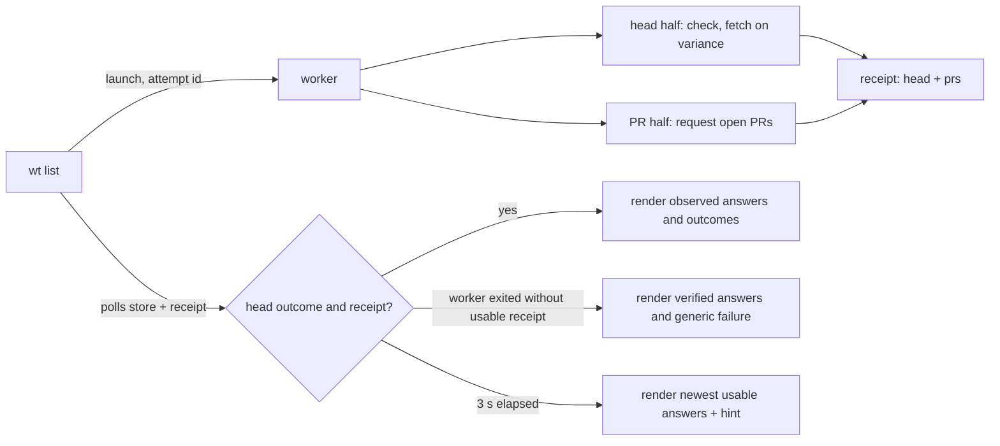

---
$schema:
    status: |-
        enum(
            draft-spec,
            finalized-spec,
            planned,
            implemented,
            review-findings,
            human-in-the-loop,
            completed,
            on-hold,
            abandoned
        ) -> an indicator of progress for this specification
    reviewed: boolean -> indicates whether the specification file has been reviewed by another agent from the one which created the spec
    reviewed_by: string -> the agent and model used in the spec review
    reviewed_on: date -> the date the spec was reviewed
    review_iterations: number -> the number of implementation reviews have taken place in the review/fix cycle
    clarified: boolean -> indicates whether the specification was built -- _in part_ -- with the 'clarify.md' prompt
    implemented: boolean -> indicates whether this spec's plan has been implemented
    implemented_by: string -> the agent who implemented the plan
status: draft-spec
reviewed: true
reviewed_by: codex/gpt-6.1-sol
reviewed_on: 2026-10-02
review_iterations: 0
clarified: false
implemented: false
related:
    - 2026-09-27-list-freshness-ux
    - 2026-09-25-list-remove-performance
human_review: false
message_to_agent: |-
    Phase 1 (library only) is done; `cargo nextest run -p worktree` (305 tests) and `just _lint worktree` pass.
    The `worktree-cli` crate does NOT compile yet, as the plan expects. The library API changes it must absorb:

    - `pull_requests::refresh(store, main, clock, connect)`: the `force` argument is gone, and it asks whenever it wins the lock.
    - `RefreshOutcome::AlreadyFresh` is gone; `RefreshOutcome::Unsupported` is new and must map to the new `PrStatus::Unsupported`.
    - `PrStatus::SkippedFresh` is gone (a receipt carrying `skipped-fresh` now reads as missing).
    - `OpenPrSource::fetch` returns `Result<_, PrRequestError>` (`Unsupported` or `Failed(PrFailure)`). Test stubs can write `Err(PrFailure::Other.into())`.
      `PrFailure::from_unavailable` is private now; `PrRequestError::from_unavailable` is the public entry and keeps sniff's `Unsupported` out of `PrFailure`.
    - `stored_publication` returns `Option<String>` (the id). `Publication`, `Writer`, `fetch_and_publish`, and `LIST_DEADLINE` are deleted.
    - Store format is 5 with no `writer`. The reader is strict: every field must be present, including `source_repo` and each PR's `url`
      and `source_repo` (null is fine, a missing key is a miss), and `publication` must be 32 lowercase hex. Unknown keys are ignored, so the
      hand-written stores in `cli/tests/perf_support`, `level2_list_verbose.rs`, and `list_remote_head.rs` still read; drop their `writer` anyway.
    - A receipt's `key` field inside a credentials failure must be present too (`null` allowed).

    Not done here, on purpose: the `Receipt`/`PrStatus`/`HeadStatus` docs and the `remote_head` module doc still say receipts are written only
    for forced attempts. That is still true until the worker changes, so fix them in Phase 2 with the worker.

    Shell gotcha: in this session the shell sometimes started in the main checkout (`/Volumes/coding/personal/rusty-biscuit`), so a relative
    `cd worktree` edited the wrong tree once. Use absolute paths under `/Volumes/coding/wt/rusty-biscuit/fix-wt-touchup`.
---

# Refresh open pull requests on every `wt list` run

## Problem

`origin` is the repository's configured remote; `<default>` is its default branch, such as `main`. The "head half" checks that branch's latest commit and fetches it when needed. The "PR half" queries open pull requests for the badges. A completion receipt is a small file recording what both halves did, so the listing can observe a detached worker's result.

Today, `wt list` treats these two remote questions differently:

| Question | When it asks | Does the listing wait for the answer? |
|---|---|---|
| Is `origin/<default>` current? | every run | yes, up to 3 s |
| Which PRs are open? | only when the stored answer is 60 s old or more | no; an ordinary listing stops waiting once the `origin/<default>` check has an outcome |

So the PR badges are almost never this run's answer:

1. **A fresh answer is never asked for again.** Within 60 s of the last success the worker's PR half makes no request (`RefreshOutcome::AlreadyFresh`).
2. **A stale answer is asked for, but not waited for.** The worker's two halves already run concurrently, yet the ordinary wait returns as soon as the head half has an outcome (`list/wait.rs`, `Follow::run`: `if !request.force { return … Finished … }`). A PR answer that lands a few hundred milliseconds later is shown only by the next run.
3. **A failed PR refresh is silent.** Only `--refresh` and `--ff` write the completion receipt that carries the PR half's outcome, so an ordinary listing cannot tell "the refresh failed" from "the refresh hasn't finished". The age line just grows. On 2026-10-02 the `rusty-biscuit` PR store was found 95 minutes old with no record of why; a forced refresh then succeeded at once.
4. **Two writers need a complex ordering rule to share the PR store.** The first-run foreground request (`fetch_and_publish`, 300 ms) and the worker's `refresh` both publish, so the store carries a publication id and a `writer`, and the forced wait has a contended-holder relaunch rule, all so that an older answer never replaces a newer one.

The worker runs the two requests concurrently, so asking for PRs on every run, and waiting for both, costs the listing roughly `max(head update, PR query)` instead of `head update`, with the foreground wait bounded by the same 3 s. The worker may continue after that budget expires.

## Scope and existing contracts

Every listing with an `origin` schedules an open pull request (PR) query, regardless of the stored answer's age. A repository configured with `--ignore-api` makes no provider query. Concurrent listings share an in-flight query when the PR lock is held; "every run" does not mean bypassing that lock or guaranteeing a separate network request for each overlapping command.

The library package `worktree` owns the stored answers and refresh lock in [pull_requests.rs](../../lib/src/pull_requests.rs). The CLI package `worktree-cli` owns the detached worker in [refresh_worker.rs](../../cli/src/commands/refresh_worker.rs), the foreground wait in [wait.rs](../../cli/src/commands/list/wait.rs), and the listing flow in [list.rs](../../cli/src/commands/list.rs). The changes below preserve these responsibilities.

Without `origin`, the listing remains local: no worker, PR status item, or refresh hint. A local-path or unsupported `origin` still gets the existing Git head check. It has no provider to ask for PRs, which is not a failure: it shows no PR badges and no PR status item, exactly like an ignored repository (§5). An ignored repository shows no PR badges or PR status item, while its head check continues through Git as today.

Remote failures remain advisory: the table still renders and the command retains its existing exit behavior. `--refresh` and `--ff` retain their 75 s wait budget and `--ff` retains its local fast-forward rules. PR failure never prevents a fast-forward that those rules permit.

## Fix

### 1. The PR half asks on every run

The `worktree` library's [pull_requests::refresh](../../lib/src/pull_requests.rs), which queries and stores open PRs, drops its freshness recheck: whenever it holds the PR lock, it makes the request. The `force` parameter goes, and `RefreshOutcome::AlreadyFresh` and `PrStatus::SkippedFresh` are removed.

Unchanged:

- The nonblocking PR lock (`<repo hash>.prs.lock`): a contender makes no request and reports `Contended`. Keep the lock from before the request through publication; keep its persistent sidecar file, because deleting it would allow two processes to lock different files.
- `REFRESH_DEADLINE` (10 s) for the request.
- The `origin` re-check after the request, and the rule that a failure is never stored.
- `~/.wt.json`: an ignored repository makes no provider request in either half (`PrStatus::Ignored`).

### 2. Every attempt writes a receipt

The worker writes the completion receipt (`<repo hash>.refresh-receipt.<attempt id>.json`) after both halves finish on **every** attempt, not only under `--force`. Its contents are unchanged (`head`, `prs`, bound to attempt id, origin digest, and branch).

Receipt cleanup is unchanged in shape: the wait discards the receipt of every attempt it launched when it returns, and the worker sweeps this repository's receipts older than `ATTEMPT_MAX_AGE` before writing its own. Both now run for ordinary and forced attempts. A worker that publishes after the listing timed out may leave a receipt behind; a later worker removes it once it is older than `ATTEMPT_MAX_AGE` (75 s). Cleanup is best effort and never removes another active attempt's receipt. The foreground removes only receipts for ids it launched, including a retry, not the receipt of a head attempt it adopted.

Remove `force` from the worker launch arguments and remove `--force` from the hidden `wt internal-refresh` command and its argument parser. Keep the ordinary-versus-forced choice in the foreground wait, where it still selects the budget and retry policy; it no longer needs to be passed to the worker.

Receipts remain bound to the launched attempt id, starting origin digest, and default branch, with the existing timestamp validation and atomic write. Each half is still joined separately: a panic in one becomes a failure in the receipt and never suppresses the other's answer. Receipt creation or publication can fail; such failure must not make the wait unbounded or turn a successful PR store write into an empty PR answer.

### 3. The ordinary wait covers both halves

The ordinary wait ends at the first of:

- the followed head attempt has an outcome **and** this run's PR result is resolved from its receipt (including the contention rules below);
- our worker has exited without a usable receipt and there is no matching head attempt still running to follow;
- the 3 s budget (`ORDINARY_BUDGET`) runs out.

**Contention.** A `Contended` PR half means another worker held the PR lock when our worker tried (for example, a listing in another checkout of this repository). Record the usable PR publication id before launch. Once our receipt reports contention, wait within the original budget for the lock to be released, then reread the usable publication id for the same origin. A nonempty id different from the pre-launch id proves a successful publication, even if both answers have the same timestamp or contain no PRs. A released lock alone proves no successful answer. If no new usable publication exists, an ordinary wait reports a PR failure; a forced wait keeps its one PR-contention relaunch, within the original 75 s budget. A second unsuccessful contention reports a generic PR failure. This guarantees at most one PR query in flight, not exactly one query across an arbitrary sequence of overlapping listings.

Probe the PR lock only after our worker has reported `Contended` or exited, so the probe cannot briefly acquire the lock ahead of our newly launched PR half. Keep this probe for contention; remove only the separate post-wait probe formerly used to decide whether to print a refresh hint.

**Adoption.** Keep the existing rules for following another worker's matching head attempt and retrying a forced attempt whose holder belongs to another origin or branch. Read our own completion receipt by our launched id even when following someone else's head id. Our PR half still runs and writes our receipt. A completed holder can be followed when our receipt proves head contention; simply finding an old completed head record is not enough.

**Independent outcomes.** The wait result must preserve the head outcome and any available PR receipt even when the overall budget expires or no head attempt could be recorded. The caption describes the head half: if it already finished, show its completed or failed caption even when PRs caused the timeout. Say "still checking" or "still pulling" only while the followed head half is unfinished. Conversely, if PRs published successfully but the head is still running, show the new badges without a PR age or failure item, plus the timeout hint. A changed usable PR publication can establish that success before the combined receipt exists.

**Missing receipt.** Read process exit before the final store and receipt reads, as today. If the worker exited without a valid receipt, retain any verified head outcome and newly published PR answer. Without a new usable PR publication, report a generic PR failure; do not invent a credentials reason. A receipt with the wrong id, origin, branch, or invalid timestamp is missing for this purpose. Never wait past the budget for a missing or malformed file.

The 3 s is one monotonic wait budget starting before launch; adoption, contention, and retries do not reset it. It excludes subsequent local gathering and rendering. The detached worker retains null standard streams and runs from the main checkout; a timeout neither joins nor kills it.

### 4. No foreground PR request

`gather_remote` no longer makes a request on a miss. With no stored answer, the listing has no badges until the worker's PR half answers, and the wait now covers that, so the first run normally shows badges.

Removed with it:

- `pull_requests::fetch_and_publish` and `LIST_DEADLINE` (300 ms);
- `ListSeams::connect` and `list::origin_pr_source` (tests stub the launched worker, as the head half's tests already do);
- `RemoteAnswers::pr_failure`. PR failures come from the receipt in every mode (§5);
- `Writer` and the filters that exclude a foreground listing's publication. Retain `WaitEnv::pr_publication` and `stored_publication` with an id-only result: a waiting run still needs that id to recognize a holder's publication. Only the worker writes the store.

After the wait, reread the PR store, including on timeout or worker failure. A successful empty answer clears old badges and counts as success. Keep source-repository filtering for both table badges and graph tags. Recheck the current origin before selecting the answer for rendering; if it changed or disappeared during the wait, discard the old origin's badges and receipt-derived PR diagnosis and do not start another refresh in this listing.

The store goes to **format 5** without `writer`. Keep `publication`, `origin_digest`, `fetched_at`, and the answer fields and validation; keep using `biscuit-hash` for the origin digest. Whole-second timestamps are not a substitute for publication ids. A format-4 store reads as a miss, so the first listing after upgrading has no stored badges until a worker publishes a format-5 answer. It normally displays the new answer during its wait; if the wait expires first, that listing has no badges.

### 5. What the listing shows about PRs

The status list after the graph (today: the PR age item, then the refresh hint) follows this run's PR outcome:

| This run's PR half | Badges | Status item |
|---|---|---|
| successful publication observed within the wait, including a shared answer | newest usable answer; an empty answer clears badges | none |
| ignored (`~/.wt.json`) | none | none |
| unsupported or local-path `origin` | none | none |
| still running at 3 s | last stored answer | `- PRs as of <age> ago` when that answer is 60 s old or more, plus the refresh hint (as today) |
| failed, including publication failure, missing receipt without a new answer, or a contended holder that published nothing | last usable stored answer, including an empty answer | `- PRs as of <age> ago (couldn't refresh)`, at any age |
| failed, nothing stored | none | `- couldn't get open PRs` |

"Unsupported" is a distinct outcome, not a failure. Today `PrFailure::from_unavailable` folds sniff's `PrUnavailable::Unsupported` into `PrFailure::Other`. Add `PrStatus::Unsupported`, recorded by the PR half when sniff reports `Unsupported`, so a repository whose `origin` has no queryable provider never shows `couldn't get open PRs` on every run.

Use the existing age formatter: `less than 1 min`, minutes, hours below two days, then days. For example, a failed refresh of an answer fetched 10 s ago reads `- PRs as of less than 1 min ago (couldn't refresh)`. An empty stored answer is still an answer and gets the same age and failure items. A pending query with no stored answer shows only the timeout hint, not "couldn't get open PRs." Apply these rules in ordinary and forced listings; only their budgets and retry policy differ.

The status list remains dim, on stderr, after the graph (or legend), before verbose output, with the PR item before the hint. Extend the existing `biscuit-terminal` rendering through `Prose` and `UnorderedList` rather than emitting raw terminal escape sequences.

`FRESHNESS_WINDOW` (60 s) survives only as the threshold for showing the age of an answer still being refreshed. It no longer decides whether to ask.

The existing credentials warning rules are read from the receipt's `PrFailure` in ordinary runs too, so a rejected key or a rate limit on the PR request produces the dim credentials line beneath the caption whether or not `-r` was given. The status item's `(couldn't refresh)` does not repeat that reason. Preserve the existing single-line precedence: a confirmed head API condition takes precedence over a PR condition. An ambiguous 404, timeout, unsupported provider, lock error, or write error never asserts that a key is wrong. Never print key values, remote URLs, or raw provider error text.

Because the receipt is written only after both halves finish, a PR failure while the head is still running may be unavailable at timeout. In that case show the pending PR presentation, not an unobserved failure. Once a receipt is available, use its PR failure even when the adopted head attempt is still unfinished.

The refresh hint's condition (`list::unfinished`) becomes "the wait timed out". The post-wait PR-lock probe and the `pr_pending` hint logic go; the contention probe described above remains. Clear the spinner before rendering on every exit path. While only PRs remain pending, use the generic `updating` text rather than retaining a completed head fetch or fallback message.

### 6. Cost

- **Time.** The listing waits for the slower of the PR query and the complete head update (check plus any fetch), capped at 3 s for an ordinary run. A stalled PR query now consumes the whole budget even when the head answers at once. Take a quick before/after sample on the development host against GitHub with and without authentication and record it in `docs/performance-testing.md`; this is an observation, not a release threshold. The existing 0.05–0.15 s branch-head measurement does not establish the cost of the PR query. Do not require more hosts or statistical gates for this sample.
- **API quota.** Each eligible listing attempts both logical provider queries, subject to locking and the existing Git fallback. The PR query is not guaranteed to be one HTTP request: the `sniff` package's [FocusedProviderClient::open_pull_requests](../../../sniff/lib/src/remote/focused.rs) follows pages to return the complete list and can make provider-specific follow-up requests. Preserve that complete-answer contract and the 10 s query deadline; a partial or failed query must never overwrite the store. More frequent queries consume more quota, especially without authentication, and can cause the head half to fall back to Git while PRs show a rate-limit warning. Authentication increases available quota but does not make frequent polling free. This feature intentionally adds no back-off.

## Decisions

1. **Same policy for both remote questions.** Ask every run, wait for both within one 3 s budget, render what arrived. (Author's direction, 2026-10-02.)
2. **No foreground PR request.** The worker is the only PR writer.
3. **Store format 5.** No compatibility reader for format 4. There are no users to migrate, and the cost is one listing without stored badges.
4. **No rate-limit back-off.** Revisit only if the unauthenticated limit proves a problem in practice.
5. **Independent display facts.** A PR timeout never turns a completed head check into "still checking"; a head timeout never hides a newly published PR answer.
6. **Generic failure for an unobservable PR result.** Keep verified stored data and report failure without guessing a credentials reason when the worker exits without a usable receipt or publication.
7. **An origin without a queryable provider is not a PR failure.** It is reported as `PrStatus::Unsupported` and shown like an ignored repository, so a local-path or unrecognized remote is not flagged on every run.

**Reader's note.** Removing the foreground writer simplifies publication ordering, but does not remove the need for publication ids or contention lock probes. Those still distinguish a successful shared answer from a failed holder. Waiting for both halves also requires preserving each half's result separately so the head caption remains accurate.

## Open Questions

None remain from this review. The increased request frequency and absence of back-off are intentional author decisions; the edge cases above complete that design without changing its policy.

## Out of scope

- The head half's check, fallback, fetch, and caption wording. Preserve its outcome when the combined wait ends because PRs remain pending.
- The `--ff` and `--ignore-api` semantics.
- PR badge placement and styling.

## Tests

L1 (`worktree` and `worktree-cli`):

- `pull_requests::refresh` asks while a fresh answer is stored. This replaces `list_prs::a_fresh_pr_store_makes_no_request_and_shows_its_badges` and the "a fresh answer stops the next" half of `concurrent_lists_and_workers_make_one_request_and_a_fresh_answer_stops_the_next`.
- The worker writes a receipt with no `--force`, carrying `prs: Ok`, `Failed { … }`, `Contended`, or `Ignored`.
- `wait::wait` (pure, scripted `WaitEnv`):
    - an ordinary wait does not end on a head outcome alone while the receipt is missing and the worker is running;
    - it ends when both are present;
    - it times out at the budget with the head finished and the PR half still running;
    - for a contended PR half, it waits for the lock and then reads the publication id; no new answer means ordinary failure or one forced retry;
    - same-second and empty publications count; unchanged, corrupt, future-dated, and wrong-origin stores do not;
    - adoption reads the launched receipt rather than the adopted head's receipt, including when the holder finishes before adoption;
    - a timeout preserves a completed head outcome and any available PR result; missing or malformed receipts and launch or publication failure remain bounded;
    - a probe cannot contend with our just-launched worker; retries share the original budget;
    - cleanup deletes only our launched receipts, and a receipt written after timeout is swept only when old.
- `list_prs` binary tests (stub proxy, `FakeGitea`):
    - two sequential listings each make one logical PR query, even with a fresh store; a one-page fixture makes one HTTP request per query;
    - a PR answer that arrives within the wait is shown by the same listing;
    - a failed refresh shows `(couldn't refresh)`, and a failure with nothing stored shows `couldn't get open PRs`;
    - a held PR request ends the listing at the 3 s budget with the refresh hint;
    - concurrent listings still make one PR query at a time;
    - an empty successful answer removes cached badges and gets no failure item;
    - no origin makes no request or PR item; ignored repositories make no provider request and suppress even seeded badges; local and unsupported origins retain the Git head check and show no PR badges or PR status item;
    - origin changes during the wait never show the previous repository's badges or PR credentials warning;
    - `-r` and `--ff` retain their budgets, and PR failure does not block a permitted fast-forward.
- A `list_table` snapshot covers every row of the §5 table.
- Credentials: a 401 on the PR request in an ordinary listing shows the credentials line; head-condition precedence and ambiguous errors retain the existing behavior.

Use loopback provider fixtures and injected workers; tests never call a real provider. Every fixture that starts a detached worker releases held requests and waits for both locks and the worker to end in a drop guard, including on assertion failure. Reuse the existing cache-path isolation, which differs on native Windows, rather than assuming changing `HOME` isolates the store.

Perf (`just test-perf`):

- `perf_list_meets_sla_when_the_pr_request_hits_its_deadline` (the 300 ms foreground gate) is removed.
- A held PR request costs the listing only its 3 s wait, mirroring `perf_a_held_live_head_check_costs_the_listing_only_its_wait`.
- `perf_command_sla` keeps its existing bound with a worker whose two halves answer at once.
- Update stale-answer and failing-refresh timing cases that relied on a background-only PR request. Local gather and render bounds stay unchanged; a held PR query uses the existing 3 s wait plus local-work allowance, not the former 300 ms request allowance. Keep historical measurement tables labeled as historical rather than rewriting measured figures.

L2 (tmux, through the shared Test Toolkit and terminal harness; no terminal or browser window may gain focus):

- `level2_list_stale_pr_answer_shows_a_dim_age_line_in_tmux` holds the PR request, so it now asserts the age item and the refresh hint after the 3 s wait.
- A new case closes the request with an error and asserts the dim `(couldn't refresh)` item. Cover PR-only waiting so the spinner clears and the completed head caption does not say "still checking."

## Docs

- `worktree/docs/cli/list.md`: the "PR badges" and "Status list" sections, and the "Checking origin" flow (one wait for both halves).
- `worktree/docs/performance-testing.md`: the "PR Request" section and the stale-gate notes; record the before/after wait measurements.
- `worktree/README.md`: the `wt list` PR bullet and the ordinary-versus-`--refresh` wait explanation.
- `.claude/skills/worktree/SKILL.md`: the `pull_requests`, `remote_head` receipt, and `wait` paragraphs.

Update behavior-changing symbols' module and function comments in the same implementation: remove claims that fresh answers skip requests, that PR requests never delay the foreground, or that only forced attempts write receipts. Current docs explain behavior directly and never link to or name this feature directory.

## Acceptance

- In a repository with open PRs and a reachable provider, two sequential `wt list` runs 10 s apart each make one logical PR query. When both worker halves finish within 3 s, each shows the new answer with no PR status item or refresh hint.
- With the PR request failing, `wt list` shows the last usable stored answer and `- PRs as of <age> ago (couldn't refresh)`; with none stored it shows `- couldn't get open PRs`. A stored empty answer is retained as a valid answer.
- If the head completes while PRs remain held, the ordinary listing returns after its one 3 s wait plus local gathering and rendering, with a completed head caption and the refresh hint.
- If PRs publish while the head remains held, that listing shows the new answer without a PR failure or age item.
- Overlapping listings preserve one PR query in flight, follow only matching publications and receipts, and never extend their budget because of contention.
- No code path other than the worker writes the PR store.
- `just test`, `just test-l2`, `just test-perf`, and `just lint` pass in `worktree/`.
