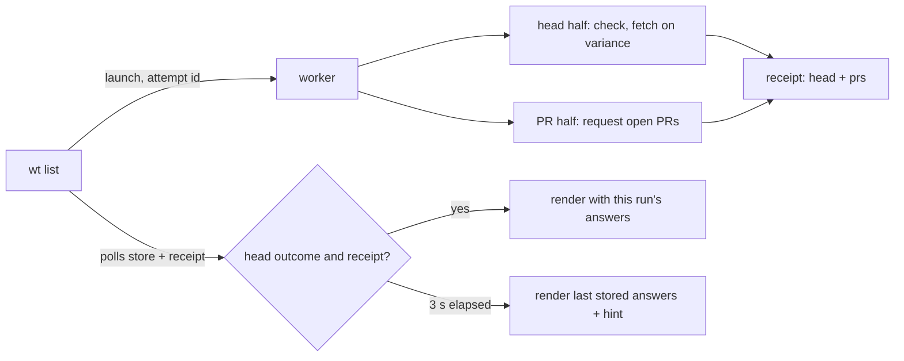

---
$schema:
    status: |-
        enum(
            draft-spec,
            finalized-spec,
            planned,
            implemented,
            review-findings,
            human-in-the-loop,
            completed,
            on-hold,
            abandoned
        ) -> an indicator of progress for this specification
    reviewed: boolean -> indicates whether the specification file has been reviewed by another agent from the one which created the spec
    reviewed_by: string -> the agent and model used in the spec review
    reviewed_on: date -> the date the spec was reviewed
    review_iterations: number -> the number of implementation reviews have taken place in the review/fix cycle
    clarified: boolean -> indicates whether the specification was built -- _in part_ -- with the 'clarify.md' prompt
    implemented: boolean -> indicates whether this spec's plan has been implemented
    implemented_by: string -> the agent who implemented the plan
status: draft-spec
reviewed: false
review_iterations: 0
clarified: false
implemented: false
related:
    - 2026-09-27-list-freshness-ux
    - 2026-09-25-list-remove-performance
human_review: true
---

# `wt list` asks for open PRs on every run, as it does for `origin/<default>`

## Problem

`wt list` treats its two remote questions differently:

| Question | When it asks | Does the listing wait for the answer? |
|---|---|---|
| Is `origin/<default>` current? | every run | yes, up to 3 s |
| Which PRs are open? | only when the stored answer is 60 s old or more | no; an ordinary listing stops waiting once the `origin/<default>` check has an outcome |

So the PR badges are almost never this run's answer:

1. **A fresh answer is never asked for again.** Within 60 s of the last success the worker's PR half makes no request (`RefreshOutcome::AlreadyFresh`).
2. **A stale answer is asked for, but not waited for.** The worker's two halves already run concurrently, yet the ordinary wait returns as soon as the head half has an outcome (`list/wait.rs`, `Follow::run`: `if !request.force { return … Finished … }`). A PR answer that lands a few hundred milliseconds later is shown only by the next run.
3. **A failed PR refresh is silent.** Only `--refresh` and `--ff` write the completion receipt that carries the PR half's outcome, so an ordinary listing cannot tell "the refresh failed" from "the refresh hasn't finished". The age line just grows. On 2026-10-02 the `rusty-biscuit` PR store was found 95 minutes old with no record of why; a forced refresh then succeeded at once.
4. **Two writers need a complex ordering rule to share the PR store.** The first-run foreground request (`fetch_and_publish`, 300 ms) and the worker's `refresh` both publish, so the store carries a publication id and a `writer`, and the forced wait has a contended-holder relaunch rule, all so that an older answer never replaces a newer one.

The worker runs the two requests concurrently, so asking for PRs on every run, and waiting for both, costs the listing roughly `max(head, PR)` instead of `head`, both bounded by the same 3 s.

## Fix

### 1. The PR half asks on every run

`pull_requests::refresh` drops its freshness recheck: whenever it holds the PR lock, it makes the request. The `force` parameter goes, and `RefreshOutcome::AlreadyFresh` and `PrStatus::SkippedFresh` are removed.

Unchanged:
- The nonblocking PR lock (`<repo hash>.prs.lock`): a contender makes no request and reports `Contended`.
- `REFRESH_DEADLINE` (10 s) for the request.
- The `origin` re-check after the request, and the rule that a failure is never stored.
- `~/.wt.json`: an ignored repository makes no provider request in either half (`PrStatus::Ignored`).

### 2. Every attempt writes a receipt

The worker writes the completion receipt (`<repo hash>.refresh-receipt.<attempt id>.json`) after both halves finish on **every** attempt, not only under `--force`. Its contents are unchanged (`head`, `prs`, bound to attempt id, origin digest, and branch).

Receipt cleanup is unchanged in shape: the wait discards the receipt of every attempt it launched when it returns, and the worker sweeps this repository's receipts older than `ATTEMPT_MAX_AGE` before writing its own. Both now run on every listing, not only forced ones.

`--force` no longer changes what the worker does. Keep the flag only if the wait still needs to tell the worker something; otherwise remove it from `LaunchArgs` and `wt internal-refresh`.

### 3. The ordinary wait covers both halves

The ordinary wait ends at the first of:

- the followed head attempt has an outcome **and** this run's receipt exists (or our worker has exited without writing one);
- the 3 s budget (`ORDINARY_BUDGET`) runs out.

**Contention.** A `Contended` PR half means another worker is asking right now (for example, `wt` started from another worktree of the same repository, which shares the store). The ordinary wait then waits, within the same 3 s, for the PR lock to be released, and counts the PR half as answered only when the stored publication id changed since launch. Otherwise the PR half ended without a new answer for this run (§5). The forced wait keeps its one relaunch.

**Adoption** of another worker's head attempt is unchanged. Our own worker's PR half still runs and writes our receipt.

### 4. No foreground PR request

`gather_remote` no longer makes a request on a miss. With no stored answer, the listing has no badges until the worker's PR half answers, and the wait now covers that, so the first run normally shows badges.

Removed with it:
- `pull_requests::fetch_and_publish` and `LIST_DEADLINE` (300 ms);
- `ListSeams::connect` and `list::origin_pr_source` (tests stub the launched worker, as the head half's tests already do);
- `RemoteAnswers::pr_failure`. PR failures come from the receipt in every mode (§5);
- `Writer` and the "a listing's answer never counts" rules in `wait.rs`, `WaitEnv::pr_publication`, and `stored_publication`. Only the worker writes the store, so its publication id alone tells a waiting run that a holder published.

The store goes to **format 5** without `writer`. A format-4 store reads as a miss, so the first listing after upgrading shows no stored badges until its own worker answers, which it now waits for.

### 5. What the listing shows about PRs

The status list after the graph (today: the PR age item, then the refresh hint) follows this run's PR outcome:

| This run's PR half | Badges | Status item |
|---|---|---|
| answered within the wait | this run's answer | none |
| ignored (`~/.wt.json`) | none | none |
| still running at 3 s | last stored answer | `- PRs as of N min ago` when that answer is 60 s old or more, plus the refresh hint (as today) |
| failed, or a contended holder published nothing | last stored answer | `- PRs as of N min ago (couldn't refresh)`, at any age |
| failed, nothing stored | none | `- couldn't get open PRs` |

`FRESHNESS_WINDOW` (60 s) survives only as the threshold for showing the age of an answer still being refreshed. It no longer decides whether to ask.

Credential conditions (§5 of `2026-09-27-list-freshness-ux`) are read from the receipt's `PrFailure` in ordinary runs too, so a rejected key or a rate limit on the PR request produces the dim credentials line beneath the caption whether or not `-r` was given. The status item's `(couldn't refresh)` does not repeat that reason.

The refresh hint's condition (`list::unfinished`) becomes "the wait timed out". The PR-lock probe and the `pr_pending` logic go.

### 6. Cost

- **Time.** The listing waits for the slower of the two requests, still capped at 3 s. A hanging PR request now holds the listing for up to 3 s, exactly as a hanging head check already does. Measure the ordinary wait before and after on the development host against GitHub (authenticated and unauthenticated) and record the figures in `docs/performance-testing.md`. Expected: both requests are single REST calls (the branch-head request measured 0.05–0.15 s on 2026-09-27), so the median wait should grow by tens of milliseconds, not seconds.
- **API quota.** Every listing makes two provider requests instead of one plus at most one PR request a minute. With a token (GitHub 5,000/hour) this is immaterial. Without one (GitHub 60/hour per IP), heavy use reaches the limit sooner. The head half then falls back to `git ls-remote`, the PR half fails with `RateLimited`, and the existing credentials line names the variable to set. No new mitigation is part of this feature.

## Decisions

1. **Same policy for both remote questions.** Ask every run, wait for both within one 3 s budget, render what arrived. (Author's direction, 2026-10-02.)
2. **No foreground PR request.** The worker is the only PR writer.
3. **Store format 5.** No compatibility reader for format 4. There are no users to migrate, and the cost is one listing without stored badges.
4. **No rate-limit back-off.** Revisit only if the unauthenticated limit proves a problem in practice.

## Out of scope

- The head half's behavior (check, fallback, fetch, caption).
- The `--ff` and `--ignore-api` semantics.
- PR badge placement and styling.

## Tests

L1 (`worktree` and `worktree-cli`):
- `pull_requests::refresh` asks while a fresh answer is stored. This replaces `list_prs::a_fresh_pr_store_makes_no_request_and_shows_its_badges` and the "a fresh answer stops the next" half of `concurrent_lists_and_workers_make_one_request_and_a_fresh_answer_stops_the_next`.
- The worker writes a receipt with no `--force`, carrying `prs: Ok`, `Failed { … }`, `Contended`, or `Ignored`.
- `wait::wait` (pure, scripted `WaitEnv`):
    - an ordinary wait does not end on a head outcome alone while the receipt is missing and the worker is running;
    - it ends when both are present;
    - it times out at the budget with the head finished and the PR half still running;
    - for a contended PR half, it waits for the lock and then reads the publication id.
- `list_prs` binary tests (stub proxy, `FakeGitea`):
    - each listing makes exactly one PR request, even with a fresh store;
    - a PR answer that arrives within the wait is shown by the same listing;
    - a failed refresh shows `(couldn't refresh)`, and a failure with nothing stored shows `couldn't get open PRs`;
    - a held PR request ends the listing at the 3 s budget with the refresh hint;
    - concurrent listings still make one request at a time.
- A `list_table` snapshot covers every row of the §5 table.
- Credentials: a 401 on the PR request in an ordinary listing shows the credentials line.

Perf (`just test-perf`):
- `perf_list_meets_sla_when_the_pr_request_hits_its_deadline` (the 300 ms foreground gate) is removed.
- A held PR request costs the listing only its 3 s wait, mirroring `perf_a_held_live_head_check_costs_the_listing_only_its_wait`.
- `perf_command_sla` keeps its bound with a worker whose two halves answer at once.

L2 (tmux):
- `level2_list_stale_pr_answer_shows_a_dim_age_line_in_tmux` holds the PR request, so it now asserts the age item and the refresh hint after the 3 s wait.
- A new case closes the request with an error and asserts the dim `(couldn't refresh)` item.

## Docs

- `worktree/docs/cli/list.md`: the "PR badges" and "Status list" sections, and the "Checking origin" flow (one wait for both halves).
- `worktree/docs/performance-testing.md`: the "PR Request" section and the stale-gate notes; record the before/after wait measurements.
- `worktree/README.md`: the `wt list` PR bullet.
- `.claude/skills/worktree/SKILL.md`: the `pull_requests`, `remote_head` receipt, and `wait` paragraphs.

## Acceptance

- In a repository with open PRs and a reachable provider, two `wt list` runs 10 s apart each make one PR request. Each shows that run's answer with no status item.
- With the PR request failing, `wt list` shows the last stored badges and `- PRs as of N min ago (couldn't refresh)`.
- No code path other than the worker writes the PR store.
- `just test`, `just test-l2`, `just test-perf`, and `just lint` pass in `worktree/`.
