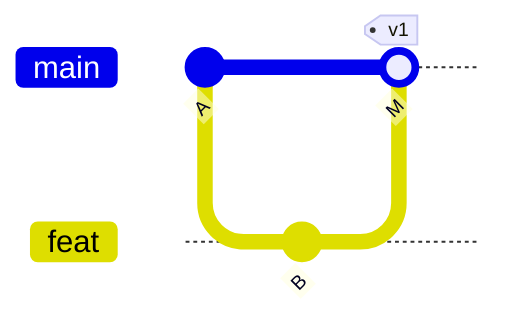

# Draft issue: gitGraph `branch` and `merge` treat attributes as part of the branch name

> **For the author's review.** Nothing here has been filed. `upstream-pr.patch` in this directory is the matching pull-request draft. It is a diff against the published `mermaid-rs-renderer` 0.3.1 crate source; rebase it onto upstream `main` before opening the PR.

---

**Title:** gitGraph: `branch` and `merge` read attributes (`order:`, `id:`, `tag:`) as part of the branch name

**Version:** 0.3.1 (also 0.2.1 and `main` as of 2026-09-24)

## Summary

In a `gitGraph`, `branch` and `merge` take everything after the keyword as the branch name, so their attributes become part of it:

- `branch feat order: 1` creates a branch named `feat order: 1`. A later `checkout feat` then creates a second, disconnected branch named `feat`. The `order:` value is still applied, to the wrongly named branch.
- `merge feat id: "M"` looks up a branch named `feat id: "M"`, finds none, and draws the merge commit without the line from `feat`. The `id:`, `tag:`, and `type:` values are still read from the same line, so the commit looks right while its second parent is missing.

Mermaid.js accepts both statements as written ([gitGraph docs](https://mermaid.js.org/syntax/gitgraph.html): "Branch ordering", and `merge` with `id`, `tag`, and `type`).

## Reproduction



```rust
let parsed = mermaid_rs_renderer::parse_mermaid(
    "gitGraph\n  commit id: \"A\"\n  branch feat order: 1\n  checkout feat\n  commit id: \"B\"\n  checkout main\n  merge feat id: \"M\" tag: \"v1\"",
)
.unwrap();
let names: Vec<_> = parsed.graph.gitgraph.branches.iter().map(|b| b.name.as_str()).collect();
println!("{names:?}");
let merge = parsed.graph.gitgraph.commits.iter().find(|c| c.id == "M").unwrap();
println!("{:?}", merge.parents);
```

**Expected:** branches `["main", "feat"]`; the merge commit `M` has parents `["A", "B"]`.

**Actual:** branches `["main", "feat order: 1", "feat"]`. Commit `B` sits on a third, unconnected lane, and `M` has parents `["A"]` only.

## Cause

`parse_gitgraph_diagram` (`src/parser.rs`) takes the whole remainder of the line as the name:

```rust
let name = line.get(7..).unwrap_or("").trim();         // branch
let from_branch = line.get(6..).unwrap_or("").trim();  // merge
```

## Proposed fix

Take the branch name as the first whitespace-separated token, or a quoted string, and leave the rest of the line to the existing attribute extractors. Apply the same rule to `checkout`/`switch`, so that a quoted name matches between `branch "x"` and `checkout "x"`. The attached patch does this with one helper, `gitgraph_branch_name`, and adds two parser tests: attributes are not part of the name, and quoted names round-trip. Both tests fail on 0.3.1 and pass with the patch. The crate's existing gitGraph test still passes.

## Also observed (separate, lower priority)

The parser always names the first lane `main` (`parse_gitgraph_diagram` pushes a hard-coded `"main"`). `gitGraph.mainBranchName` from `%%{init}%%` reaches `GitGraphConfig::main_branch_name`, but that value is used only when the graph declares no branches. Repositories whose default branch is `master` or `trunk` cannot label the first lane. This could be a follow-up issue if you prefer to keep this one narrow.

## How we work around it today

`biscuit-terminal`'s `GitGraph` component emits no attributes on `branch` or `merge`: lane order comes from the order of the `branch` statements, and merge commits keep the renderer's generated IDs. It emits the first lane as `main` and shows the real default-branch name as a tag.
