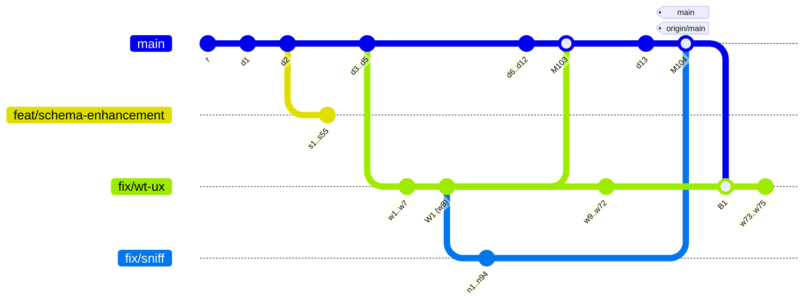

# Implementation Log for 2026-09-27-graph-sparse-lanes (4 phases)

## Phase 1

Host: macOS (Darwin 27.2.0), Apple Silicon dev Mac. Date: 2026-09-28.

### E1: the observed-shape topology (one history, three builders)

All three builders produce this history. The commit counts match in every
builder. Only the construction differs: `commit-tree` in L1 and L2, and
`git fast-import` in perf.

| Builder | Where | Construction |
|---|---|---|
| `observed_sparse_lanes()` | `worktree/cli/src/commands/git_graph/tests.rs` | `git commit-tree` on one tree, then `update-ref`; recorded parents in an in-memory `ForkOriginStore` |
| `Fixture::sparse_lanes()` | `worktree/cli/tests/level2_graph_in_kitty.rs` | the same `commit-tree` sequence, three linked worktrees, and the recorded parents written to the store `wt` reads under the fixture's `HOME` |
| `GraphFixture::observed_sparse_lanes()` | `worktree/cli/tests/perf_support/graph.rs` | `git fast-import`, three linked worktrees, and the recorded parents written to the store at `isolated_cache_file` |

Counts: `main` has `r`, `d1..d12`, `M103`, `d13`, and `M104`.
`feat/schema-enhancement` forks at `d2` with 55 commits. `fix/wt-ux` forks at
`d5` with `w1..w8`, where `W1` = `w8` is the tip `M103` merged. It then
continues with 64 more commits, merges `main` back at `B1`, and adds 3 more
(75 of its own). `fix/sniff` forks at `W1` with 94 commits, and `M104` merges
it into `main`. `origin/main` = `main` = `M104`. Recorded parents:
`fix/wt-ux` → `main`, `fix/sniff` → `fix/wt-ux`, and
`feat/schema-enhancement` → `main`.

### Spike S1: label geometry (`spikes/s1-geometry/`)

`run.sh` builds `src/main.rs` in a temporary crate against the repository's
`Cargo.lock` and lays out each case directly with `mermaid-rs-renderer`
0.3.1's `compute_layout`, at steps 34, 50, and 79, under two themes:
`Theme::mermaid_default()` (font 16) and the same theme with
`font_size = 24`. `observed.mmd` is the gathered Mermaid text of
`observed_sparse_lanes()`, captured by the S2 test. The full output is in
`output-macos.txt`.

Renderer defaults: `commit_step = 34`, `layout_offset = 8`,
`parallel_commits = false`.

**Linearity (R4 premise): confirmed.** In every case, under both themes and in
both directions, every commit x and both x edges of every tag equal
`a + index × step` to within 0.0000 user units, where `index` is the commit's
position in `GitGraphLayout::commits`. Tag y bounds do not change with the
step. Commit x rises strictly with placement index. A single widening computed
from the first pass therefore always clears the pair exactly, and the
second-pass shortfall was `None` in every case. Tags are not centered on their
commit. A 65.05-wide tag spans `commit_x − 35.78 .. commit_x + 29.27`.

**Right-to-left: not reachable from Mermaid text in 0.3.1.**
`parse_gitgraph_direction` recognizes only `LR`, `TB`, and `BT`, as a bare
line or after `direction`, and it skips the `gitGraph` header line. So
`direction RL` parses as the default `LeftRight`
(`rl-text-direction-line`). A `Graph` with `direction = RightLeft` set
programmatically lays out exactly like LR: same x values, increasing with
index, and identical numbers to the LR rows. The layout has no `RightLeft`
branch, and `render_gitgraph` handles only `TopDown` and `BottomTop`
specially, so nothing is mirrored at SVG emission either. R2's rule ("the
earlier label is the one whose commit has the smaller x"; distance = index
difference) holds for both directions, and index order and x order agree.

**Theme font size.** Tag label widths are measured at
`gitgraph.tag_label_font_size` (10) with the theme's `font_family`, so
`theme.font_size` changes only the gap (`TAG_GAP_EM × font_size`), not the
label widths: the 24-pt rows have the same bounds as the 16-pt rows.

**Computed versus old steps** (the "old" step is `max(34, widest + gap)`; "R3" is plan R1–R3):

| Case | Font | Default-step min clearance | Old step | R3 step | Clearance at R3 step |
|---|---|---|---|---|---|
| isolated `main`/`origin/main` stack on one commit | 16 | no counting pair | 81.05 | default (34) | — |
| same | 24 | no counting pair | 89.05 | default (34) | — |
| `main`/`origin/main` one commit apart | 16 | −7.71 (overlap) | 81.05 | 57.71 | 16.00 |
| same | 24 | −7.71 | 89.05 | 65.71 | 24.00 |
| cross-lane, unequal (`BETA` on a branch, `v1` next on `main`) | 16 | 13.49 (no overlap, under 1 em) | 234.68 | 36.51 | 16.00 |
| same | 24 | 13.49 | 242.68 | 44.51 | 24.00 |
| neighbors, unequal (`ALPHA`, `v1`, gap, `PR #104 → main`) | 16 | −84.65 | 246.66 | 134.65 | 16.00 |
| stack of three between `ALPHA` and `v1.0.0` | 16 | −116.02 | 246.66 | 166.02 | 16.00 |
| RL (programmatic), one commit apart | 16 | −7.71 | 81.05 | 57.71 | 16.00 |
| **observed** (`observed.mmd`) | 16 | no counting pair | 81.05 | **default (34)** | — |
| **observed** | 24 | no counting pair | 89.05 | **default (34)** | — |

The observed graph's only tags are `main` and `origin/main`, stacked on
`M104`, so R3 gives the default step. The minimum clearance at the R3 step is
exactly the one-em gap in every widened case, which is the minimality
property Phase 2 must assert.

**Rulings.** R1 and R3 are confirmed as written, and so is R4: its fallback is
unreachable on a real graph under linearity, so it is tested only through the
injected placement function, as planned. R2 is confirmed, with an amendment
recorded in the plan: a "real RL collision" cannot be written as Mermaid text
in 0.3.1, so Phase 2 proves RL ordering in two ways. The pure
`required_step` function takes synthetic RL-ordered input, and a geometry
test asserts that `direction RL` text lays out exactly like LR. It is not a
test of a mirrored layout. R8 is confirmed: `index` and `x` on
`CommitGeometry` are needed for Phase 2's minimality assertion (clearance
divided by index distance), because tag bounds alone do not identify a
commit's placement index.

### Spike S2: classification reproduction (`spikes/s2-classification/`)

A temporary test (`spike_test.rs.txt`, appended to `git_graph/tests.rs`, run
once, then removed) gathered `observed_sparse_lanes()` in the base view with
**unchanged** code. Its output is `output-macos.txt`. Commit IDs vary between
runs because `commit-tree` stamps the current time. The names below come from
the fixture.

- `fix/sniff`: `parent = fix/wt-ux`, `fork = W1`, `merged_into = None`,
  entries `+89` plus 5 commits. The Mermaid text declares `branch fix/sniff`
  before `main`'s first commit, so the lane is unconnected, and
  `GraphFacts::incomplete = true`. This is the observed defect.
- `classify(sniff tip, [fix/wt-ux tip, M104])` =
  `IntegratedOtherwise { candidate: 0, first_parent: w72 }` (today's result).
- `classify(sniff tip, [M104])` =
  `MergedDirectly { candidate: 0, merge: M104, first_parent: d13 }`, so under
  C1 the walk over `[fix/wt-ux, main]` remembers the weak parent result and
  returns `MergedDirectly { candidate: 1, merge: M104 }`.
- `merge_base(M104^1 = d13, sniff tip) = W1`, which confirms C4.
- `W1` is on neither `main`'s first-parent chain nor `fix/wt-ux`'s drawn run
  (`main..fix/wt-ux`), though it is on `fix/wt-ux`'s full first-parent chain.
  The sanity test asserts all three facts, so the fork stays undrawn (C5).
- `fix/wt-ux`: unmerged, `fork = M104` (it merged `main` back), entries `+63`
  plus 5 commits (`B1` among them). `feat/schema-enhancement`: `fork = d2`,
  `+50` plus 5.
- **Defect 1 reproduced at L1.** Planning the gathered graph with the real
  measurement at 200×60 (Default theme) gave `commit_step = 81.05`,
  `trimmed_commits = 20`, 193 columns, and every branch lane cut to its `+N`
  square plus its tip (`fix/sniff` kept 2). The planned text is
  `spikes/s1-geometry/observed-planned-before.mmd`.

C1–C4 are confirmed without amendment.

### Observed-shape fixtures (Wave 1)

- **L1** `observed_sparse_lanes()` (`worktree/cli/src/commands/git_graph/tests.rs`),
  with helpers `commit_on`/`chain_on` (`git commit-tree`, one Git call per
  commit, about 1.6 s for the 250 commits) and the shared `SPARSE_*` count
  constants. Sanity test:
  `observed_sparse_lanes_fixture_has_the_observed_topology` checks the exact
  parents of `M103`, `M104`, and `B1`, `origin/main` = `main` = `HEAD` =
  `M104`, the tips, the `d2` fork, the own-commit counts, and that `W1` is off
  `main`'s first-parent chain and off `fix/wt-ux`'s own run
  (`main..fix/wt-ux`), though on its full first-parent chain. It also checks
  the recorded parents. The test runs twice (lib and `wt` bin targets), as
  every `git_graph` unit test does.
- **Kitty L2** `Fixture::sparse_lanes()` (`worktree/cli/tests/level2_graph_in_kitty.rs`):
  the same sequence on top of `Fixture::init`'s two commits (`r`, `d1`), with
  worktrees `wt-schema`, `wt-ux`, and `wt-sniff`. The recorded parents are
  written with `worktree::fork_origin::record` to the store under the
  fixture's `HOME` (`Library/Caches` on macOS, the `XDG_CACHE_HOME` it sets
  elsewhere), which is where `GraphRun::new`'s `wt list` reads them. Sanity
  test: `level2_sparse_lanes_fixture_has_the_observed_topology`, gated on
  Kitty like the rest of the file, ran for real on this Mac (1.8 s).
- **Perf** `GraphFixture::observed_sparse_lanes()`
  (`worktree/cli/tests/perf_support/graph.rs`), built with `fast-import`. The
  recorded parents are written to `GraphFixture::fork_store()`
  (`isolated_cache_file`). `build` now names worktree directories with `/`
  replaced by `-`; no existing fixture has a `/` in a branch name, so their
  paths are unchanged. Sanity test (L1, Unix, in
  `perf_graph_stages.rs`): `observed_sparse_lanes_graph_fixture_has_the_observed_topology`.
- `perf_graph_stages.rs`: `list_perf_in_pty` takes the terminal size;
  `stage_samples` holds the warm-up and sampling loop that the existing
  120×40 test used inline, and that test now calls it unchanged at 120×40. The
  new perf case is `perf_graph_stages_for_the_observed_sparse_lanes_at_200x60`.
  It prints the median and the min–max spread of both stages.

### Perf baseline (before), unchanged spacing and classification code

Run: `WT_GRAPH_PERF_SAMPLES=10 just test-perf perf_graph --cargo-profile release`
from `worktree/`, with nothing else running. Host: Apple M4 Max, 128 GB,
macOS (Darwin 27.2.0), rustc 1.98.1, `release` profile. Each row has 10
samples after one warm-up run, `TERM_PROGRAM=ghostty` under `script`. The raw
output is `spikes/perf-before-macos.txt`.

| Fixture | Size | Samples | `graph gather` median (min–max) | `graph image render (biscuit-terminal)` median (min–max) |
|---|---|---|---|---|
| observed sparse lanes | 200×60 | 10 | 61.0 ms (58.8–70.3) | **351.4 ms (350.0–357.8)** |

The existing 120×40 table from the same run gives context for the fixed cost
(medians only; that test prints no spread):

| Fixture | `graph gather` | `graph image render (biscuit-terminal)` |
|---|---|---|
| floor (one commit) | 10.9 ms | 341.8 ms |
| ordinary | 38.9 ms | 345.8 ms |
| older essential connections | 130.9 ms | 347.6 ms |
| multiple selected branches | 64.1 ms | 348.6 ms |

The render stage on the observed shape is only about 10 ms above the
one-commit floor, and the floor is the ~340 ms fixed cost the `worktree` skill
describes. Phase 3 reruns the same command on this host with the same profile
and size.

### Phase 1 close

Phase 1 changes no production behavior. `git status` shows no change under
`biscuit-visualized/`, `biscuit-terminal/`, or `worktree/cli/src/` apart from
`git_graph/tests.rs`. So its tests prove the fixtures, not a fix.

| Requirement (Phase 1) | Test or evidence |
|---|---|
| E1 topology, L1 | `commands::git_graph::tests::observed_sparse_lanes_fixture_has_the_observed_topology` (lib and bin targets) |
| E1 topology, Kitty | `level2_sparse_lanes_fixture_has_the_observed_topology` (ran on macOS, 1.8 s) |
| E1 topology, perf | `perf_graph_stages::observed_sparse_lanes_graph_fixture_has_the_observed_topology` (L1, Unix) |
| 200×60 perf case | `perf_graph_stages_for_the_observed_sparse_lanes_at_200x60` (tier `perf_`, run by `just test-perf`) |
| S1 linearity, RL, steps | `spikes/s1-geometry/run.sh` → `output-macos.txt` |
| S2 reproduction | `spikes/s2-classification/spike_test.rs.txt` → `output-macos.txt` |

Gates run in `worktree/`:

- `just test`: 749 passed, 30 skipped (the existing skips), and every new
  L1 test ran.
- `just lint`: clean.
- `cargo clippy -p worktree-cli --features terminal-tests --all-targets -- -D warnings`:
  clean. It covers the feature-gated Kitty file that `just lint` does not
  compile.
- `just check-tier-coverage worktree`: 0 stranded.
- `BISCUIT_TEST_REQUIRED_BACKENDS=kitty cargo nextest run -p worktree-cli --features terminal-tests -E 'binary(level2_graph_in_kitty) & test(sparse_lanes)'`:
  passed.
- The perf baseline command above passed.

Not run in Phase 1: cross-OS runs. The new code is test-only and uses only
`git commit-tree`, `update-ref`, `fast-import`, and `worktree add` with
arguments passed directly, not through a shell. The perf sanity test is
Unix-only by its file's `#![cfg(unix)]`, and the Kitty file runs on macOS only.
The plan schedules cross-OS proof in Phase 3, Wave 5. No test failed before or
after these changes.

## Phase 2

Host: macOS (Darwin 27.2.0), Apple Silicon dev Mac. Date: 2026-09-28. Wave 2
(`biscuit-visualized`) was implemented by the orchestrator. Wave 3
(`worktree-cli`) was implemented by a delegated agent, in parallel.

### Wave 2: collision-driven tag spacing (`biscuit-visualized`)

`biscuit-visualized/src/src/mermaid/gitgraph.rs`:

- `required_step(step, gap, &[LabeledCommit]) -> Option<f32>` (R6) is pure
  over `(index, commit x, tag Bounds)`. It implements the R1 filter (different
  commits, strict vertical-interior overlap), R2 ordering (smaller commit x is
  earlier; distance = index difference), and R3 (`step + shortfall /
  distance`, maximum over pairs). A shortfall at or below `SPACING_EPSILON`
  (0.01) counts as clear. The first argument is the step the labels were laid
  out at, not always the default, so the verification pass (R4) reuses the
  same function on second-pass bounds.
- `spaced(default, gap, place)` is the loop over an injected placement
  closure, `place(step) -> (L, Option<Vec<LabeledCommit>>)`, generic over the
  layout type, so the fallback is unit-tested with synthetic labels (R4, R6).
  `layout(graph, theme)` stays the only production entry point and passes the
  real `compute_layout` plus `horizontal_labels` (which returns `None` for
  vertical graphs and any rotated tag).
- **R4 counting, as implemented.** `MAX_SPACING_PASSES = 3` counts every
  layout after the first, the fallback's included. So at most two verifying
  widenings run; if a collision survives both, the third layout uses
  `max(chosen, widest + gap)` and is returned unverified. This reads "at most
  3 layouts in total after the first" and "the fallback is a return, not
  another loop" together. Under S1's linearity, a real graph verifies after
  the first widening (2 layouts in total).
- `GitGraphGeometry` gains `#[doc(hidden)]` `tag_gap` (`TAG_GAP_EM ×
  theme.font_size`). `CommitGeometry` gains `index` and `x` (R8).
  `from_layout` now takes the theme. `default_gitgraph_commit_step()` is
  re-exported from `biscuit_visualized::mermaid` (R5). **Departure:**
  `tag_gap` is not named in R8. It lets tests assert minimality against the
  gap the layout actually used, including under a `fontSize` init override,
  without re-deriving the resolved theme.
- The module `//!` "Tag spacing" bullet and `layout()`'s docs now describe the
  collision rule. The widest-tag wording is gone from source.
- `MERMAID_BACKEND` is `mermaid-rs-renderer@0.3.x+bv3` (R7). The existing
  pin, `cache_tests::cache_key_different_mermaid_backend`, asserts the new
  value and that the key differs from both `+bv2` and `0.2.x+bv1`. The
  `file_cache.rs` doc example uses the constant, not a literal, so it needed
  no edit.

Tests (`biscuit-visualized/src/src/tests/gitgraph_tests.rs`):

| Requirement | Test |
|---|---|
| no pairs → `None` | `no_labels_or_one_label_needs_no_step` |
| same-commit tags → `None` | `tags_on_one_commit_add_no_requirement` |
| no vertical overlap → `None` (shared edge too; control with 1 unit of overlap) | `labels_without_vertical_overlap_add_no_requirement` |
| one adjacent overlapping pair → exact step | `an_adjacent_overlapping_pair_gets_exactly_the_missing_gap` |
| three indices apart → shortfall ÷ 3 | `a_pair_three_indices_apart_divides_its_shortfall_by_three` |
| unequal and offset labels, slice order irrelevant | `unequal_and_offset_labels_measure_edge_to_edge` |
| RL-ordered input | `right_to_left_labels_take_the_smaller_x_as_earlier` |
| epsilon applies only in the clear direction | `a_pair_within_epsilon_of_the_gap_is_clear` |
| maximum over several pairs | `the_widest_requirement_over_several_pairs_wins` |
| unspaced placement → one layout | `an_unspaced_placement_is_laid_out_once` |
| linear placement verifies after one widening (2 layouts) | `a_linear_placement_verifies_after_one_widening` |
| fallback through injected placement: `1 + MAX_SPACING_PASSES` layouts, `max(chosen, widest + gap)`, fallback layout returned | `a_placement_that_never_clears_falls_back_to_the_widest_tag` |
| kept: neighbors, `main`/`origin/main` one apart, stack of three, cross-lane (now also assert minimality: no governed pair under the gap, tightest within `SPACING_EPSILON` of it, both themes) | `long_labels_on_neighboring_commits_do_not_overlap`, `main_and_origin_main_one_commit_apart_do_not_overlap`, `a_stack_of_three_tags_clears_its_neighbors`, `tags_on_different_lanes_do_not_overlap` (shared `assert_spaced` → `assert_minimal`) |
| tags on one commit only → default step, identical to the single pass | `tags_stacked_on_one_commit_keep_the_default_step` |
| different lanes one column apart, horizontal overlap but no vertical overlap → default step (control proves the horizontal overlap and adjacency) | `tags_on_lanes_apart_without_vertical_overlap_keep_the_default_step` |
| observed Mermaid text (S1's `observed.mmd`, embedded as `OBSERVED`) → default step, no overlaps | `the_observed_graph_keeps_the_default_step` |
| `direction RL` text → same geometry as LR, minimal | `right_to_left_text_lays_out_like_its_left_to_right_twin` |
| font override (`%%{init}%%` `fontSize: 24`) → gap 24, minimal, step exactly 8 wider than at font 16, measured ≥ laid-out width | `the_gap_scales_with_an_overridden_font_size` |
| kept: untagged and vertical single pass, measured = spaced | `a_diagram_without_tags_keeps_the_single_pass_layout`, `a_vertical_graph_with_tags_keeps_the_single_pass_layout`, `the_spaced_layout_is_the_measured_one` |
| R5 accessor | `the_default_step_is_the_renderers` |

The observed text is embedded instead of read with `include_str!` from the
fix's `spikes/` directory. That directory moves when the spec closes, and a
library test must not depend on a snapshot's location.

**Regression proof.** With `spaced` temporarily patched back to the old
widest-tag rule, and then restored, 12 of the 38 `gitgraph` tests failed:
every minimality assertion, the three default-step cases (stacked, lanes
apart, observed), the font-scaling case, and the loop tests. With the new
rule, all 38 pass.

No existing test asserted `commit_step == widest + gap` literally. The kept
tests asserted only "widened", which still holds, and they now also assert
the gap property.

**Checkpoint 2a gates:**

- `biscuit-visualized`: `just test` 116 passed, 0 skipped. `just lint`
  clean.
- `biscuit-terminal`: `just test` 3344 passed, 55 skipped (the existing
  skips). `just lint` clean. No `biscuit-terminal` expectation encoded the
  old widened step, so none changed.
- A repo-wide search found no other Rust source pinning `+bv2` or the
  spacing formula. Darkmatter only detects the gitGraph diagram type.
- Docs (`biscuit-visualized/docs/mermaid-gitgraph.md`, the git-graph
  component doc, `worktree/docs/git-graph.md`) still describe the widest-tag
  rule and `+bv2`. The plan schedules those edits for Phase 4 (Wave 6/7).

**Cross-OS (brought forward from Phase 3 for `biscuit-visualized`).**
`just cross-check biscuit-visualized --os linux --all-features` passed on
build-linux (116 of 116). On native Windows, the first run failed one
assertion in `the_gap_scales_with_an_overridden_font_size`: with the
`fontSize: 24` override, the root viewBox width (322.40) came out narrower
than the layout's own `gitgraph.width` (328.62). On macOS it is wider. That
check compared two renderer measurements whose relation depends on font
metrics, and it was not the property under test. It now asserts that the
measured width at font 24 exceeds the measured width at font 16: measurement
shares the spaced layout, so the wider step shows. The comment at the
assertion records why. After the change, Windows passed 116 of 116. Per the
plan's Wave 5 rule, this fixed the assertion's robustness, not the OS.

### Wave 3: classification order (`worktree-cli`)

`worktree/cli/src/commands/git_graph/topology.rs`:

- `History::classify` walks the candidates in the existing order.
  `MergedDirectly` and `NoSeparateHistory` return at once. The first
  `IntegratedOtherwise` is remembered, and the walk continues (C1). A
  `GatherGap` returns `Err` when nothing is remembered yet, and returns the
  remembered weak result otherwise (C2). The per-candidate check moved
  unchanged into a private `integration_into`.
- `Integration::MergedDirectly` gains `after_indirect: bool` (C3). The docs on
  `classify` and `Integration` describe the strength order.

`worktree/cli/src/commands/git_graph.rs` `place()`: `parent_elsewhere` also
requires `!after_indirect`, so a deferred direct merge forks at
`merge_base(C^1, tip)` and stops at `[C^1]` (C4). The fork comment is
updated. No code was added to draw or substitute a fork (C5).

| Requirement | Test (`worktree/cli/src/commands/git_graph/tests.rs`) |
|---|---|
| C1/C3: parent-indirect then default-direct → `MergedDirectly { after_indirect: true }`; parent-indirect alone → the parent's `IntegratedOtherwise`; parent first-parent while the default contains the tip → parent's `NoSeparateHistory`; parent direct while the default contains the tip → parent's `MergedDirectly { after_indirect: false }` | `classify_names_every_integration_and_tries_candidates_in_order` (extended; the only edit to its existing content is `after_indirect: false` on the old expectation, plus two setup values that are now captured instead of discarded) |
| C4/C5, the `fix/sniff` shape (E1): `merged_into = M104`, fork `W1` = `merge_base(M104^1, tip)`, entries = `+89` plus the branch's own 5 commits, W1 on no lane and absent from the Mermaid text, merge laid out on `main` with parents `d13` and the sniff tip, the lane's first laid-out commit parentless (nothing substituted), `GitGraphPlan::incomplete` true, no hidden lanes | `a_direct_merge_into_the_default_branch_beats_the_parents_indirect_containment` |
| C6: the deferred direct merge's fork is drawable (the parent was fast-forwarded into `main`) → merge and fork both drawn, `GraphFacts::incomplete` and `GitGraphPlan::incomplete` both false | `a_deferred_direct_merge_with_a_drawn_fork_is_complete` |
| the parent has the tip on its first-parent chain while `main` contains it too → a label on the parent's lane | `a_tip_on_the_parents_first_parent_chain_is_labeled_there_while_main_contains_it` |
| C2: shallow, unknown earlier candidate → `Err(GatherGap)` even beside a later direct merge; the gathered base view has no merge edge and has the notice. A gap after a weak result → that weak result | `a_shallow_unknown_earlier_candidate_is_a_gap_even_beside_a_later_direct_merge` (a new test: the existing shallow fixture has no merge and no recorded parent) |
| child merged into its parent; an indirect branch with no stronger result | `a_child_merged_into_its_parent_merges_on_the_parent_lane`, `an_indirectly_integrated_branch_gets_a_lane_without_a_merge_and_the_notice` (unedited, passing) |

**Regression proof.** On unchanged code, the `fix/sniff` test failed on
`merged_into` (`left: None, right: Some(<M104>)`), and so did the C6 test.
Both pass after the change.

**Departure: where the notice comes from.** The plan's Wave 3 bullet reads
"`incomplete == true`" for the `fix/sniff` shape. After the fix, every Git
query in that shape verifies, so `GraphFacts::incomplete` is `false`. The
notice is still shown: `GitGraphPlan::incomplete` is the OR of the facts'
flag and `GitGraph`'s own finding that it cannot attach the lane at `W1`,
which C5 relies on. That plan flag is what the terminal notice reads. The
test asserts `plan.incomplete` and does not pin `GraphFacts::incomplete`.
The spec's outcome, "the incomplete-history notice is shown", holds.
Phase 3's component assertion ("`GitGraphPlan::incomplete == true` only
because of the `W1` fork") matches this exactly.

**C6 fixture note.** `merge_base(C^1, tip)` lands on a drawn lane only when
the parent reached `main` by fast-forward. Had the parent been merged with a
merge commit, the fork would be that merge's second parent, which is
undrawable like `W1`.

### Phase 2 close

Gates:

- `worktree/`: `just test` 757 passed, 30 skipped (the existing skips).
  `just lint` clean. `cargo clippy -p worktree-cli --all-targets -- -D
  warnings` clean, also with `--features terminal-tests`.
  `just check-tier-coverage worktree`: 0 stranded.
- `biscuit-visualized`: `just test` 116 passed, `just lint` clean. Linux and
  native Windows cross-check pass.
- `biscuit-terminal`: `just test` 3344 passed, 55 skipped, `just lint`
  clean.
- All new tests are L1 unit tests with no tier marker. The `worktree-cli`
  unit tests run twice (lib and `wt` bin targets), as every `git_graph` test
  does.

Skill: the `commands/git_graph.rs` bullet in `.claude/skills/worktree/SKILL.md`
now states the strength order, the deferred fork rule, where the notice comes
from, and collision-only spacing. The full docs and skills sweep
(`biscuit-visualized/docs/mermaid-gitgraph.md`,
`biscuit-terminal/docs/components/git_graph.md`,
`worktree/docs/git-graph.md`, the `biscuit-visualized` and `biscuit-terminal`
skills) remains in Phase 4 as planned.

Not run in Phase 2: `worktree` cross-OS (Phase 3, Wave 5); the Kitty L2 and
perf reruns (Phase 3, Wave 4). No pre-existing failures.
