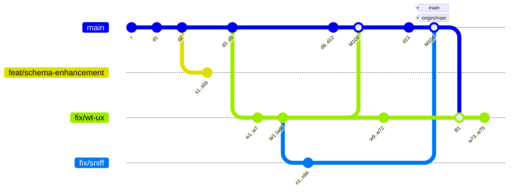

# Implementation Log for 2026-09-27-graph-sparse-lanes (4 phases)

## Phase 1

Host: macOS (Darwin 27.2.0), Apple Silicon dev Mac. Date: 2026-09-28.

### E1: the observed-shape topology (one history, three builders)

All three builders produce this history. The commit counts match in every
builder. Only the construction differs: `commit-tree` in L1 and L2, and
`git fast-import` in perf.

| Builder | Where | Construction |
|---|---|---|
| `observed_sparse_lanes()` | `worktree/cli/src/commands/git_graph/tests.rs` | `git commit-tree` on one tree, then `update-ref`; recorded parents in an in-memory `ForkOriginStore` |
| `Fixture::sparse_lanes()` | `worktree/cli/tests/level2_graph_in_kitty.rs` | the same `commit-tree` sequence, three linked worktrees, and the recorded parents written to the store `wt` reads under the fixture's `HOME` |
| `GraphFixture::observed_sparse_lanes()` | `worktree/cli/tests/perf_support/graph.rs` | `git fast-import`, three linked worktrees, and the recorded parents written to the store at `isolated_cache_file` |

Counts: `main` has `r`, `d1..d12`, `M103`, `d13`, and `M104`.
`feat/schema-enhancement` forks at `d2` with 55 commits. `fix/wt-ux` forks at
`d5` with `w1..w8`, where `W1` = `w8` is the tip `M103` merged. It then
continues with 64 more commits, merges `main` back at `B1`, and adds 3 more
(75 of its own). `fix/sniff` forks at `W1` with 94 commits, and `M104` merges
it into `main`. `origin/main` = `main` = `M104`. Recorded parents:
`fix/wt-ux` → `main`, `fix/sniff` → `fix/wt-ux`, and
`feat/schema-enhancement` → `main`.

### Spike S1: label geometry (`spikes/s1-geometry/`)

`run.sh` builds `src/main.rs` in a temporary crate against the repository's
`Cargo.lock` and lays out each case directly with `mermaid-rs-renderer`
0.3.1's `compute_layout`, at steps 34, 50, and 79, under two themes:
`Theme::mermaid_default()` (font 16) and the same theme with
`font_size = 24`. `observed.mmd` is the gathered Mermaid text of
`observed_sparse_lanes()`, captured by the S2 test. The full output is in
`output-macos.txt`.

Renderer defaults: `commit_step = 34`, `layout_offset = 8`,
`parallel_commits = false`.

**Linearity (R4 premise): confirmed.** In every case, under both themes and in
both directions, every commit x and both x edges of every tag equal
`a + index × step` to within 0.0000 user units, where `index` is the commit's
position in `GitGraphLayout::commits`. Tag y bounds do not change with the
step. Commit x rises strictly with placement index. A single widening computed
from the first pass therefore always clears the pair exactly, and the
second-pass shortfall was `None` in every case. Tags are not centered on their
commit. A 65.05-wide tag spans `commit_x − 35.78 .. commit_x + 29.27`.

**Right-to-left: not reachable from Mermaid text in 0.3.1.**
`parse_gitgraph_direction` recognizes only `LR`, `TB`, and `BT`, as a bare
line or after `direction`, and it skips the `gitGraph` header line. So
`direction RL` parses as the default `LeftRight`
(`rl-text-direction-line`). A `Graph` with `direction = RightLeft` set
programmatically lays out exactly like LR: same x values, increasing with
index, and identical numbers to the LR rows. The layout has no `RightLeft`
branch, and `render_gitgraph` handles only `TopDown` and `BottomTop`
specially, so nothing is mirrored at SVG emission either. R2's rule ("the
earlier label is the one whose commit has the smaller x"; distance = index
difference) holds for both directions, and index order and x order agree.

**Theme font size.** Tag label widths are measured at
`gitgraph.tag_label_font_size` (10) with the theme's `font_family`, so
`theme.font_size` changes only the gap (`TAG_GAP_EM × font_size`), not the
label widths: the 24-pt rows have the same bounds as the 16-pt rows.

**Computed versus old steps** (the "old" step is `max(34, widest + gap)`; "R3" is plan R1–R3):

| Case | Font | Default-step min clearance | Old step | R3 step | Clearance at R3 step |
|---|---|---|---|---|---|
| isolated `main`/`origin/main` stack on one commit | 16 | no counting pair | 81.05 | default (34) | — |
| same | 24 | no counting pair | 89.05 | default (34) | — |
| `main`/`origin/main` one commit apart | 16 | −7.71 (overlap) | 81.05 | 57.71 | 16.00 |
| same | 24 | −7.71 | 89.05 | 65.71 | 24.00 |
| cross-lane, unequal (`BETA` on a branch, `v1` next on `main`) | 16 | 13.49 (no overlap, under 1 em) | 234.68 | 36.51 | 16.00 |
| same | 24 | 13.49 | 242.68 | 44.51 | 24.00 |
| neighbors, unequal (`ALPHA`, `v1`, gap, `PR #104 → main`) | 16 | −84.65 | 246.66 | 134.65 | 16.00 |
| stack of three between `ALPHA` and `v1.0.0` | 16 | −116.02 | 246.66 | 166.02 | 16.00 |
| RL (programmatic), one commit apart | 16 | −7.71 | 81.05 | 57.71 | 16.00 |
| **observed** (`observed.mmd`) | 16 | no counting pair | 81.05 | **default (34)** | — |
| **observed** | 24 | no counting pair | 89.05 | **default (34)** | — |

The observed graph's only tags are `main` and `origin/main`, stacked on
`M104`, so R3 gives the default step. The minimum clearance at the R3 step is
exactly the one-em gap in every widened case, which is the minimality
property Phase 2 must assert.

**Rulings.** R1 and R3 are confirmed as written, and so is R4: its fallback is
unreachable on a real graph under linearity, so it is tested only through the
injected placement function, as planned. R2 is confirmed, with an amendment
recorded in the plan: a "real RL collision" cannot be written as Mermaid text
in 0.3.1, so Phase 2 proves RL ordering in two ways. The pure
`required_step` function takes synthetic RL-ordered input, and a geometry
test asserts that `direction RL` text lays out exactly like LR. It is not a
test of a mirrored layout. R8 is confirmed: `index` and `x` on
`CommitGeometry` are needed for Phase 2's minimality assertion (clearance
divided by index distance), because tag bounds alone do not identify a
commit's placement index.

### Spike S2: classification reproduction (`spikes/s2-classification/`)

A temporary test (`spike_test.rs.txt`, appended to `git_graph/tests.rs`, run
once, then removed) gathered `observed_sparse_lanes()` in the base view with
**unchanged** code. Its output is `output-macos.txt`. Commit IDs vary between
runs because `commit-tree` stamps the current time. The names below come from
the fixture.

- `fix/sniff`: `parent = fix/wt-ux`, `fork = W1`, `merged_into = None`,
  entries `+89` plus 5 commits. The Mermaid text declares `branch fix/sniff`
  before `main`'s first commit, so the lane is unconnected, and
  `GraphFacts::incomplete = true`. This is the observed defect.
- `classify(sniff tip, [fix/wt-ux tip, M104])` =
  `IntegratedOtherwise { candidate: 0, first_parent: w72 }` (today's result).
- `classify(sniff tip, [M104])` =
  `MergedDirectly { candidate: 0, merge: M104, first_parent: d13 }`, so under
  C1 the walk over `[fix/wt-ux, main]` remembers the weak parent result and
  returns `MergedDirectly { candidate: 1, merge: M104 }`.
- `merge_base(M104^1 = d13, sniff tip) = W1`, which confirms C4.
- `W1` is on neither `main`'s first-parent chain nor `fix/wt-ux`'s drawn run
  (`main..fix/wt-ux`), though it is on `fix/wt-ux`'s full first-parent chain.
  The sanity test asserts all three facts, so the fork stays undrawn (C5).
- `fix/wt-ux`: unmerged, `fork = M104` (it merged `main` back), entries `+63`
  plus 5 commits (`B1` among them). `feat/schema-enhancement`: `fork = d2`,
  `+50` plus 5.
- **Defect 1 reproduced at L1.** Planning the gathered graph with the real
  measurement at 200×60 (Default theme) gave `commit_step = 81.05`,
  `trimmed_commits = 20`, 193 columns, and every branch lane cut to its `+N`
  square plus its tip (`fix/sniff` kept 2). The planned text is
  `spikes/s1-geometry/observed-planned-before.mmd`.

C1–C4 are confirmed without amendment.

### Observed-shape fixtures (Wave 1)

- **L1** `observed_sparse_lanes()` (`worktree/cli/src/commands/git_graph/tests.rs`),
  with helpers `commit_on`/`chain_on` (`git commit-tree`, one Git call per
  commit, about 1.6 s for the 250 commits) and the shared `SPARSE_*` count
  constants. Sanity test:
  `observed_sparse_lanes_fixture_has_the_observed_topology` checks the exact
  parents of `M103`, `M104`, and `B1`, `origin/main` = `main` = `HEAD` =
  `M104`, the tips, the `d2` fork, the own-commit counts, and that `W1` is off
  `main`'s first-parent chain and off `fix/wt-ux`'s own run
  (`main..fix/wt-ux`), though on its full first-parent chain. It also checks
  the recorded parents. The test runs twice (lib and `wt` bin targets), as
  every `git_graph` unit test does.
- **Kitty L2** `Fixture::sparse_lanes()` (`worktree/cli/tests/level2_graph_in_kitty.rs`):
  the same sequence on top of `Fixture::init`'s two commits (`r`, `d1`), with
  worktrees `wt-schema`, `wt-ux`, and `wt-sniff`. The recorded parents are
  written with `worktree::fork_origin::record` to the store under the
  fixture's `HOME` (`Library/Caches` on macOS, the `XDG_CACHE_HOME` it sets
  elsewhere), which is where `GraphRun::new`'s `wt list` reads them. Sanity
  test: `level2_sparse_lanes_fixture_has_the_observed_topology`, gated on
  Kitty like the rest of the file, ran for real on this Mac (1.8 s).
- **Perf** `GraphFixture::observed_sparse_lanes()`
  (`worktree/cli/tests/perf_support/graph.rs`), built with `fast-import`. The
  recorded parents are written to `GraphFixture::fork_store()`
  (`isolated_cache_file`). `build` now names worktree directories with `/`
  replaced by `-`; no existing fixture has a `/` in a branch name, so their
  paths are unchanged. Sanity test (L1, Unix, in
  `perf_graph_stages.rs`): `observed_sparse_lanes_graph_fixture_has_the_observed_topology`.
- `perf_graph_stages.rs`: `list_perf_in_pty` takes the terminal size;
  `stage_samples` holds the warm-up and sampling loop that the existing
  120×40 test used inline, and that test now calls it unchanged at 120×40. The
  new perf case is `perf_graph_stages_for_the_observed_sparse_lanes_at_200x60`.
  It prints the median and the min–max spread of both stages.

### Perf baseline (before), unchanged spacing and classification code

Run: `WT_GRAPH_PERF_SAMPLES=10 just test-perf perf_graph --cargo-profile release`
from `worktree/`, with nothing else running. Host: Apple M4 Max, 128 GB,
macOS (Darwin 27.2.0), rustc 1.98.1, `release` profile. Each row has 10
samples after one warm-up run, `TERM_PROGRAM=ghostty` under `script`. The raw
output is `spikes/perf-before-macos.txt`.

| Fixture | Size | Samples | `graph gather` median (min–max) | `graph image render (biscuit-terminal)` median (min–max) |
|---|---|---|---|---|
| observed sparse lanes | 200×60 | 10 | 61.0 ms (58.8–70.3) | **351.4 ms (350.0–357.8)** |

The existing 120×40 table from the same run gives context for the fixed cost
(medians only; that test prints no spread):

| Fixture | `graph gather` | `graph image render (biscuit-terminal)` |
|---|---|---|
| floor (one commit) | 10.9 ms | 341.8 ms |
| ordinary | 38.9 ms | 345.8 ms |
| older essential connections | 130.9 ms | 347.6 ms |
| multiple selected branches | 64.1 ms | 348.6 ms |

The render stage on the observed shape is only about 10 ms above the
one-commit floor, and the floor is the ~340 ms fixed cost the `worktree` skill
describes. Phase 3 reruns the same command on this host with the same profile
and size.

### Phase 1 close

Phase 1 changes no production behavior. `git status` shows no change under
`biscuit-visualized/`, `biscuit-terminal/`, or `worktree/cli/src/` apart from
`git_graph/tests.rs`. So its tests prove the fixtures, not a fix.

| Requirement (Phase 1) | Test or evidence |
|---|---|
| E1 topology, L1 | `commands::git_graph::tests::observed_sparse_lanes_fixture_has_the_observed_topology` (lib and bin targets) |
| E1 topology, Kitty | `level2_sparse_lanes_fixture_has_the_observed_topology` (ran on macOS, 1.8 s) |
| E1 topology, perf | `perf_graph_stages::observed_sparse_lanes_graph_fixture_has_the_observed_topology` (L1, Unix) |
| 200×60 perf case | `perf_graph_stages_for_the_observed_sparse_lanes_at_200x60` (tier `perf_`, run by `just test-perf`) |
| S1 linearity, RL, steps | `spikes/s1-geometry/run.sh` → `output-macos.txt` |
| S2 reproduction | `spikes/s2-classification/spike_test.rs.txt` → `output-macos.txt` |

Gates run in `worktree/`:

- `just test`: 749 passed, 30 skipped (the existing skips), and every new
  L1 test ran.
- `just lint`: clean.
- `cargo clippy -p worktree-cli --features terminal-tests --all-targets -- -D warnings`:
  clean. It covers the feature-gated Kitty file that `just lint` does not
  compile.
- `just check-tier-coverage worktree`: 0 stranded.
- `BISCUIT_TEST_REQUIRED_BACKENDS=kitty cargo nextest run -p worktree-cli --features terminal-tests -E 'binary(level2_graph_in_kitty) & test(sparse_lanes)'`:
  passed.
- The perf baseline command above passed.

Not run in Phase 1: cross-OS runs. The new code is test-only and uses only
`git commit-tree`, `update-ref`, `fast-import`, and `worktree add` with
arguments passed directly, not through a shell. The perf sanity test is
Unix-only by its file's `#![cfg(unix)]`, and the Kitty file runs on macOS only.
The plan schedules cross-OS proof in Phase 3, Wave 5. No test failed before or
after these changes.
