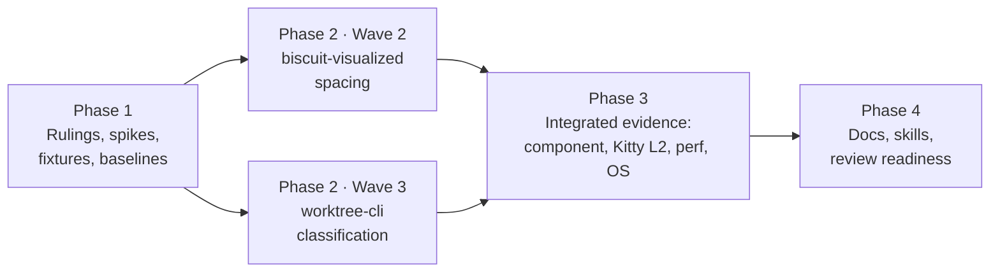

# Plan: restore commit density and direct merges in the `wt list` graph

Specification: [spec.md](spec.md). Related: `2026-09-27-graph-merged-branch`.

## Summary and Definition of Done

### The work

The spec has two independent regressions. Each belongs to a different package, and they meet only in the final `wt list` image.

| Defect | Root cause (verified in source on 2026-09-28) | Owner |
|---|---|---|
| 1. Branch lanes collapse to `+N` plus their tips | `layout()` (`biscuit-visualized/src/src/mermaid/gitgraph.rs:113`) sets `commit_step = max(34, widest tag + 1 em)` whenever any horizontal tag exists. One long isolated label (`origin/main`) raises every column from 34 to 79, and `GitGraph::plan_with` then trims commits to fit. | `biscuit-visualized` |
| 2. `fix/sniff` has no merge edge and no connection | `History::classify` (`worktree/cli/src/commands/git_graph/topology.rs:109`) returns the **first** candidate containing the tip. The recorded parent `fix/wt-ux` now contains it only by way of `main`, so the result is `IntegratedOtherwise` and the direct merge on `main` is never seen. `place()` (`worktree/cli/src/commands/git_graph.rs:438`) would also take the fork and the lane's stop from the parent's tip, and that tip now contains the branch tip. | `worktree-cli` |

Source facts the plan relies on, read from `mermaid-rs-renderer` 0.3.1 (`src/layout/gitgraph.rs`):

- In horizontal, non-parallel layouts, commits are placed in `seq` order at `pos`, and `pos += commit_step + layout_offset` for each commit. A commit's x coordinate is therefore linear in `commit_step`, with slope equal to its placement index.
- A horizontal tag's polygon is built from `axis_pos` (= `pos`) and `pos_with_offset` (= `pos + layout_offset`), so it is **not** centered on the commit. Both edges are still linear in the step. Tags on one commit share one `max_width` and x extent and are stacked by `tag_spacing_y`.
- The layout code has no `RightLeft` branch. Whether a right-to-left graph is mirrored in the layout or only at SVG emission must be measured (Spike S1).
- `layout()` always starts from `LayoutConfig::default()`, where `parallel_commits` is `false`, so the parallel-placement path cannot occur on this code path.

`MermaidDiagram::compute_layout` (`render.rs:268`) is the single path shared by `natural_size`, `render_svg`, and `gitgraph_geometry`. The spacing change goes only into `gitgraph::layout`, so measured and rendered sizes cannot diverge.

### What success looks like

- [ ] In a real-Git fixture that mirrors the observed history, at 200×60, every affected branch lane (`feat/schema-enhancement`, `fix/wt-ux`, `fix/sniff` analogs) plans **more than its tip** after its `+N` square, and the laid-out `commit_step` equals the renderer's default.
- [ ] The `fix/sniff` analog has `merged_into` = the default-lane merge commit, the merge edge is drawn, its fork (the old parent tip) is undrawn and never substituted, and the incomplete-history notice is shown.
- [ ] Every existing classification fixture keeps its result (child merged into parent, fast-forwarded label, indirect integration with notice, shallow clone gap, deleted parent fallback).
- [ ] Every existing `biscuit-visualized` spacing test keeps passing (neighboring long labels, `main`/`origin/main` one commit apart, stack of three, cross-lane), and new tests prove: single-commit tags give the default step, non-overlapping cross-lane tags give the default step, and a real collision gets the **smallest** step that restores the one-em gap (tight within tolerance).
- [ ] `MERMAID_BACKEND` is bumped, and the cache test pins the new identifier.
- [ ] The Kitty L2 test shows the restored density in the saved transmitted image with no overlapping labels.
- [ ] `graph image render (biscuit-terminal)` timings are recorded before and after on the same fixture, terminal size, and build profile, with the spread across runs.
- [ ] Docs and skills describe the new rules. `just test`/`just lint` pass in `biscuit-visualized`, `biscuit-terminal`, and `worktree`. The spec is marked implemented; the implementation is ready for review. Agents do not move the spec to `_completed`.

### Out of scope (restated from the spec)

- Per-gap tag spacing. The step stays one global value.
- Reconstructing earlier merges of a branch that continued after its merge. The `fix/sniff` fork remains undrawn, with the notice.
- Any change to branch selection, the height cap, the focused-view exemption, `LINE_WINDOW`/`BASE_DEFAULT_WINDOW`, explicit `--width`, or the trim order.

### Phase overview

## Phase 1 — Rulings, Spikes, Fixtures, and Baselines

### Necessary Rules

These rulings resolve points the spec leaves to implementation. Each applies unless a Phase 1 spike disproves its premise. If one does, record the finding in the implementation log and amend the ruling here before Phase 2 starts.

**Spacing (`biscuit-visualized`)**

- **R1 — Which pairs count.** A pair is two tags on **different** commits in a horizontal (`LR`/`RL`) gitGraph with no rotated tag. The pair counts only when their label bounds' **vertical interiors** overlap (`a.y1 < b.y2 && b.y1 < a.y2`, the same strict test as `Bounds::overlaps`; a shared edge does not count). Tags on one commit add no requirement. Vertical graphs, graphs with any rotated tag, and graphs with no tag keep the single default pass.
- **R2 — Drawing order.** For each pair, the "earlier" label is the one whose **commit** has the smaller x in the first pass, and the distance is the absolute difference of the two commits' placement indices (their order in `GitGraphLayout::commits` after the renderer's `seq` sort). This handles LR and RL with one rule. Spike S1 confirms that the index gap and x order agree, and records how RL is laid out.
    - **Amended after S1 (2026-09-28):** `mermaid-rs-renderer` 0.3.1 cannot produce a right-to-left gitGraph from Mermaid text. Its gitGraph parser recognizes only `LR`/`TB`/`BT`, so `direction RL` parses as LR. A `Graph` given `RightLeft` programmatically lays out and renders exactly like LR, with nothing mirrored in the layout or at SVG emission. The rule stands unchanged, and RL is proven through `required_step`'s synthetic RL-ordered input plus a geometry test that `direction RL` text lays out exactly like LR (see Wave 2).
- **R3 — Required step.** `gap = TAG_GAP_EM × theme.font_size` (unchanged constant). For each counting pair, `shortfall = gap − (later.x1 − earlier.x2)`. When the shortfall is positive, the pair requires `default_step + shortfall / index_distance`. The chosen step is the maximum over all pairs and never less than the default. If no pair has a positive shortfall, return the first pass unchanged. Floating-point comparisons use a fixed tolerance `SPACING_EPSILON = 0.01` user units, applied only in the "already clear" direction, so a pair within epsilon of the gap is treated as clear. The computed step is not rounded.
- **R4 — Verification and convergence.** After laying out at the chosen step, recompute the shortfalls from the second-pass bounds (same R1/R2 rules). If any remains, widen from the remaining overlap and lay out again, for at most `MAX_SPACING_PASSES = 3` layouts in total after the first. If a shortfall still remains, fall back to `max(chosen, widest tag + gap)`, the existing rule and the proven-safe bound. The fallback is a return, not another loop. Under S1's linearity finding the first widening should always verify, so a unit test proves the fallback only through an injected placement function (R6), not a real graph.
- **R5 — Default step source.** Tests compare against the renderer default, never a literal `34`. `biscuit-visualized` exposes `#[doc(hidden)] pub fn default_gitgraph_commit_step() -> f32` next to `GitGraphGeometry`, so `worktree-cli` and `biscuit-terminal` tests (which do not depend on `mermaid-rs-renderer`) can assert it.
- **R6 — Structure.** Keep `layout(graph, theme) -> (Layout, LayoutConfig)` as the only entry point. Put the pair and shortfall arithmetic in a pure function over `(index, commit x, tag Bounds)` tuples, `required_step(default, gap, &[LabeledCommit]) -> Option<f32>`, so it can be unit-tested with synthetic offsets (unequal, offset, and RL-ordered labels) independently of font measurement. The layout loop calls it.
- **R7 — Cache identity.** Bump `MERMAID_BACKEND` from `mermaid-rs-renderer@0.3.x+bv2` to `+bv3` and update `cache_tests.rs`. This covers every caller: `GitGraph`, `bt git-graph`, and Darkmatter's Mermaid blocks. No other cache key changes.
- **R8 — Geometry evidence.** `GitGraphGeometry`/`CommitGeometry` may gain `#[doc(hidden)]` fields (`index: usize`, `x: f32`) if tests need them to prove R2/R3 against real layouts. They stay test-support API with no stability promise.

**Classification (`worktree-cli`)**

- **C1 — Strength order.** `History::classify` walks the candidates in the existing order (recorded parent, default, diverged `origin/<default>`). `NoSeparateHistory` (first-parent match) and `MergedDirectly` are **strong** and returned at the first candidate that yields one. `IntegratedOtherwise` is **weak**: the first is remembered and the walk continues. After the walk: return the remembered weak result if one exists, otherwise `Unmerged`.
- **C2 — Unknowns.** A `GatherGap` raised while evaluating a candidate **before** any weak result was remembered returns `Err(GatherGap)`, exactly as today, even if a later candidate would have produced a direct merge. A `GatherGap` raised on a **later** candidate after a weak result was remembered returns that weak result. It already sets the placement's `gap`, so the notice appears, no merge edge is invented, and the result is identical to today's for that input. The shallow-repository guards stay where they are.
- **C3 — Carrying the deferral.** `Integration::MergedDirectly` gains `after_indirect: bool`: `true` when an earlier candidate contained the tip only indirectly. No other variant changes. `NoSeparateHistory` after an indirect match is still a label on the lane that has the tip on its first-parent chain.
- **C4 — Fork and stop for a deferred direct merge.** In `place()`, `parent_elsewhere` (fork and stop measured against the parent's tip) applies only when the merge went to a non-parent lane **and** `after_indirect` is `false`. When `after_indirect` is `true`, the fork is `merge_base(C^1, tip)` and the stop is `[C^1]`, keeping the merge commit and its first parent together as the spec requires. The fork lane stays the recorded parent's lane when there is one (the existing `fork` closure already prefers `parent_lane`).
- **C5 — Undrawable fork.** No new code draws or substitutes the fork. The existing `assemble` fallback (try the expected lane, then the default lane; verify anchors with `log --no-walk`) and `GitGraph`'s rule that an undrawable fork sets `GitGraphPlan::incomplete` already give the required outcome. Phase 2 tests assert it; they do not re-implement it.
- **C6 — Notice without gaps.** The notice must not appear when every connection is drawn. Tests assert `incomplete == false` on the existing fully drawn fixtures, and on a new fixture where the direct-merge-after-indirect branch's fork **is** drawable.

**Evidence**

- **E1 — One observed-shape history, three builders.** L1 unit tests (`git_graph/tests.rs`), the Kitty L2 test (`cli/tests/level2_graph_in_kitty.rs`), and the perf test (`cli/tests/perf_support/graph.rs`, built with `git fast-import`) cannot share a module. Each gets a builder for the **same** topology, documented once in the implementation log with a Mermaid diagram:
  - `main` with a long history; `feat/schema-enhancement` forked early, with ≥ 50 commits of its own.
  - `fix/wt-ux` (recorded parent `main`) with ≥ 70 commits; its tip `W1` is merged into `main` by merge `M103`, after which `fix/wt-ux` continues.
  - `fix/sniff` (recorded parent `fix/wt-ux`, forked at `W1`) with ≥ 90 commits, merged into `main` by merge `M104`. `origin/main` = `main` = `M104`.
  - `fix/wt-ux` then merges `main` (`B1`) and adds a few more commits.
  - Commit counts follow the observed `+N` values closely enough that trimming actually applies at 200 columns.
- **E2 — Size.** The observed-case assertions and the perf comparison run at **200×60**, with the perf build profile fixed to `release`. Existing 120×40 and 56×60 cases are unchanged.
- **E3 — Density assertion.** "More than the tip after the `+N` square" means the planned line has ≥ 2 commits after its leading square. Assert on `GitGraphPlan` lines, not pixels. Assert `commit_step == default_gitgraph_commit_step()` through `gitgraph_geometry` of the planned Mermaid text.

### Spikes

Spikes live under `worktree/fixes/2026-09-27-graph-sparse-lanes/spikes/`. Each writes its findings into `implementation-log.md` before Phase 2 starts.

- **S1 — Label geometry is linear, and RL behavior.** A small binary against `biscuit-visualized` that lays out a set of gitGraphs (LR and RL; one long isolated tag; `main`/`origin/main` one commit apart; unequal labels on adjacent commits on different lanes; a three-tag stack) at steps 34, 50, and 79 and prints each commit's index and x and each tag's bounds. Findings to record:
  - every tag edge is `a + index × (step + layout_offset)`, so one widening verifies (R4);
  - whether RL mirrors x in the layout or only at SVG emission, and whether R2's "smaller commit x is earlier" holds in RL;
  - the step R3 computes for each case, and the step the old widest-tag rule gives;
  - the observed Mermaid text from the spec (captured in the E1 L1 fixture) yields step = default under R3.
- **S2 — Classification reproduction.** Build the E1 topology with real Git and run today's `gather` on it. Confirm:
  - `fix/sniff` is `IntegratedOtherwise` into `fix/wt-ux`, `merged_into: None`, fork `W1`, and the lane is unconnected;
  - under C1, `classify` would return `MergedDirectly { candidate: default, merge: M104 }`;
  - `merge_base(M104^1, sniff tip) == W1`;
  - `W1` is on neither `fix/wt-ux`'s drawn first-parent run nor `main`'s first-parent chain.

  If `merge_base(M104^1, tip)` is not `W1`, stop and amend C4 before Phase 2.

### Tasks

**Wave 1** (all run concurrently; they touch disjoint files)

- [x] **Spike S1: label geometry**
    - build and run the S1 binary; record linearity, RL behavior, and computed-versus-old steps in `implementation-log.md`
    - confirm or amend R2–R4
- [x] **Spike S2: classification reproduction**
    - build the E1 topology in a scratch repository; record the classification, fork, and first-parent facts
    - confirm or amend C1–C4
- [x] **Observed-shape fixtures**
    - add the E1 builder to `worktree/cli/src/commands/git_graph/tests.rs` (`observed_sparse_lanes()`), to `worktree/cli/tests/level2_graph_in_kitty.rs` (`Fixture::sparse_lanes()`), and to `worktree/cli/tests/perf_support/graph.rs` (`GraphFixture::observed_sparse_lanes()`, via `fast-import`)
    - add no assertions about the fixed behavior yet; each builder has a sanity test that the topology is as described in E1 (merges' parents, `origin/main` position, recorded parents)
- [x] **Perf baseline (before)**
    - add a perf case that runs `wt list --perf` over `GraphFixture::observed_sparse_lanes()` at 200×60 (a new test beside `perf_graph_stages_are_reported_for_every_graph_fixture`; the existing 120×40 test is unchanged)
    - on **unchanged** code, record `graph image render (biscuit-terminal)` with `WT_GRAPH_PERF_SAMPLES=10 just test-perf perf_graph --cargo-profile release`: host, OS, build profile, samples, median, min–max spread

**Checkpoint 1**

- [x] The spike findings and baseline timings are in `implementation-log.md`, and every ruling is confirmed or amended.
- [x] `just test` passes in `worktree` with the new fixtures (sanity tests only).

## Phase 2 — Spacing and Classification

The two waves touch different packages and can run concurrently. Wave 3's tests do not depend on Wave 2, because classification is asserted on `GraphFacts`, not on the image.

### Wave 2 — `biscuit-visualized` collision-driven spacing

- [ ] **Pure step calculation**
    - add `required_step` (R6) in `mermaid/gitgraph.rs`, with the R1 pair filter, the R2 ordering, the R3 shortfall arithmetic, and `SPACING_EPSILON`
    - unit tests on synthetic inputs: no pairs → `None`; same-commit tags → `None`; pairs without vertical overlap → `None`; one overlapping adjacent pair → the exact step; a pair three indices apart → shortfall ÷ 3; unequal and offset labels; RL-ordered input; the maximum over several pairs
- [ ] **Layout loop**
    - rewrite `layout()`: first pass at the default; if horizontal and unrotated, call `required_step`; lay out again; verify (R4); iterate up to `MAX_SPACING_PASSES`; fall back to the widest-tag step
    - make the placement step injectable for tests only (a private function taking a `compute` closure) so the fallback branch is tested without a pathological real graph
    - update `layout()`'s docs and the module `//!` "Tag spacing" bullet (the old widest-tag wording becomes stale)
- [ ] **Geometry and default-step accessors**
    - add `default_gitgraph_commit_step()` (R5), and `index`/`x` on `CommitGeometry` if S1 showed they are needed (R8)
- [ ] **Geometry tests** (`src/src/tests/gitgraph_tests.rs`)
    - keep: long labels on neighboring commits, `main`/`origin/main` one commit apart, a stack of three, cross-lane with controls, the vertical and untagged single pass, and measured size equals the spaced layout
    - add: tags on one commit only → default step; two tagged commits on different lanes one column apart without vertical overlap → default step; the observed Mermaid text from S1 → default step; LR real collisions → no overlap **and** at least one counting pair's gap within `SPACING_EPSILON` of the one-em gap (proving minimality); `direction RL` text → the same geometry as its LR twin (amended after S1: 0.3.1 has no RL layout, so a mirrored RL collision cannot be built from text); a theme font override (`MermaidTheme` with a larger font) → the gap scales with the font size and measured equals rendered geometry (S1: tag widths are measured at the renderer's `tag_label_font_size`, so only the gap follows `theme.font_size`)
    - existing tests that asserted `commit_step == widest + gap` are rewritten to assert the gap property, not the old formula
- [ ] **Cache identifier**
    - bump `MERMAID_BACKEND` to `+bv3` (R7); update `cache_tests.rs` and the `file_cache.rs` doc example

**Checkpoint 2a**

- [ ] `just test` and `just lint` pass in `biscuit-visualized` and `biscuit-terminal`. `biscuit-terminal`'s git-graph tests pass unchanged; any expectation that encoded the old widened step is corrected, and the reason is recorded in the log.

### Wave 3 — `worktree-cli` classification order

- [ ] **Deferred indirect classification**
    - change `History::classify` per C1–C3; update its doc comment (it currently says "the first of `candidates` … that contains it") and the `Integration` docs
    - extend `classify_names_every_integration_and_tries_candidates_in_order` with parent-indirect-then-default-direct → `MergedDirectly { after_indirect: true }`; parent-indirect with no later strong result → the parent's `IntegratedOtherwise`; parent first-parent while the default also contains the tip → the parent's `NoSeparateHistory`; parent direct merge while the default also contains the tip → the parent's `MergedDirectly`
- [ ] **Fork and stop for deferred merges**
    - change `place()` per C4; update the fork comment at the `parent_elsewhere` line
- [ ] **Topology tests** (real Git, `git_graph/tests.rs`)
    - `fix/sniff`-shape (E1): `merged_into` = `M104`, the merge edge on the default lane, the lane's commits limited to the branch's own first-parent run, the fork `W1` not drawn, not substituted, and `incomplete == true`
    - a variant whose fork **is** on a drawn lane: merge and fork both drawn, `incomplete == false` (C6)
    - a child merged into its parent, parent later merged into default → still merged into the parent (existing `a_child_merged_into_its_parent_merges_on_the_parent_lane` keeps passing unchanged)
    - the parent has the tip on its first-parent chain while another lane contains it → a label on the parent's lane
    - the earlier candidate is indirect and no later candidate is strong → the indirect lane plus the notice (existing `an_indirectly_integrated_branch_gets_a_lane_without_a_merge_and_the_notice` keeps passing)
    - an unknown earlier candidate (shallow clone) → notice and no merge edge, even where a later candidate has a direct merge (extend `a_shallow_clone_draws_what_it_can_verify_and_reports_the_rest`, or add a case with a scripted `GatherGap` if the shallow fixture cannot express it)

**Checkpoint 2b**

- [ ] `just test` and `just lint` pass in `worktree`, and every pre-existing `git_graph` test passes without edits to its expected results.

## Phase 3 — Integrated Evidence

Depends on both Phase 2 waves.

### Wave 4 (concurrent)

- [ ] **Component plan assertions** (`git_graph/tests.rs`)
    - gather `observed_sparse_lanes()` and plan with the real measurement at 200×60: every affected branch lane has ≥ 2 commits after its `+N` square (E3); `commit_step == default_gitgraph_commit_step()`; the `fix/sniff` lane merges into `M104`; no tag overlaps; tags on their SHAs; `GitGraphPlan::incomplete == true` only because of the `W1` fork
    - add the fixture to `gathered_graphs_lay_out_with_exact_merges_and_no_overlapping_tags` so the 120×40 and 56×60 geometry checks cover it too
- [ ] **Kitty L2**
    - add `level2_graph_restores_lane_density_in_kitty` using `Fixture::sparse_lanes()` at 200×60, with the existing text, APC, and screenshot checks, keeping the evidence as `wt-graph-sparse-200x60-{screenshot,transmitted}.png`
    - run it locally on macOS (needs Screen Recording permission) and inspect the transmitted PNG: density visibly restored, labels separate, merge edge from the `fix/sniff` lane into `main`
    - existing `level2_graph_*` tests keep passing
- [ ] **Perf after**
    - rerun the Phase 1 perf case on the same host, profile, and size; record the after median and spread beside the baseline; note that the extra verification layout pass is the expected cost

### Wave 5

- [ ] **Cross-OS proof**
    - load the `os` skill; run `just test` for `biscuit-visualized` and `worktree` on Linux and native Windows through the repo's cross-check hosts (`./scripts/cross-check.sh --os <os> <package>`), or record the qualifying receipts
    - font measurement differs by OS, so any density assertion that fails on one OS only is a finding. Fix the assertion's robustness (E3), never the OS.

**Checkpoint 3**

- [ ] Component, L2, perf, and cross-OS evidence are recorded in `implementation-log.md` with paths to the saved images.

## Phase 4 — Documentation, Skills, and Review Readiness

### Wave 6 (concurrent; disjoint files)

- [ ] **`biscuit-visualized/docs/mermaid-gitgraph.md`**
    - replace the widest-tag formula and the "up to about 3.8×" paragraph with the collision-driven rule: which pairs count, the gap, minimality, the verification pass, the fallback, and the unchanged vertical/rotated behavior
    - add a Mermaid or table example contrasting an isolated long label (no widening) with `main`/`origin/main` one commit apart (widening); update the test inventory and the backend identifier
- [ ] **`biscuit-terminal/docs/components/git_graph.md`**
    - fix the sizing paragraph (line ~110): only colliding labels widen the step, so a single long label no longer forces trimming
- [ ] **`worktree/docs/git-graph.md`**
    - the classification order with the direct-merge preference, and an example of the `fix/sniff` shape (merge drawn, fork undrawn, notice)
    - fix the spacing sentence (line ~166)
    - no reference to this fix by name or path
- [ ] **Skills**
    - `.claude/skills/worktree/SKILL.md`: the `commands/git_graph.rs` bullet (classification order, deferred indirect match, fork against `C^1` after an indirect parent) and the "widens commit spacing" wording
    - `.claude/skills/biscuit-visualized/` and `.claude/skills/biscuit-terminal/components.md` where they state the widest-tag rule (grep `widest`)

### Wave 7

- [ ] **Drift sweep**
    - `grep -rn "widest tag\|widest + \|widen" biscuit-visualized biscuit-terminal worktree .claude/skills --include=*.md --include=*.rs` and fix every stale statement
- [ ] **Review readiness**
    - `just lint` and `just test` in all three areas; `just test-l2` for the graph binary on macOS
    - update the spec frontmatter: `status: implemented`, `implemented: true`, `implemented_by: claude/opus`
    - finish `implementation-log.md` (rulings amended, departures from the spec, evidence locations)
    - the final state is "implementation complete, ready for review". No commit unless asked, and no move to `_completed`.

**Checkpoint 4**

- [ ] Every "What success looks like" item above is checked, with its evidence linked from the implementation log.
