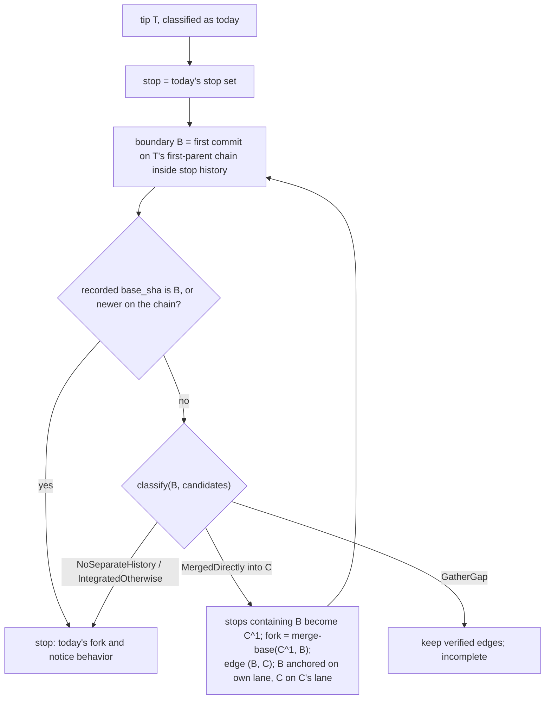
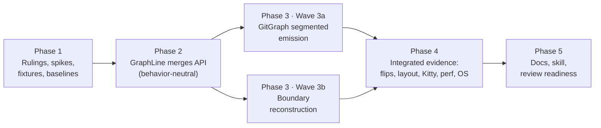

# Plan: draw a branch that continued after its merge

Specification: [spec.md](spec.md). Related: `2026-09-27-graph-merged-branch`, `2026-09-27-graph-sparse-lanes`.

## Summary and Definition of Done

### The work

Two packages change, and they meet in the `wt list` image. `biscuit-visualized` is not expected to change (see ruling D6).

| Part | Today (verified in source on 2026-09-28) | Change | Owner |
|---|---|---|---|
| 1. Merge edges on a line | `GraphLine::merged_into: Option<String>` (`biscuit-terminal/lib/src/components/git_graph.rs:113`) holds one destination, and its source is implicitly the lane's tip. | An ordered `merges: Vec<LaneMerge { source, destination }>` with one builder, `with_merge(source, destination)`. `merged_into` is removed, and every caller migrates. | `biscuit-terminal`, callers in `worktree-cli` |
| 2. Emission | `GitGraph::emit_lane` (`:753`) is a recursive depth-first emitter that marks a lane `finished` only after its last entry. `merged_lane` (`:804`) draws a merge only when the source lane is finished. | Segmented emission: a lane pauses after a merge source `B` until its destination `C` is emitted, then resumes after the `merge`. Dependency-aware sibling order, cycle detection, and per-edge incompleteness accounting. The height cap and width trimming learn about sources and every destination. | `biscuit-terminal` |
| 3. Boundary reconstruction | `place()` (`worktree/cli/src/commands/git_graph.rs:438`) classifies each tip once. A continued branch is `Unmerged`, its stop is the default tips, and its fork is the old merged tip, which no lane draws. | After classification, locate the lane boundary `B`, `classify(B, candidates)`, and while that is `MergedDirectly` into `C`, extend the stop to `C^1`, record the edge, and walk to the next strictly older boundary. The recorded fork origin acts as a cutoff, and every unknown is a `GatherGap`. | `worktree-cli` |

Renderer facts the plan relies on, read from source on 2026-09-28:

- `repair_gitgraph_merges` (`biscuit-visualized/src/src/mermaid/gitgraph.rs:52`) gives a labeled merge the **source lane's newest commit with `seq` below the merge's** as its second parent. So if emission pauses the source lane at `B`, `C`'s second parent is `B`. It also needs no change to support a lane that is merged twice. Spike S1 confirms this.
- The spec says `mermaid-rs-renderer` 0.3.1 leaves the source branch's head at `B` after `merge`, so a resumed `checkout <branch>; commit` has `B` as its parent. Spike S1 confirms this too.

### What success looks like

- [ ] In the PR #105-shaped real-Git fixture (base view), `fix/wt-ux` forks at the `b47a046` analog, `+N` is exact, `B` (`eeb7154` analog) is on its lane and merged into `C` (`85852c0` analog), then `572ef7d` follows. `fix/sniff-pr` is a label at `B` on the `fix/wt-ux` lane, and `incomplete` is false both in `GraphFacts` and in the plan.
- [ ] The same holds before `--ff`, both when local `main` is behind `origin/main` and when the two have diverged, where `C` is drawn on the `origin/main` line.
- [ ] `a_branch_continued_after_its_merge_is_an_unmerged_lane` is renamed and inverted: `b1` is on `b`'s lane, merged into `merge`, then `b2` follows, the fork is `d1`, and there is no notice.
- [ ] `observed_sparse_lanes()`: `fix/wt-ux` draws `W1` merged into `M103`, `fix/sniff` forks at `W1` on that lane and merges into `M104`, and there is no notice. The `Evidence` entry, the density test, and `a_direct_merge_into_the_default_branch_beats_the_parents_indirect_containment` are updated to match.
- [ ] Merged twice and then continued: both edges are drawn in source order, no commit repeats, and there is no false notice.
- [ ] A new branch created at an already merged tip, with a fork-origin record there, does not claim the old merge. Its lane stays unconnected with the notice.
- [ ] `B` reached the default branch through another branch's merge: no edge is reconstructed, and today's drawing and notice stay.
- [ ] Shallow clone: no invented merge, and the notice appears. Older-boundary failure: the earlier verified edges remain and the notice appears.
- [ ] An ordinary unmerged branch forked from the default lane has **identical `GraphFacts`** to today. Its added Git calls stay within the ruled budget (P1), and the call-count test pins the new exact numbers.
- [ ] Component tests cover a mid-lane merge, children forked before, at, and after `B`, a sibling merge chain, a cycle, and a destination hidden by the height cap. All existing component Mermaid outputs stay **byte-identical** except in tests the spec flips.
- [ ] `gathered_graphs_lay_out_with_exact_merges_and_no_overlapping_tags` includes the new fixtures, including the parents of post-merge commits.
- [ ] Kitty L2: the continued-after-merge graph draws connected with no notice, and screenshots are kept. The sparse-lanes Kitty test no longer expects the notice.
- [ ] `perf_graph_stages` medians and spread, before and after, plus Git call counts, are in `implementation-log.md`. Every existing SLA test passes.
- [ ] Docs and the skill describe the new behavior, and `just test` and `just lint` pass in `biscuit-terminal` and `worktree`. The spec is marked implemented and ready for review. Agents never move it to `_completed`, and never commit unless told to.

### Out of scope (restated from the spec)

- Squash-merge inference, merge edges for indirect integration, and merges of the default branch **into** a branch (such as `B1`), which stay ordinary commits.
- PR badge source attribution (the spec's open question): ruled out of scope in X1.
- Branch selection, the height cap's policy, the focused view's default-lane window, `--width`, trim order, tag spacing, and PR filtering.

### Phase overview

## Phase 1 — Rulings, Spikes, Fixtures, and Baselines

### Necessary Rules

Each ruling applies unless a Phase 1 spike disproves its premise. If one does, record the finding in `implementation-log.md` and amend the ruling here before Phase 2 starts.

**API (`biscuit-terminal`)**

- **A1 — Shape.** `pub struct LaneMerge { pub source: String, pub destination: String }` (full SHAs), exported beside `GraphLine` and from `prelude.rs`. `GraphLine::merges: Vec<LaneMerge>` is ordered **oldest first** as gathered. The builder `GraphLine::with_merge(source, destination)` appends one edge. `merged_into` (field and builder) is removed outright, with no deprecation, since there are no outside users.
- **A2 — The tip edge.** A `MergedDirectly` lane's latest merge is `with_merge(T, C0)`, where `T` is the placement's full tip SHA, appended **after** every reconstructed edge. Component tests that used `.merged_into(x)` become `.with_merge(<that line's tip>, x)`.
- **A3 — Phase 2 is behavior-neutral.** The migration changes no Mermaid output. Any snapshot or text diff in Phase 2 is a defect.

**Emission (`biscuit-terminal` `GitGraph`)**

- **D1 — Edge resolution.** In `arrange`, each edge of a drawn lane resolves to `(source lane, source position)` and `(destination lane, destination position)` through `drawn_positions`. An edge is **undrawable**, and sets `incomplete`, when:
  - the source is not a drawn commit on that same lane;
  - the destination is not drawn, or is on the same lane;
  - it is a second edge into one destination commit (one merge per commit; the first edge in lane order, then edge order, wins).

  Edges of lanes the height cap hid stay uncounted, as today, because the hidden-lanes note covers them.
- **D2 — Segmented depth-first emission.** Keep today's depth-first emitter, with a cursor per lane (the next un-emitted entry) replacing `finished`:
  - After a lane emits a source entry `B` and every child that hangs at `B` (so `fix/sniff` at `W1` is declared before the merge), the lane **pauses** if its edge's destination is not yet emitted.
  - When the emitter reaches a destination `C` whose source lane's cursor is past `B` and whose destination lane has a head, it emits `merge <source lane> id: …`. It then immediately emits `checkout <source>`, resumes the source lane from its cursor (depth-first, and it may pause again), and emits `checkout <destination>`.
  - A destination reached while its source has not yet been emitted through `B` is a plain `commit`. Its edge is marked **dropped** (incomplete), so the source never pauses on it later.
- **D3 — Sibling order.** Generalize `emit_merged_lanes_first` so that a sibling comes first when **any** of its edges' destinations lies on another sibling or in that sibling's subtree. With no dependency, the existing `(created_at.is_none(), created_at, index)` order is kept unchanged.
- **D4 — Cycles and stranded lanes.** When the root lane's emission returns, and some lanes are still paused, take them in deterministic order (the lane order from D3, then edge order). For each, drop its blocking edge (incomplete) and resume the lane. Each iteration either drops an edge or emits at least one entry, so emission terminates. There is no loop bound to tune.
- **D5 — Caps and trimming.** `lane_ancestors` returns the lanes holding each edge's destination (plus the fork lane and parent lane, as today). `trim_one_commit` pins every edge's source and destination position, in addition to today's tips, forks, tags, and destinations.
- **D6 — No `biscuit-visualized` change** is expected, because the repair already selects the source's newest commit before the merge. If S1 shows otherwise (for example, a resumed commit's parent is `C` instead of `B`, or a second `merge` of one lane fails), amend this ruling. The fix then goes into `repair_gitgraph_merges`, with its own tests.

**Gathering (`worktree-cli`)**

- **G1 — Where reconstruction runs.** It runs in `place()`, after classification, for `Shape::Lane` placements only. It has to finish before lanes are built, because a destination `C` is an anchor on another lane, and lanes are built in parallel. `Shape::Label` never reconstructs.
- **G2 — Boundary lookup.** `place()` makes the lane's `log --first-parent --format=%H %ct %P --max-count <LINE_WINDOW> T --not <stop>` call (today's `History::newest`, moved, not added) and hands its result to `first_parent_entries` through a new `Extent`/argument, so it is not repeated.
  - If fewer than `LINE_WINDOW` commits come back, `B` is the oldest shown commit's first parent, at no cost.
  - Otherwise, the lane's `count_first_parent` result (also handed on) gives `n`, and one `log --no-walk=unsorted --ignore-missing --format=%H %P T~(n-1)` reads `B`.
  - A root with no parent means there is no boundary. In a shallow clone, a missing parent or boundary is a `GatherGap`.
  - After an extension, the stop has changed, so the lane re-reads its window once.
- **G3 — Classification fast path.** In `integration_into`, when the oldest entry of the first-parent chain `B..X` has `B` as its first parent, return `NoSeparateHistory` without the `--ancestry-path` call. This is equivalent to today's rule, since every commit on that chain descends from `B`. It is a pure optimization that saves one call per ordinary boundary. Existing classify tests keep their results, and call-count assertions are updated.
- **G4 — Classification cache.** Keep a `Mutex<HashMap<(B, candidate tips), Result<Integration, GatherGap>>>` shared by all placements in one `assemble`, so a boundary asked about twice (for example, sibling lanes forked at one commit) costs one classification.
- **G5 — Accepting an edge.** Only `Ok(MergedDirectly { merge: C, first_parent: C^1, .. })` for `B` is accepted.
  - For each current stop, `is_ancestor(B, stop)` decides whether it is replaced. Reuse the answers classification already obtained for identical tips.
  - The new stop is `[C^1]` plus the retained stops, deduplicated.
  - ~~`B` must not be an ancestor of `C^1`, or the edge is rejected and reconstruction ends as incomplete. In a shallow clone, a "no" here is a `GatherGap`.~~ **Amended after S2 (2026-09-28):** no separate `is_ancestor(B, C^1)` call. Classification already proves it: `C` is the oldest commit of the candidate's first-parent run inside `--ancestry-path B..X`, so `C^1` does not descend from `B`, and `C^1 == B` would have been `NoSeparateHistory`. The explicit check is redundant in a complete clone, and in a shallow clone its "no" is always a `GatherGap`, so it would stop every shallow reconstruction before its first edge, which makes E3's "older boundary fails" fixture impossible. A shallow clone therefore accepts an edge exactly when `classify(B)` returns `MergedDirectly`, the same trust today's lane classification gets.
  - In a shallow clone, a stop whose `is_ancestor(B, stop)` answer is a gap is **kept** (the lane can only get shorter) and sets `gap`.
  - The boundary's position (distance from `T`) must strictly increase and must not be in the visited set. Otherwise reconstruction ends and the lane is marked incomplete.
- **G6 — Fork, anchors, lanes.**
  - The fork is `merge-base(C^1, B)` of the **oldest** accepted step. The fork lane follows today's rule: the parent's lane if one is recorded, else the lane `C` is on, with the existing default-lane fallback in `assemble`.
  - Each `B` is an anchor on the branch's own lane.
  - Each `C` is an anchor on the candidate lane it was classified against (`LaneId` from the candidate index).
  - The lane's own classification, and its tip edge (A2), are unchanged.
- **G7 — Stopping without an edge.**
  - `NoSeparateHistory` or `IntegratedOtherwise` for `B` in a complete clone ends reconstruction cleanly. With no accepted step, the facts are exactly today's.
  - `GatherGap` ends it with the verified edges kept and `gap = true`.
  - `Unmerged` for `B` should be impossible, because `B` is in stop history. Treat it as a `GatherGap`.
- **G8 — Fork-origin cutoff.** Read `forks.get(branch).base_sha` once per reconstructing branch.
  - The value is usable only if it is a full object ID (`is_object_id`) and names a commit on `T`'s first-parent chain. Check this with one `rev-list --first-parent --count <base>..T` giving `d`, verified by including `T~d` in an existing `log --no-walk` batch.
  - A malformed value, a missing object in a complete clone, a non-commit, or a commit that is not on the chain is **stale**: no cutoff, and no notice.
  - A missing object in a shallow clone is a `GatherGap`.
  - Before accepting a step at boundary distance `n`, stop if `d <= n` (the record is `B` or newer on the chain). The lane keeps its current fork. If that fork is on no drawn lane, `GitGraph`'s existing unconnected-lane accounting shows the notice.
  - Records are consulted for every drawn branch, not only for the current one.
- **G9 — Verbose is unchanged.** `commit_details_since` and the focused view's shared `merge-base` keep today's semantics. `default_base` is still passed, and reconstruction only overrides the lane's fork.
- **G10 — Network.** Nothing new touches `origin`. Every new call is a local `git` call through `git_command` or `git_command_allow_no_match`, so the existing zero-network tests keep holding.

**Performance**

- **P1 — Budget.** For an ordinary unmerged lane whose boundary is an ordinary fork, reconstruction adds at most **2** Git subprocesses when the lane is shorter than `LINE_WINDOW` (`is_ancestor` plus the first-parent chain, with G2 and G3), and at most **3** otherwise. Every accepted step adds a bounded, history-independent number. No call is made per historical commit. The existing call-count test (`tests.rs:246–251`) is updated to the exact new numbers, with a comment giving this budget.
  - **Refined after S2 (2026-09-28):** S2 measured exactly +2 (short lane: `merge-base --is-ancestor`, `rev-list --first-parent --parents`) and +3 (long lane: plus one `log --no-walk`) with G3. Without G3 each is one more (`rev-list --ancestry-path`). The bound holds when `B` is in the **first** candidate tried; `classify` asks one more `--is-ancestor` for each earlier candidate that does not contain `B` (for example, a recorded parent forked from `main` before the child's fork), so the exact budget is `2 (or 3) + one per earlier candidate`. An accepted step costs one boundary re-read (`log`, plus `rev-list --count` and `log --no-walk` for a long lane), one classification, one `--is-ancestor` per current stop not already answered, and one `merge-base`.
- **P2 — Timing evidence.** `perf_graph_stages` runs on the same host, profile (`release`), and sample count before (Phase 1) and after (Phase 4). The median and min–max spread are recorded. A median regression beyond the baseline spread on the floor or ordinary fixtures blocks review until it is explained. The SLA tests (`perf_command_sla`, etc.) must pass unchanged.
  - **Refined after the Phase 1 baseline (2026-09-28):** two baseline runs on one host gave `graph gather` medians of 14.1/10.5 ms (floor) and 54.9/40.6 ms (ordinary): run-to-run drift is larger than one run's min–max spread. "The baseline spread" therefore means the envelope of **both** recorded baseline runs (lowest min to highest max, see `implementation-log.md`). Phase 4 should run the after-measurement at least twice as well. `perf_graph_stages_are_reported_for_every_graph_fixture` prints medians only; the Phase 1 spreads came from a temporary, reverted edit that added min–max to its table. Phase 4 may make that edit permanent (it owns `perf_graph_stages.rs`).

**Evidence and fixtures**

- **E1 — The PR #105 shape** (`continued_after_merge()` in `git_graph/tests.rs`):
  - `main: r - d… - P(b47a046) - C(85852c0)`, where `C = merge(P, B)`.
  - `fix/wt-ux` is forked from `main` several commits back, with more than `LINE_WINDOW` commits up to `B(eeb7154)`, then `N(572ef7d)` on `B`.
  - `fix/wt-ux` merged `main` back in once before `B`, to exercise the "measure the fork against `B`" rule.
  - `fix/sniff-pr` is at `B`, with a fork-origin record `{ base_branch: fix/wt-ux, base_sha: B }` (the real record on this host has exactly this shape). `fix/wt-ux` has **no** record, which is also observed.
  - `origin/main` = `main` = `C`.
  - Variants: *behind* (local `main` = `P`, `origin/main` = `C`), and *diverged* (local `main` = `P'`, a commit on `P`).
- **E2 — Which view asserts `fix/sniff-pr`.** The focused view selects only the current branch and its recorded parent (unchanged), so from `fix/wt-ux` it does not draw `fix/sniff-pr`. The label is asserted in the **base view**, and in the focused view **from `fix/sniff-pr`**, where the parent `fix/wt-ux` is drawn with the reconstructed lane. The focused view from `fix/wt-ux` asserts the lane, the edge, and no notice.
- **E3 — Other fixtures:**
  - merged twice and continued;
  - a new branch at a merged tip, with a record at `B`, plus a control without the record, where the edge is reconstructed;
  - `B` integrated indirectly;
  - a shallow clone whose boundary crosses the cutoff;
  - an older boundary that fails. There is no Git failure-injection seam in `worktree::git`, so use a shallow clone whose depth keeps the **first** edge verifiable and puts the second boundary past the shallow cutoff. The spec allows this.
  - **Built in Phase 1** (`git_graph/tests.rs`): `continued_after_merge(LocalMain::{AtMerge, Behind, Diverged})`, `merged_twice_and_continued()`, `new_branch_at_merged_tip()` (its `forks` holds the record at `b1`; the control is the same repository with `ForkOriginStore::default()`), `indirect_boundary()`, and `shallow_merged_twice(depth)`: depth 1 is the "boundary crosses the cutoff" clone (only `C2` and `n`), depth 2 the "older boundary fails" clone (`C2`, `p2`, `b2`, `n`; `b1` and `C1` absent). With amended G5, S2 shows depth 2 accepts `(b2, C2)`; `merge-base(p2, b2)` and `b2`'s parent are then gaps, so the fork is unknown and the notice appears. Every commit is made with `commit_on` (E4).
- **E4 — Deterministic times.** New fixtures that the height cap ranks use `commit_on` with one-second-increasing dates, as `observed_sparse_lanes()` does. Otherwise fast hosts tie and hide different lanes.
- **E5 — Realistic records in L2 and perf fixtures.** `Fixture::record_parent` (`level2_graph_in_kitty.rs:229`) and `GraphFixture` (`perf_support/graph.rs:156`) record `base_sha` as the parent's **final** tip, which G8 would read as stale. Change both to record the actual fork commit, so that G8 is exercised with realistic data and never fires by accident:
  - `fix/wt-ux` at `d5`;
  - `fix/sniff` at `W1`, whose boundary is an ordinary fork anyway.

**Scope**

- **X1 — PR badge attribution** (the spec's open question): out of scope, as the spec recommends. No change to PR tag text.
- **X2 — `docs/` pages never name this fix.** They describe the behavior in their own words (repository rule).

### Input Robustness Matrix

This work adds a new **consumer** of one load-bearing field in an existing file: `base_sha` in `<repo hash>.fork-origins.json`. The loader (`ForkOriginStore::load_from`) is not changed. It deserializes the whole file strictly and loads **any** shape error as an empty store. The file-level cells record that behavior, and the value-level cells are new code (G8).

| Shape | Example | `base_sha` outcome | Must never |
|---|---|---|---|
| absent | key omitted from one record | whole file rejected, so an empty store: no cutoff, no parent | be read as a cutoff |
| explicit null | `"base_sha": null` | same as absent: file rejected, no cutoff (the format defines neither, so both are errors) | be read as a cutoff |
| wrong type, whole field | `"base_sha": 123` | file rejected, no cutoff | be coerced to a string |
| wrong type, one or every element | n/a: a scalar field | n/a | n/a |
| empty | `"base_sha": ""` | record loads; the value is not an object ID, so stale: no cutoff, and **no Git call with an empty argument** | be a `GatherGap`, or reach `git` |
| duplicate key | `base_sha` twice in one record | serde's derive rejects the duplicate field, so the file is rejected: no cutoff | be last-wins |
| trailing or invalid content | valid JSON plus `garbage` | `from_slice` rejects it, so an empty store: no cutoff | be accepted |
| abbreviated or uppercase SHA | `"eeb7154"` | not a full lowercase object ID, so stale: no cutoff | be expanded by Git |
| unknown object, complete clone | a well-formed SHA not in the repository | stale: no cutoff, no notice | be a `GatherGap` |
| unknown object, shallow clone | the same, in a shallow clone | `GatherGap`: the lane's notice, no reconstruction | be treated as stale |
| not on `T`'s first-parent chain | the parent's final tip (today's L2 fixtures) | stale: no cutoff | be treated as a cutoff |
| ancestor of `B` on the chain | the true fork of `fix/wt-ux` | no cutoff (the branch predates the merge) | stop reconstruction |
| equal to `B`, or newer on the chain | `fix/sniff-pr`'s real record, or a new branch at a merged tip | cutoff: stop, keep the current fork, notice if undrawn | claim the earlier merge |

- **One test walks the matrix** (`fork_origin_cutoff_matrix`). The fixture is the E3 new-branch-at-merged-tip repository. Its record is written by `ForkOriginStore::save_atomic`, the same writer `wt create` uses. Each cell applies one textual edit to the saved JSON, loads it with `load_from`, gathers, and asserts through `GraphFacts` (the line's merges, the fork, `incomplete`). It never asserts on parser return values.
- **Control rows.** The unedited file (`base_sha = B`) gives the cutoff (no edge). Deleting the record gives the reconstructed edge. Together they prove the field is load-bearing.
- **Smell grep before declaring it done.** Search the new G8 code for `unwrap_or_default()`, `.ok()`, and `filter_map(.. as_str())` on `base_sha` or on its Git answers. Confirm that `ForkOrigin` has no `#[serde(default)]`.

### Spikes

Spikes live under `worktree/fixes/2026-09-28-graph-continued-after-merge/spikes/`, and each records its findings in `implementation-log.md`.

- **S1 — Renderer segment semantics.** A small binary calls `biscuit_visualized::mermaid::MermaidDiagram::gitgraph_geometry` on hand-written Mermaid text:
  1. `branch b; commit B; checkout main; commit P; merge b id:"C"; checkout b; commit N`. Confirm that `C`'s parents are `[P, B]` and `N`'s parent is `B`.
  2. The same, with `+2` squares between `B` and `N`. Confirm that the square's parent is `B`.
  3. Two `merge b` statements into `main` with commits between them. Confirm that both merges get the right `B`, and that nothing reports `RenderFailed`.
  4. A child declared at `B` (`branch c` right after `commit B`, emitted before the merge). Confirm its first commit's parent is `B`.
  5. A merge into a sibling lane that later merges into `main`. Confirm the parents and the lane row order, which is the order of the `branch` statements.
  6. Render the SVG for cases 1 and 3, and save them next to the spike for inspection.

  **Confirms or amends D2 and D6.**
- **S2 — Git boundary reproduction.** Build the E1 behind variant, the sparse-lanes shape (reuse `observed_sparse_lanes()`), and the E3 shapes in scratch repositories. Record:
  - `B` from the G2 lookup;
  - `classify(B)` as `MergedDirectly(C)`, and `merge-base(C^1, B)`, which must be `P` for E1 and `d5` for sparse lanes;
  - the next boundary, and why it stops;
  - for the indirect case, `IntegratedOtherwise`;
  - for the new branch at a merged tip, `d == n` under G8;
  - Git call counts for one ordinary unmerged lane, with and without G3.

  **Confirms or amends G2–G8 and P1.** If `merge-base(C^1, B)` is not the expected fork in any shape, stop and amend G6 before Phase 3.

### Tasks

**Wave 1** (concurrent; the files are disjoint)

- [x] **Spike S1: renderer segments**
    - build and run the S1 binary; record parents, row order, and any `RenderFailed` in `implementation-log.md`
    - confirm or amend D2 and D6
- [x] **Spike S2: boundary reproduction**
    - build the scratch histories; record the facts listed under S2
    - confirm or amend G2–G8 and P1
- [x] **L1 fixtures** (`worktree/cli/src/commands/git_graph/tests.rs` only)
    - add builders for E1 (with its *behind* and *diverged* variants) and E3, with `commit_on` dates where the height cap applies (E4)
    - each builder gets a topology sanity test: merge parents, `origin/main`, first-parent membership of `B`, and fork-origin records. Assert nothing about the fixed behavior yet
- [x] **Baselines (before)** (runs no new code; writes only `implementation-log.md`)
    - on unchanged code, run `WT_GRAPH_PERF_SAMPLES=10 just test-perf perf_graph --cargo-profile release` in `worktree/`, and record host, OS, profile, samples, and the median and min–max spread per fixture, including the 200×60 sparse-lanes case
    - record the exact call counts that the existing call-count test pins, and the `recorder` counts for `observed_sparse_lanes()` in the base view (collected in a scratch run, not committed)

**Checkpoint 1**

- [x] Spike findings and baselines are in `implementation-log.md`, and every ruling is confirmed or amended.
- [x] `just test` passes in `worktree` with the new fixtures (sanity tests only).

## Phase 2 — `GraphLine` Merges API

Behavior-neutral (A3). This phase is sequential because both crates depend on it.

### Wave 2

- [ ] **Introduce `LaneMerge`** (`biscuit-terminal/lib/src/components/git_graph.rs`, `prelude.rs`)
    - add `LaneMerge`, `GraphLine::merges`, and `with_merge`; remove `merged_into` (field and builder)
    - internally, `arrange` and `lane_ancestors` read `merges.last()` for exactly today's behavior (a single tip-sourced edge). Phase 3 generalizes this
    - update the `//!` and `///` docs that name `merged_into` (module "Lanes and tags" section, the field docs)
- [ ] **Migrate callers**
    - `biscuit-terminal/lib/src/components/git_graph/tests.rs`: `.merged_into(x)` becomes `.with_merge(<tip>, x)`
    - `worktree/cli/src/commands/git_graph.rs` `assemble`: `line.with_merge(placement.tip, merge)`
    - `worktree/cli/src/commands/git_graph/tests.rs`: assertions on `.merged_into` go through one helper, `merge_destinations(line) -> Vec<&String>`, so Phase 4 can extend them
    - grep the workspace for `merged_into(` and `.merged_into` (excluding `_completed/` specs, which are snapshots)

**Checkpoint 2**

- [ ] `just test` and `just lint` pass in `biscuit-terminal` and `worktree`, and no Mermaid string, snapshot, or plan assertion changed.

## Phase 3 — Emission and Reconstruction

Two concurrent waves in different crates. Wave 3b asserts on `GraphFacts` only, so it does not depend on Wave 3a. Plan and geometry assertions that combine the two wait for Phase 4.

### Wave 3a — `GitGraph` segmented emission (`biscuit-terminal`)

- [ ] **Edge resolution** (D1)
    - in `arrange`, replace `merges: HashMap<String, Vec<usize>>` with resolved edges keyed by destination SHA, carrying `(source lane, source position)`; also record the source positions per lane
    - count undrawable edges as incomplete: source not drawn on its lane, destination undrawn or on the same lane, or a second edge into one commit
- [ ] **Segmented emitter** (D2, D4)
    - replace `EmitState::finished` with per-lane cursors, a set of emitted sources, and a set of dropped edges
    - pause after a source and its children; at a ready destination, emit `merge`, then `checkout` the source, resume it, and `checkout` back
    - at the end of root emission, drain paused lanes by dropping their blocking edges, in deterministic order
    - keep `has_head` semantics, so a merge is never the first entry of a lane with no head
- [ ] **Sibling order** (D3)
    - generalize `emit_merged_lanes_first` to use every edge's destination lane; unrelated lanes keep the creation-time order
- [ ] **Caps and trimming** (D5)
    - `lane_ancestors` includes every edge's destination lane
    - `trim_one_commit` pins every source and destination position
- [ ] **Component tests** (`biscuit-terminal/lib/src/components/git_graph/tests.rs`), each asserting Mermaid text and, through `biscuit-visualized` geometry, exact parents:
    - a mid-lane merge: `C`'s parents are `[C^1, B]`, and the first post-merge commit's parent is `B`; with `+N` folded after `B`, the square's parent is `B`
    - a source with two children, one forked before `B` and one after: both at their real SHAs, and the source resumes after `C`
    - a child forked **at** `B`: declared before the merge, with its label at `B`
    - merged twice and continued: both merges, in source order, with no repeated ID
    - a merge into a sibling lane that later merges into the default lane: every source precedes its destination, and there is no duplicate or loop
    - a cycle (A into S, S into A): terminates, draws one edge, sets `incomplete`, and emits every commit exactly once
    - a destination that would come before its source: plain commit, `incomplete`, and no stranded pause
    - the height cap: a lane whose destination is another branch lane keeps that lane with it, or both are hidden, and a destination hidden by the cap is accounted for
    - width trimming never folds `B` or `C`
    - regression: every pre-existing component test's Mermaid output is byte-identical (the Phase 2 texts)
- [ ] **Component docs in code**
    - update the module docs ("Lanes and tags", "Nothing undrawn is substituted") and the `plan_with` docs to describe sources, segments, and the one-merge-per-commit rule

### Wave 3b — Boundary reconstruction (`worktree-cli`)

- [ ] **Topology helpers** (`git_graph/topology.rs`)
    - the G2 boundary lookup, with the window result and count handed to `first_parent_entries` (extend `Extent::Until` or add a `Known` argument, whichever reads better); no duplicate `newest` or count calls
    - the G3 fast path in `integration_into`
    - the G8 chain-position lookup for `base_sha`, with `is_object_id` validation before any Git call
- [ ] **Reconstruction in `place()`** (`git_graph.rs`)
    - `Shape::Lane` gains `earlier: Vec<(String /*B*/, String /*C*/, LaneId)>`, oldest first
    - loop per G5–G8 with the G4 cache (created in `assemble`, passed to `place`); record the visited boundaries and `gap`
    - `Placement::anchors` adds `(own lane, B)` and `(C's lane, C)`; `assemble` passes the own-lane `B` anchors to that lane's `first_parent_entries`
    - `assemble` emits `with_merge(B, C)` for each earlier edge, then the tip edge (A2)
    - comment only the counter-intuitive points (why the fork is measured against `B`, why `Unmerged` for `B` is a gap), following the repository's comment rules
- [ ] **Fact tests** (`git_graph/tests.rs`, exact SHAs, `GraphFacts` only)
    - E1 base view: `fix/wt-ux` entries, fork `P`, merges `[(B, C)]`, `fix/sniff-pr` a label line at `B` with its parent, `!incomplete`, and no SHA on two lanes (add an `assert_no_repeated_commit(&facts)` helper)
    - E1 focused views: from `fix/wt-ux` (lane plus edge) and from `fix/sniff-pr` (the parent's reconstructed lane)
    - E1 *behind* and *diverged*: `C` anchored on the default lane or on the `origin/main` line, respectively
    - merged twice, indirect boundary, shallow crossing, older-boundary gap, and the new branch at a merged tip, with and without the record
    - `fork_origin_cutoff_matrix` (see the Input Robustness Matrix)
    - an ordinary unmerged branch: `GraphFacts` equal to a literal expectation written from today's output, and the call-count test updated per P1

**Checkpoint 3**

- [ ] `just test` passes in `biscuit-terminal` and in `worktree`. The tests the spec flips (Phase 4) may be marked with a `// flips in Phase 4` note, but they must still compile. Do not leave them `#[ignore]`d past Phase 4.
- [ ] `just lint` passes in both areas.

## Phase 4 — Integrated Evidence

### Wave 4 (concurrent; the files are disjoint)

- [ ] **Flip the L1 graph tests** (`worktree/cli/src/commands/git_graph/tests.rs`)
    - rename and invert `a_branch_continued_after_its_merge_is_an_unmerged_lane`, to `a_branch_continued_after_its_merge_draws_its_earlier_merge`, per the spec's acceptance row
    - update `a_direct_merge_into_the_default_branch_beats_the_parents_indirect_containment`: `W1` drawn on `fix/wt-ux`, `fix/sniff` connected there, and no notice. Fix its doc comment, which the code now contradicts
    - `the_observed_graph_keeps_recent_commits_on_every_lane_at_200x60`: `fix/wt-ux` has a merge into `M103` whose second parent is `W1`, every lane is connected, and there is no notice. Assert density on the run after the **last** `+N` square, since `fix/wt-ux` now has an anchor between squares
    - `gathered_graphs_lay_out_with_exact_merges_and_no_overlapping_tags`:
        - `Evidence` gains a `post_merge: Vec<(child, parent)>` field for exact parents of the commits after a merge source
        - the sparse-lanes entry adds `(M103, d12, W1)`, with `incomplete: false`; re-measure `hidden_lanes` and record the reason if it changes
        - add E1 (base and focused views, *behind* and *diverged*), merged twice, and new-branch-at-merged-tip entries
    - update the `untrimmed_plan` users that asserted the old notice
- [ ] **Kitty L2** (`worktree/cli/tests/level2_graph_in_kitty.rs`, macOS)
    - add `Fixture::continued_after_merge()` (the E1 shape with `fix/sniff-pr` in its own worktree, base view) and `level2_graph_draws_a_branch_continued_after_its_merge_in_kitty` at 200×60, keeping `wt-graph-continued-200x60-{screenshot,transmitted}.png`; assert no "Some history is not shown"
    - `level2_graph_restores_lane_density_in_kitty`: expect **no** notice
    - E5: record realistic `base_sha` in `record_parent`
    - run with `just test-l2 level2_graph`. If Screen Recording permission is missing, the existing warning path applies; record which checks ran
- [ ] **Perf and records** (`worktree/cli/tests/perf_support/graph.rs`, `perf_graph_stages.rs`)
    - E5: realistic `base_sha` in `GraphFixture`, and update the fixture's sanity test
    - re-run the Phase 1 perf command on the same host, profile, and sample count; record after-medians, spreads, and call counts against the baseline in `implementation-log.md`, and apply P2's regression rule

### Wave 5 (sequential)

- [ ] **Whole-area verification**
    - `just test`, `just test-l2`, and `just lint` in `worktree` and in `biscuit-terminal`
    - `just ci-local --plan` from the repository root; record the executing cells and the duration band (see CLAUDE.md, "Estimating CI duration")
- [ ] **Other operating systems**
    - load the `os` skill; run `worktree-cli`'s and `biscuit-terminal`'s L1 on Linux (`./scripts/cross-check.sh --os linux …`, or the host that skill names)
    - Windows is proven on the push to `main`, per the CI event schedule. There is no `#[cfg(windows)]` or path code in this change; record that in the log

**Checkpoint 4**

- [ ] Every acceptance row in the spec maps to a passing test, listed in `implementation-log.md` as a row-to-test table.
- [ ] The Kitty screenshots and the transmitted PNGs are kept, and their paths are recorded.

## Phase 5 — Documentation, Skill, and Review Readiness

### Wave 6 (concurrent; the files are disjoint)

- [ ] **`worktree/docs/git-graph.md`**
    - replace "Continued after a merge" with the new drawing and a Mermaid example
    - update the "Merged directly after the parent took it indirectly" example, where the fork is now drawn
    - remove the "No reconstruction of earlier merges" limit
    - add merge sources to the anchors list ("Forks, merges, and labels at verified commits")
    - explain the fork-origin cutoff, and that without a usable record the graph describes commits, not when a branch name was created
    - state the remaining limits: shallow histories, octopus merges (one source per commit), and the unchanged squash and indirect limits
    - update the "Tests" section with the new fixtures
    - no mention of this fix by name (X2)
- [ ] **`biscuit-terminal/docs/components/git_graph.md`**
    - replace `merged_into` in the API table and the example with `with_merge` and `LaneMerge`
    - describe segmented emission, the pause and resume rule, sibling ordering and cycle handling, the one-merge-per-commit rule, and the cap and trim pinning; add a Mermaid sequence or flow diagram of one pause and resume
- [ ] **`.claude/skills/worktree/SKILL.md`**
    - rewrite the `wt list` graph summary's continued-after-merge sentence, and the `merged_into(C)` and `GraphLine::merged_into(sha)` mentions
    - update the Kitty test descriptions (the new continued fixture, and no notice in sparse lanes) and the E5 fixture-record note
- [ ] **`worktree/README.md` and `worktree/docs/performance-testing.md`**
    - README: change it only if its graph example or text shows the old continued-branch behavior (check it and record the result)
    - performance-testing: add the before and after graph-stage medians and the P1 call budget

### Wave 7 (sequential)

- [ ] **Drift pass**
    - grep docs, skills, and code comments for `merged_into`, "unconnected", "not reconstructed", and "continued after" in the touched areas; fix drifted text and record each fix in the log
- [ ] **Review readiness**
    - complete `implementation-log.md`: the rulings as amended, spike results, departures from the spec (the docs are corrected, and the spec is left as written), perf table, and acceptance-row mapping
    - set the spec's frontmatter to `implemented: true`, `implemented_by: claude/opus`, and `status: implemented`
    - do **not** move the spec to `_completed`, run `just complete`, or commit. The terminal state is "implementation complete, ready for review"
