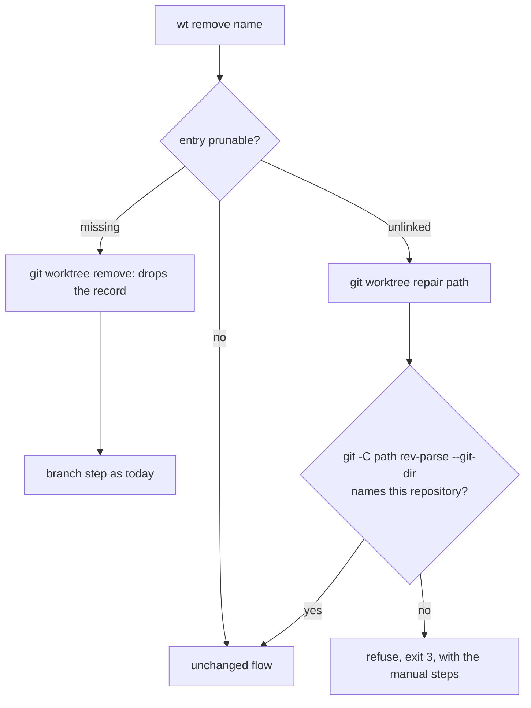

---
$schema:
    status: |-
        enum(
            draft-spec,
            finalized-spec,
            planned,
            implemented,
            review-findings,
            human-in-the-loop,
            completed,
            on-hold,
            abandoned
        ) -> an indicator of progress for this specification
    reviewed: boolean -> indicates whether the specification file has been reviewed by another agent from the one which created the spec
    reviewed_by: string -> the agent and model used in the spec review
    reviewed_on: date -> the date the spec was reviewed
    review_iterations: number -> the number of implementation reviews have taken place in the review/fix cycle
    clarified: boolean -> indicates whether the specification was built -- _in part_ -- with the 'clarify.md' prompt
    implemented: boolean -> indicates whether this spec's plan has been implemented
    implemented_by: string -> the agent who implemented the plan
status: draft-spec
reviewed: false
review_iterations: 0
clarified: true
implemented: false
---

# Worktrees git can no longer read: `wt list` calls them clean, `wt remove` fails

## Problem

A linked worktree can lose its connection to the repository while git still
records it. Git reports such an entry as `prunable`:

```text
worktree /private/tmp/lhg-before
HEAD aff3dc38e654023bcac41e38edc3460e5f6a4b96
detached
prunable gitdir file points to non-existent location
```

Git uses that one reason for two different states:

| State | On disk | Example |
| --- | --- | --- |
| **Missing** | the worktree directory is gone | someone ran `rm -rf` on it |
| **Unlinked** | the directory and its files remain; its `.git` file is gone | `/private/tmp/lhg-before`, observed 2026-10-03, cause unknown |

`wt` handles neither:

1. **`wt list` says an unlinked worktree is clean.** `dirty_status`
   (`lib/src/worktree.rs`) maps *any* `git status` failure to
   `DirtyStatus::Clean`, so the row shows `○` although nothing was checked.
   The same fallback hides every other `git status` failure.
2. **`wt remove` fails with a raw git error.** `collect_inventory` runs
   `git status` in the worktree and returns `WorktreeError::GitCommand`:

   ```text
   💻❯ wt remove lhg-before
   Error: failed to execute git command: fatal: not a git repository (or any of the parent directories): .git
   ```

   It names neither the worktree nor the problem, nor what to do.
3. **`wt list` parses `prunable` and throws it away** (the porcelain
   parser in `lib/src/worktree.rs` skips that line).

### What git does (git 2.55.0, macOS, 2026-10-03)

Checked in a scratch repository with one missing and one unlinked worktree:

| Command | Missing | Unlinked |
| --- | --- | --- |
| `git worktree remove <path>` | succeeds; drops the record | `fatal: validation failed, cannot remove working tree: '<path>/.git' does not exist` |
| `git worktree remove --force <path>` | — | the same fatal error |
| `git worktree repair <path>` | — | **recreates `<path>/.git` and the link, but prints `error: unable to locate repository; .git file broken` and exits 1**; afterward `git -C <path> status` works and the entry is no longer `prunable` |

So git cannot remove an unlinked worktree at all, `repair` can bring it back,
and `repair`'s exit status cannot be trusted.

## Fix

### 1. The listing knows the state

- The porcelain parser records `prunable` on `WorktreeEntry`.
- A prunable entry is classified once, from the filesystem: **missing** when
  its path does not exist, **unlinked** when it does.
- Classify with the entry's path as git printed it; never canonicalize a
  missing path.

### 2. `wt list` shows it

- No `git status` runs for a missing or unlinked worktree.
- The worktree marker is `✕` for both, with one legend entry,
  `✕ git can't read this worktree`, shown only when such a row exists.
- After the legend, one dim note per such worktree saying what is wrong and
  what to do:

  ```text
  lhg-before: its .git file is missing; `wt remove lhg-before` restores and removes it, or `git worktree repair /private/tmp/lhg-before` restores it.
  feat-gone: its directory is gone; `wt remove feat-gone` drops the record.
  ```

- Branch comparisons for such a row still come from refs and are shown as
  usual; only the dirtiness claim changes.
- **`git status` failing for any other reason is not clean.** Add
  `DirtyStatus::Unknown`, rendered `?` with the legend entry `? couldn't
  check`, shown only when such a row exists. `Unknown` never counts as clean
  anywhere a decision depends on it.
- `wt list` stays read-only: it never repairs.

### 3. `wt remove` handles both states



- **Missing:** nothing on disk can be lost. Drop the record and continue with
  the branch step exactly as for an ordinary removal (consent and
  `--force-branch` rules unchanged). Report that the directory was already
  gone.
- **Unlinked:** run `git worktree repair <path>` and decide by **verifying**,
  never by its exit status: the worktree's `git rev-parse --git-dir` must name
  this repository's `worktrees/<id>` directory. On success, report
  `restored the link for <name> so its files could be checked` and continue
  with the ordinary flow, so the inventory, consent, `--force-worktree`, and
  handoff rules apply unchanged.
- **Repair did not take:** refuse with exit 3 and no change beyond what
  `repair` wrote:

  ```text
  Can't remove lhg-before: its .git file is missing and git couldn't restore it,
  so wt can't tell what in /private/tmp/lhg-before is uncommitted work.
  To drop the record and keep the files: git worktree prune
  ```

  No flag makes `wt` delete a directory whose contents it could not check.
- **Every other git failure** in the remove flow names the worktree it was
  about, instead of a bare `failed to execute git command`.

## Decisions

1. **`wt remove` repairs an unlinked worktree before checking it.** Repair
   only restores the link git expects; it writes the `.git` file into the
   worktree even if the user then declines. The alternative, refusing
   outright, leaves the user with no `wt` path at all, since git cannot remove
   such a worktree either.
2. **`repair` is judged by its result, not its exit status** (git 2.55.0 exits
   1 after a successful repair).
3. **A failed `git status` is `Unknown`, never `Clean`.**
4. **`wt list` never repairs.**

## Out of scope

- Finding what removed `/private/tmp/lhg-before/.git`. That worktree is kept
  in place as a live example.
- `wt go` into a missing or unlinked worktree.
- Other `prunable` reasons git may add later; they are treated as unlinked when
  the path exists and missing when it does not.

## Tests

All fixtures build both states with plain filesystem operations: delete the
directory (missing), delete only `<path>/.git` (unlinked).

- **Parser (L1).** `prunable` is recorded; missing and unlinked are told apart.
- **`wt list` (L1).** `✕` rows, the legend entry and notes appear only when
  such a row exists; no `git status` runs for them (`count-git` recorder); a
  `git status` failure for another reason renders `?`, never `○`.
- **`wt remove`, missing (L1).** The record is dropped, the branch step behaves
  as today, nothing else is touched.
- **`wt remove`, unlinked (L1).** After the remove, the link is restored and the
  ordinary flow ran: a dirty file still requires consent, and declining leaves
  the files in place with the restored `.git`.
- **`wt remove`, repair fails (L1).** Inject the repair step behind a seam and
  stub it to change nothing; exit 3, the message, and no files removed. Real
  git cannot produce this case for a listed entry: deleting
  `.git/worktrees/<id>` makes `repair` fail, but git then stops listing the
  worktree at all (checked with git 2.55.0).
- **Repair exit status (L1).** A test pins the observed behavior: the result is
  verified even when `repair` exits nonzero.
- **Error naming (L1).** A forced git failure in the remove flow names the
  worktree.

## Docs

- `worktree/docs/cli/list.md`: the `✕` and `?` markers and the notes.
- `worktree/README.md` / the `wt remove` page: missing and unlinked
  worktrees.
- `.claude/skills/worktree/remove.md`: the prunable branch of the flow and the
  `repair` exit-status trap. `list.md`: `Unknown` dirtiness.

## Acceptance

- `wt list` in the `rusty-biscuit` checkout shows `lhg-before` as `✕` with its
  note, not `○`.
- `wt remove` on an unlinked worktree restores it and then follows the
  ordinary removal rules; on a missing one it drops the record; when repair
  does not take, it refuses with the message above and removes nothing.
- No `wt list` row claims clean without a successful `git status`.
- `just test`, `just test-l2`, and `just lint` pass in `worktree/`.
