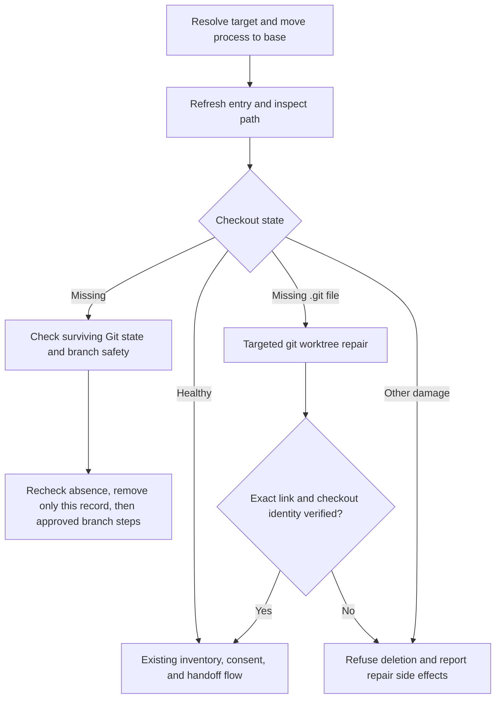

---
$schema:
    status: |-
        enum(
            draft-spec,
            finalized-spec,
            planned,
            implemented,
            review-findings,
            human-in-the-loop,
            completed,
            on-hold,
            abandoned
        ) -> an indicator of progress for this specification
    reviewed: boolean -> indicates whether the specification file has been reviewed by another agent from the one which created the spec
    reviewed_by: string -> the agent and model used in the spec review
    reviewed_on: date -> the date the spec was reviewed
    review_iterations: number -> the number of implementation reviews have taken place in the review/fix cycle
    clarified: boolean -> indicates whether the specification was built -- _in part_ -- with the 'clarify.md' prompt
    implemented: boolean -> indicates whether this spec's plan has been implemented
    implemented_by: string -> the agent who implemented the plan
status: draft-spec
reviewed: true
reviewed_by: codex/gpt-6.1-sol
reviewed_on: 2026-10-03
review_iterations: 0
clarified: true
implemented: false
human_review: true
human_review_items:
  - |-
    **`git worktree repair` fixes more than the worktree you name. Decide before Phase 4 (the repair engine). Phases 2 and 3 are not affected.**

    The spec says `wt remove` runs a *targeted* `git worktree repair <path>` when a worktree folder still exists but its `.git` link file is gone. A test on Git 2.56 showed that this command, run from the main checkout, also recreates the `.git` link of **every other** worktree whose link is missing, not just the named one. It also exited with an error code even though it succeeded. Nothing is deleted, but `wt remove foo` could quietly re-link `bar`, which the user did not ask about.

    - **A. Accept Git's behavior and say so (recommended).** Verify only the target, and make the messages and docs say repair "may have changed Git metadata for this or other worktrees".
      Pros: uses Git's own supported tool; repair only restores links Git already knows about and never removes anything; least code.
      Cons: a side effect on unrelated worktrees, though it is the same repair the user would run by hand.
    - **B. Only auto-repair when the target is the only worktree with a missing link; otherwise refuse and explain.**
      Pros: side effects stay confined to the named worktree.
      Cons: blocks removal exactly when several worktrees are broken (for example after a bulk folder copy); more checks; a race remains between the check and the repair.
    - **C. Write the target's `.git` link file ourselves instead of calling `git worktree repair`, then verify it the same way.**
      Pros: truly targeted; no misleading exit code.
      Cons: reimplements a Git file format (including Git's relative-path worktree option) and departs from the spec's explicit choice of Git's repair command.

    I recommend **A**. The extra effect is a non-destructive restoration that Git itself considers correct, and the spec already warns that repair may change metadata. Widening that wording is cheaper and safer than B's refusals or C's reimplementation.
message_to_agent: |-
  Read the "Phase 1" section of implementation-log.md before starting. Key facts from the Git 2.56 spike:
  (1) Git always prints `prunable <reason>` with a non-empty reason, but still parse a bare `prunable` as Some("").
  (2) A locked entry whose directory is gone is NOT prunable, and neither is a `.git` file holding garbage. Both reach the ordinary path and must become DirtyStatus::Unknown (`?`), not `✕`.
  (3) `fast_forward::holder_of` (lib/src/fast_forward.rs:121) parses porcelain itself and ignores `prunable`; Phase 3 must handle it.
  (4) WorktreeEntry struct literals to fix: lib/src/worktree.rs:145, :170, :1593; lib/src/listing.rs:505; cli/tests/list_table.rs:66.
  (5) The baseline was green: 958 passed, 32 skipped, lint clean.
  (6) For Phase 4: GIT_INDEX_FILE pointing at an absent index reads as empty without error, so check presence first. Path comparison should reuse remove::handoff::canonical / same_path (make same_path pub(crate)). R9 (repair is repo-wide) awaits the author; its default is in the log.
---

# Worktrees Git can no longer read: honest listing and safe removal

## Problem

A linked worktree can lose its connection to the repository while Git still
records it. Git reports such an entry as `prunable`:

```text
worktree /private/tmp/lhg-before
HEAD aff3dc38e654023bcac41e38edc3460e5f6a4b96
detached
prunable gitdir file points to non-existent location
```

The same reason can describe two different states:

| State | On disk | Example |
| --- | --- | --- |
| **Missing** | The worktree directory is gone. | Someone deleted the directory. |
| **Unlinked** | The directory remains, but its `.git` file is absent. | `/private/tmp/lhg-before`, observed 2026-10-03; cause unknown. |

Other damage or an unreadable path is also possible; `prunable` alone does
not prove that `.git` is missing.

`wt` currently hides the problem or fails without useful context:

1. In the `worktree` library, [dirty_status](../../lib/src/worktree.rs)
   classifies working files for listing. It maps every `git status` failure
   to `DirtyStatus::Clean`, so an unlinked row shows `○` without checking
   anything. The same fallback hides unrelated status failures.
2. In the `worktree` library, [collect_inventory](../../lib/src/remove/inventory.rs)
   gathers files that removal might discard. It runs `git status` in the
   damaged worktree and returns a bare Git error:

   ```text
   Error: failed to execute git command: fatal: not a git repository (or any of the parent directories): .git
   ```

   The message identifies neither the target nor a recovery step.
3. In the `worktree` library, [parse_worktree_list](../../lib/src/worktree.rs)
   discards the `prunable` line, losing information needed to explain the row.

### Observed Git behavior

The author checked Git 2.55.0 on macOS on 2026-10-03 in a scratch repository
with one missing and one unlinked worktree:

| Command | Missing | Unlinked |
| --- | --- | --- |
| `git worktree remove <path>` | Succeeds; drops the record. | Fails because `<path>/.git` does not exist. |
| `git worktree remove --force <path>` | Not checked. | Fails for the same reason. |
| `git worktree repair <path>` | Not checked. | Recreates `.git` and the link, but prints an error and exits 1. Afterward status works and the entry is no longer prunable. |

These are observations, not a Git version requirement. Tests must check the
result of repair rather than require real Git to return this exact exit code.

## Scope and design

This fix makes listing distinguish unavailable checkouts from checked-clean
ones, and lets removal recover the specific missing-`.git` case before applying
its existing protections. It introduces no new force flag and never removes
an unchecked existing directory.

**Reader's note:** The original draft called every existing prunable path
“unlinked” and suggested repository-wide pruning after repair failed. This
review narrows automatic repair to a confirmed absent `.git` file and removes
that advice. A prunable directory may have different damage, and pruning can
drop other worktree records; neither justifies deleting the named directory.

### 1. Preserve Git's report and classify filesystem state separately

In the `worktree` library, extend [WorktreeEntry](../../lib/src/worktree.rs),
the parsed entry shared by commands, with `prunable: Option<String>`: `None`
means no marker, `Some("")` means a marker without a reason, and otherwise the
string preserves Git's reason. Reset it for every entry, including the last
entry. Do not interpret localized reason text to make safety decisions.

Keep filesystem classification separate from porcelain parsing. For each
prunable entry, inspect the recorded path and its `.git` entry:

| Classification | Required evidence | Listing marker | Removal preparation |
| --- | --- | --- | --- |
| Missing | The path is confirmed absent. | `✕` | Use the missing-directory path below. |
| Unlinked | The path is a directory and `.git` is confirmed absent. | `✕` | Attempt targeted repair. |
| Other unavailable state | The path is a file, a dangling link, cannot be inspected, or `.git` exists but Git reports damage. | `✕` | Refuse automatic recovery and explain the observed condition. |

A permission or I/O failure is not absence: do not use `Path::exists()` to
make that decision. Do not follow a dangling link into the missing-directory
path. Refuse automatic repair/removal of a target that is itself a symlink
or Windows reparse point; this avoids treating a replacement link as the
original checkout. Existing healthy worktree behavior is otherwise unchanged.

Keep Git's recorded spelling for display and subprocess arguments. Never
canonicalize a missing path. When comparing existing repository metadata
paths, use the repository's established path helpers, accounting for macOS
symlink aliases and Windows short names and verbatim prefixes.

Classification is a snapshot, not authorization to delete. Listing uses one
classification per entry for this run; removal refreshes the listing and
filesystem evidence before preparation and rechecks before execution.

### 2. Make `wt list` honest

- Do not run `git status` for a prunable entry. Represent its dirtiness as
  unknown and use its separate availability state to render `✕`.
- Add `DirtyStatus::Unknown` to the `worktree` library's
  [DirtyStatus](../../lib/src/worktree.rs), which describes working-file
  changes. Spawn failures and nonzero status exits return `Unknown`, never
  `Clean`. A non-prunable entry with unknown dirtiness renders `?`.
- Add `✕ git can't read this worktree` and `? couldn't check` to the Worktree
  legend only when their respective markers occur. Keep the existing Branch
  legend and size the table using the actual rendered legends.
- Add one dim note for each unavailable entry, in table row order, without
  disrupting the existing PR status and closing-note order. Render through
  `biscuit-terminal` components and escape names, paths, and Git reasons as
  text so they cannot become markup.

Example notes, with commands shown for simple names and paths:

```text
lhg-before: its .git file is missing; wt remove lhg-before attempts to restore the link before checking its files. To restore it without removing it, run git -C /path/to/base worktree repair /private/tmp/lhg-before.
feat-gone: its directory is gone; wt remove feat-gone checks whether its remaining Git record can be removed safely.
```

For other unavailable states, explain the observed condition and include
Git's reason when present. Do not claim `.git` is absent unless it was checked.
Use an unambiguous command argument accepted by existing name resolution;
when no unique short name exists, explain the conflicting names rather than
suggesting a command that cannot select the row. Quote suggested commands for
the caller's shell when names or paths need it; never execute displayed text.

Branch comparisons still use refs and retain their existing meaning. A
comparison cell saying `clean` means “merges without conflicts,” not “working
files were checked.” Unknown dirtiness never counts as checked-clean, nor as
known uncommitted source files. Audit every match and default over dirtiness,
including graph annotations and status refresh after `--ff`.

Listing performs no repair or worktree-record removal. Its existing cache
writes, worker behavior, and explicit `--ff` behavior remain supported. With
`--ff`, a prunable holder of the default branch still counts as a holder:
refuse the move rather than treat it as absent and update the ref underneath
it. Never repair as part of fast-forwarding.

### 3. Prepare `wt remove` before inventory



#### Missing directory

Do not run checkout status, include-file discovery, or a checkout-content
fingerprint against a directory that is gone. Carry an explicit missing state;
an empty file inventory means “no directory to inspect,” not “checked clean.”
Resolve the branch and tip from this repository's refs, or the recorded HEAD
for a detached entry. Branch safety assessment, consent, `--force-branch`,
remote preflight, and `--force-remote` remain unchanged. A missing directory
does not prove that its commits or surviving index are disposable; the index
policy is the open question below.

Immediately before record removal, confirm that the target still identifies
the same listed entry and remains absent. If a directory or link has appeared,
refuse with exit 3 and ask the caller to rerun so its contents can be checked.
Use only `git -C <base> worktree remove <path>`, not `prune` or hand-deletion of
administrative directories. On Windows, skip the rename-based directory-lock
probe only for confirmed absence; keep it for existing directories. Preserve
Git's worktree-lock protections and do not add a second `--force` to bypass them.

After successful record removal, perform the existing copy-record cleanup and
approved local and remote branch steps. Report that the directory was already
gone and the record was removed. If Git removal fails, do not delete branches
or claim completion. No move-first handoff is needed for an absent directory.

#### Directory remains and `.git` is absent

Run targeted `git -C <base> worktree repair <path>` only after the existing
main-checkout and shell-wrapper guards have passed. Run every repair and
verification subprocess from the base checkout through the existing Git
helpers, so it does not hold the target directory open on Windows. It must
remain noninteractive and must not launch a network operation.

Before repair, identify the exact administrative entry associated with the
recorded target through this repository's common Git directory and the
administrative `gitdir` back-reference. Do not guess its ID from the worktree
basename, assume that base `.git` is a directory, or accept an arbitrary entry
under `worktrees/`. If the association is ambiguous or unreadable, refuse.

Judge repair by all of these postconditions, even if its exit status is nonzero:

- The target's `.git` resolves to the exact administrative directory identified
  before repair, and its common Git directory is this repository's.
- That entry's `gitdir` back-reference resolves to the target's `.git`.
- Git's top-level checkout is the target itself. Discovering a parent
  repository is not success.
- A fresh worktree listing still identifies the same target, branch or
  detached HEAD, and no longer marks it prunable. If identity changed during
  preparation, refuse and require a fresh invocation.

Only then report `restored the link for <name> so its files could be checked`
and enter the ordinary inventory, consent, protected-include-file,
`--force-worktree`, and move-first handoff flow. Inventory must succeed before
any deletion, even when all force flags are present.

Repair intentionally occurs before consent to discard files. It may recreate
`.git` and alter administrative links even when the user declines or later
checks refuse removal. Do not roll back those changes: removing a repaired
link could undo concurrent recovery work. Report the outcome and leave files,
branches, and records in place when removal is refused.

In the handoff's second run, never automatically repair a newly broken link.
Verify the repaired checkout's identity again and apply the existing content,
index, rules, baseline, branch, and remote checks. A link that changed or broke
between the two runs invalidates approval and refuses deletion with exit 3.

#### Repair failed or other damage prevents checking

Refuse deletion with exit 3 using the existing refusal error. No force flag
allows deletion of an existing directory whose inventory could not be checked.
For the confirmed missing-`.git` case, the message explains:

```text
Can't remove lhg-before: its .git file was missing and Git couldn't restore a verified link.
No working files, branches, or worktree records were removed. The repair attempt may have changed Git metadata.
From the base checkout, inspect the repair result with git worktree list --porcelain and try git worktree repair /private/tmp/lhg-before, then retry wt remove lhg-before.
```

Include useful captured repair diagnostics on failure. A spawn failure still
requires verification before claiming a repaired result, and must be named in
the failure message. Do not suggest `git worktree prune` as a targeted way to
keep the files: it can affect other entries and normally honors an expiration
period. Removing only a damaged record while keeping its directory is outside
this fix.

In `worktree-cli`, [exit_code](../../cli/src/exit.rs) maps refusal errors to
exit 3. In the `worktree` library, [WorktreeError](../../lib/src/error.rs)
currently documents these errors as changing nothing. **This is an intended
contract adjustment:** exit 3 continues to mean refusal to risk losing work,
but a repair attempt may have changed link metadata. Update those comments and
user documentation to distinguish “nothing removed” from “nothing changed”;
do not print the latter after repair. Cancellation remains exit 0, and existing
environment/directory-in-use failures remain exit 4.

Add target name, path, and operation to otherwise bare Git failures in the
remove flow while preserving the underlying error category and exit code.
Retain existing partial-success reporting when a later branch operation fails.
Do not convert an environment error into exit 1 merely to add context.

## Decisions

1. Automatic repair is limited to a confirmed absent `.git` in an existing
   directory, with a uniquely associated administrative entry. This addresses
   the observed defect without guessing what other damage means.
2. Repair is verified by exact repository and checkout identity, not by exit
   status or a path merely somewhere under the repository's `worktrees/`.
3. Repair may leave metadata changes after cancellation or refusal; the report
   and documented error contract must say so.
4. Failed status is unknown. Availability and dirtiness are separate facts;
   branch comparisons remain independent of both.
5. Listing never repairs, and removal never prunes unrelated records.
6. Keep filesystem paths as paths in Git arguments, not interpolated shell
   commands. Existing name ambiguity rules and cross-platform path helpers
   apply unchanged.

## Open Questions

### May removing a missing directory discard staged work in its surviving index?

Deleting a checkout directory does not necessarily delete its administrative
index. That index can still reference staged changes absent from HEAD; removing
the record loses the index that identifies them, even though object contents
may remain temporarily recoverable. The original “nothing on disk can be
lost” assumption is therefore too strong. Decide this policy before finalizing
the missing-directory removal path.

- **Inspect the surviving index and require ordinary discard consent when it
  differs from recorded HEAD; refuse if inspection fails (recommended).**
  Pros: preserves the existing distinction between losing working changes and
  deleting commits; clean missing entries still remove conveniently. Cons:
  needs a metadata-only check and a report of staged paths, because checkout
  status cannot run. Recommend this because the existing removal contract
  already protects staged work; directory deletion should not bypass it.
- **Require `--force-worktree` for every missing entry.** Pros: simple and
  explicit authorization to discard remaining checkout state. Cons: asks for
  force even when the index is unchanged, and provides little guidance about
  what may be lost.
- **Refuse every missing entry and require manual Git removal.** Pros: smallest
  implementation and no automatic loss of surviving state. Cons: leaves the
  observed missing-entry problem without a usable `wt` removal path.

Until resolved, implementation must refuse missing-entry removal when staged
state cannot be proved disposable; tests and acceptance below do not authorize
silently discarding it. This review does not change the spec's draft status.

## Out of scope

- Finding what removed `/private/tmp/lhg-before/.git`, or mutating that live
  example during implementation or testing.
- Changing `wt go` or `wt create` behavior for damaged entries.
- Automatic recovery of corrupt, present, or foreign `.git` entries; future
  prunable reasons receive honest listing and safe refusal.
- A command that removes a broken record while preserving an existing directory.
- New performance benchmarks or CI environments. Skipping failed status calls
  and adding bounded local metadata checks does not warrant a performance spike.

## Tests

Use disposable, network-isolated repositories and the existing test toolkit.
Create missing and unlinked fixtures by deleting the directory or only its
`.git` file. Never use the live `lhg-before` worktree. Tests must run on macOS,
Linux, native Windows, and WSL2 without making terminal/browser windows gain
focus.

- **Porcelain parsing (L1):** preserve marker presence with/without a reason;
  reset between entries and flush the last entry. Filesystem classification
  tests are separate and cover absence, missing `.git`, a present broken
  `.git`, and inspection errors. Inject permission errors when the host cannot
  reproduce them reliably.
- **Listing (L1):** `✕` and `?` markers, conditional legends, dim notes, stable
  row order, safe markup escaping, and ordinary ref comparisons. Record Git
  calls to prove no status or repair runs for prunable entries. Inject status
  spawn/nonzero failures through the runner actually used by status: the
  existing recorder's failure injection does not affect `git_command_in`.
  Put rendering snapshots in `cli/tests/list_table.rs`, not shared CLI unit
  modules, which compile under both library and binary targets.
- **Fast-forward (L1):** a prunable default-branch holder is refused without
  repair or a ref move; healthy-holder behavior remains unchanged.
- **Missing removal (L1):** a disposable record is removed without checkout
  inventory or the Windows rename probe; an unsafe branch is retained unless
  deletion is approved. Cover detached HEAD, other entries left intact, target
  reappearance before execution, record-removal failure, and cleanup only
  after success. Add staged-index cases for the policy chosen above.
- **Unlinked removal (L1):** successful repair enters ordinary inventory;
  dirty and protected ignored files still require consent. Noninteractive
  refusal leaves the repaired link and all files intact; forced removal works
  only after successful inventory. Verify cancellation through the existing
  pure policy tests and scripted answers.
- **Failed or incorrect repair (L1):** inject no change, a wrong administrative
  entry in the same repository, a foreign repository, parent-repository
  discovery, and changed identity. Refuse with exit 3 and delete no files,
  records, or branches, including with every force flag. Do not assume real
  Git can never fail for a listed entry.
- **Repair exit status (L1):** an injected nonzero result with valid repaired
  postconditions succeeds; a zero result without them refuses. Real-Git tests
  assert postconditions without pinning the observed Git 2.55.0 exit code.
- **Handoff (L1/L2):** preserve normal approval checks after repair; breaking
  or redirecting the link between runs refuses without another repair. Use
  existing windowless terminal helpers for the consent/cancellation and
  wrapper behavior that needs a real terminal.
- **Error context (L1):** failures identify target and operation, preserve exit
  codes, and accurately describe any completed metadata or removal steps.

## Documentation updates required by implementation

- `worktree/docs/cli/list.md`: markers, conditional legends, notes, and the
  distinction between working-file status and branch merge comparisons.
- `worktree/README.md`: missing/unlinked removal, repair before consent,
  metadata changes on refusal, and force limits.
- Create `worktree/docs/cli/remove.md`: recovery and refusal examples plus the
  existing removal safety and handoff rules, so removal has a current topic
  page rather than an unspecified “wt remove page.”
- `.claude/skills/worktree/remove.md`: preparation, exact repair verification,
  missing-directory handling, and the exit-status trap. Update `list.md` for
  unavailable/unknown states and `cli-contracts.md` for refusal side effects.
- Update affected symbol comments alongside behavior, especially the status
  fallback and error/exit-code promises. Current documentation must state the
  behavior directly, without referring readers back to this fix.

## Acceptance

- A fixture matching `lhg-before` renders `✕` with an accurate recovery note,
  rather than `○`; no live checkout is modified to demonstrate this.
- Unlinked removal verifies repair and then follows ordinary protections.
  Failed verification refuses without deletion and reports possible metadata
  changes. An unknown inventory never permits deleting an existing directory.
- Missing removal targets only that entry, follows the finalized staged-index
  policy and existing branch rules, and refuses if the target reappears.
- No row claims checked-clean after a status failure. Merge-comparison `clean`
  remains a separate, unchanged concept.
- `just test`, `just test-l2`, and `just lint` pass from `worktree/` using
  nextest and existing focus-free terminal test helpers. Implementation
  evidence states which environments were actually exercised.
