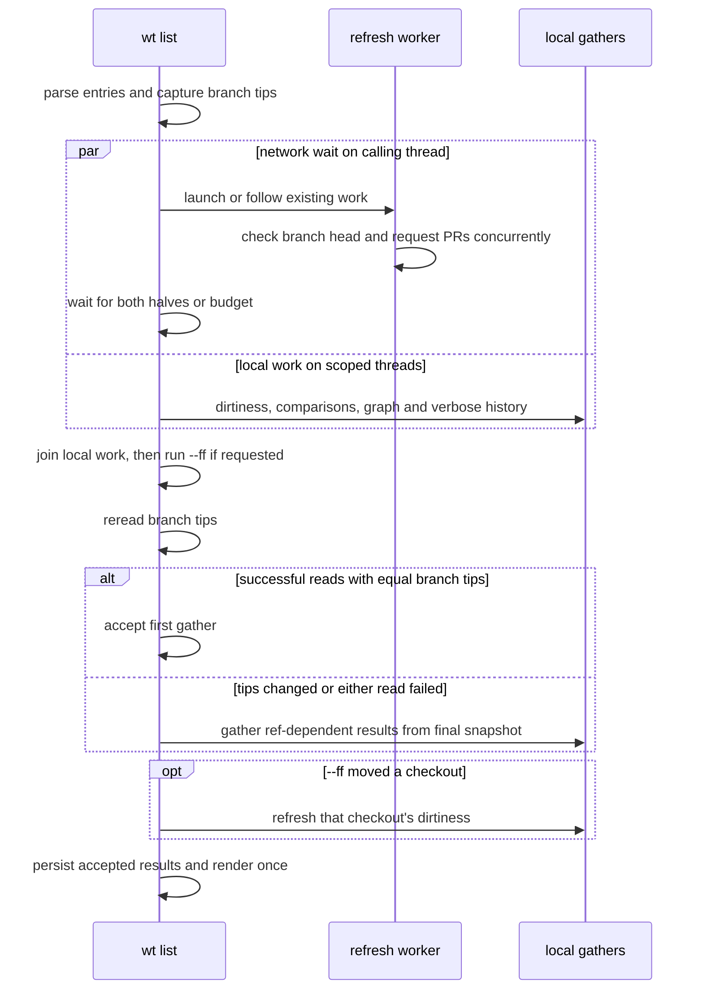

---
$schema:
    status: |-
        enum(
            draft-spec,
            finalized-spec,
            planned,
            implemented,
            review-findings,
            human-in-the-loop,
            completed,
            on-hold,
            abandoned
        ) -> an indicator of progress for this specification
    reviewed: boolean -> indicates whether the specification file has been reviewed by another agent from the one which created the spec
    reviewed_by: string -> the agent and model used in the spec review
    reviewed_on: date -> the date the spec was reviewed
    review_iterations: number -> the number of implementation reviews have taken place in the review/fix cycle
    clarified: boolean -> indicates whether the specification was built -- _in part_ -- with the 'clarify.md' prompt
    implemented: boolean -> indicates whether this spec's plan has been implemented
    implemented_by: string -> the agent who implemented the plan
status: draft-spec
reviewed: true
reviewed_by: codex/gpt-6.1-sol
reviewed_on: 2026-10-03
review_iterations: 1
clarified: true
implemented: false
human_review: false
message_to_agent: |-
    Phases 2-8 (and most of 9) were already implemented by review cycle 1 before
    this plan was executed phase by phase; see implementation-log.md, "Implementation
    of Review Findings #1", and plan.md "Checkpoint 1 (Phase 1)" for rulings as applied
    (including departures: upper-case-only stored variable names, `regather` children
    `list regather` / `graph regather` / `verbose regather`, `pr reread` always a
    group child). Treat each later phase as verify-and-tick against the existing code,
    filling only real gaps; do not re-implement. Builds on this macOS host need
    `LIBGIT2_NO_PKG_CONFIG=1` (Homebrew libgit2 upgrade; see the `os` skill macOS page).
    Phase 2 (sniff) was verified with no code change. Phase 3 (stores, worker, wait
    capture) was verified; its only change was one added assertion in
    `pull_requests::tests::a_format_5_answer_is_served_with_unknown_credentials_and_a_future_format_is_a_miss`
    (a format-5 file carrying a stray `credentials: anonymous` still reads as `unknown`).
    After phase 3: worktree `just test` 945 passed, `just lint` clean. `packages` now
    lists `sniff` and `worktree`; add `worktree-cli` when a phase touches `worktree/cli`.
    Phase 4 (library gather separation) was verified; its only change was one added
    test, `listing::repo_tests::the_shared_cache_seeds_the_final_gather_and_never_holds_a_failure`.
    Watch for Phase 6: `cli/tests/list_prs.rs`
    `a_held_pr_request_with_nothing_stored_ends_at_the_budget_with_only_the_hint`
    asserts the whole `wt list` command takes under 5 s. It failed once under full-suite
    load (11.8 s) and passed in isolation (5 of 5, about 3.7 s) and on the next two full
    runs. That bound covers local gathering as well as the wait. Since the overlap, a
    timeout limits waiting, not local computation, so decide in Phase 6 whether the
    bound should measure only the wait. A second `list_prs` test,
    `a_detached_workers_answer_replaces_the_stale_one_on_the_next_list`, failed the
    same way once (11.2 s under load; 3.9 s isolated, 3 of 3 passing), so review the
    timing bounds across `cli/tests/list_prs.rs`, not just the first test.
related:
    - 2026-09-27-list-freshness-ux
    - 2026-10-02-fresh-prs
---

# `wt list` should do its local work while the network answers, and say when it has no API key

## Problem

### 1. The local work waits for the network

`wt list` launches its refresh worker (branch-head check and PR request,
concurrently), waits for both, and only **then** starts the `git status` walks,
the branch comparisons, and the graph gather. The command adds the local work to the time spent waiting for the network.
Running them together would make the slower one determine that part of the
command’s duration.

A release build at `a4558c92d`, `rusty-biscuit` checkout with 9 worktrees,
authenticated against GitHub, 2026-10-03:

| Stage | Run 1 | Run 2 |
| --- | ---: | ---: |
| `pre-dispatch` + `pr gather` | 20.1 ms | 20.6 ms |
| `remote wait` | 314.3 ms | 286.7 ms |
| `list gather` | 149.6 ms | 150.8 ms |
| `graph gather` (concurrent with `list gather`) | 175.5 ms | 173.4 ms |
| render | 9.3 ms | 9.3 ms |
| **Total** | **549.5 ms** | **520.9 ms** |

Overlapping the local work with the wait would cost about
`20 + max(300, 175) + 9` ≈ 330 ms here.

The ordering comes from `2026-09-27-list-freshness-ux` §3: "Gather the local
refs, comparison counts, and graph *after* the wait. A fetch completed during
the wait changes those inputs." The concern is right, but the rule is wider
than it needs to be:

- **Dirtiness does not depend on the fetch.** The worker changes the tracking
  ref and objects, never a working tree. However, `--ff` can update a checkout’s
  files and index, so that checkout’s dirtiness must be measured afterward.
- **Counts and the graph depend on it only when a ref actually moved.** The
  worker fetches only when the remote differs, and `--ff` moves the local
  default branch only when it can. In the common case (`in sync`) nothing
  moves, and the wait bought no accuracy.

### 2. A keyless API answer is silent

`2026-09-27-list-freshness-ux` §5 decided that "updated information was
retrieved (with or without an API key)" prints nothing. That hid a lost key:
the user's `GITHUB_TOKEN` had been removed from their shell, GitHub answered
the public repository anonymously, the attempt recorded `source: api` with
`api: null`, and nothing told them the key they believed was in use was not.
Anonymous requests have a far lower rate limit, so the next symptom would have
been a rate-limit failure with no earlier warning.

## Current implementation contracts

The change spans the `worktree` library and `worktree-cli`, with a small
extension to `sniff` for successful-request credential metadata:

- In `worktree`, [RefTips](../../lib/src/listing.rs) captures local and
  remote-tracking branch tips. [WorktreeList](../../lib/src/worktree.rs)
  owns that snapshot and the listing results; its `fill_worktree_statuses`
  operation currently combines dirtiness, comparisons, and persistent writes.
  Separate those responsibilities so an early gather can be discarded safely.
- In `worktree-cli`, [GatherInput](../../cli/src/commands/git_graph.rs)
  supplies graph and verbose history gathering. Both must use the same accepted
  branch tips as the table. Verbose commit decorations currently come from
  Git’s live refs, so they need special handling below.
- In `worktree`, [FfResult](../../lib/src/fast_forward.rs) identifies the
  checkout whose files a successful fast-forward moved. Use that result to
  refresh only the affected checkout’s dirtiness.
- In `worktree-cli`, [wait](../../cli/src/commands/list/wait.rs) already
  follows head attempts and observes PR publication IDs independently. Keep its
  budgets, adoption, retry, failure precedence, and receipt cleanup rules.
- In `sniff`, [FocusedProviderClient](../../../sniff/lib/src/remote/focused.rs)
  selects credentials for provider requests, including host-bound token
  overrides. Successful-request metadata must come from that selection, rather
  than duplicating token lookup in `worktree`.

These are intended changes to gather ordering and the successful anonymous
request notice. They do not change which network requests run, how refs are
updated, or when a stored PR answer is usable.

## Fix

### 1. Gather locally while the worker runs



**Reader’s note:** the original draft said dirtiness would never be redone.
That is safe for fetches, but a fast-forward can change checkout files and the
index. A targeted status refresh preserves the speed improvement for ordinary
listings without reporting a status taken before this command’s own mutation.

#### Capture and overlap

1. Keep the cheap parse step: worktree entries, default branch, branch-tip
   snapshot, and fork-origin records. Reuse its existing `for-each-ref` result;
   do not add a duplicate initial ref read.
2. Record `--ignore-api` preferences and prepare the remote request before
   starting speculative work. A preference-write error still exits without a
   listing or worker launch.
3. Run the wait on the calling thread, while scoped threads gather local
   results. Preserve the existing parallelism between list and graph gathers,
   and between per-worktree status walks. The monotonic wait budget starts
   before the first launch and is never reset by local work or adoption.
4. Gather the graph only on the existing image-capable path, and verbose data
   only when requested and applicable. Captured output and a repository with
   no `origin` still work; no worker is launched without `origin`.
5. Join local work before `--ff` runs, so status does not race this command’s
   own checkout update. A wait timeout limits network waiting, not local
   computation: a slow gather can still make the full command take longer.
   The detached worker is never joined or killed by the listing.

#### Accept or regather

After the wait and any `--ff`, reread refs when remote work was followed or a
fast-forward was attempted, as today. Compare the complete local and
remote-tracking maps in the initial and final snapshots, including additions
and deletions. Comparing all captured tips is deliberately conservative and
cheap; do not introduce per-consumer dependency tracking.

Reuse the first gather only if both reads succeeded and their maps are equal.
An unsuccessful read is not an empty repository and cannot establish equality.
If refs changed or either read failed, discard the ref-dependent results and
perform one final gather against the final snapshot. If the final read failed,
keep the existing degraded listing behavior and do not prune fork records.
Do not retry until refs stabilize.

The discarded results include the caption, default comparison target, branch
tree, comparison cells, graph facts, and verbose history. Every Git history or
comparison query must name captured object IDs, not mutable branch names.
Verbose ref labels affected by fetch or `--ff` must also come from the accepted
snapshot or be resolved after the acceptance decision; Git’s live `%D`
decorations are not proof of snapshot consistency. Preserve existing tag and
HEAD labeling behavior.

For unchanged refs, keep the initial dirtiness results. If `--ff` returns a
successful move with a checkout path, refresh that checkout’s dirtiness after
the move and replace its earlier result. A move without a checkout, an
up-to-date branch, or a refusal does not require another status walk. Keep
all other checkout results.

A changed-ref run costs an initial speculative gather plus a final gather,
although the initial work overlaps the wait. It can therefore use more CPU
and take longer than today; the benefit targets the common unchanged-ref run.
SHA-pair cache entries computed successfully during the first gather may be
reused in the final gather.

#### Persistence, failures, and render

- Early gathers do not save the comparison cache, prune fork-origin records,
  or prune include-copy records. Commit these effects once after choosing the
  final results. Preserve the library’s ordinary `list_worktrees` behavior by
  composing the same separated operations there.
- Keep valid SHA-pair entries in memory, including entries from a discarded
  gather, and save the accumulated cache once. Failed comparisons remain
  uncached. This rule concerns persistent cache and record writes; it does not
  prohibit Git’s existing object writes during merge analysis.
- Fork pruning still requires a successful final ref read. Reload the store
  before pruning and retain its existing protection for records created since
  the ref read, so a concurrent `wt create` is not lost. Include-copy pruning
  retains its current live-worktree checks.
- Join scoped tasks and clear the spinner on every exit path, including a
  local gather error. Preserve graph incomplete-history behavior and the
  existing listing error policy. Only the caller emits terminal output.
- Reread PR answers and recheck `origin` after waiting, as today. If `origin`
  changed, suppress badges and all request notices for the old origin,
  including successful keyless notices.
- Render the caption, table, graph, and verbose section once, from the accepted
  branch tips. Apply the final PR answer at rendering time, not during the
  speculative gather.
- When a timeout leaves the worker running, retain the existing “still
  checking” / “still pulling” status and refresh hint. A fetch observed by the
  final read invalidates the first gather even if the wait timed out. A fetch
  after that read affects the next listing; this is a bounded snapshot, not an
  atomic transaction with the background worker.

Unrelated concurrent commits, checkouts, ref changes, and worktree inventory
changes remain subject to the command’s existing snapshot limitations. This
fix adds no repository-wide lock and promises no continuously current view.

### 2. `--perf` shows the overlap

Report concurrent work beneath one group measured from the beginning of the
concurrent region until its last local task and wait have finished. Its duration
is measured elapsed time, not the sum of its children or a reconstructed
maximum. Each child retains its own duration without a percentage:

```text
Performance                       330.0ms  100%
├─ pre-dispatch                     8.4ms    3%
├─ pr gather                       11.7ms    4%
├─ remote wait ‖ local gather     300.2ms   91%
│  ├─ remote wait                 300.2ms
│  ├─ list gather                 150.0ms
│  └─ graph gather                175.0ms
├─ table render                     0.5ms   <1%
└─ graph image render               8.8ms    3%
```

The example is illustrative, not an acceptance threshold. Use the existing
biscuit-terminal metrics-tree rendering in
[PerfCollector](../../cli/src/perf.rs), in `worktree-cli`.

- Top-level children, including `unattributed`, reconcile to total elapsed time.
  Overlapping children are excluded from the top-level sum.
- The group includes any post-wait PR read that runs before the local tasks
  finish; do not also count that time outside the group. Keep `pr gather`
  discoverable for existing tests, but place its overlapping portion inside
  the group, or show it as a non-additive diagnostic child.
- Preserve `list gather`, `graph gather`, and `verbose gather` names for
  diagnostic consumers. Graph and verbose rows keep their current conditions.
- Show `regather` only when a final ref-dependent gather was needed, as another
  elapsed-time group with concurrent children. Show `fast-forward` and any
  affected checkout status refresh separately; neither is hidden in the wait.
- Without remote work, report a local-only group and omit `remote wait`.
- Update existing stage parsers and reconciliation tests to understand nested
  rows. Do not count a child twice or rely on saturating subtraction to hide
  overlapping durations.

### 3. Say when the API answered without a key

When this listing observes a successful branch-head or PR API answer without a
key, and the provider accepts API keys, print one dim line immediately after
the caption, using the existing credentials-line renderer:

```text
GitHub answered without an API key; set GITHUB_TOKEN or GH_TOKEN for higher rate limits.
```

The provider display name and accepted variable names come from `sniff`’s
[credential_env](../../../sniff/lib/src/remote/blocking.rs). Print variable
names only, never values or raw remote URLs. Use “set {variables} to authenticate
API requests” for providers whose anonymous rate-limit advantage is not
established; do not promise higher limits for every supported provider.

#### Record what the request used

Successful-request evidence distinguishes an anonymous request, a request with
a selected key variable, and unknown credential use. Unknown is never treated
as anonymous. Failure information remains distinct from successful evidence.

Extend `sniff`’s blocking provider results, or add metadata-bearing entry points,
so the branch-head and open-PR calls return the credential selection made by
the client that sent the request. Reuse `sniff`’s credential policy, including
host-bound `SNIFF_*_TOKEN` overrides; do not inspect the listing’s environment
or recreate credential precedence in `worktree`. Preserve request deadlines,
error classification, pagination, and network request counts. No extra request
is made merely to determine authentication. For a paginated PR answer, claim
anonymous success only if all its requests were anonymous.

Publish that evidence with the worker’s results:

- Branch-head success metadata lives on the followed head attempt and survives
  its transition from checking to fetching, including a fetch failure or a
  timeout while fetching. A later `source: fetch` answer must not erase the
  preceding API result.
- PR success metadata lives in the PR store beside the publication ID and is
  written atomically with the successful answer. An empty PR list is still a
  successful answer. This is necessary because the wait can observe a
  publication and finish before the completion receipt exists.
- The wait captures metadata from the same new publication it accepted,
  including a publication by a lock holder. It must not borrow metadata from
  an older cached answer or a later unrelated publication. Capturing it does
  not reset the budget or add a wait for the receipt.
- For adopted head work, use the followed attempt’s metadata, even when its
  worker inherited a different environment. Keep the current rule that a PR
  failure belongs to this listing’s own receipt.

**Reader’s note:** adding a success case only to the head API note would miss
PR-only success and answers published before the receipt. Storing PR metadata
with its publication addresses both without lengthening the wait.

#### Choose one credentials line

Use this precedence, with at most one credentials line per listing:

1. An existing confirmed head credentials or rate-limit warning.
2. An existing confirmed PR credentials or rate-limit warning.
3. The successful keyless notice from either half.

A keyed success in one half does not hide an observed anonymous success in the
other. A generic failure in one half does not hide anonymous success in the
other either. A confirmed warning always outranks the new notice.

Do not show the new notice for an ignored repository, unsupported provider,
local-path origin, changed origin, cached-only answer, unknown credentials, or
success that arrives after the listing has selected its results. Do not add a
credentials line for an anonymous API failure alone.

The existing closing fallback notice remains for a keyless API refusal
followed by a successful `ls-remote`. It describes a different request and may
coexist with the new line when the PR API succeeded anonymously; neither notice
is inferred from Git transport credentials. Preserve all other output ordering,
exit codes, and shell-wrapper behavior.

#### Stored-format compatibility

Bump the remote-head format from 2 to 3 and the PR-store format from 5 to 6.
Do not change the receipt format unless its serialized shape actually changes;
PR success evidence does not require a new receipt field.

- Read remote-head format 1 using its existing migration. Read format 2’s
  independently valid `answer`, preserving its source, but drop its `attempt`
  because it cannot prove successful-request credentials.
- Read valid PR format 5 answers with their publication IDs and existing age
  and origin checks; their credentials are unknown. A pre-launch publication
  remains cached evidence, never evidence of this listing’s anonymous request.
  Older unsupported PR formats remain misses.
- New writers emit only the new versions. Unknown future versions remain
  misses. Old and new workers can coexist briefly; an old-format result can
  still supply usable cached data under these migration rules, but cannot
  invent a keyless notice.
- Keep strict duplicate, missing-field, type, trailing-content, identity, and
  timestamp validation. Bad head-attempt metadata cannot invalidate a good
  head answer. Reject malformed new PR publications; do not silently interpret
  malformed authentication fields as anonymous.
- Persist only authentication state and validated variable names, never tokens.

## Decisions

1. Overlap local gathering with the existing remote wait. This intentionally
   replaces the gather-after-wait rule in `2026-09-27-list-freshness-ux`.
   Validate branch tips once afterward and regather when needed.
2. Reuse dirtiness across fetches, with a targeted refresh after a checkout is
   moved by `--ff`. This corrects the draft’s unconditional reuse rule.
3. Report a successful anonymous API answer. This intentionally replaces the
   silent-success rule in `2026-09-27-list-freshness-ux`; existing confirmed
   failure warnings keep priority.
4. Use worker-recorded request metadata from `sniff`, with PR evidence bound
   to its publication. Credential lookup in the foreground cannot establish
   what an adopted worker sent.
5. Preserve old usable answers during the format upgrades, while treating
   absent success metadata as unknown.

## Open Questions

None remain for this draft review. Representation and helper names are left
for implementation; the required behavior and compatibility rules above are
fixed. Any departure should be recorded in the implementation log, with current
behavior documented in the package’s topic pages.

## Out of scope

- `core.fsmonitor` for the dirtiness walks. Measured on the development host,
  `git status` dropped from 100–160 ms to about 30 ms with it; whether `wt`
  should pass it is a separate decision.
- Reading `gh auth token` as a key source.
- Changing credential precedence or adding new token sources in `sniff`.
- Connection reuse across worker processes.
- The ~15–25 ms gaps observed between sequential git calls inside `wt`.
- New repository locks, stabilization loops, or broader performance studies.

## Tests

Use network-free local stubs, the repository Test Toolkit, and the existing
worktree fixtures. Tests must release held workers on failure and leave no
background processes behind. Terminal tests must use a windowless backend and
never gain focus. These cases extend existing suites rather than add CI cells.

- **Overlap (L1).** Hold a worker outcome until both local gathers signal they
  started. Assert arrival before releasing the outcome. Use bounded
  synchronization, not sleeps or scheduler-sensitive elapsed-time assertions.
  The existing gather-overlap seam proves list-versus-graph overlap only; extend
  it to prove overlap with the remote wait.
- **Unchanged refs (L1).** Accept the first gather; status and comparison work
  run once. No-origin, ignored-API, and non-image paths retain their behavior.
- **Fetch or `--ff` changes refs (L1).** Cover remote advancement, rewind,
  addition, and deletion. Caption, target, tree, counts, graph, and verbose
  history describe final tips. Fetches do not rerun dirtiness; a moved checkout
  reruns only its status. Cover `--ff` without a holder, up-to-date, and refused.
- **Failed reads and gathers (L1).** A failed initial or final ref read never
  establishes equality or authorizes pruning. Preserve degraded graph output,
  local error behavior, scoped-task cleanup, and spinner cleanup.
- **Persistence (L1).** Cache save, fork pruning, and copy-record pruning happen
  once after acceptance. Retain valid speculative SHA-pair cache entries and
  concurrent fork records; failed comparisons are never cached.
- **Timeout (L1).** A held worker does not block past the existing wait budget.
  Reuse the first gather when final tips match; regather when a fetch was
  observed before the final read. Keep pending status and refresh hint, and do
  not join the detached worker. A local gather longer than the wait is allowed
  to finish before rendering.
- **Perf tree (L1).** Verify reconciliation with nested overlapping children,
  conditional graph/verbose rows, local-only grouping, and `regather` only when
  needed. Update stage-reading tests so existing timing checks still read the
  intended duration.
- **Credential metadata (L1).** Verify actual credential selection with
  provider tokens, host-bound tokens, empty variables, and no token. Include
  paginated PR results. Assert token values never enter serialized stores or
  rendered output.
- **Keyless notice (L1).** Cover head-only and PR-only success, empty PR answers,
  mixed keyed/anonymous halves, success during fetch, adoption with different
  environments, PR publication before receipt, and PR lock contention. Verify
  warning precedence, cached-only and unknown suppression, ignored or changed
  origin suppression, and coexistence with the closing fallback notice.
- **Store formats (L1).** Cover remote-head versions 1, 2, and 3; PR versions
  5 and 6; unsupported versions; and malformed success metadata under the
  existing strict reader test matrices.
- **Presentation (L2).** Extend the existing credentials-line terminal test
  to prove the new line is dim, below the caption, and follows spinner cleanup.
  Do not introduce a new visible terminal window.

The measurements in the problem section already justify overlap. Do not add a
new timing gate with an unspecified margin to prove scheduling: the bounded
synchronization test proves it directly. Keep existing performance gates and
record a quick release-build sample on one development host after implementation,
using the same listing shape when available. Report overlap and any regather
cost; no extra hosts, workload matrix, repetition count, or statistical
threshold is required.

## Docs

Update current behavior alongside implementation:

- `worktree/README.md` and `worktree/docs/cli/list.md`: overlap, snapshot
  validation, targeted status refresh, and the keyless line’s precedence.
- `worktree/docs/performance-testing.md`: current gather ordering, nested
  timing groups, and the full-command contract. Append the new quick sample;
  preserve dated historical measurements rather than replacing them.
- `worktree/docs/git-graph.md`: accepted-snapshot behavior for graph and verbose
  gathering where it is described.
- `.claude/skills/worktree/list.md`, `list-remote.md`, and `testing.md`: pipeline,
  successful-request metadata, new formats, and updated test interpretation.
- Relevant `sniff` remote documentation and skill topic page: the new metadata
  interface and its credential-selection contract.

Current topic pages must explain behavior without linking to or naming this fix
or another dated specification. The specification remains a dated decision
record; implementation departures belong in its implementation log.

## Acceptance

- An unchanged-ref listing runs local work during the remote wait; the bounded
  overlap test proves scheduling, and `--perf` reports the concurrent span
  without double counting. Expected time is fixed costs plus the slower of the
  remote wait and local gather, with post-wait validation and rendering.
- Changed refs produce final-snapshot caption, table, graph, and verbose data.
  Dirtiness runs once except for a checkout moved by this command’s `--ff`.
  Persistent saves and pruning run once on accepted results.
- An observed successful anonymous API answer produces one credentials line
  unless a confirmed warning takes priority. Cached, ignored, unsupported,
  changed-origin, or unknown evidence cannot produce it.
- Old usable answers survive migration; malformed or absent authentication
  metadata cannot be mistaken for an anonymous success. No credential values
  are stored or printed, and no extra network requests or waits are introduced.
- Implementation works on macOS, Linux, native Windows, and WSL2 using the
  existing scoped-thread and detached-process contracts.
- `just test`, `just test-l2`, `just test-perf`, and `just lint` pass in
  `worktree/`; affected `sniff` tests and lint pass using that area’s recipes.
