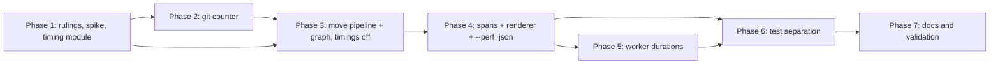

# Plan: `wt list --perf` as a library option that names real work

## Summary and Definition of Done

The spec moves timing into the `worktree` library (`worktree::timing`), moves the
`wt list` pipeline and graph gathering into the library, renames the report rows to
name real work, adds `--perf=json` (framed `WT_PERF_JSON` line), adds optional worker
durations in the version-1 receipt, and separates performance tests (read `Timings`
by stage path) from functional tests (never use timing as evidence).

The work is mostly a **move plus instrumentation**, so the main risk is behavior drift
in a ~11k-line surface (`list.rs` 809, `list/wait.rs` 625, `git_graph.rs` 1283,
`topology.rs` 585, `refresh_worker.rs` 737, plus their tests). The plan therefore
builds the leaf types first, moves code with timing disabled and tests green, and only
then threads spans.

**Done when** every Acceptance item in the spec holds:

- `worktree::list` exposes the pipeline with `ListOptions.timings`; `cli/src/perf.rs` only renders.
- Every measured row is a typed `Stage` (id + label in `worktree::timing`); no label is a lookup key.
- Documents reconcile exactly in integer microseconds; `graph_history` shows sub-steps with git counts.
- Worker reports appear as diagnostics, with explicit missing/adopted/invalid states, never delaying return.
- No test scrapes the human report; `perf_rows`, `stage_from_perf`, `list_gather_from_perf` are deleted.
- The library has no terminal dependency, prints nothing, and adds no Git or network calls.
- `just test`, `just test-perf`, `just test-l2`, `just lint` pass in `worktree/`.
- Docs and `.claude/skills/worktree/` are updated; three warm-run `unattributed` observations are in the implementation log.

Skills to load while implementing: `worktree`, `rust-testing`, `nextest`, `serde`, `clap`, `os` (path/Windows traps), `biscuit-terminal` (CLI adapter only).

Terminal state for an agent: "implementation complete, ready for review". Do not move the spec to `_completed`, do not run `just complete`, do not commit unless told.

## Phase 1: Rulings, spike, and the `timing` module

### Necessary Rules

The spec says "Open Questions: None", but these gaps need an explicit ruling before code. Defaults are given so work can proceed under `yolo`; the author can override.

- [x] **R1 — Stage list is closed.** The `Stage` enum contains exactly the ids in the proposed tree in spec §3 plus `local_reads`, `verbose_history`, and the worker ids (`worker_setup`, `worker_halves`, `pr_refresh`, `head_refresh`, `pr_request`, `head_check`, `head_fetch`). Default: add no others. A new id requires editing the enum and the docs stage table together.
- [x] **R2 — Sequential-vs-concurrent defaults.** Root and `remote_and_local` follow the spec (root sequential; `remote_and_local`, `local_gather`, worker `worker_halves` concurrent; `refresh_worker`, `graph_history`, `verbose_history`, `regather` sequential). `regather`'s children are sequential for input preparation and a concurrent group for `branch_comparisons` ‖ history. Default: as stated.
- [x] **R3 — Concurrent-parent remainder fields.** A parent with concurrent children serializes `unattributed_us: 0` and `over_attributed_us: 0` (spec). Default: the decoder rejects a nonzero value there.
- [x] **R4 — `launch_index` base.** Default: 0-based, in launch order, so a forced retry is index 1.
- [x] **R5 — Decoder strictness vs. "ignore unknown optional fields".** Unknown *stage ids* are rejected; unknown *fields* are ignored in version 1. Duplicate JSON object keys follow `strict_json.rs` (already in the lib); reuse it rather than serde's last-wins. Default: use `strict_json`.
- [x] **R6 — Input Robustness Matrix applies** (the decoder reads a file format: the receipt `durations` object and the `WT_PERF_JSON` document). Outcomes are fixed in Phase 1 task "Decoder matrix" below. Load-bearing fields: `format_version`, `scope`, `total_us`, `spans[].stage`, `elapsed_us`, `git_calls`, `children_kind`, `children`, `unattributed_us`, `over_attributed_us`.
- [x] **R7 — Wider measurement for author (not scheduled).** The spec asks for a quick one-host spike only. A cross-OS measurement of the disabled-mode overhead is *not* planned; if the author wants Windows/WSL2 figures they must say so.
- [x] **R8 — Windows/WSL2 are post-merge.** Per the repo's CI schedule, only Linux and macOS are proven on the PR; code must still avoid `cfg(unix)`-only assumptions (read the `os` skill before touching path comparison in the moved pipeline).
- [x] **R9 — `local_reads` vs `remote_and_local` and the `--ff`/`regather` interaction with the wait.** Default as in spec §3: choose by whether a wait actually ran.

### Spike

One spike, run once, before the work it informs. The spec's own figures (≈45 git starts, 7–15 ms each, 11% unattributed) already answer the "how costly is the graph" question, so no spike on that.

- [x] **S1 — Thread-scoped git counter feasibility** (one host, macOS, quick).
  - Question: can a counter scoped per listing work through the lowest spawning helper in `lib/src/git.rs` with threads that the pipeline spawns (graph lane tasks, status-per-worktree tasks, concurrent wait), without global state?
  - Method: read `lib/src/git.rs` and the thread-spawn sites in `cli/src/commands/git_graph.rs`, `list.rs`; write a 30-line throwaway test with a thread-local scope plus an explicit "scope handle" passed into spawned tasks.
  - Output: a one-paragraph decision in the implementation log: thread-local + explicit handle (spec's "tasks return scoped counts and aggregate after joining") vs. an `Arc<AtomicU64>` handle cloned into tasks. Default expectation: thread-local current scope with a `CountScope` handle that spawned tasks re-enter.
  - Also record the `count-git` recorder's current seam so the new counter stays separate from it.

### Tasks

- [x] **Stage enum** (`lib/src/timing.rs`, new; export from `lib.rs`)
  - `Stage` enum per R1 with `id() -> &'static str` (stable snake_case), `label()`, `FromStr`/`from_id`, and `Serialize`/`Deserialize` through the id.
  - Unit test: every variant's id round-trips and ids are unique.
- [x] **Timings tree** (same module)
  - Span: `stage`, `elapsed: Duration`, `git_calls: Option<u64>`, `children_kind`, `children`.
  - Builder API for the pipeline: start/finish a span, `add_concurrent_child`, accumulate repeated calls into one logical step (sum of *non-overlapping* durations only; document that overlapping invocations must not be summed).
  - Path lookup by `&[Stage]`; a stage under two parents resolves by path.
  - Ordinary sibling ids are unique; adding a duplicate accumulates rather than creating a second sibling.
- [x] **Reconciliation** (same module; port from `cli/src/perf.rs`)
  - Convert to integer microseconds first, then compute remainders so `sum(spans) + unattributed − over_attributed = total` holds exactly.
  - Apply at every sequential parent; concurrent children never enter a sum; concurrent parents carry zero remainders.
- [x] **Worker observations type** (same module)
  - `WorkerReport { launch_index, attempt_id, status, report: Option<..> }` and the summary `worker_report_status` enum: `complete | partial | missing | invalid | adopted | origin_changed`. Summary derivation rules exactly as in spec §3 (partial = mixed; none usable → latest owned launch's status unless origin changed; adopted only when no owned report).
  - Observations carry no percentage and are outside the foreground reconciliation.
- [x] **Version-1 serde document + decoder** (same module)
  - Document: `format_version: 1`, `scope: library | command`, `total_us`, `spans`, `unattributed_us`, `over_attributed_us`, `worker_reports`.
  - Library decoder rejects: unsupported `format_version`, unknown stage ids, duplicate ordinary sibling ids, inconsistent reconciliation fields; ignores unknown optional fields.
  - **Decoder matrix** (one test, real-shaped fixture, one edit per cell, plus a control row proving the unedited fixture decodes; assert through the public `Timings` result):

    | Shape | `format_version` | `spans[].stage` | `elapsed_us` | `git_calls` | `children_kind` | `children` | reconciliation fields |
    | ----- | ---------------- | --------------- | ------------ | ----------- | --------------- | ---------- | --------------------- |
    | absent | reject | reject | reject | valid = unknown (`None`) | reject | valid = empty only if the format allows; spec says empty valid, so **reject absent** and require `[]` | reject (always present, zeros included) |
    | explicit null | reject | reject | reject | reject (null ≠ absent; `0` ≠ unknown) | reject | reject | reject |
    | wrong type, whole field | reject | reject | reject | reject | reject | reject | reject |
    | wrong type, one element | n/a | n/a | n/a | n/a | n/a | reject (one bad span fails the document) | n/a |
    | wrong type, every element | n/a | n/a | n/a | n/a | n/a | reject | n/a |
    | empty | n/a | reject (`""` unknown id) | n/a | n/a | n/a | valid `[]` | n/a |
    | duplicate key | reject | reject | reject | reject | reject | reject | reject |
    | trailing/invalid content | reject the document | | | | | | |

    Wrong-version: `format_version: 2` is rejected; negative or fractional `*_us` rejected.
  - Smell grep before closing the task: `#[serde(default)]` on any field above, `Option<T>` where absent/null must differ (`git_calls` uses a `present` deserializer or `Option<Option<T>>`), `unwrap_or_default`, `.ok()` on a load-bearing parse.
  - The receipt `durations` object uses the same decoder, but a failure there degrades to `invalid`, never invalidating the outcome (Phase 5).
- [x] **Timing unit tests** (per spec "Tests" §1): exact reconciliation; over-attribution surfaced at each sequential level; concurrent exclusion; sequential remainder; path lookup with two parents; JSON round trip; integer rounding; version mismatch; unknown id; duplicate siblings; inconsistent reconciliation.

### Checkpoint 1

- [x] `just test` (worktree) green; `just lint` clean; matrix test present with its control row; spike decision logged.

## Phase 2: Scoped git-call counter

Depends on Phase 1 spike S1. Independent of Phase 3 beyond the shared `lib/src/git.rs` file, so do it **first**.

### Wave 1 (single agent; one file)

- [x] **Counter scope** (`lib/src/git.rs`)
  - Scoped counter, separate from the `count-git` recorder and failure injection. Count at the lowest spawning helper (including byte-output helpers) once per actual subprocess start; a failed spawn or injected failure counts none; a nonzero exit counts.
  - Nested scopes each include their descendants; a parent counts each child call once.
  - Unrelated threads do not count; spawned tasks receive an explicit handle and return counts that are aggregated after joining.
  - Disabled path: the always-compiled hook does only an inactive-scope check (no allocation, no atomics beyond a thread-local read).
- [x] **Counter tests** (per spec): nested scopes, unrelated thread excluded, scoped threaded aggregation, failed spawn/injected failure excluded, nonzero exit counted, byte helpers counted once, disabled collection, recorder unchanged. Run with and without `count-git`.

### Checkpoint 2

- [x] Existing recorder-backed tests unchanged and green; `just test`, `just lint`.

## Phase 3: Move the pipeline and graph gathering into the library (timings disabled)

Goal: pure relocation with behavior unchanged and every existing test green, **before** any span is threaded. This isolates move regressions from instrumentation regressions.

### Wave 1 (two agents in parallel; disjoint files)

- [ ] **Graph gather → `worktree::graph`** (agent A)
  - Move the gathering half of `cli/src/commands/git_graph.rs` and `git_graph/topology.rs` (history reads, classification, lane facts, verbose commit details) to `lib/src/graph/`.
  - Replace biscuit-terminal `LaneEntry`/`GraphLine` with library-owned data types. The CLI keeps layout, row budget, terminal capability decisions, and the conversion (`GraphFacts::to_git_graph`) as a CLI adapter function (not an inherent method, since `GraphFacts` is now foreign).
  - Do not change algorithms (lane placement, repeated assembly, holder search).
  - Move the matching tests from `git_graph/tests.rs`; keep rendering tests in the CLI.
  - Check the `worktree` dependency set: no biscuit-terminal. Update `worktree/docs/dependencies.md` for any crate moves.
- [x] **Wait core split** (agent B)
  - Split the spinner adapter out of `cli/src/commands/list/wait.rs` (it imports biscuit-terminal) so the wait core is terminal-free; spinner stays in the CLI behind `on_phase`.
  - Move the wait core and its `WaitEnv`/scripted-clock tests to the library (`lib/src/list/wait.rs`).

### Wave 2 (after Wave 1; single agent, same files)

- [ ] **`worktree::list` pipeline entry**
  - Move `gather_listing`, `prepare_remote`, `follow_remote`, accept-or-regather, and the commit step into `lib/src/list/`. Entry: `gather(repo_path, ListOptions, on_phase)`; `ListOptions` holds today's flags, budgets, worker launch (`Option<WorkerLaunch>`; `None` = read cached remote data, no spawn, no wait), graph/verbose needs as booleans, and `timings: bool`.
  - Never `set_current_dir`; thread the repo path explicitly (audit the moved code for implicit-cwd git calls).
  - Add `Listing.regathered: bool`, set by the accept-or-regather decision.
  - `WorkerLaunch` stays an injected seam; the CLI supplies its launcher on every ordinary listing.
  - Preserve contracts: object IDs from the accepted ref snapshot; budgets bound only the wait; at most one ref-dependent regather; cache save and pruning once; only a checkout moved by `--ff` gets another status read; origin-change guard; ignored/unsupported/local-origin behavior; retry/adoption; receipt cleanup; no printing and no foreground network.
- [ ] **CLI thin adapter**: `cli/src/commands/list.rs` calls the library, then does render and write. Remove timing literals later (Phase 4), not now.
- [ ] **Move pipeline tests** from `cli/src/commands/list/tests.rs` and `list/tests/pipeline.rs` to the library, functional assertions only: `Listing` facts, `regathered`, the git-call recorder. Replace `stages.contains("regather")` with `regathered`. Remove stage-name proofs from `run_pipeline_*`; the recorder already proves the work.
- [ ] **Benchmark**: point `lib/benches/list_status.rs` at the new entry with `timings: false`, no launcher, no `--ff`, no API preference writes; state this scope in its docs comment.

### Checkpoint 3

- [ ] `just test`, `just test-l2`, `just lint`, and the existing `just test-perf` all pass unchanged in `worktree/`. A concurrency test shows two simultaneous library calls with different repo paths leave cwd untouched.
- [ ] `cargo tree -p worktree` shows no biscuit-terminal.

## Phase 4: Thread spans through the pipeline and build the report

### Wave 1 (parallel; disjoint modules)

- [ ] **Library spans** (agent A, `lib/src/list/`, `lib/src/graph/`)
  - With `timings: true`, record the stages of spec §3 for `read_worktrees`, `origin_lookup`, `prepare_local`, `remote_and_local` or `local_reads`, `refresh_worker` (`worker_launch` with the foreground monotonic clock, `worker_wait`), `pr_cache_read`, `local_gather` (`worktree_status` ‖ `branch_comparisons`), `graph_history` / `verbose_history` (sub-steps with `git_calls`; `lane_assembly` aggregates the whole repeated loop; omit `shallow_check` on the verbose-only path; with both, gather once), `fast_forward`, `ref_reread`, `regather` (no repeated dirtiness), `commit`, `checkout_refresh`.
  - Use `remote_and_local` only when a wait ran. Record attempted steps even if they return nothing or fail recoverably; omit steps that did not run.
  - Graph tasks return scoped counts; aggregate after join. `git_calls` is reported only when coverage is complete.
  - **Disabled mode**: no tree, no clock reads, no counter scopes, no worker timing request, no new global state. A test asserts identical listing facts and identical git-call recorder output with timings on and off.
- [ ] **CLI renderer** (agent B, `cli/src/perf.rs`, `cli/src/commands/list.rs`)
  - `cli/src/perf.rs` becomes render-only: `Timings` → `MetricsTree` using `Stage::label`, sequential children with shares, concurrent children without, generated `unattributed` rows (hidden under 1 ms; over-attribution always shown), `[n git]` suffixes, and a labeled diagnostic section for worker reports with no percentages.
  - CLI stages `startup`, `caption_status`, `display_facts`, `table_render`, `verbose_render`, `notes_render`, `graph_budget`, `graph_render`, `final_notes_render`, `write_output` appended after the library spans.
  - Compose: CLI interval starts at the process-start instant and ends after the listing stderr write; rebase library spans into it (no extra top-level span for the library total); finalize once; exclude rendering/serializing/writing the report itself.

Agents A and B coordinate on the `Timings` builder API fixed in Phase 1; if it needs a change, change Phase 1's module first, then both rebase.

### Wave 2 (after Wave 1)

- [ ] **`--perf[=human|json]`** in clap with `num_args = 0..=1`, `require_equals = true`, `default_missing_value = "human"`, a `ValueEnum` for the value; invalid value → usage error exit 2; `--perf json` must not consume a subcommand; behavior on other commands unchanged.
- [ ] **JSON emission**: after a successful listing write, print `\n` then exactly one compact `WT_PERF_JSON <doc>` line ending in `\n`, on stderr, `scope: command`. Listing errors emit no report. Stdout stays empty. No ANSI, CR, labels, or image bytes in the JSON.
- [ ] **Shape tests per path** (library, no host-speed thresholds): no origin, remote, regather, `--ff`, `-v` without image: assert expected stage paths and exact reconciliation.

### Checkpoint 4

- [ ] `just test`, `just lint`; run `wt list --perf` three times warm on this repo and record the `unattributed` row (hidden, or named work) for the implementation log. Note any residual cause.

## Phase 5: Worker durations in the receipt

Depends on Phases 1 and 3 (wait core in library). Disjoint from Phase 4's renderer, so Wave 1 below may overlap Phase 4 Wave 2 with care over `wait.rs`; default is to run after Phase 4 Wave 1 to avoid conflicts.

### Wave 1 (parallel)

- [ ] **Worker side** (agent A, `cli/src/commands/refresh_worker.rs`, hidden subcommand)
  - Add an opt-in timing boolean to the injected launch arguments and the hidden subcommand. Only enabled attempts collect.
  - Record `worker_setup` then a concurrent `worker_halves` with children `pr_refresh` (lock, provider request, publication) and `head_refresh` (check and optional fetch). Record `pr_request`, `head_check`, `head_fetch` only when they run, covering API plus Git fallback for a check. Interval: worker entry to completion of both halves, excluding receipt serialization and write.
  - A half panic preserves the other half's outcome and measurements; absent is unknown, not zero. No credentials, URLs, or error text in the document.
  - Receipt gains optional `durations`; `RECEIPT_FORMAT_VERSION` stays 1.
- [ ] **Reader side** (agent B, library wait core + receipt reader)
  - Decode `durations` separately after validating required outcome fields; missing/malformed/unsupported never invalidates a usable outcome.
  - Copy a validated report into the wait result **before** receipt deletion; bind via existing attempt id / origin digest / branch checks; suppress on origin-change guard failure.
  - Per-launch entries with `launch_index`, `attempt_id`, status and optional report; summary status per spec (`missing` for no `durations`; `adopted` rules; partial rules).
  - No extra poll, wait, post-return receipt read, or join for instrumentation. Do not change which outcome wins.

### Wave 2

- [ ] **Tests**: receipt v1 with and without durations; malformed/unsupported durations preserve outcome; attempt/origin/branch mismatch still rejected; wait tests (scripted `WaitEnv` clock) for capture before deletion, early publication, timeout, adoption, retry (two entries), changed origin, and a half panic, none extending a wait or altering winners.
  - **Durations matrix** (same outcome table as Phase 1, applied to the receipt's `durations` object; every cell yields the outcome intact and status `invalid`, except absent → `missing`); one test from a real receipt fixture with one edit per cell and a control row.
- [ ] **CLI**: render worker reports beneath the diagnostic section and include `worker_reports` in the JSON.

### Checkpoint 5

- [ ] `just test`, `just test-l2`, `just lint`. The wait budget/timing behavior of existing L1/L2 tests is unchanged.

## Phase 6: Separate performance tests from functional tests

### Wave 1 (parallel by file group)

- [ ] **Perf helper** (`cli/tests/perf_support/mod.rs`): add a helper that runs `wt list --perf=json`, selects the final nonempty line (splitting CRLF as well as LF), strips `WT_PERF_JSON `, and deserializes into `worktree::timing::Timings`; reject a missing or malformed final record; never search earlier text. Add a path-lookup convenience. Delete `perf_rows`, `stage_from_perf`, `list_gather_from_perf`.
- [ ] **Migrate perf consumers** (split among agents): `perf_graph_stages.rs`, `perf_pr_request.rs`, `cache_warm_path.rs`, `cache_cold_path.rs` (their `perf_` tests), `perf_flag.rs`, and `list_prs.rs` perf tests. Mapping: `list gather` → `local_gather`; `remote wait` → `refresh_worker`; `pr gather` → `origin_lookup`; graph gather/render keep their boundaries. Bounds and sampling unchanged; never sum concurrent children as an old elapsed span.
- [ ] **Functional test cleanups**
  - `list_prs::a_held_live_head_check_holds_the_listing_only_until_its_deadline`: keep `.output()` returning while the request and worker lock stay held plus the timeout presentation; drop the `remote wait` row bound; prove the budget with the scripted wait clock in library tests (add if missing); rely on existing `perf_` held-check tests for the real bound; add no whole-command bound.
  - `list_prs::a_held_pr_request_with_nothing_stored_ends_at_the_budget_with_only_the_hint`: keep held-request and hint assertions; scripted clock proves expiry.
  - Audit for any remaining functional test that passes `--perf` or calls shared perf helpers (including `perf_`-named tests living in `cache_*_path.rs`); every functional test must pass without `--perf`.

### Wave 2

- [ ] **`perf_flag.rs` feature tests**: report on stderr only; stdout empty; no report on listing errors; human and JSON describe the same stages; top level reconciles; framed record after listing output; misleading prefix text in a commit message not mistaken; CRLF (pty) capture; invalid flag values exit 2; `--perf json` does not eat a subcommand; disabled mode emits nothing. Compare both renderers on the same synthetic tree (snapshots live in integration tests because CLI modules compile twice).
- [ ] **Library isolation tests**: library reports exclude CLI stages; two concurrent calls with different repo paths mix no spans or counts and leave cwd alone; timings on/off give identical facts and identical git calls.

### Checkpoint 6

- [ ] `just test`, `just test-perf`, `just test-l2`, `just lint`. `rg 'stage_from_perf|perf_rows|list_gather_from_perf'` finds nothing. Tests keep terminal/browser windows from taking focus.

## Phase 7: Docs, skill, and review readiness

### Wave 1 (parallel; disjoint files)

- [ ] `worktree/docs/performance-testing.md`: stage table (id, label, measures), two child kinds plus worker observations, `--perf=json` schema and framing, how a perf test reads a stage by path; remove `stage_from_perf` guidance. Include a Mermaid flow and a compact example per rule (audience: developer with no repo experience); do not link to or name this fix.
- [ ] `worktree/docs/cli/list.md` (`--perf[=human|json]`, stderr framing), `worktree/docs/git-graph.md` (`graph_history` row and sub-steps; graph gather now in the library), `worktree/README.md` (`--perf` paragraph), `worktree/docs/dependencies.md` (and lib/cli per-area files) for crate moves.
- [ ] `.claude/skills/worktree/`: `list.md` and `git-graph.md` (pipeline and gather in the library), `testing.md` (perf/functional split rule), `list-remote.md` (optional receipt timings, unchanged waits); adjust the router "shared modules compiled twice" note if `perf` changes.
- [ ] **Comment drift pass** over every moved or changed symbol's `///`/`//!` and inline comments (repo rule); delete stale ones and report any drift found.

### Wave 2

- [ ] **Final validation**: `just test`, `just test-perf`, `just test-l2`, `just lint` in `worktree/`; `cargo tree -p worktree` free of biscuit-terminal; grep that the library prints nothing (`println!`, `eprintln!`, `print!`).
- [ ] **Implementation log** (`implementation-log.md` in the fix dir): spike S1 outcome, the three warm-run `unattributed` observations, departures from the spec (docs corrected, spec left as written), and rulings taken at their defaults.
- [ ] **Status**: set spec status to `implemented` only if the author's process says an agent does so; otherwise leave it. Stop at "implementation complete, ready for review"; do not move the fix to `_completed`.

### Checkpoint 7

- [ ] Every Acceptance item 1–8 is checked off against evidence in the log.

## Dependency Overview

