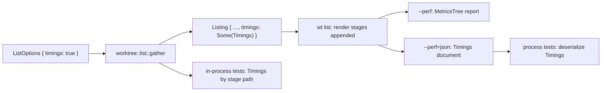

---
$schema:
    status: |-
        enum(
            draft-spec,
            finalized-spec,
            planned,
            implemented,
            review-findings,
            human-in-the-loop,
            completed,
            on-hold,
            abandoned
        ) -> an indicator of progress for this specification
    reviewed: boolean -> indicates whether the specification file has been reviewed by another agent from the one which created the spec
    reviewed_by: string -> the agent and model used in the spec review
    reviewed_on: date -> the date the spec was reviewed
    review_iterations: number -> the number of implementation reviews have taken place in the review/fix cycle
    clarified: boolean -> indicates whether the specification was built -- _in part_ -- with the 'clarify.md' prompt
    implemented: boolean -> indicates whether this spec's plan has been implemented
    implemented_by: string -> the agent who implemented the plan
status: draft-spec
reviewed: false
review_iterations: 0
clarified: false
implemented: false
related:
    - 2026-06-14-perf-measurement
    - 2026-10-03-list-overlap-and-keyless-notice
---

# `wt list --perf` should be a library option that names real work, and tests should read it as data

## Problem

`wt list --perf` was meant to answer "where did the time go?". Today it
answers that poorly, and the tests built on it mix performance evidence with
functional evidence.

A report from 2026-10-04 on this repository (image terminal, 10 worktrees):

```text
▌ Performance                               749.2ms  100%
▌ ├─ pre-dispatch                            15.7ms    2%
▌ ├─ pr gather                                8.5ms    1%
▌ ├─ remote wait ‖ local gather             585.8ms   78%
▌ │  ├─ remote wait                         540.5ms     —
▌ │  ├─ pr reread                            45.2ms     —
▌ │  ├─ list gather                         247.6ms     —
▌ │  └─ graph gather                        416.9ms     —
▌ ├─ table render                            27.5ms    4%
▌ ├─ graph image render (biscuit-terminal)   30.1ms    4%
▌ └─ unattributed                            81.6ms   11%
```

### 1. The rows do not say what work ran

| Row | What it measures | Why the name misleads |
| --- | --- | --- |
| `pre-dispatch` | Process start to the list pipeline: argument parsing, completion check, terminal detection | Names a code location, not work |
| `pr gather` | `git remote get-url origin`, the `--ignore-api` record, and the API preference read | No PR is gathered |
| `remote wait` | Launching the detached `wt internal-refresh` worker and blocking until both of its halves end or the budget runs out | The work (a provider API request for open PRs; a default-branch check and possibly a `git fetch`) happens in another process and is invisible |
| `pr reread` | An origin recheck (`git remote get-url origin`) and a read of the PR store file | Reads as a second API call; it makes none |
| `list gather` | One `git status --porcelain` per worktree, all at once, concurrent with the branch comparisons, caption, and fork tree | Two unrelated kinds of work under one vague name |
| `graph gather` | Commit-history reads for the graph: ~45 sequential `git` subprocesses on this repository | One opaque number for the slowest local step |
| `table render` | Building the caption status (which may run `git reflog`), the table facts, and the table | Includes Git work that is not rendering |

### 2. `unattributed` hides real work

`unattributed` was 11% of the total. It is not noise; it is work no row
covers:

- the parse step: `git worktree list`, `git symbolic-ref`, `git for-each-ref`,
  and the fork-origin record load (`worktree::parse_worktree_state`);
- the comparison cache load and the graph's input assembly;
- the ref reread after the wait (`RefSnapshot::read`);
- the commit step: comparison cache save, fork-record pruning, and one
  `canonicalize` per worktree for copy-record pruning (`WorktreeList::commit`);
- the status and notes renders, the graph row budget, and the final write of
  the listing (including Kitty image bytes) to stderr.

### 3. `--perf` exists only in the CLI

The collector (`cli/src/perf.rs`), the stage names (`&'static str` literals in
`cli/src/commands/list.rs`), and the pipeline being timed
(`gather_listing`, `prepare_remote`, `follow_remote`, `list/wait.rs`, and the
graph and verbose gather in `cli/src/commands/git_graph.rs` and
`git_graph/topology.rs`) all live in `worktree-cli`. The `worktree` library has
no notion of timing. A library caller cannot get the same breakdown, and the
library's own Criterion bench (`lib/benches/list_status.rs`) measures a
different entry point from the one `wt list` runs.

### 4. Tests read timings by scraping the rendered report

`cli/tests/perf_support/mod.rs` parses the human-readable report
(`perf_rows`, `stage_from_perf`, `list_gather_from_perf`) back into durations
by stripping ANSI, counting tree connectors, and matching label text. Row
labels and the metrics-tree layout are therefore a de facto test API:
renaming a row, or a cosmetic change to biscuit-terminal's `MetricsTree`,
breaks performance tests. Consumers: `perf_flag.rs`, `perf_pr_request.rs`,
`perf_graph_stages.rs`, `cache_warm_path.rs`, `cache_cold_path.rs`,
`list_prs.rs`.

### 5. Functional tests use timing rows as evidence of behavior

- `list_prs.rs::a_held_live_head_check_holds_the_listing_only_until_its_deadline`
  is an ordinary L1 test. It proves the wait was bounded by reading the
  `remote wait` row out of `--perf` output.
- `list/tests/pipeline.rs` decides whether a regather happened with
  `stages.contains(&"regather")`.
- Several tests in `list/tests.rs` (`run_pipeline_*`) prove which work ran by
  checking stage-name lists, beside the git-call recorder that already proves
  it.

Whether a regather happened, or whether the wait was bounded, is a behavioral
fact. It must not depend on a timing label existing.

### 6. Graph gather has no breakdown

Graph gather is the longest local task (416.9 ms above), and it has no network
work. Its cost is dominated by starting `git` processes one after another
(`merge-base --is-ancestor`, `rev-list --first-parent`, `log --no-walk`, …). Each
takes about 7–15 ms of Git time by `GIT_TRACE2_EVENT`, and process start makes
up the rest. The report shows neither the steps nor the call count, so a
regression or a speedup cannot be located.

## Fix

### 1. The library owns the timings

Add a `worktree::timing` module:

- **`Stage`**: one enum of every measured step of `wt list`, including the
  render and write steps the CLI performs. Each variant has a stable
  snake_case **id** (serialized; tests and JSON use it) and a display
  **label** (`Stage::label`, rendered only). Renaming a label changes no test.
- **`Timings`**: a tree of spans. Each span has a `Stage`, a measured elapsed
  time, an optional `git_calls` count, and children of one of two kinds:
  - **concurrent children** ran in parallel inside the parent's span. They show
    no share and are never summed (today's group semantics).
  - **sequential children** are consecutive parts of the parent. They show a
    share of the parent and reconcile to it with their own `unattributed`
    remainder.
- **Reconciliation** moves out of `cli/src/perf.rs` unchanged in meaning:
  top-level spans are sequential, they and `unattributed` equal the total
  exactly, and an excess is surfaced as `over-attributed`, never clipped.
- **Paths, not labels, identify a span.** The same `Stage` may appear under
  different parents (for example `branch_comparisons` under the first group
  and under `regather`). Lookups take a path of stage ids.
- **Serialization**: `Timings` derives `Serialize`/`Deserialize` into a
  versioned document (`format_version`, total, spans with `stage` id,
  `elapsed_us`, `git_calls`, `kind`, `children`).
- **Git-call counts**: `worktree::git` gains a scoped counter so a
  single-threaded step can report how many `git` subprocesses it started. It
  is always compiled (not behind `count-git`) and costs one thread-local
  increment per call. Counts are required for the graph and verbose history
  sub-steps. Elsewhere they are recorded where a step runs on one thread, and
  left out (not guessed) where it fans out across threads.



### 2. The `wt list` pipeline moves into the library

`--perf` corresponds to a library option because the work it measures is
library work:

- Move the listing pipeline into `worktree::list`: today's `gather_listing`,
  `prepare_remote`, `follow_remote`, the accept-or-regather logic, and
  `list/wait.rs`. The entry point takes `ListOptions` (today's `ListFlags`, the
  `ListSeams` budgets and worker launch, graph/verbose needs, and
  `timings: bool`) and returns a `Listing` carrying `timings: Option<Timings>`.
- The worker launch stays an injected seam (`WorkerLaunch`): the library does
  not know the `wt` binary. The spinner stays in the CLI behind the existing
  `on_phase` callback.
- Move the gathering half of `cli/src/commands/git_graph.rs` and
  `git_graph/topology.rs` (history reads, classification, lane facts, verbose
  commit details) into `worktree::graph`. Its output becomes worktree-owned
  types. Today `topology.rs` returns `biscuit_terminal::components::git_graph::LaneEntry`,
  and the library must not depend on biscuit-terminal. The CLI keeps
  `GraphFacts::to_git_graph` and the rendering, and maps the library types
  onto the terminal component.
- The refresh worker (`wt internal-refresh`, `cli/src/commands/refresh_worker.rs`)
  stays in the CLI.
- `lib/benches/list_status.rs` benches the new library entry point with
  `timings: false`, so the bench and `wt list` measure the same code.

### 3. The report names the work

Proposed tree (labels are display only; ids in parentheses):

```text
Performance
├─ startup                                  (startup)
├─ read worktrees and refs                  (read_worktrees)
├─ origin lookup                            (origin_lookup)
├─ refresh worker ‖ local reads             (remote_and_local)   concurrent children
│  ├─ refresh worker                        (refresh_worker)     concurrent children
│  │  ├─ launch                             (worker_launch)
│  │  ├─ PR API request                     (pr_request)
│  │  ├─ default-branch check               (head_check)
│  │  └─ fetch                              (head_fetch)
│  ├─ PR cache read                         (pr_cache_read)
│  ├─ worktree status                       (worktree_status)
│  ├─ branch comparisons                    (branch_comparisons)
│  └─ graph history  [n git]                (graph_history)      sequential children
│     ├─ shallow check  [n git]
│     ├─ default-branch tips  [n git]
│     ├─ lane placement  [n git]
│     ├─ fork holders  [n git]
│     └─ unattributed
├─ fast-forward                             (fast_forward)       --ff only
├─ ref reread                               (ref_reread)
├─ regather                                 (regather)           tips moved only
├─ checkout status refresh                  (checkout_refresh)   --ff moved a checkout
├─ save caches and records                  (commit)
├─ caption status                           (caption_status)
├─ table render                             (table_render)
├─ verbose render                           (verbose_render)     -v only
├─ status and notes render                  (notes_render)
├─ graph image render (biscuit-terminal)    (graph_render)
├─ write output                             (write_output)
└─ unattributed                             (hidden below 1 ms)
```

- Without an `origin`, the group is `local reads` (`local_reads`) with no
  `refresh worker` child.
- `verbose history` (`verbose_history`) replaces `graph history` when only `-v`
  needs history; it has the same sequential children.
- The graph-history sub-steps follow the top-level calls of today's
  `git_graph::gather` (`History::read`, `DefaultTips::read`, the focused or
  base view's `assemble`, `fork_holder`). The plan fixes the exact list after
  reading the code. Every sub-step carries its `git_calls`.
- **Refresh worker children come from the worker.** The worker measures the
  launch-to-start delay it can see, each half's request, and the fetch, and
  records them in its completion receipt. The receipt gains an optional
  `durations` object, and `RECEIPT_FORMAT_VERSION` goes to 2. A version-1
  receipt is still read, with no durations. The children appear only when
  this run read its own launched attempt's receipt before the wait ended.
  After a timeout, or for an adopted attempt, `refresh worker` has no
  children and the JSON says why (`worker_report: missing | adopted`).
- **`unattributed` is a defect signal.** It is always present in the JSON, and
  shown in the human report only at 1 ms or more. Every gap listed under
  Problem §2 gets a row, so on an ordinary run it should round to nothing.

### 4. `--perf=json`

`--perf` keeps printing the human report. `--perf=json` prints the `Timings`
document to stderr in place of the report, after the listing. Tests that
need a real `wt` process (a pty for the graph, a real refresh worker) use it
and deserialize into `worktree::timing::Timings`. Nothing parses the human
report any more; `perf_rows`, `stage_from_perf`, and `list_gather_from_perf`
are deleted.

### 5. Performance tests and functional tests separate

**Performance tests** (`perf_` prefix, run serially by `just test-perf`) read
`Timings` only, by stage path:

- in process, through the library entry point with `timings: true`;
- out of process, through `--perf=json`.

**Functional tests never read timings.** Each current use is replaced by the
evidence the test actually claims:

| Test | Today | Replacement |
| ---- | ----- | ----------- |
| `list_prs::a_held_live_head_check_holds_the_listing_only_until_its_deadline` | `remote wait` row < 5 s | Wall-clock around the command's own `.output()`, against the budget plus a margin documented in the test. The 2026-10-03 fix moved this bound onto the row because local gathering under load inflated the whole command. If a wall-clock bound is still too noisy, the test moves to `perf_`. A functional test never reads `Timings`. |
| `list/tests/pipeline.rs` `regathered()` | `stages.contains("regather")` | A `regathered: bool` on the library `Listing`, set by the accept-or-regather decision |
| `list/tests.rs` `run_pipeline_*` stage-name checks | Stage names prove which work ran | The git-call recorder (already present in these tests) and the `Listing`'s facts. Checks of the report's *shape* move to `timing` unit tests and `perf_flag.rs`. |

`perf_flag.rs` keeps testing the `--perf` feature itself: the report appears
on stderr only, stdout stays empty, errors emit none, the human report and
`--perf=json` describe the same stages, and the top level reconciles.

## Decisions

| Decision | Rationale |
| -------- | --------- |
| Move the pipeline, not just the types, into the library | `--perf` should correspond to a library option. A `Timings` type in the library with all timing calls in the CLI would leave library callers and the bench measuring something other than `wt list`. |
| Typed `Stage` with separate id and label | Labels are for people and should be free to change; ids are the contract for JSON and tests |
| Two child kinds (concurrent, sequential) | Today's groups only express overlap. Graph-history sub-steps are consecutive parts of one task and should reconcile to it. |
| Worker durations travel in the receipt | The receipt is already the one per-attempt record the foreground reads; a second channel would duplicate its binding rules |
| `--perf=json` instead of a test-only hook | Tests that need a real process use the same mechanism a user would, as asked |
| Keep the refresh worker in the CLI | It is a process entry point that runs the `wt` binary; the library already holds both halves' logic (`pull_requests::refresh`, `remote_update::run_attempt`) |

## Open Questions

1. **Flag spelling.** `--perf=json` (optional value on the existing flag) or a
   separate `--perf-format json`? The proposal assumes `--perf[=human|json]`.
2. **`unattributed` threshold.** Hide below 1 ms, or below 1 ms *and* under 1%
   of the total?
3. **Worker launch timing.** The foreground can time the spawn itself. The
   worker can record its start time against a timestamp passed in
   `--attempt`'s arguments, but that compares clocks across processes. Is the
   foreground spawn time enough for `launch`?

## Out of scope

- **Making graph history faster.** About 45 sequential `git` processes could
  become one in-process history read (`gix`) or one long-lived
  `git cat-file --batch` / `rev-list --parents` over the relevant range. That
  is a separate fix, measured with the instrumentation this one adds.
- **Rendering the table and graph concurrently.** The graph's row budget
  depends on the rendered table's height (`list_table::graph_row_budget`), and
  the possible saving is about 27 ms. Revisit with the new `caption status` /
  `table render` split, which may show the table itself is cheap.
- `wt remove` and `wt create` timings.

## Tests

- `worktree::timing` unit tests: reconciliation (exact, over-attribution
  surfaced), concurrent children excluded from sums, sequential children
  reconciling with their own remainder, path lookup with a stage under two
  parents, JSON round trip, version-mismatch rejection.
- `worktree::git` counter: nested scopes, a call on another thread not
  counted.
- Library pipeline tests (moved from `cli/src/commands/list/tests.rs` and
  `list/tests/pipeline.rs`): functional assertions on `Listing` facts,
  `regathered`, and the git-call recorder, with no stage names. A separate
  `timing` shape test per path (no origin, remote, regather, `--ff`, `-v`
  without image) asserts the expected stage paths.
- Receipt: format 2 round trip with durations; format 1 still read; malformed
  `durations` drops only the durations (the receipt's outcome stands).
- `perf_flag.rs`: the feature tests listed in Fix §5, including human and JSON
  agreement and a bound that `unattributed` stays under 2% of the total on the
  `MixedFixture`, serially.
- `perf_graph_stages.rs`, `perf_pr_request.rs`, `cache_warm_path.rs`,
  `cache_cold_path.rs`: read `--perf=json` by stage path; their bounds are
  unchanged.
- Every listed functional test passes with `--perf` absent from its command
  line (a check in the plan: `rg -- '--perf' cli/tests` lists only `perf_`
  files).

## Docs

- `worktree/docs/performance-testing.md`: the stage table (id, label, what it
  measures), the two child kinds, `--perf=json` and its schema, and how a
  performance test reads a stage. Remove the `stage_from_perf` guidance.
- `worktree/docs/cli/list.md`: `--perf[=json]` in the options table.
- `worktree/docs/git-graph.md`: the `graph history` row and its sub-steps.
- `worktree/README.md`: the `--perf` paragraph.
- `.claude/skills/worktree/`: `list.md` and `git-graph.md` for the pipeline and
  graph-gather move into the library; `testing.md` for the perf/functional
  split rule.

## Acceptance

1. `worktree::list` exposes the listing pipeline with `ListOptions.timings`,
   and `wt list --perf` sets it; `cli/src/perf.rs` only renders.
2. Every row in the report is a `Stage` with an id and a label, and no stage
   name string literal remains in `worktree-cli` outside `Stage::label`.
3. On this repository's checkout, `unattributed` is under 1 ms or under 1% of
   the total on three consecutive warm runs.
4. `graph history` shows its sub-steps with `git` call counts.
5. A run that read its own receipt shows `PR API request`,
   `default-branch check`, and (when it ran) `fetch` under `refresh worker`.
6. No test parses the human report; no non-`perf_` test reads `Timings` or
   passes `--perf`.
7. `just test`, `just test-perf`, `just test-l2`, and `just lint` pass in
   `worktree/`.
