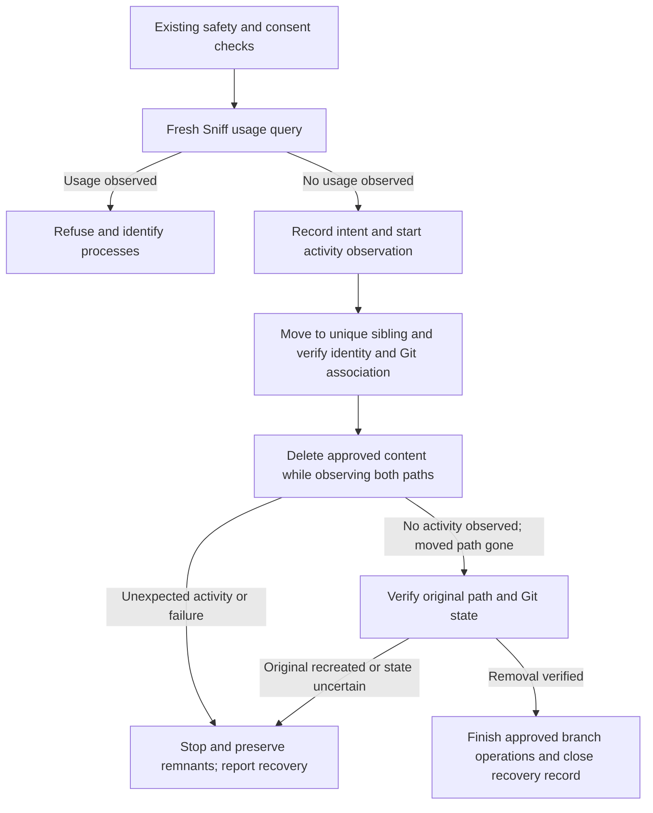

---
$schema:
    status: |-
        enum(
            draft-spec,
            finalized-spec,
            planned,
            implemented,
            review-findings,
            human-in-the-loop,
            completed,
            on-hold,
            abandoned
        ) -> an indicator of progress for this specification
    reviewed: boolean -> indicates whether the specification file has been reviewed by another agent from the one which created the spec
    reviewed_by: string -> the agent and model used in the spec review
    reviewed_on: date -> the date the spec was reviewed
    review_iterations: number -> the number of implementation reviews have taken place in the review/fix cycle
    clarified: boolean -> indicates whether the specification was built -- _in part_ -- with the 'clarify.md' prompt
    implemented: boolean -> indicates whether this spec's plan has been implemented
    implemented_by: string -> the agent who implemented the plan
status: draft-spec
implemented: false
reviewed: true
reviewed_by: codex/gpt-6.1-sol
reviewed_on: 2026-10-05
review_iterations: 0
depends-on:
  - 2026-10-05-filesystem-watchers
---

# Graceful removal under filesystem contention

## Outcome

`wt remove` identifies observable process usage before moving or deleting a
checkout.
When usage is found, it explains the evidence and asks the user to stop the
relevant work before retrying. When no usage is found, removal moves the checkout
to a unique temporary sibling and deletes there while observing both locations.
Unexpected activity causes a recoverable stop and an accurate report of what
was moved, deleted, retained, and changed in Git.

This is planned behavior. Implementation must wait for the author to resolve
the Git transition and observation choices in **Open Questions**. The dependent
Sniff specification also has an unresolved timing contract; this specification
accepts the shared scan budget recommended there, subject to that API decision.

The existing branch-safety, file-discard consent, protected include, worktree
identity, locked-worktree, submodule, remote-endpoint, and shell-handoff rules
remain mandatory. A safe branch does not authorize discarding new writes.
Discovery cannot guarantee that a directory is unused, and moving a directory
does not revoke a process's handles or working directory.

Here, **quarantine** means the temporary sibling directory holding the moved
checkout. An **inventory** lists inspected entries and their state; a **consent
fingerprint** binds approval to that inspected state so changes invalidate it.
Git's **administrative record** connects the checkout to the shared repository
and retains its index, which describes staged work. Discovery **coverage** says
which observation mechanisms ran and what they could not inspect.

## Scope and compatibility

Apply this lifecycle to existing linked checkout directories, including detached
checkouts and checkouts whose missing `.git` link was successfully repaired.
The main checkout remains ineligible. A directory already confirmed absent uses
the existing record-only removal: inspect its retained index, reconfirm its
identity and absence, then remove that exact record. Do not query Sniff for a
missing target or fabricate a quarantine. A pending recovery record takes
precedence over this ordinary missing-directory path, because it may identify
retained content elsewhere.

The existing preparation step may repair Git links before reporting and consent.
This specification does not move that repair or claim that it is read-only.
Refusal after repair must say that the restored link was left in place, or that
an unsuccessful repair may have changed Git metadata, as it does today.

Two changes are intentional: observed usage adds a refusal that force flags
cannot bypass, and eligible checkout removal replaces Git's whole-directory
deletion with checked deletion. Exit codes and the shell wrapper protocol retain
their existing meanings. No new force flag, process-stop command, or user-facing
JSON option is introduced by this fix; structured reports are library results
and saved recovery files.

## Problem

An active writer can recreate content while Git deletes a worktree. Git can
report `Directory not empty` after unregistering the checkout, leaving files
behind and making a retry by worktree name ineffective. A rename alone does
not solve this: a process with a retained cwd/handle can write into the moved
directory, and a process using the old absolute path can recreate the original.

The misleading routine list of ignored paths is not a contention diagnostic and
stays removed. Continue reporting dirty/protected files that require consent.
Do not special-case GitNexus, editor, build-tool, or other watcher names.

## Responsibility boundaries

- **Sniff library:** read-only process/path observations and coverage, using
  `query_path_usage`; no removal policy or process termination.
- **Worktree library:** contention policy, quarantine lifecycle, bounded activity
  observation, checked Git transitions, recovery records, and typed outcomes.
- **`wt` CLI:** existing questions/handoff plus human reporting and recovery
  guidance using `biscuit-terminal` components. Request the Worktree library's
  removal observations and outcomes; do not duplicate its contention policy.

The Worktree library calls Sniff directly. Neither package spawns the `sniff`
CLI or duplicates OS-specific process discovery. Keep the existing thin CLI
coordination of consent and branch actions; this fix does not require an
unrelated rewrite of that coordination.

Consume the public API defined by `2026-10-05-filesystem-watchers`. Activity
observation during this operation belongs in Worktree; it is not another
systemwide watcher-inventory API.

## Preflight and refusal

Run discovery after the existing guards and preparation, immediately before the
quarantine mutation, after any questions and final identity/fingerprint checks.
A preliminary query may supply report information but never replaces this fresh
query. A fresh query cannot replace the consent or identity checks either; check
that their bindings still hold after discovery and observation setup.

When the caller's shell is inside the target, the first invocation reports,
collects consent, and emits the existing handoff. Perform the decisive usage
query in the second invocation, after the wrapper has moved the shell out and
all handoff checks pass. Do not refuse the first invocation merely because its
parent shell still has its working directory inside the target: that would
prevent the handoff that resolves the usage. Other programs still using the
target after handoff cause refusal. Without the wrapper, retain exit 4 before
discovery or mutation.

Any relevant `watch_registration`, `open_handle`, `working_directory`, or
`loaded_module` evidence, except the exact operation-owned handles described
below, causes a conservative refusal.
This establishes current usage, not proof that deletion is blocked. Exclude
only the current `wt` process's own operation handles after moving its cwd
outside the target; do not exclude its shell, ancestors, or an entire process
group. Give the user PID, available name/executable, exact matched path, evidence
kind, and observation limitations.

Exclude only specifically identified detector/operation handles, not all
evidence belonging to the current PID. Preserve Sniff's process-lifetime
identity and lossless paths. When an evidence record has several in-scope
aliases or only a native identity, report those facts rather than invent an
exact pathname or attach a name from a reused PID.

Refuse with the existing refusal exit code (3), keeping the checkout and branches
in place. Ask the user to stop the listed work and rerun `wt remove`; there is no
"continue anyway" question, automatic kill, or force-flag bypass. Explain that
some handles are harmless but removal was paused because usage was observed.

If no matches are found, continue with move-then-delete even when discovery is
partial, unavailable, or unsupported. Preserve coverage in the operation report
and describe it if recovery is needed. If the target cannot be resolved or
validated, refuse. Ordinary detector permission/failure limitations alone must
not make removal impossible on an OS. "No usage observed" never becomes "no
watchers exist."

Use Sniff's default two-second shared scan budget; do not add a new timeout flag
or retry exhausted scans automatically. Budget exhaustion after a verified root
retains partial evidence. A root-validation error, including a timeout before
identity capture, refuses before mutation. This is a work budget, not a promise
that every native call returns within two seconds; do not leave scanning threads
running after the query returns. The implementation must use the finalized
dependent API rather than reclassify typed errors by their message text.

Example:

```text
Removal paused: another process is using fix-path-spelling.

PID 8124  node
  Open handle: /work/fix-path-spelling/.gitnexus/index.db

Stop the relevant process or task, then rerun:
  wt remove fix/path-spelling

The checkout and branches were kept.
Discovery is partial; FSEvents subscriptions cannot be enumerated on macOS.
```

## Move-then-delete lifecycle



### Durable preparation

Before mutation, create a recovery record under the repository's verified common
Git directory, outside both checkout paths and outside the target's own admin
record (which removal will delete). Use `<common-git-dir>/wt-removal/<operation-id>/`
for the report and deletion journal. Do not assume `<base>/.git` is a directory.
Write atomically with owner-restricted access using platform-appropriate
permissions. Bind an operation ID to original and quarantine paths, native
directory identity, repository/admin
identity, branch and approved tip, existing consent fingerprint, discovery
report, original requested name and branch/directory aliases, intended actions,
record version, and completed phase. Reject concurrent removals of the
same target using a held OS-backed lock keyed by repository/admin identity, not
PID-file existence. A stale lock file is not proof that an operation is active.
A pending record blocks a new operation; retry resumes that record only after
validation. A crash after rename must leave enough information to find retained
content without relying on the original registration or directory name.

Validate the storage directory and record without following replacement links;
reject unknown record versions, malformed native paths, wrong ownership, and
repository/admin identity mismatches. Flush mutation intent before destructive
work, and document the selected persistence primitive's crash guarantees. The
required recovery tests cover process termination; do not claim protection
against every filesystem or power-loss failure.

Persist each mutation's intent before starting it and its observed result after
it, including rename, registration changes, deletion batches, and branch actions.
On restart, inspect actual state to resolve an interrupted phase; never treat a
saved completed-phase value as proof that paths or Git still have that state.
If the record or journal cannot be safely created, refuse before mutation. If a
later write fails, stop further destructive work and report the last durable
phase plus any subsequent known or uncertain actions. Handle interruption at
the next entry boundary; abrupt termination uses the same restart recovery.

Choose a collision-resistant hidden sibling, such as
`/work/.wt-remove-fix-path-spelling-<token>`, on the same filesystem. Do not use
a global temporary directory or copy-and-delete fallback. Rename must not
replace an existing destination. Validate identity and real-directory status
at mutation boundaries, and never follow a recreated original path or a
replacement quarantine symlink/junction during cleanup.

An existence check followed by ordinary `std::fs::rename` does not enforce
no-replacement: [Rust's rename contract](https://doc.rust-lang.org/std/fs/fn.rename.html)
permits destination replacement. Select and test an operation with an atomic
no-replacement guarantee on each supported platform. Pass native paths to Git
and filesystem APIs without display-string conversion. Inspect child entries
without following links; remove an approved link itself, never its target.
Refuse nested mounts or unsupported reparse-point types before mutation unless
the selected backend can establish safe boundaries. A path containing an
ancestor alias such as macOS `/tmp` remains valid; a link replacing the target
directory itself remains ineligible.

### Git association and rename

Treat this as removal of the originally inspected checkout, preserving its
registered/admin identity and index protections. Prefer a supported Git move
where it satisfies the contract. Git cannot move worktrees containing submodules;
an alternative same-filesystem rename and association update requires explicit
verification of the target's forward/back references and all existing submodule
and locked-worktree safeguards. Do not disguise a moved checkout as an ordinary
missing worktree to bypass those checks. Avoid repair that silently mutates
unrelated worktree records.

Git's [worktree command contract](https://git-scm.com/docs/git-worktree)
does not provide a record-only deletion mode for an existing checkout. A
successful move therefore does not solve the interruptible-deletion requirement.
The author must select the move and final unregister strategy under **Open
Questions** before implementation enables deletion. If a checkout topology
cannot be moved safely, refuse before destructive work with an explanation.
A failed native rename leaves the original intact. After a successful rename
but failed association update, attempt a verified rollback only
when the original path is still absent and no destructive work or unexpected
activity occurred. Otherwise preserve the quarantine and report actual state.

Re-list and validate lock status and admin/checkout links immediately before
moving, before deleting, and before unregistering. Never unlock an existing
worktree or use repeated `--force` to bypass its lock. Replace the Windows
rename-and-back lock probe with the actual recorded quarantine move, so a probe
cannot leave an unrecorded directory behind. A native Windows sharing failure
before a successful move retains exit 4; permission, collision, and other I/O
failures are operational errors, not evidence of another process's usage.
If a move command fails, inspect both locations before claiming the original
was kept: a multi-step command may have moved files before reporting failure.

### Activity observation

Start observation before rename, covering the parent for original-path
recreation and the checkout/quarantine for descendant activity. Include changes
to the target's admin identity and approved index, whose files live outside the
checkout tree. Maintain
observation across rename; explicitly account for platform watch invalidation.
Combine native notifications with identity/inventory checks. A watcher alone is
insufficient, and an event overflow or lost watch must be reported as lost
coverage. Distinguish operation-owned rename/unlink/metadata events from
unexplained creates, replacements, and content modifications.

Establish usable local activity observation before mutation; if it cannot be
established, retain both files and registration and return an operational error.
This differs from incomplete Sniff discovery, which is advisory and permits
continuation. Bound event queues and deletion batches; an overflow or a watch
limit cannot silently downgrade safety. Drain between entries/batches and
inspect exact affected paths. Parent events outside the two target trees do not
stop removal merely because another sibling changed. Watcher handles created
by this operation must be tracked so its own later Sniff query can exclude them.

Do not ignore every event on a path merely because that path is scheduled for
deletion. Match expected operations narrowly by path, kind, and captured identity,
and confirm resulting state. If an event could equally represent a concurrent
write and cannot be resolved by checks, stop with uncertain state. Loss of a
watch when the final observed directory is intentionally removed is expected
only when absence is confirmed and the parent watch remains usable.

Capture an operation-start inventory for all content approved for deletion,
including ignored content that previously required no consent. Preserve the
existing fingerprints for consent-sensitive files; use `biscuit-hash` when
additional content hashes are necessary. Never rely only on directory mtime or
entry count. Compare newly observed paths and identities against that inventory.
During deletion, stop before deleting a newly appeared or detectably changed
entry. Detect modifications/replacements of existing files as well as new files.

Begin that inventory after observation is active and before moving. Finish with
a consistency check; if entries changed or cannot be inspected, refuse before
mutation. Persist the inventory with the deletion journal before moving so
restart recovery can compare retained entries to their original identities.
Store per-entry native identity, type, relevant metadata and link
target, and use content hashes for the existing consent-sensitive paths. For
other files, detection relies on metadata plus notifications, with the concurrent
write limit stated below. Do not hash every ignored build artifact by default
or claim detection of changes that preserve all inspected metadata and escape
notification. A hash alone also cannot close the check-to-unlink race.

Use one initial inventory and targeted checks during deletion, rather than
rescanning the entire remaining tree after every entry. Delete children before
directories. An externally disappeared approved entry is recorded as already
absent, never as a deletion performed by `wt`; unexplained disappearance is
activity that stops the operation. Only regular files, directories, and link
types with a safe unlink operation are eligible; do not open a FIFO/device to
hash it. Uninspectable or unsupported content refuses before any deletion.

Use parent-directory handles and relative operations where supported, and
revalidate parent/entry identity immediately before mutation. A one-time root
check followed by recursive pathname deletion is insufficient if a descendant
directory has been replaced by a link. Keep `.git` and the administrative index
available until ordinary content cleanup has finished where the chosen Git
strategy permits, and bind index bytes and Git's interpreted entries (including
split-index files and entry flags) to the approved state. Recheck that binding
before unregistering; a new staged write is not covered by earlier consent.

Activity at the original path is never authorized cleanup: leave the recreated
tree intact and stop deletion of the quarantine. Never recursively delete the
original as a retry strategy. Activity at the quarantine causes the same stop,
with remaining files preserved. Record observed paths, event kinds, and times;
query Sniff again for validated real directories at either existing location to
supply process evidence where available. A diagnostic query failure is recorded
without changing the stopped operation into a success or concealing its saved
report. Do not attribute a write to a PID merely because it has a handle. Record
notification receipt times; an event without a reliable occurrence timestamp
does not establish when the process wrote.

Deletion must be interruptible at entry boundaries. An opaque whole-tree delete
that cannot stop for unexpected activity does not meet this contract. Check both
locations between bounded deletion batches and after the final batch, including
an observation drain and final identity/inventory checks. Do not use an arbitrary
sleep as proof that writers stopped or retry until a writer loses the race.

No portable implementation can atomically distinguish and preserve every write
concurrent with unlink. Events can arrive late, and a writer can start after the
final check. The report must state this limit and identify already deleted
content; it must never promise complete preservation or absence of writers.
Lost observation coverage during deletion stops the operation with recovery
guidance rather than silently claiming a verified success.

### Completion and partial outcomes

Verify quarantine absence, no original-path recreation observed through the final
check, and the exact registration's removal before declaring checkout removal
complete. Retain the registration until file cleanup is confirmed where possible;
if Git unregisters during a failed step, record that fact. Never prune unrelated
registrations. Keep branch deletion and remote deletion after verified checkout
completion, using the existing expected-tip and endpoint reconfirmation rules.

On unexpected activity or cleanup failure, stop further local/remote branch
operations. Preserve the recovery record and remaining files. Distinguish
`usage_refused`, `removed`, `activity_detected`, `cleanup_failed`, and
`state_unverified` typed outcomes, including moved/deleted/remaining state.
Use exit codes according to actual changes, preserving the existing promise
that exits 3 and 4 removed nothing:

| Situation | Exit | Required report |
| --- | --- | --- |
| Usage or changed approved state detected before mutation | 3 | Files, registration, and branches kept; mention any earlier link repair |
| Missing wrapper, invalid/expired handoff, or Windows sharing failure before move | 4 | Nothing removed; explain the environment remedy |
| Activity, lost coverage, I/O failure, or uncertain state after move | 1 | Both paths, partial deletion, registration, and branches in their actual state |
| Checkout removed, later branch action fails | 1 | Checkout removed; completed and pending branch actions identified |
| Verified completion, or consent declined before mutation | 0 | Existing completion or cancellation report |

**Reader's note:** the draft assigned exit 3 to activity discovered after files
had been deleted. That contradicted the existing exit-code contract. A stop
after a move now uses exit 1 even if it deleted no files, so scripts and reports
do not mistake a quarantined checkout for an untouched refusal. Preserve the
typed outcome separately from the exit code; a writer stop is not reduced to
an unexplained Git failure.

Do not restore a partially deleted quarantine into the original path and call it
an intact checkout. If the original reappears, do not overwrite or merge it.
Report which locations still exist and preserve all remaining content there.

## Recovery report and retry

The persistent report includes operation ID; original/quarantine paths and
identity; timeline and completed steps; initial and later Sniff evidence with
coverage; observed activity; an operation-owned deletion journal; retained
entries; Git registration state; local/remote branch outcomes; and errors. Report
whether counts/listings were truncated or state could not be inspected. Do not
claim attribution or full preservation beyond the evidence.

The deletion journal distinguishes planned entries, confirmed operation-owned
deletions, externally absent entries, and uncertain attempted deletions. Persist
batch intent before unlinking and confirmed results afterward. A crash between
unlink and result persistence cannot establish who removed an absent file;
recovery labels it uncertain rather than claiming an exact deletion count.
Include directories and links with their types, and distinguish directory-entry
deletion from destroying bytes (hard-linked or still-open data can survive).
Summary truncation must not discard confirmed journal entries; exhausting a
journal storage limit stops deletion. Use the dependent Sniff specification's
lossless serialized path representation for report and journal paths, including
Unix bytes and Windows UTF-16 when display strings do not round-trip.

Keep the pending record, copy/include baseline, and journal through failed branch
steps as well as partial checkout cleanup. Remove the original path's copy
record only after checkout and registration removal are verified; a quarantine
does not create a fresh include-copy baseline. When all requested steps finish,
persist completion before clearing pending recovery state and its temporary
journal. Failure to clear it is reported as a bookkeeping warning; the completed
record must not authorize another removal. No background deletion of retained
quarantines or unfinished records is part of this fix.

Show a compact human report with the persistent report path for full detail:

```text
Removal stopped: new files appeared at the original path.

Original: /work/fix-path-spelling
Moved to: /work/.wt-remove-fix-path-spelling-a91c
Deleted before stopping: 124 files (listed in the saved report)
Remaining: 6 files in the moved directory
Observed: /work/fix-path-spelling/.gitnexus/index.db was created
Git registration: now points to the moved directory
Local and remote branches: kept

Stop any tasks using either path. Inspect both locations and save new work.
Retry: wt remove fix/path-spelling
Full report: /repo/.git/wt-removal/a91c/report.json
```

Retry by the original name uses the verified pending recovery record even if Git
no longer registers that name. It must resolve ambiguity explicitly, validate
record ownership/identity, query both existing directory locations, and reassess
consent for retained or new content. No prior approval authorizes newly written
files. Retry never automatically deletes a recreated original; the user must
preserve or otherwise resolve that content first. Explain recovery options when
the registration is
gone or the quarantine no longer forms a usable checkout. A stale record or
replacement path must not become authority to delete arbitrary content.

Resolve the requested name against the union of live registrations and pending
records, deduplicating only when both identify this same operation's checkout.
The quarantine's registered basename must not provide a second way to bypass its
pending record. A new live worktree using the old branch/name is ambiguous with
the pending removal: list both and refuse rather than choosing either. Run
recovery from the base checkout when the original no longer reaches this
repository. Saved aliases are lookup keys, never filesystem authority.

Retry re-collects surviving content, include rules/baseline, index and branch
state, and obtains fresh consent through the existing questions/force flags.
It never reuses an expired handoff or saved remote deletion approval; expected
tips, branch safety, and remote endpoints are assessed again. A pending record
describes what happened, rather than granting permission for future deletions.
If an original-path object has appeared, refuse automatic cleanup of either
tree until the user resolves it. Query it only if it is a validated real
directory; never follow a replacement link simply to gather diagnostics.

If the quarantine is a partial checkout whose ordinary Git status cannot run,
report the verified remaining inventory and administrative index without
repairing missing working files. The record may bind those remnants to this
operation, but does not make the ordinary missing-directory/index-only path
safe. Resume deletion only if their identity and consent-sensitive state can
still be established. Otherwise provide inspection and manual recovery steps
and preserve everything. Inability to resume safely is an honest recovery
outcome, not permission to skip safeguards.

## CLI reporting

Keep `wt`'s existing channel contract: reports, questions, warnings, failures,
and recovery guidance go to stderr; stdout carries only shell-wrapper protocol
lines where needed. Sniff's data-on-stdout convention applies to its own CLI,
not to `wt remove`. Do not emit `cd:` or `remove-handoff:` after a mutation
failure, or render process/path text as protocol lines.

Use `biscuit-terminal` components, including `Prose`, for capability-aware
rendering and wrapping. Escape untrusted names, paths, and errors before placing
them in markup, and display control characters safely. Preserve native values
in library results and files; shell command examples must quote arguments for
the relevant shell rather than invite pasting a raw process-supplied path.
Preflight refusal remains concise and omits the routine ignored-file list.
Successful removal adds no discovery chatter to today's report. Partial
reports always show both locations and the saved report path, and distinguish
"kept" from "already removed" when a later step fails.

## Open Questions

### How should Git stay associated while file deletion can be stopped?

**Requires author decision before implementation.** The Worktree library's
[`remove_worktree`](../../lib/src/remove/mod.rs) currently lets Git delete
the directory and unregister it in one command. This fix needs to stop between
entries and preserve the index; merely moving the path first does not supply
that control. The move must also honor the no-replacement rule and leave other
worktrees' metadata alone.

1. **Controlled deletion with registration retained — recommended.** Select a
   move backend that enforces no replacement and verifies the same admin links.
   Use supported Git move only if it meets those requirements; otherwise use
   native rename plus narrowly scoped, checked link updates. Delete approved
   content in Worktree, preserving `.git` until the last stage, and use targeted
   Git removal only once no working content remains and the index/lock bindings
   are reconfirmed. Refuse unsupported submodule topologies before moving.
   - **Pros:** separates file cleanup from unregistering, supports entry-level
     stops, and preserves the index and ordinary registration for recovery.
   - **Cons:** native link updates require careful crash recovery and support
     for Git's relative-link format; the final Git step still needs identity,
     recreation, and index checks. Some formerly removable submodule checkouts
     would initially refuse, which help and removal docs must disclose.
2. **Keep Git in charge of deletion and interrupt it on activity.** Move using
   a verified backend, then supervise `git worktree remove` and stop its process
   when notifications indicate activity.
   - **Pros:** less custom filesystem deletion and association handling;
     retains more Git-managed topology behavior.
   - **Cons:** process termination cannot enforce entry boundaries, and Git can
     unregister before a failure. This option requires the author to weaken
     the preservation and checked-deletion contract explicitly; it does not
     satisfy this draft as written.
3. **A native quarantine with registration left at the original path until
   cleanup ends.** Rename without modifying Git links, delete under the captured
   identity, then remove the now-missing original registration after checking
   the retained index and both paths.
   - **Pros:** avoids rewriting Git links during the move and leaves Git's
     final step dealing with an absent directory.
   - **Cons:** the record looks prunable while cleanup is pending, concurrent
     Git maintenance can discard it, and a recreated original can redirect
     removal toward new content. Protecting and recovering the record adds
     complexity and requires an explicit change to this draft's association
     guarantees.

Recommend controlled deletion with registration retained because stopping
before deleting newly observed work is the goal. Confirm the supported Git
versions and eligible checkout topologies in the implementation plan, and test
the final index-safe unregister step before enabling destructive cleanup.
Do not use broad `git worktree repair` as the move's association updater: this
repository already records that it can change unrelated broken links.

### What local observation strategy is sufficient during deletion?

**Requires author decision before implementation.** Native notifications can
be delayed, combined, lost, or invalidated by rename. They also do not reliably
identify the writing process. The Worktree library needs a stated minimum
coverage contract so an implementation cannot silently treat a broken observer
as successful removal.

1. **Native notifications plus one inventory and targeted checks — recommended.**
   Choose a maintained portable notification adapter with explicit platform
   capabilities, or focused native adapters where needed. Watch the parent,
   captured checkout, and relevant admin state; drain notifications during
   checked deletion and validate path/entry identities.
   - **Pros:** bounds repeated traversal and catches ordinary creates and
     modifications while keeping permission to delete tied to captured state.
   - **Cons:** recursive watch setup can hit platform limits; rename continuity
     and Windows sharing behavior need real tests. Unsupported local observation
     refuses before moving, and cannot claim protection on every filesystem.
2. **Inventory polling without native notifications.** Recheck paths and file
   metadata during deletion and publish the polling coverage limits.
   - **Pros:** fewer notification dependencies and works where native watches
     cannot be established.
   - **Cons:** misses changes between polls and makes broad rescans costly;
     cannot satisfy the current notification/coverage contract without an
     author-approved reduction in protection.
3. **Hash every remaining file repeatedly.** Compare full content snapshots
   between deletion batches.
   - **Pros:** detects some modifications that preserve ordinary metadata.
   - **Cons:** repeatedly reads ignored build output, delays routine removal,
     and still cannot preserve every check-to-unlink write. The cost buys no
     complete safety guarantee.

Recommend notifications plus targeted checks because it addresses the reported
writer race without repeatedly reading the whole checkout. Record supported
filesystem capabilities and the chosen batch bounds in the plan. No performance
spike is required to decide these semantics, and this review adds no timing
thresholds or multi-host performance study. Behavioral portability tests below
remain necessary because real handle and rename semantics differ across OSes.

## Acceptance and verification

1. Known usage refuses before rename/deletion, names available PIDs/evidence,
   preserves branches, and cannot be overridden by existing force flags.
2. No matches, partial discovery, and unsupported watcher discovery take the
   move-then-delete path when local activity observation is available; ordinary
   safe removal adds no discovery chatter. Unavailable discovery is retained in
   the report, while root-validation errors refuse before mutation.
3. Controlled writers reproduce both retained-cwd writes to the quarantine and
   absolute-path recreation at the original. Both yield preserved remnants,
   honest partial-deletion reports, and no branch operations.
4. Existing-file modification, replacement, deletion-time recreation, delayed
   events, overflow, and watch invalidation exercise the stop/report contract.
5. Rename collision/failure, Windows handle contention, submodule topology,
   locked worktrees, links/reparse points, changed admin associations, and
   cross-device destinations preserve existing safeguards.
6. Crash injection at each phase leaves recoverable records; retry by original
   name works after unregistering and rejects changed identities/new content.
7. Preflight/handoff/force paths retain consent fingerprint, expected branch-tip,
   and remote-endpoint protections. A recreated original is never traversed for
   deletion, and rollback never overwrites it.
8. Human reports and structured outcomes agree about both paths, partial deletion,
   discovery coverage, Git registration, and branch state on every failure path.
9. An inside-target wrapper run reaches handoff despite its parent shell's cwd;
   the second run performs discovery after the shell moves. A different process
   still using the target refuses. Existing stdout protocol remains unchanged.
10. Missing directories retain record-only/index-safe removal. Pending recovery
    records cannot be bypassed by the quarantine name, and a reused branch/name
    refuses as ambiguous. Partial checkouts never enter an unchecked cleanup path.
11. Recovery-record/journal write failures, crashes between unlink and result
    persistence, stale locks, malformed records, and interruption after rename
    preserve remnants and distinguish confirmed deletions from uncertain ones.
    Branch-step failures retain recovery information and require fresh approvals
    on retry. Completed records never authorize a second removal.
12. Native paths round-trip through Git, saved reports, and recovery; descendant
    links are not followed, nested mounts/unsupported entries refuse safely,
    and a concurrently created rename destination is never replaced. Activity
    after move exits 1; observed usage before move exits 3; a Windows sharing
    failure before move retains exit 4. Ordinary I/O errors are not mislabeled
    as process usage.

Use existing Worktree fixtures, Test Toolkit, nextest, and area `just test` /
`just lint`. Prove policy/error combinations with injected observations and
failures in library tests; prove representative CLI wiring and recovery through
the real binary. Real child-process/rename/handle/watch tests are ordinary L1
tests when they need no terminal. Exercise the relevant native behavior on
macOS, Linux, native Windows, and WSL2; mocked evidence or cross-compilation
alone does not establish it. Retain representative shell-wrapper tests at their
existing tiers without expanding every policy case into a terminal test.

Start controlled writers after preflight through deterministic barriers so the
test reaches the deletion race; an already-active known writer would only prove
preflight refusal. Use child readiness handshakes, not sleeps. Fixtures release
all children, handles, and watches even when assertions fail. Test process
discovery with a fixture-owned scope or injected source rather than depending
on arbitrary host watchers. Network and branch-safety queries use the existing
local stand-ins. No terminal or browser focus changes.

Check work structurally: no per-process repeated checkout walks, no whole-tree
rescan per deleted entry, and no unconditional hashing of ignored file bodies.
This spec does not add a performance spike or statistical timing gate.
Update README and removal topic docs when the behavior is built, including the
meaning of exit codes, eligible topology/filesystem limits, and retry from the
base checkout. Update dependency docs if dependencies change and Worktree/OS
skills when new workflow/platform facts are established. Remove planned markers
only for implemented behavior. Record departures in the implementation log;
the author closes and moves the spec after review.
