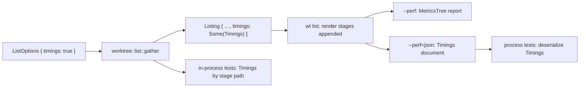

---
$schema:
    status: |-
        enum(
            draft-spec,
            finalized-spec,
            planned,
            implemented,
            review-findings,
            human-in-the-loop,
            completed,
            on-hold,
            abandoned
        ) -> an indicator of progress for this specification
    reviewed: boolean -> indicates whether the specification file has been reviewed by another agent from the one which created the spec
    reviewed_by: string -> the agent and model used in the spec review
    reviewed_on: date -> the date the spec was reviewed
    review_iterations: number -> the number of implementation reviews have taken place in the review/fix cycle
    clarified: boolean -> indicates whether the specification was built -- _in part_ -- with the 'clarify.md' prompt
    implemented: boolean -> indicates whether this spec's plan has been implemented
    implemented_by: string -> the agent who implemented the plan
status: draft-spec
reviewed: true
reviewed_by: codex/gpt-6.1-sol
reviewed_on: 2026-10-04
review_iterations: 2
completed: true
clarified: false
implemented: true
human_review: false
message_to_agent: |-
    Phase 7 (final, done): implementation complete, ready for review. Docs rewritten
    (`worktree/docs/performance-testing.md` `--perf` section: stage table, child kinds, worker reports,
    `--perf=json` framing and schema, reading a stage by path, perf/functional split, old-row-name map;
    plus `docs/cli/list.md`, `docs/git-graph.md`, `README.md`, `docs/dependencies.md`) and skill pages
    `git-graph.md`/`list.md` updated. One open finding for review: biscuit-terminal's `MetricsTree`
    always prints `100%` on its root row, so the human report's worker-section heading shows `100%`
    although spec §3 says worker reports render without percentages (the rows themselves show `—`).
    Fixing it touches shared rendering (a biscuit-terminal option for a blank root share, or a different
    layout in `cli/src/perf.rs`); details in the implementation log, Phase 7. The spec `status` was left
    unchanged for the author.
related:
    - 2026-06-14-perf-measurement
    - 2026-10-03-list-overlap-and-keyless-notice
---

# `wt list --perf` should be a library option that names real work, and tests should read it as data

## Problem

`wt list --perf` was meant to answer "where did the time go?". Today it
answers that poorly, and the tests built on it mix performance evidence with
functional evidence.

A report from 2026-10-04 on this repository (image terminal, 10 worktrees):

```text
▌ Performance                               749.2ms  100%
▌ ├─ pre-dispatch                            15.7ms    2%
▌ ├─ pr gather                                8.5ms    1%
▌ ├─ remote wait ‖ local gather             585.8ms   78%
▌ │  ├─ remote wait                         540.5ms     —
▌ │  ├─ pr reread                            45.2ms     —
▌ │  ├─ list gather                         247.6ms     —
▌ │  └─ graph gather                        416.9ms     —
▌ ├─ table render                            27.5ms    4%
▌ ├─ graph image render (biscuit-terminal)   30.1ms    4%
▌ └─ unattributed                            81.6ms   11%
```

### 1. The rows do not say what work ran

| Row | What it measures | Why the name misleads |
| --- | --- | --- |
| `pre-dispatch` | Process start to the list pipeline: argument parsing, completion check, terminal detection | Names a code location, not work |
| `pr gather` | `git remote get-url origin`, the `--ignore-api` record, and the API preference read | No PR is gathered |
| `remote wait` | Launching the detached `wt internal-refresh` worker and blocking until both of its halves end or the budget runs out | The work (a provider API request for open PRs; a default-branch check and possibly a `git fetch`) happens in another process and is invisible |
| `pr reread` | An origin recheck (`git remote get-url origin`) and a read of the PR store file | Reads as a second API call; it makes none |
| `list gather` | One `git status --porcelain` per worktree, all at once, concurrent with the branch comparisons, caption, and fork tree | Two unrelated kinds of work under one vague name |
| `graph gather` | Commit-history reads for the graph: about 45 `git` subprocesses in the observed run, with parallel work across lanes and sequential reads within a lane | One opaque number for the slowest local step |
| `table render` | Building the caption status (which may run `git reflog`), the table facts, and the table | Includes Git work that is not rendering |

### 2. `unattributed` hides real work

`unattributed` was 11% of the total. It is not noise; it is work no row
covers:

- the parse step: `git worktree list`, `git symbolic-ref`, `git for-each-ref`,
  and the fork-origin record load (`worktree::parse_worktree_state`);
- the comparison cache load and the graph's input assembly;
- the ref reread after the wait (`RefSnapshot::read`);
- the commit step: comparison cache save, fork-record pruning, and one
  `canonicalize` per worktree for copy-record pruning (`WorktreeList::commit`);
- the status and notes renders, the graph row budget, and the final write of
  the listing (including Kitty image bytes) to stderr.

### 3. `--perf` exists only in the CLI

The collector (`cli/src/perf.rs`), the stage names (`&'static str` literals in
`cli/src/commands/list.rs`), and the pipeline being timed
(`gather_listing`, `prepare_remote`, `follow_remote`, `list/wait.rs`, and the
graph and verbose gather in `cli/src/commands/git_graph.rs` and
`git_graph/topology.rs`) all live in `worktree-cli`. The `worktree` library has
no notion of timing. A library caller cannot get the same breakdown, and the
library's own Criterion bench (`lib/benches/list_status.rs`) measures a
different entry point from the one `wt list` runs.

### 4. Tests read timings by scraping the rendered report

`cli/tests/perf_support/mod.rs` parses the human-readable report
(`perf_rows`, `stage_from_perf`, `list_gather_from_perf`) back into durations
by stripping ANSI, counting tree connectors, and matching label text. Row
labels and the metrics-tree layout are therefore a de facto test API:
renaming a row, or a cosmetic change to biscuit-terminal's `MetricsTree`,
breaks performance tests. Consumers: `perf_flag.rs`, `perf_pr_request.rs`,
`perf_graph_stages.rs`, `cache_warm_path.rs`, `cache_cold_path.rs`,
`list_prs.rs`.

### 5. Functional tests use timing rows as evidence of behavior

- `list_prs.rs::a_held_live_head_check_holds_the_listing_only_until_its_deadline`
  is an ordinary L1 test. It proves the wait was bounded by reading the
  `remote wait` row out of `--perf` output.
- `list/tests/pipeline.rs` decides whether a regather happened with
  `stages.contains(&"regather")`.
- Several tests in `list/tests.rs` (`run_pipeline_*`) prove which work ran by
  checking stage-name lists, beside the git-call recorder that already proves
  it.

Whether a regather happened, or whether the wait was bounded, is a behavioral
fact. It must not depend on a timing label existing.

### 6. Graph gather has no breakdown

Graph gather is the longest local task (416.9 ms above), and it has no network
work. It starts many `git` processes
(`merge-base --is-ancestor`, `rev-list --first-parent`, `log --no-walk`, …).
Some run concurrently across lanes; others depend on earlier results. Each
takes about 7–15 ms of Git time by `GIT_TRACE2_EVENT`, and process start makes
up the rest. The report shows neither the steps nor the call count, so a
regression or a speedup cannot be located.

## Fix

### 1. The library owns the timings

Add a `worktree::timing` module:

- **`Stage`**: one enum of every measured step of `wt list`, including the
  render and write steps the CLI performs. Each variant has a stable
  snake_case **id** (serialized; tests and JSON use it) and a display
  **label** (`Stage::label`, rendered only). Renaming a label changes no test.
- **`Timings`**: a tree of spans. Each span has a `Stage`, a measured elapsed
  time, an optional `git_calls` count, and children of one of two kinds:
  - **concurrent children** ran in parallel inside the parent's span. They show
    no share and are never summed (today's group semantics).
  - **sequential children** are consecutive parts of the parent. They show a
    share of the parent and reconcile to it with their own `unattributed`
    remainder.
- **Worker observations are separate from contained children.** Worker spans
  measured in another process are diagnostic observations attached to the
  foreground wait, not children that claim to have run entirely inside it.
  They have no percentage and do not participate in its reconciliation.
  Their own sequential/concurrent structure may reconcile internally.
- **Reconciliation** moves out of `cli/src/perf.rs` unchanged in meaning:
  top-level spans are sequential. When their sum does not exceed the total,
  they plus `unattributed` equal it exactly. Otherwise `unattributed` is zero
  and `over_attributed` records the excess: sum(spans) + unattributed −
  over_attributed = total. Apply this rule to every sequential parent;
  concurrent children never enter that sum.
- **Paths, not labels, identify a span.** The same `Stage` may appear under
  different parents (for example `branch_comparisons` under the first group
  and under `regather`). Lookups take a path of stage ids. Ordinary sibling
  stage ids are unique;
  repeated calls inside one logical step accumulate into that step. Do not
  sum overlapping invocation durations as one elapsed span.
- **Serialization**: the library exports a version-1 document with
  `format_version: 1`, `scope: library | command`, `total_us`, and `spans`.
  Each span has `stage` (the stable id), `elapsed_us`, optional `git_calls`,
  `children_kind: sequential | concurrent`, `children`, `unattributed_us`,
  and `over_attributed_us`. Empty children are valid. Each parent and the
  root carry both reconciliation fields, including zero values. For a parent
  with concurrent children these fields are zero, since summing those children
  would double-count overlap; each child can still reconcile its own sequential
  work. Remainder rows are generated by the renderer rather than ordinary stages. Worker
  reports live in a separate `worker_reports` array described below.
  Unsigned integer microseconds are elapsed wall time, never Unix dates.
  Convert measured durations to microseconds before computing serialized
  remainders, so integer rounding preserves the equation. Reject unsupported
  document versions, unknown stage ids, duplicate ordinary sibling ids, and
  inconsistent reconciliation fields; ignore unknown optional fields within
  version 1. These rules belong to the library decoder, not just test helpers.
- **Git-call counts**: the `worktree` package's
  [`git` helpers](../../lib/src/git.rs) gain an optional scoped counter,
  separate from the existing `count-git` test recorder and failure injection.
  Count actual subprocess starts, including processes that later exit with
  an error; a failed spawn or injected failure starts none. Count once at the
  lowest spawning helper, including byte-output helpers, so wrappers cannot
  double-count. Nested scopes each include their descendants. Unrelated calls
  on another thread do not count; graph tasks explicitly return their scoped
  counts and aggregate them after joining. A parent includes each child call
  once, not the sum of parent and child counts. Report `git_calls` only when
  coverage is complete; zero means measured with no calls, omission means
  unknown. Preserve existing recorder-backed functional assertions.
- **Disabled instrumentation**: `timings: false` creates no timing tree,
  takes no per-stage clock reads, enables no counter scopes, and sends no
  worker timing request. The always-compiled Git hook performs only an
  inactive-scope check when disabled. Instrumentation must not add Git calls,
  change budgets, or introduce global state that mixes concurrent listings.



### 2. The `wt list` pipeline moves into the library

`--perf` corresponds to a library option because the work it measures is
library work:

- Move the listing pipeline into `worktree::list`: today's `gather_listing`,
  `prepare_remote`, `follow_remote`, the accept-or-regather logic, and
  `list/wait.rs`. The entry point takes an explicit repository path and
  `ListOptions`
  (today's flags, budgets and worker launch, graph/verbose needs, and
  `timings: bool`) and returns a `Listing` carrying `timings: Option<Timings>`.
  It must not change the process's current directory. The phase callback is
  passed separately so callers can capture their own state; no callback
  defaults to no progress output. Graph needs are a boolean, not a terminal
  capability type. A caller that disables remote refresh supplies no launcher:
  it reads cached remote data without spawning or waiting. The CLI supplies
  its launcher on every ordinary listing, preserving its current behavior.
- The worker launch stays an injected seam (`WorkerLaunch`): the library does
  not know the `wt` binary. The spinner stays in the CLI behind the existing
  `on_phase` callback. Split the spinner adapter out of
  [`list/wait.rs`](../../cli/src/commands/list/wait.rs) before moving
  the wait core: that file currently imports biscuit-terminal itself.
- Move the gathering half of `cli/src/commands/git_graph.rs` and
  `git_graph/topology.rs` (history reads, classification, lane facts, verbose
  commit details) into `worktree::graph`. Its output becomes worktree-owned
  types. Today graph facts use biscuit-terminal's `LaneEntry` and `GraphLine`;
  replace both with library-owned data types, since the library must not depend
  on biscuit-terminal. The CLI keeps
  the conversion currently in `GraphFacts::to_git_graph` and the rendering,
  and maps library types onto the terminal component through a CLI adapter.
  Once `GraphFacts` is library-owned, its terminal conversion cannot remain
  an inherent method defined in the CLI.
- The refresh worker (`wt internal-refresh`, `cli/src/commands/refresh_worker.rs`)
  stays in the CLI.
- The `worktree` package's
  [`list_status` benchmark](../../lib/benches/list_status.rs) uses the new
  entry point with `timings: false`, remote refresh disabled, no `--ff`, and
  no API preference writes. It measures the shared local pipeline rather
  than repeatedly launching workers against the ambient repository. State
  this scope in its docs; it is not a full-command or network benchmark.
- Preserve the existing pipeline contracts during the move: comparisons and
  history use object IDs from the accepted ref snapshot; wait budgets bound
  only the wait; one ref-dependent regather at most; cache save and record
  pruning happen once; only a checkout moved by `--ff` gets another status
  read. Retain the origin-change guard for every caption and request notice,
  ignored/unsupported/local-origin behavior, retry and adoption rules, and
  worker receipt cleanup. The library never prints or makes foreground
  network requests. Keep all graph layout and terminal capability decisions
  in `worktree-cli`.
- Library timing starts at entry and ends after commit and checkout refresh.
  CLI timing starts at the existing process-start instant and ends after the
  listing's stderr write returns. Compose it by rebasing the measured library
  spans into that command interval; do not add the library total as another
  top-level span. Finalize once. Rendering, serializing, and writing the
  performance report itself are excluded to avoid timing the report with
  itself. Library reports omit startup, render, and output stages.

### 3. The report names the work

Proposed tree (labels are display only; ids in parentheses):

```text
Performance
├─ startup                                  (startup)
├─ read worktrees and refs                  (read_worktrees)
├─ origin and API preferences                (origin_lookup)
├─ prepare local inputs                      (prepare_local)
├─ refresh worker ‖ local reads             (remote_and_local)   concurrent children
│  ├─ launch and wait for refresh            (refresh_worker)     sequential children
│  │  ├─ launch worker                       (worker_launch)
│  │  └─ follow results                      (worker_wait)
│  ├─ PR cache read                         (pr_cache_read)
│  ├─ local listing facts                   (local_gather)       concurrent children
│  │  ├─ worktree status                    (worktree_status)
│  │  └─ branch comparisons                 (branch_comparisons)
│  └─ graph history  [n git]                (graph_history)      sequential children
│     ├─ shallow check  [n git]              (shallow_check)
│     ├─ default-branch tips  [n git]        (default_tips)
│     ├─ focused merge base  [n git]         (focused_merge_base)
│     ├─ verbose commit details  [n git]     (verbose_details)
│     ├─ assemble lanes and fork holders  [n git]  (lane_assembly)
│     └─ unattributed
├─ fast-forward                             (fast_forward)       --ff only
├─ ref reread                               (ref_reread)
├─ regather                                 (regather)           refs changed or read failed
├─ save caches and records                  (commit)
├─ checkout status refresh                  (checkout_refresh)   --ff moved a checkout
├─ caption status                           (caption_status)
├─ prepare display facts                    (display_facts)
├─ table render                             (table_render)
├─ verbose render                           (verbose_render)     -v only
├─ status and preliminary notes             (notes_render)
├─ graph row budget                         (graph_budget)
├─ graph image render (biscuit-terminal)    (graph_render)
├─ final notes render                       (final_notes_render)
├─ assemble and write output                (write_output)
└─ unattributed                             (hidden below 1 ms)
```

- Use `remote_and_local` only when a wait actually ran, not merely when an
  origin exists. Otherwise use `local_reads`. Omit steps that did not run;
  record attempted steps even when they return no data or fail recoverably.
- `prepare_local` covers comparison-cache load and graph input assembly.
  `caption_status` includes any reflog read; `display_facts` is the pure
  conversion to table facts. `graph_budget` includes sizing; preliminary and
  final notes each get their own span because the graph can add notes.
- Keep a `local_gather` parent around status and ref-fact gathering. Its
  concurrent children are `worktree_status` and `branch_comparisons`, the
  latter including caption and fork-tree work. This preserves the exact
  elapsed surface of the existing warm/cold cache performance bounds.
  Under `regather`, include input preparation and the concurrent
  `branch_comparisons` and history steps; do not repeat dirtiness.
- `verbose_history` replaces `graph_history` when only `-v` needs history.
  Omit `shallow_check` on that path, as today's code does. When both graph
  and verbose are requested, gather once and attribute verbose detail reads
  within `graph_history`, rather than counting history twice.
- **Reader's note — graph work already overlaps.** In `worktree-cli`,
  [`gather`](../../cli/src/commands/git_graph.rs) reads shallow state,
  default tips, a focused merge base and verbose details when needed, then
  assembles lanes. Lane placement and lane reads already use parallel tasks,
  and the focused view can repeat assembly after finding another fork holder.
  Treat that whole assembly loop as `lane_assembly`, with complete aggregated
  counts. This avoids claiming that repeated assembly and holder searches are
  disjoint sequential steps. Do not change its algorithms to make timing easy.
- **Worker reports come from the worker.** Add an opt-in timing boolean to
  the injected launch arguments and hidden subcommand. Only enabled attempts
  collect durations. The completion receipt gains an optional `durations`
  object but keeps `RECEIPT_FORMAT_VERSION` at 1: this is an additive field,
  and the existing reader ignores unknown fields. Decode timing data
  separately after validating the receipt's required outcome fields. Missing,
  malformed, or unsupported timing data never invalidate a usable outcome.
  The timing object has its own `format_version: 1`, `total_us`, `spans`,
  and root reconciliation fields, using the same span schema as `Timings`.
- Each worker report describes its own measured interval from worker entry
  through completion of both halves, excluding receipt serialization and
  writing. Record setup sequentially, then a measured concurrent-halves group.
  Its children are `pr_refresh` (lock, provider request and publication) and
  `head_refresh` (check and optional fetch, including their store work).
  Record `pr_request`, `head_check`, and `head_fetch` at their actual library
  operation boundaries only when those operations run. A check may use a
  provider API or Git fallback; its duration covers both if fallback occurs.
  Do not name a whole refresh duration “API request.” Panics preserve the
  other half's outcome and usable measurements; absent durations are unknown,
  not zero. Worker observations never expose credentials, remote URLs, or
  error text in timing documents.
- Copy a validated report into the wait result **before** the existing receipt
  deletion. Bind it to attempt id, origin digest, and branch using the existing
  receipt checks, and suppress it if the foreground origin-change guard fails.
  Reports for each owned launch, including a forced retry, are separate array
  entries with `launch_index` and `attempt_id`; they are not summed into one
  request. `worker_report_status` describes availability as `complete`,
  `partial`, `missing`, `invalid`, `adopted`, or `origin_changed`. A receipt
  with no `durations` is `missing`: the worker is the same binary, so only a
  version change mid-attempt produces one, and a separate state would not
  change what the reader does. Each launch entry also has a status and an
  optional report, so mixed missing/invalid cases remain distinguishable. Summary `partial`
  means some owned launches have usable data and others do not; if none do,
  use the latest owned launch's status unless the origin changed. `adopted`
  means an adopted head is being followed and no owned report is available.
  Adoption alone does not prevent showing a valid owned PR report. Never
  present an adopted attempt's durations as an owned report or change the
  existing rules for reading outcomes and deleting receipts. A timeout, early
  publication, or missing report never causes another poll, wait, receipt read after return,
  or join solely for instrumentation.
- **Reader's note — worker time is not foreground wait time.** Process startup
  and receipt publication happen outside some measured worker spans; an owned
  worker can finish after the foreground has returned. Render available worker
  reports beneath a clearly labeled diagnostic section without percentages.
  Measure `worker_launch` with the foreground's monotonic clock. Do not pass
  wall-clock timestamps to estimate startup delay across processes.
- `unattributed` is always represented in JSON. Hide a human remainder below
  1 ms, but always show over-attribution. Small bookkeeping gaps can remain;
  reconciliation must be exact, rather than promising a noisy elapsed-time
  percentage. No performance threshold is added for this refactor.

### 4. `--perf=json`

`--perf` and `--perf=human` print the human report. `--perf=json` keeps
printing the listing on stderr, then emits a newline followed by exactly one
compact line beginning `WT_PERF_JSON ` and the versioned `Timings` document,
ending with a newline. The prefix is an output framing contract, not part of
the JSON. Consumers select the final nonempty output line and deserialize
its suffix; no ANSI, carriage returns, labels, or image bytes appear inside
the JSON. Reject
a missing or malformed final record. Pseudo-terminal consumers split CRLF
as well as LF. Earlier listing text is never searched for timing records,
so a commit message resembling the prefix cannot be mistaken for the report.

**Reader's note — stderr already carries the listing and image bytes.**
Appending unframed JSON would require every consumer to discover where the
human listing ends. A fixed report line makes that boundary explicit while
preserving the shell wrapper's empty stdout contract and the graph path.
This mode provides a framed JSON record, not an entirely JSON stderr stream.

Use an optional value with `require_equals`: bare `--perf` means human,
`--perf=json` selects JSON, and `--perf json` does not consume a subcommand.
Invalid values are usage errors (exit 2). Preserve the existing handling of
`--perf` on other commands; broadening its behavior is out of scope. Successful
listings emit one report after a successful listing write. Listing errors
emit no report. Finalize the same data model for either renderer; two separate
runs need agree on stage structure, not durations. Tests that need a real
`wt` process deserialize the framed record into `worktree::timing::Timings`.
Delete `perf_rows`, `stage_from_perf`, and `list_gather_from_perf`.

### 5. Performance tests and functional tests separate

**Performance tests** (`perf_` prefix, run serially by `just test-perf`) read
stage durations from `Timings` by stage path. Existing full-command tests
keep their outer wall-clock measurements:

- in process, through the library entry point with `timings: true`;
- out of process, through `--perf=json`.

**Functional behavior tests never use timings as evidence.** Tests of the
instrumentation and serialization contract may inspect synthetic `Timings`
without becoming performance gates. Each current use is replaced by the
evidence the test actually claims:

| Test | Today | Replacement |
| ---- | ----- | ----------- |
| `list_prs::a_held_live_head_check_holds_the_listing_only_until_its_deadline` | `remote wait` row < 5 s | Keep the proof that `.output()` returns while the request and worker lock remain held, plus the timeout presentation. Prove the budget in the library wait tests with a scripted `WaitEnv` clock. Existing `perf_` held-check tests retain the real elapsed bound; do not add a whole-command bound that local reads under load can inflate. |
| `list_prs::a_held_pr_request_with_nothing_stored_ends_at_the_budget_with_only_the_hint` | Wait duration from a timing row | Keep held-request and pending-hint assertions; prove budget expiration with the scripted wait clock and retain the existing held-PR performance gate. |
| `list/tests/pipeline.rs` `regathered()` | `stages.contains("regather")` | A `regathered: bool` on the library `Listing`, set by the accept-or-regather decision |
| `list/tests.rs` `run_pipeline_*` stage-name checks | Stage names prove which work ran | The git-call recorder (already present in these tests) and the `Listing`'s facts. Checks of the report's *shape* move to `timing` unit tests and `perf_flag.rs`. |

`perf_flag.rs` keeps testing the `--perf` feature itself: the report appears
on stderr only, stdout stays empty, errors emit none, the human report and
`--perf=json` describe the same stages, and the top level reconciles.

## Decisions

| Decision | Rationale |
| -------- | --------- |
| Move the pipeline, not just the types, into the library | `--perf` should correspond to a library option. A `Timings` type in the library with all timing calls in the CLI would leave library callers and the bench measuring something other than `wt list`. |
| Typed `Stage` with separate id and label | Labels are for people and should be free to change; ids are the contract for JSON and tests |
| Two contained child kinds, plus separate worker observations | Today's groups only express overlap. Sequential history phases reconcile to their parent; cross-process observations cannot claim containment in the foreground wait. |
| Optional worker durations travel in the version-1 receipt | The receipt already binds outcomes to each attempt. An additive, independently validated timing field preserves older outcomes and does not require a second channel or a breaking receipt version. |
| `--perf=json` instead of a test-only hook | Tests that need a real process use the same mechanism a user would, as asked |
| Keep the refresh worker in the CLI | It is a process entry point that runs the `wt` binary; the library already holds both halves' logic (`pull_requests::refresh`, `remote_update::run_attempt`) |
| `--perf[=human\|json]`, an optional value on the existing flag (author, 2026-10-04) | One flag selects both the report and its form; no second flag to keep consistent with it |
| Hide a human `unattributed` row below 1 ms; always show over-attribution (author, 2026-10-04) | An absolute floor is predictable; a percentage would hide more on slow runs. JSON always carries the value. |
| `worker_launch` is the foreground's spawn duration only (author, 2026-10-04) | Estimating worker startup delay would compare clocks across processes; worker reports never extend the wait |

## Open Questions

None.

## Out of scope

- **Making graph history faster.** The observed run starts about 45 `git` processes, some overlapping.
  Reducing those starts with an in-process history read (`gix`) or a long-lived
  `git cat-file --batch` / `rev-list --parents` over the relevant range is
  separate work, measured with the instrumentation this fix adds.
- **Rendering the table and graph concurrently.** The graph's row budget
  depends on the rendered table's height (`list_table::graph_row_budget`), and
  the possible saving is about 27 ms. Revisit with the new `caption status` /
  `table render` split, which may show the table itself is cheap.
- `wt remove` and `wt create` timings.

## Tests

- `worktree::timing` unit tests: reconciliation (exact, over-attribution
  surfaced), concurrent children excluded from sums, sequential children
  reconciling with their own remainder, path lookup with a stage under two
  parents, JSON round trip, integer rounding, version-mismatch rejection,
  unknown stage ids, duplicate siblings, and invalid reconciliation data.
- `worktree::git` counter: nested scopes, unrelated thread excluded, scoped
  threaded aggregation, failed spawn/injected failure excluded, nonzero exit
  counted, byte helpers counted once, disabled collection, unchanged recorder.
- Library pipeline tests (moved from `cli/src/commands/list/tests.rs` and
  `list/tests/pipeline.rs`): functional assertions on `Listing` facts,
  `regathered`, and the git-call recorder, with no stage names. A separate
  `timing` shape test per path (no origin, remote, regather, `--ff`, `-v`
  without image) asserts the expected stage paths.
- Receipt: version 1 with and without durations; malformed or unsupported
  durations preserve the outcome; attempt/origin/branch mismatch remains
  rejected. Wait tests cover report capture before deletion, early publication,
  timeout, adoption, retry, changed origin, and one worker-half panic without
  extending any wait or changing which outcomes win.
- `perf_flag.rs`: the feature tests listed above, including the framed record
  after
  listing output and misleading prefix text in commit messages, CRLF capture,
  invalid flag values, empty stdout, disabled
  mode, and no report on listing errors. Compare both renderers on the same
  synthetic tree and validate reconciliation without a host-speed threshold.
  Keep snapshots in integration tests because CLI modules compile in both
  the library and binary targets.
- `perf_graph_stages.rs`, `perf_pr_request.rs`, `cache_warm_path.rs`,
  `cache_cold_path.rs`: read `--perf=json` by stage path; their bounds and
  existing sampling are unchanged. Map old `list gather` to `local_gather`,
  `remote wait` to `refresh_worker`, and `pr gather` to `origin_lookup`;
  graph gather and graph render retain their existing measured boundaries.
  Do not substitute a sum of concurrent children for an old elapsed span.
- Every functional behavior test passes without `--perf`. Audit commands
  and shared helpers, not just filenames: `cache_warm_path.rs` and
  `cache_cold_path.rs` contain `perf_` tests despite their file names.
  Feature/serialization tests may exercise the flag without being speed gates.
- Library reports exclude CLI work; two concurrent calls with different
  repository paths do not change current directory or mix spans/counts.
  Disabled and enabled runs have identical listing facts and Git calls.
  Existing caption, graph, origin-guard, fast-forward, and overlap tests remain
  valid after moving the pipeline.

## Docs

- `worktree/docs/performance-testing.md`: the stage table (id, label, what it
  measures), the two child kinds, `--perf=json` and its schema, and how a
  performance test reads a stage. Remove the `stage_from_perf` guidance.
- `worktree/docs/cli/list.md`: `--perf[=human|json]` and stderr framing in the
  options table.
- `worktree/docs/git-graph.md`: the `graph history` row and its sub-steps.
- `worktree/README.md`: the `--perf` paragraph.
- `.claude/skills/worktree/`: `list.md` and `git-graph.md` for the pipeline and
  graph-gather move into the library; `testing.md` for the perf/functional
  split rule; `list-remote.md` for optional receipt timings and unchanged waits.
- Update dependency docs for any crate additions/removals needed by moving
  graph data; no biscuit-terminal dependency is added to `worktree`.

## Acceptance

1. `worktree::list` exposes the listing pipeline with `ListOptions.timings`,
   and `wt list --perf` sets it; `cli/src/perf.rs` only renders.
2. Every measured row uses a typed `Stage` whose id and label live in
   `worktree::timing`. CLI labels are not used as lookup keys. Diagnostic
   headings and generated reconciliation rows are not measured stages.
3. Every successful document reconciles exactly in integer microseconds;
   synthetic over-attribution is surfaced at each sequential level. Every
   identified untimed operation is covered by the stage boundaries above.
   Three warm `wt list --perf` runs on this repository's checkout are recorded
   in the implementation log. On each, the top-level `unattributed` row is
   hidden (under 1 ms), or the log names the work it covers. This is a review
   observation, not a test gate.
4. `graph history` shows its sub-steps with `git` call counts.
5. A run that captured its own valid report shows the measured worker
   operations as diagnostic observations with no foreground share. Missing,
   adopted, or invalid reports remain explicit without delaying return.
6. No test extracts durations from the human report. Functional behavior
   assertions use outcomes and operation evidence; instrumentation contract
   tests may read `Timings`. Real elapsed bounds remain in `perf_` tests.
7. The library has no terminal dependency, emits no output, and preserves
   accepted-ref, cache, worker, and fast-forward behavior. No implementation
   of this instrumentation introduces extra Git or network operations.
8. `just test`, `just test-perf`, `just test-l2`, and `just lint` pass in
   `worktree/`.
